# distributed-nvme (dnv) — Design

Conventions:

* `{p}` is the etcd key prefix `DnvPrefix` = `"dnv"`.
* All numeric ids are `uint64`, rendered in keys and device names with
  `IdKeyFmt = "%016x"` (16 lower-case hex digits) unless stated otherwise.
* "STM" = software transactional memory, i.e. the Go etcd `clientv3/concurrency` STM.
* `block_size` unqualified always means the SP's `DmPoolConf.data_block_size`.
* Figures are Mermaid diagrams embedded in this document, named `000DiskNode` …
  `100Transfer`; "fig. `040Slice` (§3.3)" refers to the diagram of that name in the
  given section.
* MUST / SHOULD in the RFC sense.

---

## 1. System overview

dnv is a distributed block-storage system. It aggregates the raw disks of many **disk
nodes (DN)** into **storage pools (SP)**, runs the volume logic (thin provisioning,
striping, redundancy, snapshots, cloning, live migration) on **controller nodes (CN)**,
and exports virtual volumes to **hosts** over **NVMe-oF** with native NVMe multipath and
ANA. The control plane keeps all desired state in **etcd**; stateless control-plane
processes (gateway, workers, cdc) and per-node agents converge the data plane to that
desired state. See fig. `070Cluster` below.

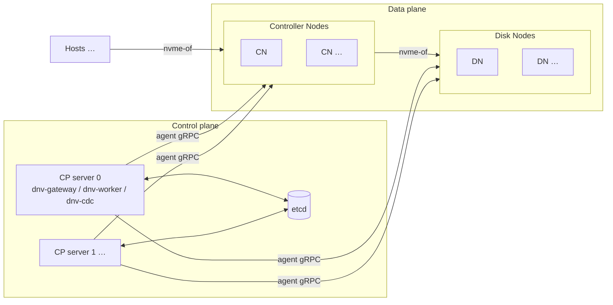

*Fig. `070Cluster` — physical view: hosts, data plane, control plane.*

Process / RPC view:

```
Hosts  ──nvme-of──▶  Controller Nodes (cntlrs)  ──nvme-of──▶  Disk Nodes (sides)
                          ▲            ▲                            ▲
                          └── SyncupCn/SyncupCntlr        SyncupDn/SyncupSide
                                   │                                │
              dnv-gateway ──▶ etcd ◀── dnv-worker (roles dn,cn,sp) ─┘
                                   ▲
                              dnv-cdc (discovery)
```

Processes (all use [viper](https://github.com/spf13/viper) for flags / config file /
environment variables; see §13):

| binary       | role |
|--------------|------|
| `dnv-gateway`| Serves the `Gateway` gRPC service to users/CLI. Reads and writes etcd. Calls agents only for `GetDnSize`/`GetCnSize`, `Inspect*` and the bitmap reads. |
| `dnv-worker` | One binary, roles `dn`, `cn`, `sp` (any subset per instance). Watches revision keys in etcd, shards work by shard code, and drives agents via `SyncupDn`, `SyncupSide`, `SyncupCn`, `SyncupCntlr`, `PushCloneBitmap`, `PushMigrBitmap` (§9.6). Also performs health checking and the automatic reactions of §10.4 (primary election, replacements). |
| `dnv-agent dn` / `dnv-agent cn` | Runs on every DN / CN. Serves `DiskNodeAgent` / `ControllerNodeAgent`. Owns the local LVM / device-mapper / mdadm / nvmet state; persists the last applied request per object (and every received bitmap chunk) as protobuf files under `Local*Path` (§9.1, §9.6). |
| `dnv-cdc`    | NVMe-oF Central Discovery Controller. Watches the `cdc` keys and serves discovery + AENs to hosts. |
| `dnvctl`     | CLI over the Gateway, plus admin helpers (`update_etcd`, `move_dn`, `move_cn`, and the userspace copier `clone` of §11.4). |

## 2. Terminology and object model

| term | meaning |
|------|---------|
| **cluster** | Namespace for everything else. Identified by `cluster_name`; `cluster_id = fnv64a(cluster_name)` (§5.2). One etcd installation can host many clusters. |
| **DN, disk node** | A machine contributing one raw block device (`--disk`). The device becomes one LVM VG; capacity is handed out as **extents**. |
| **CN, controller node** | A machine running the volume logic. Contributes no persistent storage (only a tmpfs for clone metadata) but has a capacity budget in extents. |
| **extent** | The allocation unit for both DN space and CN budget. Size = `ClusterConf.dn_bin_conf.extent_size`, default `DefaultDnExtSize` = 1 GiB. Counts are always rounded **down** (10 GiB + 3 MiB = 10 extents). |
| **SP, storage pool** | The unit of volume service. Owns cntlrs, slices, thin devices, subsystems, clones, transfers, migrations. Identified by `sp_name` (user visible) and `sp_id` (internal, used in device names / keys; reverse lookup via `sp_id_to_name`). |
| **cntlr** | One SP instance on one CN. Exactly one cntlr of an SP is **primary** (runs the full device stack and serves IO); the others are **standby** (keep leg connections, export dm-error, ANA inaccessible). `1 ≤ cntlr_cnt ≤ MaxCntlrCntPerSp(4)`, default 2. Figs `020ControllerNode` (§3.2), `030PrimaryCntlr` (§3.3), `050StandbyCntlr` (§3.4). |
| **slice** | A vertical shard of an SP. Each slice is one dm thin-pool on the primary. Thin devices are striped (raid0) across all slices. `1 ≤ slice_cnt ≤ MaxSliceCntPerSp(16)`, fixed at SP creation. Fig. `040Slice` (§3.3). |
| **group** | A contiguous chunk of pool space inside a slice. Each slice has ≥1 **meta group** (backs the thin-pool metadata device) and ≥1 **data group** (backs the thin-pool data device). `GrowSlice` appends groups. A group is either a single leg (RedundNone) or an md-raid1 over its legs (RedundMdRaid1). Every leg of a group reserves a small **meta region** at its start (md superblock + write-intent bitmap + health block, §3.6); only the remaining **data region** feeds the pool. |
| **leg** | One replica of a group. Backed by exactly one **side** normally, two sides while that leg is being migrated. Groups may also carry **spare legs** (`MaxSpareLegPerGrp` = 2) — connected and health-checked, but not md members until a switch (§8.12). |
| **side** | The DN-resident part of a leg: one LV in the DN VG plus, per cntlr, a dm-error + dm-linear + nvmet subsystem exported to that cntlr's CN. Figs `000DiskNode`, `010Side` (§3.1). |
| **thin device (td)** | A user volume: one dm-thin volume per slice + one raid0 (dm striped) across the per-slice thin volumes on the primary. Snapshots are thin devices with `ori_id` set. |
| **subsystem (ss) / namespace (ns)** | The host-facing NVMe-oF objects. A namespace binds an `ns_idx` (NSID) of a subsystem to a thin device. Fig. `060VirtualVolume` (§3.5). |
| **clone** | Pull-copy of an external NVMe-oF namespace into a local thin device via dm-clone, on the primary cntlr. Fig. `090Clone` (§8.9). |
| **transfer (xfer)** | The source-side counterpart of a clone: exports a local namespace's raid0 over a dedicated subsystem so another SP (possibly another cluster) can clone from it. Fig. `100Transfer` (§8.10). Clone + transfer = cross-SP live migration of a volume (§11.3). |
| **migration (migr)** | Side-level live move of one leg's data from one DN to another via dm-clone on the destination DN. Fig. `080Migration` (§11.2). §11.2. |
| **shard code** | `uint32` in `[0,256)`, formatted `ShardCodeFmt = "%02x"`. Every DN, CN and SP gets one at creation; workers and cdc split ownership by shard code. |
| **revision** | Monotonic `uint64` per DN / CN / SP stored in `DnRev`/`CnRev`/`SpRev`. Bumped whenever the agent-visible desired state changes; drives the worker→agent sync (§9, §10). Also the optimistic-concurrency token carried in mutating requests. |
| **location** | Free-form failure-domain string per node (rack/zone), stored in `DnConf`/`CnConf` (a copy rides in the capacity-key value for scan efficiency [D5]). Used for anti-affinity during allocation (§6). |
| **err_epoch** | Unix seconds when the object was last detected unhealthy by a worker; `0` = healthy. Compared against `EventThreshold` to trigger the automatic reactions of §10.4. A node with `err_epoch != 0` also loses its capacity key (§5.6). |

Ownership hierarchy (etcd side):

```
ClusterConf
├── DnGlobal / CnGlobal / SpGlobal            (id + shard bookkeeping)
├── DnConf(addr_port)  ──side_ptr_list──▶ (sp_id, leg_id, side_id) it hosts
├── CnConf(addr_port)  ──cntlr_ptr_list─▶ (sp_id, cntlr_id) it hosts
└── SpConf(sp_name)
    ├── Cntlr(cntlr_id)                        one per CN, one primary
    ├── Slice(slice_id)
    │   ├── meta_grp_list: Group ── leg_list: Leg ── side_list: Side
    │   │                        └─ spare_leg_list: Leg ── Side
    │   └── data_grp_list: (same shape)
    ├── ThinDevice(td_name), Subsystem(nqn)+Namespace, Clone(clone_name),
    │   Transfer(xfer_name), Migration(migr_name)  (+ bitmap keys)
    └── SpName (sp_id → sp_name reverse map), SpRev, CdcEntry per ss
```

### 2.1 Cardinality limits (from `constants.go`)

| limit | value | limit | value |
|---|---|---|---|
| `MaxDnCntPerCluster` | 1024 | `MaxCnCntPerCluster` | 1024 |
| `MaxSpCntPerCluster` | 4096 | `MaxTdCntPerSp` | 1024 |
| `MaxSsCntPerSp` | 4 | `MaxNsCntPerSs` | 4 |
| `MaxHostCntPerSs` | 8 | `MaxSliceCntPerSp` | 16 |
| `MinCntlrCntPerSp` / `MaxCntlrCntPerSp` / default | 1 / 4 / 2 | `MaxCntlrCntPerCn` | 256 |
| `MaxCloneCntPerSp` | 64 | `MaxXferCntPerSp` | 4 |
| `MaxMigrCntPerSp` | 4 | `MaxSideCntPerDn` | 1024 |
| `MaxLegPerGrp` | 8 | `MaxSpareLegPerGrp` | 2 |
| `MaxCloneBmCnt` | 16 | `MaxMigrBmCnt` | 4 |
| `ShardBucketSize` | 256 | `MaxListCnt` / `DefaultListCnt` | 1024 / 64 |

---

## 3. Data-plane device stacks

The data plane is built from stock Linux pieces: LVM, device-mapper targets
(`error`, `linear`, `striped` a.k.a. raid0, `thin-pool`, `thin`, `clone`), md-raid1 and
the kernel `nvmet` target / `nvme` host. Every device dnv creates has a deterministic
name (§4) so agents are fully idempotent and crash-restartable.

### 3.1 Disk node (figs `000DiskNode`, `010Side`)

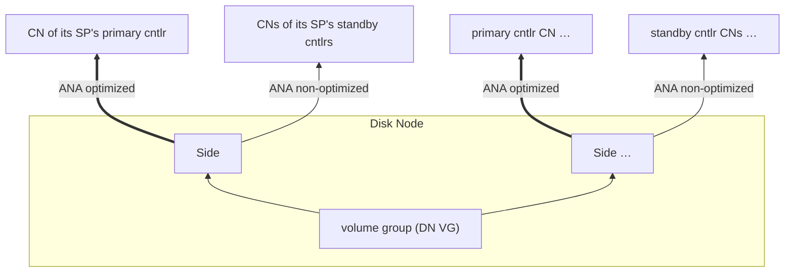

*Fig. `000DiskNode` — one DN: its VG hands extents to the sides it hosts; every side
exports one path per cntlr of its SP.*

Per DN, once (created by the dn agent at first `SyncupDn`):

1. `pvcreate` on the `--disk` device, `vgcreate` the DN VG `DnVgName` with
   `--physicalextentsize` = cluster `extent_size`.
2. One LV `migr-pv` (`DnMigrPvName`, size `DefaultMigrVgSize` = 1 GiB) inside the DN VG,
   used as the PV of the per-DN migration VG `DnMigrVgName`
   (`--physicalextentsize` = `DefaultMigrVgExtSize` = 4 MiB). It stores dm-clone
   metadata LVs for migrations whose **destination** side lives on this DN. The extents
   consumed by `migr-pv` are subtracted when the CP computes `DnConf.total_ext_cnt`.
3. Exactly **one** nvmet port, built from `DnConf.nvme_tr_conf` (which mirrors the
   agent's `--tr-type/--adr-fam/--tr-addr/--tr-svc-id` flags). Every subsystem this DN
   ever exports — all side subsystems and all migration-source subsystems — attaches to
   this single port.

Per **side** (one per hosted leg replica):

* LV `DnLvName = {sp_id}-{side_id}` in the DN VG, `--extents` = `Group.ext_cnt` of the
  owning group. LV provisioning MUST follow the trim protocol of §9.4 (`not_trimmed` /
  `trimmed` LV tags + `blkdiscard`).
* Per cntlr of the SP (primary and standbys — the side learns them from
  `SyncupSideRequest.primary_cn_id` / `standby_id_list`):
  * a dm-error device `DnErrorName` sized like the LV,
  * a dm-linear device `DnLinearName` whose table points at the **LV** for the primary
    cntlr's CN and at the **dm-error** device for every standby CN,
  * an nvmet subsystem `SideToCnNqn(cluster,dn,sp,side,cn)` on the DN's port,
    `allowed_hosts = [CnHostNqn(cluster,cn)]`, `attr_cntlid_min/max` from
    `Side.cntlid_slot` (§11.8), exposing one namespace backed by the dm-linear device.
    ANA state of the namespace's group on the port: `optimized` for the primary CN's
    subsystem, `non-optimized` for standby CNs' subsystems (a standby path therefore
    exists but errors out — a pre-connected placeholder that makes failover fast). ANA
    group ids are allocated by the agent, node-locally, one per exported namespace [D4].

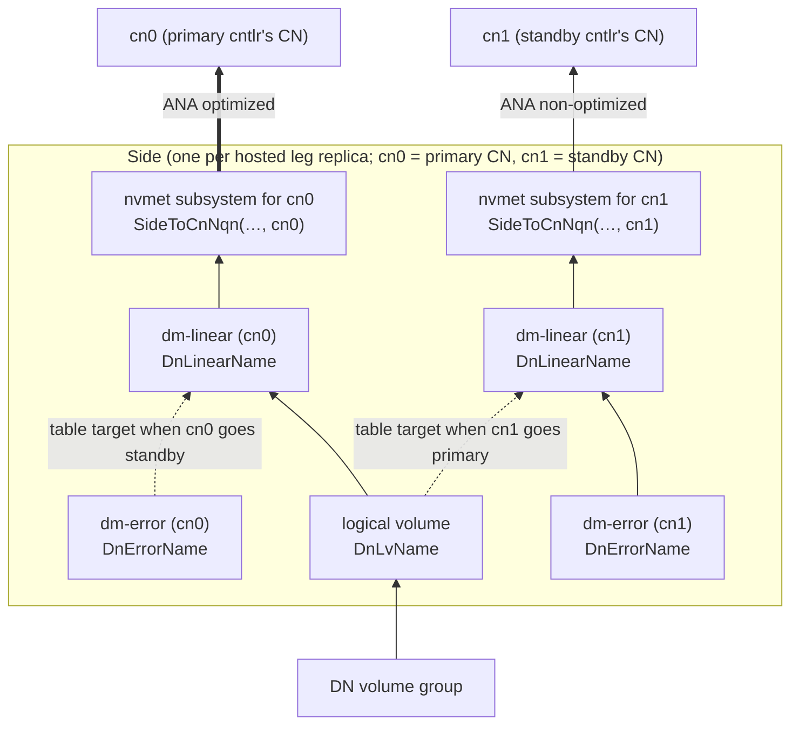

*Fig. `010Side` — one side and its per-CN export stacks. Failover only reloads the
dm-linear tables and flips ANA (dashed alternatives).*

Failover and migration only ever *reload* the dm-linear tables and flip ANA states; the
exported namespace object never changes, so CN NVMe connections survive.

Additionally, while this DN hosts the **source** side of a migration: a dm-linear
`DnMigrSrcName` on top of the LV, exported through subsystem `MigrSrcNqn` (same port)
with `allowed_hosts = [DnHostNqn(cluster, dst_dn)]`. While it hosts the **destination**
side: an nvme host connection to the source's `MigrSrcNqn` (hostnqn `DnHostNqn`), a
dm-clone metadata LV `DnMigrMetaName = {sp_id}-{migr_id}` in the migration VG, and a
dm-clone device `DnMigrFinalName` (dest = the local LV, source = the connected nvme
device, region size = the SP's `block_size`). The per-cntlr dm-linears of the
destination side sit on top of the dm-clone (primary CN) / dm-error (standbys). See
fig. `080Migration` (§11.2) and §11.2.

### 3.2 Controller node, common (fig. `020ControllerNode`)

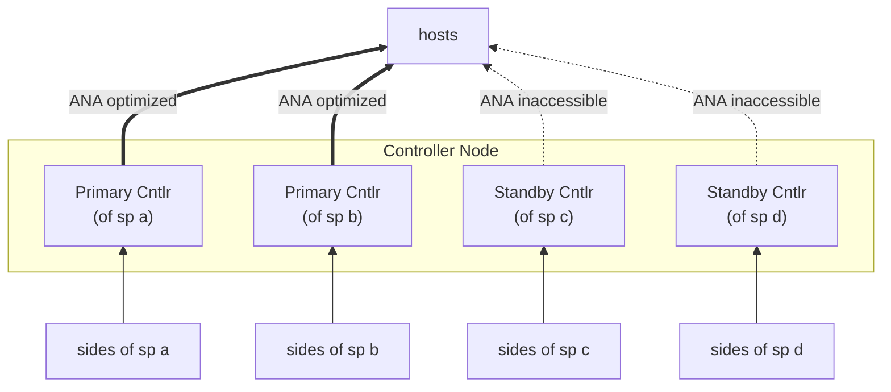

*Fig. `020ControllerNode` — one CN hosts up to `MaxCntlrCntPerCn` cntlrs of different
SPs, in a mix of primary and standby roles.*

Per CN, once (created by the cn agent at first `SyncupCn`):

1. tmpfs mounted at `CnTmpfsPath = {tmpfs_prefix}/{cluster_id}-{cn_id}`
   (`DefaultTmpfsPrefix = /tmp/dnv-tmpfs`), sized `DefaultCloneVgSize` + slack
   (mount `-o size=2G` is fine for the 1 GiB default VG).
2. A file `tmp-file` (`CnTmpFilePath`) of `DefaultCloneVgSize` = 1 GiB inside it,
   attached to a free loop device; `pvcreate` + `vgcreate` the clone VG `CnCloneVgName`
   with `--physicalextentsize` = `DefaultCloneVgExtSize` = 4 MiB. It stores the dm-clone
   metadata LVs `CnCloneMetaName = {sp_id}-{clone_id}` of clones running on this CN.
   The metadata is deliberately volatile: after a reboot a clone is rebuilt from the
   **destination thin-pool bitmaps** (§11.5) — copied blocks are exactly the mapped
   blocks of the destination td, so no clone state needs to survive the CN.
3. Exactly **one** nvmet port from `CnConf.nvme_tr_conf`; every host-facing subsystem
   and every transfer subsystem of every cntlr on this CN attaches to it.

A CN hosts up to `MaxCntlrCntPerCn` cntlrs of different SPs; at most one cntlr **per SP**
per CN.

### 3.3 Primary cntlr (figs `030PrimaryCntlr`, `040Slice`)

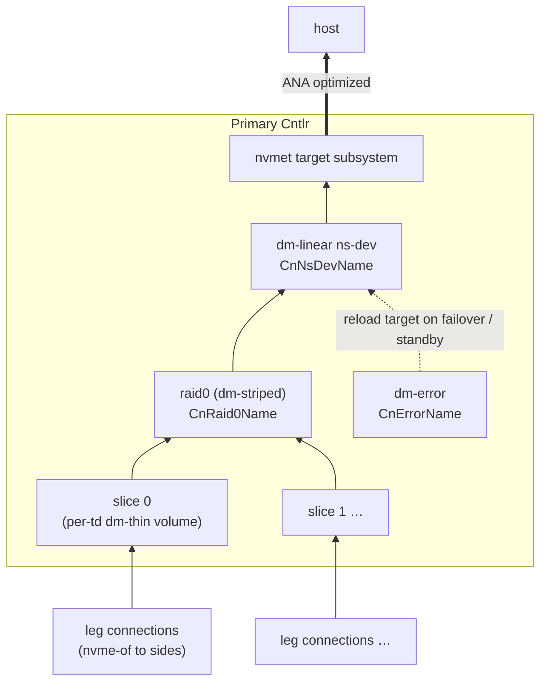

*Fig. `030PrimaryCntlr` — the primary's per-td path for one thin device.*

Bottom-up, everything below is created/owned by the cn agent when `SyncupCntlr` says
`Cntlr.primary = true` ("make sure all groups are available", §11.1):

1. **Legs.** For each side of each leg (spare legs included): `nvme connect` to
   `SideToCnNqn(..., cn_id = this CN)` at `Side.nvme_tr_conf`, hostnqn =
   `CnHostNqn(cluster, cn)`, `--fast-io-fail-tmo = DefaultNvmeFastIoFailTmo`(5),
   `--ctrl-loss-tmo = -1` (reconnect forever). The **leg device** is a cn-local
   dm-linear wrapper over the nvme namespace device of the side whose ANA state toward
   this CN is `optimized` (single-side legs: the only side). During a migration the leg
   has two connected sides and the wrapper is reloaded from the source to the
   destination device when ANA flips [D1]. The agent runs the §3.6 health-check IO
   against every connected leg (spares too) and reports per leg in
   `CntlrInfo.leg_id_to_leg`.
2. **Groups.** RedundNone: the group device is a dm-linear over the single leg's
   **data region** (offset `meta_blocks × block_size`, §3.6). RedundMdRaid1: an
   md-raid1 `CnMdDevName`/`CnMdArrayName` over the member leg devices — always with an
   **internal write-intent bitmap** (`--bitmap=internal`, `--bitmap-chunk` =
   `RedundMdRaid1.bitmap_chunk_block_cnt × block_size`), always with **failfast**
   members, and `--data-offset = meta_blocks × block_size` (§3.6). Assembly rules
   (create vs assemble vs add) are in §11.1.1. **Spare legs are not md members**: they
   stay connected, wrapped and health-checked, and are only `--add`-ed by an explicit
   `SwitchSpareLeg` (§8.12).
3. **Per slice** (fig. `040Slice`): a dm-linear concat `CnPoolMetaName` over the slice's
   meta group devices (in `meta_grp_list` order) and a dm-linear concat `CnPoolDataName`
   over its data group devices; a dm thin-pool `CnPoolFinalName` (metadata dev = pool
   meta, data dev = pool data, block size = `block_size`, `low_water_mark` = data-dev
   blocks × `EventThreshold.pool_low_water_mark_pct` / 100).
4. **Per thin device × slice**: a dm-thin volume `CnThinDevName`, created with pool
   message `create_thin {dev_id}` or `create_snap {dev_id} {ori_id}`, virtual size =
   `ThinDevice.size / slice_cnt`.
5. **Per thin device**: a dm-striped raid0 `CnRaid0Name` across its per-slice thin
   volumes (slice order = `slice_idx`), chunk = `DmRaid0Conf.stripe_size`; a dm-error
   `CnErrorName` of the same size (permanent reload target); a dm-linear `CnNsDevName`
   — **the** namespace backing device — whose table points at the raid0 (normal), the
   dm-clone `CnCloneFinalName` (while a clone targets this td, fig. `090Clone` §8.9),
   or dm-error (standby / failover transitions).
6. **Host-facing nvmet**: per `Subsystem` a nvmet subsystem on the CN's port with
   `attr_cntlid_min/max` from `Cntlr.cntlid_slot`, `serial`/`model` from the etcd
   `Subsystem`, allowed hosts as configured (empty list ⇒ `attr_allow_any_host=1`);
   per `Namespace` an nvmet namespace `nsid = ns_idx`, `device_path` = the td's
   `CnNsDevName`, `uuid`/`nguid` from the etcd record, an agent-allocated ANA group
   [D4], state `optimized` (primary) unless `suspended` (§8.8) — suspended ⇒ dm device
   suspended + ANA `inaccessible` everywhere.
7. **Clones / transfers / migrations** hosted by the SP, per §11.

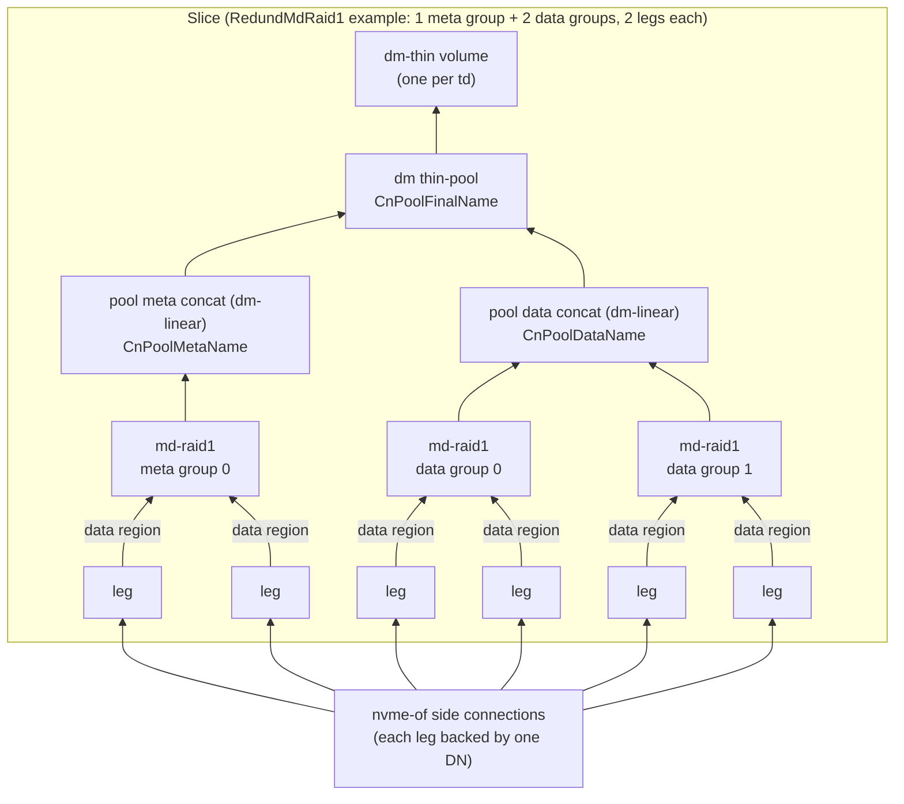

*Fig. `040Slice` — the per-slice stack of step 3. Every leg starts with its meta
region (md superblock + write-intent bitmap + health block, §3.6); only the data
region becomes an md member / pool space.*

### 3.4 Standby cntlr (fig. `050StandbyCntlr`)

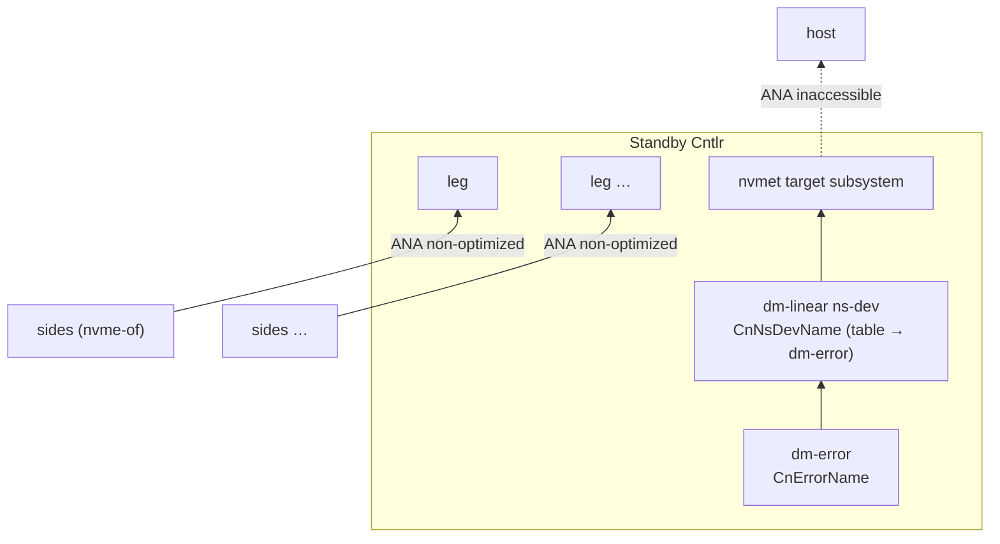

*Fig. `050StandbyCntlr` — pre-connected but dark: legs stay connected, the exported
namespaces error out.*

A standby keeps only: the leg nvme connections + leg wrappers + health-check IO
(step 1 above), the per-td `CnErrorName` and `CnNsDevName` (table → dm-error), and the
host-facing nvmet objects with every namespace's ANA group `inaccessible`. It has
**no** md arrays, pools, thin volumes or raid0s ("cleanup all resources that a primary
shouldn't have"). For a transfer it also keeps the dm-error-backed `CnXferFinalName` +
xfer subsystem counterparts (fig. `100Transfer` right half, §8.10).

### 3.5 Host view (fig. `060VirtualVolume`)

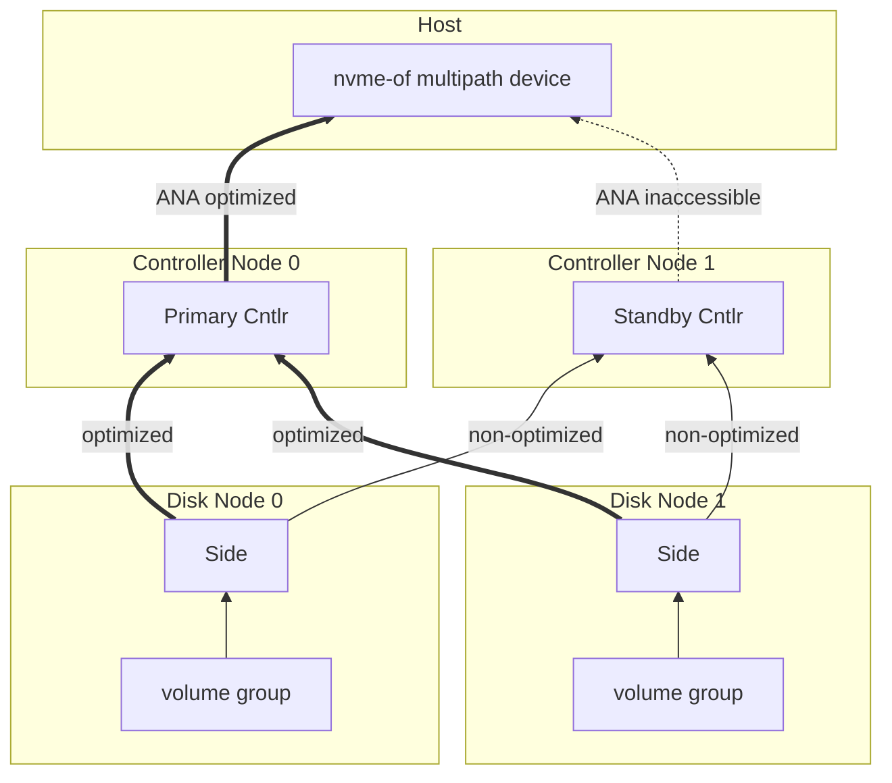

*Fig. `060VirtualVolume` — one virtual volume end to end: same subsystem NQN and
namespace identity from every cntlr, aggregated by the host kernel.*

A host discovers the SP's subsystems through dnv-cdc, connects to every enabled cntlr's
port, and the kernel aggregates the paths into one nvme multipath device because all
cntlrs export the same subsystem NQN and the same namespace identity (`nguid`/`uuid`),
with distinct cntlids guaranteed by cntlid slots (§11.8). Primary path ANA `optimized`,
standby paths `inaccessible`.

### 3.6 Group on-leg layout: meta region, data region, health block

Every leg LV of a group is split into a **meta region** (`meta_blocks` blocks of
`block_size`) followed by the **data region** (`data_blocks` blocks). Both counts are
computed automatically — never configured — and stored in the `Group`:

```
total_group_blocks = ext_cnt × extent_size / block_size
bitmap_chunk       = RedundMdRaid1.bitmap_chunk_block_cnt × block_size
bitmap_bits        = ceil(ext_cnt × extent_size / bitmap_chunk)
bitmap_bytes       = 256 + ceil(bitmap_bits / 8)        # 256 = md bitmap superblock
bitmap_blocks      = ceil(bitmap_bytes / block_size)

RedundMdRaid1: meta_blocks = 1 (md superblock) + bitmap_blocks + 1 (health block)
RedundNone:    meta_blocks = 1 (health block only)
data_blocks        = total_group_blocks − meta_blocks
```

The meta region must be large enough for the md superblock and the internal
write-intent bitmap, **plus an additional 4 KiB used for the leg health check**: the
health-check area is the **last 4 KiB of the last meta block** (byte offsets
`meta_blocks × block_size − 4096 … meta_blocks × block_size`). The cn agent
periodically writes and reads back this 4 KiB block through each connected leg device
(direct IO, a magic + timestamp payload [D7]) to decide whether the leg is healthy —
including standby cntlrs and spare legs, and covering the whole path CN → side →
LV even when md would otherwise mask a member failure. md never touches this area:
the superblock sits at 4 KiB into block 0, the bitmap right after it (the
`bitmap_blocks` reservation is an upper bound), and member data starts at
`--data-offset = meta_blocks × block_size`. On migration the meta region is copied
verbatim like any other bytes (the md superblock must move with the data, §8.11).

With the defaults (1 GiB extents, 1 MiB blocks, 128-block bitmap chunks) a 1 TiB group
gets `bitmap_bits = 8192`, `bitmap_bytes = 1280`, `bitmap_blocks = 1`, so
`meta_blocks = 3` — 3 MiB of overhead per leg.

---

## 4. Naming

All formats below are normative. `NameFmt` is constructed from the prefixes in
`constants.go`: `dmPrefix = DmPrefix = "dnv"`, `nqnPrefix = NqnPrefix =
"nqn.2024-01.io.dnv"`, `tmpfsPrefix = DefaultTmpfsPrefix`, `dnVgPrefix =
DefaultDnVgPrefix = "dnv-dn"`, `cloneVgPrefix = DefaultCloneVgPrefix = "dnv-clone-vg"`,
`migrVgPrefix = DefaultMigrVgPrefix = "dnv-migr"`, `localStorPrefix =
DefaultLocalStorPrefix = "/var/tmp"`. Unless noted, every id field is `%016x` and every
kind field is `%01x`, joined by `-`. Where a helper in `name_fmt.go` differs in
parameter naming or arity (its `SideToCnNqn` names the 4th parameter `legId`; its
`XferNqn` carries a vestigial `dnId`), the signatures and formats in this section are
normative — a side subsystem is keyed by `side_id`, and a transfer NQN is
node-independent because every cntlr of the SP exports the same NQN.

### 4.1 dm-device kinds

DN-side (`dmKindDn*`): `0` error, `1` linear, `2` migr-src, `3` migr-final(dm-clone).
CN-side (`dmKindCn*`): `0` pool-meta, `1` pool-data, `2` pool-final(thin-pool),
`3` thin-dev, `4` raid0, `5` error, `6` ns-dev, `7` clone-final(dm-clone),
`8` xfer-final.

### 4.2 dm device names (`dmsetup` names; node path = `DmPath` = `/dev/mapper/{name}`)

| function | format |
|---|---|
| `DnErrorName(cluster,dn,sp,side,cn)`  | `dnv-{cluster}-{dn}-0-{sp}-{side}-{cn}` |
| `DnLinearName(cluster,dn,sp,side,cn)` | `dnv-{cluster}-{dn}-1-{sp}-{side}-{cn}` |
| `DnMigrSrcName(cluster,dn,sp,migr)`   | `dnv-{cluster}-{dn}-2-{sp}-{migr}` |
| `DnMigrFinalName(cluster,dn,sp,migr)` | `dnv-{cluster}-{dn}-3-{sp}-{migr}` |
| `CnPoolMetaName(cluster,cn,sp,slice)` | `dnv-{cluster}-{cn}-0-{sp}-{slice}` |
| `CnPoolDataName(cluster,cn,sp,slice)` | `dnv-{cluster}-{cn}-1-{sp}-{slice}` |
| `CnPoolFinalName(cluster,cn,sp,slice)`| `dnv-{cluster}-{cn}-2-{sp}-{slice}` |
| `CnThinDevName(cluster,cn,sp,td,slice)`| `dnv-{cluster}-{cn}-3-{sp}-{td}-{slice}` |
| `CnRaid0Name(cluster,cn,sp,td)`       | `dnv-{cluster}-{cn}-4-{sp}-{td}` |
| `CnErrorName(cluster,cn,sp,td)`       | `dnv-{cluster}-{cn}-5-{sp}-{td}` |
| `CnNsDevName(cluster,cn,sp,td)`       | `dnv-{cluster}-{cn}-6-{sp}-{td}` |
| `CnCloneFinalName(cluster,cn,sp,clone)`| `dnv-{cluster}-{cn}-7-{sp}-{clone}` |
| `CnXferFinalName(cluster,cn,sp,xfer)` | `dnv-{cluster}-{cn}-8-{sp}-{xfer}` |

The leg wrapper of §3.3 step 1 is agent-internal; name it like a dm kind of its own if
desired, but it is not part of the cross-component contract [D1].

### 4.3 md names (node path = `MdPath` = `/dev/md/{name}`)

`getShortId(clusterId, nodeId) = fnv64a(sprintf("%016x%016x", clusterId, nodeId)) &
0x0000FFFFFFFFFFFF` (48 bits). With `sliceIdxM = slice_idx | 0x80` when the group is a
**meta** group, else `slice_idx`:

* `CnMdDevName(cluster,cn,sp,sliceIdx,grpIdx,isMeta)` =
  `{shortId:%012x}{sp_id:%016x}{sliceIdxM:%02x}{grpIdx:%02x}` — 32 hex chars, no
  separators (fits the kernel md name limit); used for `/dev/md/{name}`.
* `CnMdArrayName(sp,sliceIdx,grpIdx,isMeta)` = `{sp_id:%016x}-{sliceIdxM:%02x}-{grpIdx:%02x}`
  — used for `mdadm --name` (the array's superblock name).

`grpIdx` is the group's index inside its `meta_grp_list` / `data_grp_list` (stable:
groups are only appended, never removed).

### 4.4 NQNs

nqnKinds: `0` DnHost, `1` CnHost, `2` SideToCn, `3` MigrSrc, `4` Xfer. `:` joined.

| function | format |
|---|---|
| `DnHostNqn(cluster,dn)` | `nqn.2024-01.io.dnv:0:{cluster}:{dn}` — hostnqn a DN uses when it connects out (migration destination pulling from the source). |
| `CnHostNqn(cluster,cn)` | `nqn.2024-01.io.dnv:1:{cluster}:{cn}` — hostnqn a CN uses toward sides, migr-src and xfer targets; also what users put into `Transfer.allowed_hosts`. |
| `SideToCnNqn(cluster,dn,sp,side,cn)` | `nqn.2024-01.io.dnv:2:{cluster}:{dn}:{sp}:{side}:{cn}` — subsystem a side exports to one CN. |
| `MigrSrcNqn(cluster,dn,sp,migr)` | `nqn.2024-01.io.dnv:3:{cluster}:{dn}:{sp}:{migr}` — subsystem the migration source side exports to the destination DN. |
| `XferNqn(cluster,sp,xfer)` | `nqn.2024-01.io.dnv:4:{cluster}:{sp}:{xfer}` — subsystem a transfer exports; the destination SP's user passes it as `Clone.src_nqn`. |

### 4.5 LVM / tmpfs / file names

| function | value |
|---|---|
| `DnVgName(cluster,dn)` | `dnv-dn-{cluster}-{dn}` |
| `DnLvName(sp,side)` / `DnLvPath` | `{sp}-{side}` / `/dev/{DnVgName}/{DnLvName}` |
| `DnMigrPvName` / `DnMigrPvPath` | `migr-pv` / `/dev/{DnVgName}/migr-pv` |
| `DnMigrVgName(cluster,dn)` | `dnv-migr-{cluster}-{dn}` |
| `DnMigrMetaName(sp,migr)` / `DnMigrMetaPath` | `{sp}-{migr}` / `/dev/{DnMigrVgName}/{DnMigrMetaName}` |
| `CnCloneVgName(cluster,cn)` | `dnv-clone-vg-{cluster}-{cn}` |
| `CnCloneMetaName(sp,clone)` / `CnCloneMetaPath` | `{sp}-{clone}` / `/dev/{CnCloneVgName}/{CnCloneMetaName}` |
| `CnTmpfsPath(cluster,cn)` | `{tmpfs_prefix}/{cluster:%016x}-{cn:%016x}` |
| `CnTmpFileName` / `CnTmpFilePath` | `tmp-file` / `{CnTmpfsPath}/tmp-file` |

### 4.6 Agent local-store paths

The agent's persistent state (§9.1) lives as flat protobuf files under
`localStorPrefix` (`--local-store`). `{bm_idx}` is formatted with
`BmIdxFmt = "%02x"`:

| function | path | content |
|---|---|---|
| `LocalDnPath(cluster,dn)` | `{prefix}/dn-{cluster}-{dn}` | last applied `SyncupDnRequest` |
| `LocalSidePath(cluster,dn,sp,side)` | `{prefix}/side-{cluster}-{dn}-{sp}-{side}` | last applied `SyncupSideRequest` |
| `LocalCnPath(cluster,cn)` | `{prefix}/cn-{cluster}-{cn}` | last applied `SyncupCnRequest` |
| `LocalCntlrPath(cluster,cn,sp,cntlr)` | `{prefix}/cntlr-{cluster}-{cn}-{sp}-{cntlr}` | last applied `SyncupCntlrRequest` |
| `LocalMigrBmPath(cluster,dn,sp,migr,bm_idx)` | `{prefix}/migr-bm-{cluster}-{dn}-{sp}-{migr}-{bm_idx}` | one received `PushMigrBitmapRequest` chunk (§9.6) |
| `LocalCloneBmPath(cluster,cn,sp,clone,bm_idx)` | `{prefix}/clone-bm-{cluster}-{cn}-{sp}-{clone}-{bm_idx}` | one received `PushCloneBitmapRequest` chunk (§9.6) |

---

## 5. etcd data model

### 5.1 Key grammar

Every stored protobuf message has one key schema, declared as a comment above the
message in `schema.proto`. Fields of a key are joined by a single space `" "`.
Formatting: ids with `IdKeyFmt = "%016x"`, shard codes with `ShardCodeFmt = "%02x"`,
free extent counts with `FreeSpaceFmt = "%016x"`, `bin_idx` with `BinIdxFmt = "%01x"`,
bitmap indexes with `BmIdxFmt = "%02x"`. **Every id in a key uses `IdKeyFmt`** — e.g.
with `ClusterId = 0xebada5168620c5fe`, `SpId = 17` the `SpName` key is
`dnv sp_id_to_name ebada5168620c5fe 0000000000000011`. Values are the binary-serialized
protobuf messages.

### 5.2 cluster_id derivation

```go
func clusterNameToId(clusterName string) uint64 {
    h := fnv.New64a()
    h.Write([]byte(clusterName))
    return h.Sum64()
}
```

### 5.3 Key table

| message | key | notes |
|---|---|---|
| `ClusterConf` | `{p} cluster_conf {cluster_name}` | cluster-wide QoS/bdev/bin/alloc conf |
| `DnGlobal`    | `{p} dn_global {cluster_id}` | `next_id`, `shard_bucket[256]` |
| `CnGlobal`    | `{p} cn_global {cluster_id}` | idem |
| `SpGlobal`    | `{p} sp_global {cluster_id}` | idem |
| `DnRev`       | `{p} dn_rev {shard_code} {cluster_id} {addr_port}` | watched by dn-role workers |
| `CnRev`       | `{p} cn_rev {shard_code} {cluster_id} {addr_port}` | watched by cn-role workers |
| `SpRev`       | `{p} sp_rev {shard_code} {cluster_id} {sp_name}` | watched by sp-role workers |
| `DnConf`      | `{p} dn_conf {cluster_id} {addr_port}` | includes `location` |
| `CnConf`      | `{p} cn_conf {cluster_id} {addr_port}` | includes `location` |
| `DnCapacity`  | `{p} dn_capacity {cluster_id} {bin_idx} {free_ext_cnt} {addr_port}` | allocation index, §5.6; value = location copy [D5] |
| `CnCapacity`  | `{p} cn_capacity {cluster_id} {free_ext_cnt} {addr_port}` | idem |
| `CdcEntry`    | `{p} cdc {cluster_id} {shard_code} {sp_id} {ss_id}` | shard_code = the SP's; watched by dnv-cdc |
| `SpConf`      | `{p} sp_conf {cluster_id} {sp_name}` | |
| `Cntlr`       | `{p} cntlr {cluster_id} {sp_id} {cntlr_id}` | |
| `Slice`       | `{p} slice {cluster_id} {sp_id} {slice_id}` | groups/legs/sides embedded |
| `ThinDevice`  | `{p} thin_device {cluster_id} {sp_id} {td_name}` | |
| `Subsystem`   | `{p} subsystem {cluster_id} {sp_id} {nqn}` | namespaces embedded |
| `Clone`       | `{p} clone {cluster_id} {sp_id} {clone_name}` | |
| `CloneBitmap` | `{p} clone_bitmap {cluster_id} {sp_id} {clone_name} {bm_idx}` | bm_idx = source slice_idx |
| `Transfer`    | `{p} transfer {cluster_id} {sp_id} {xfer_name}` | |
| `Migration`   | `{p} migration {cluster_id} {sp_id} {migr_name}` | |
| `MigrBitmap`  | `{p} migration_bitmap {cluster_id} {sp_id} {migr_name} {bm_idx}` | bm_idx = append sequence 0… |
| `SpName`      | `{p} sp_id_to_name {cluster_id} {sp_id}` | reverse lookup for admin/log analysis |
| (worker registry) | `{p} worker {role} {worker_uuid}` | lease-bound, value empty; defined by this doc, not protobuf (§10.1) |

### 5.4 Globals: id allocation + shard buckets

`DnGlobal`/`CnGlobal`/`SpGlobal` each hold `next_id` (starts at 1) and
`shard_bucket` of length `ShardBucketSize` = 256, all zeros at cluster creation.
Creating a DN/CN/SP inside the STM:

1. `id = next_id; next_id += 1`. Ids are never reused ("all ids in a cluster are
   incremental"), which lets agents assume a deleted object never comes back.
2. `shard_code` = index of the **smallest** bucket value, first index on ties;
   `shard_bucket[shard_code] += 1`. Example: `NextId=18`,
   `ShardBucket=[52,76,13,17,2,5,2]` ⇒ `DnId=18`, `ShardCode=4`, then `NextId=19`,
   `ShardBucket=[52,76,13,17,3,5,2]` (real length is always 256).
3. `sum(shard_bucket)` is the live object count — the `Max*CntPerCluster` check never
   needs a range query. Deletion decrements the bucket.

Per-SP sub-object ids (`cntlr_id`, `slice_id`, `grp_id`, `leg_id`, `side_id`, `ss_id`,
`ns_id`, `td_id`, `clone_id`, `xfer_id`, `migr_id`) all come from the single
`SpConf.next_id` counter (starts at 1). Thin-device `dev_id`s come from
`SpConf.next_dev_id` (starts at 1; `ori_id = 0` means "no origin") and are never reused.

### 5.5 Revision keys and the sync fan-out

`DnRev`/`CnRev`/`SpRev` values hold a single `revision` (starts at 1 on creation).
Rules:

* Any STM that changes agent-visible desired state of a DN / CN / SP bumps the matching
  revision **once** (even if it touched many sub-keys).
* `err_epoch` and capacity-key maintenance never bump revisions (they only gate CP
  scheduling). Every SpConf/sub-object mutation listed in §8 bumps `SpRev` unless the
  RPC spec says otherwise.
* The request-side `DnRev`/`CnRev`/`SpRev` fields are optimistic-concurrency tokens: the
  STM MUST assert `stored.revision == request.revision` and fail the RPC with `ABORTED`
  ("stale revision") on mismatch. `Get*` returns the current token.
* Workers watch the rev prefixes of the shard codes they own and react per §10.

### 5.6 Capacity index keys

`DnCapacity`/`CnCapacity` are pure indexes for the allocator: the key encodes
`(bin_idx,) free_ext_cnt` so a lexicographic range scan returns nodes ordered by free
space (the zero-padded `%016x` makes lexical order = numeric order). The value carries a
copy of the node's `location` so a scan needs no extra point reads; `DnConf`/`CnConf`
is authoritative [D5].

**Presence rule.** A node has a capacity key **iff it is currently allocatable**. The
capacity key is absent while any of these holds:

* DN: `len(side_ptr_list) ≥ MaxSideCntPerDn`; CN: `len(cntlr_ptr_list) ≥ MaxCntlrCntPerCn`
* `err_epoch != 0` (unhealthy)
* `disabled == true`
* DN: `free_ext_cnt < 1 << bin0_shift` (with the default `bin0_shift = 0`: fewer than
  1 free extent); CN: `free_ext_cnt == 0`

Whichever STM changes one of those inputs (allocation/free of extents, pointer-list
growth/shrink, a worker setting/clearing `err_epoch`) also deletes/rewrites the
capacity key in the same transaction — delete-if-present, recreate-when-allocatable.
Consequently the §6 allocator never has to filter by health or flags: everything it can
see is eligible (it still applies black/white lists, location dedupe and the per-SP CN
exclusion).

### 5.7 page_token

`base64.StdEncoding.EncodeToString(lastReturnedKey)`; decode with
`base64.StdEncoding.DecodeString` and range from the **next** key. Decode failure ⇒
`INVALID_ARGUMENT`. Empty token ⇒ start of prefix. List RPCs never use the STM.

### 5.8 STM discipline

Unless a spec says otherwise, all etcd reads/writes of one RPC happen in **one** STM
transaction. Prepare everything computable outside beforehand (e.g. `cluster_id` from
`cluster_name`, name formatting, candidate lists) to keep transactions short. Network
calls to agents (GetDnSize/GetCnSize, Inspect*, bitmap reads) MUST happen **outside**
(before/after) the STM.

### 5.9 UNEXPECTED_ERROR → `ABORTED`

The catch-all `ABORTED` covers: STM-client errors (not app logic inside the STM),
protobuf (de)serialization errors, etcd connection errors — plus the specific `ABORTED`
cases listed per RPC (missing invariant keys, agent RPC failures where specified, stale
revision tokens).

---

## 6. Allocation (extents, bins, candidates)

### 6.1 Size → extents

Everything is allocated in extents of `extent_size` (cluster-wide,
`ClusterConf.dn_bin_conf.extent_size`, default 1 GiB). Counts round **down**. A DN's
`total_ext_cnt` = floor(disk size / extent_size) − extents consumed by `migr-pv`.
A CN's `total_ext_cnt` = floor(capacity budget / extent_size) where the budget comes
from `GetCnSize` (0 ⇒ `DefaultCnCap` = 4 TiB; > `MaxCnCap` = 64 TiB ⇒ clamp; a nonzero
reply below `MinCnCap` is treated like 0).

### 6.2 DN bins

With `DnBinConf` shifts (`0 ≤ bin0 < bin1 < bin2 < bin3 ≤ 63`, defaults 0/4/8/12) define
`level_i = 1 << bin_i_shift` (defaults 1/16/256/4096). A DN with free extents `f` sits in
bin `b` where `level_b ≤ f < level_{b+1}` (bin3: `f ≥ level3`; `f < level0` ⇒ no bin,
§5.6). Bins balance two failure modes: (a) always draining one big DN before touching the
next, and (b) spreading so thin that no single DN can satisfy a request although the
cluster has plenty of space in aggregate.

### 6.3 Finding DN candidates

Input: `CandExtCnt` (needed free extents per candidate), `CandCnt` (how many wanted),
plus `BlackList`/`WhiteList` of `addr_port`s from the `NodeSelector` (empty white list =
all DNs; black list always excludes, even if white-listed). Health, flags, fullness and
side-count eligibility are already enforced by key presence (§5.6).

1. Start `LocList = []`, `DnList = []`.
2. Pick the smallest bin `b` whose range can hold `CandExtCnt` (skip bins with
   `level_{b+1} ≤ CandExtCnt`). For `b … 3`: range-scan
   `{p} dn_capacity {cluster_id} {b} ` **descending** (largest free first); for each DN:
   stop this bin when `free < CandExtCnt`; skip if filtered by the lists or if its
   `location` is already in `LocList`; else append to `DnList`+`LocList`; return as soon
   as `len(DnList) ≥ CandCnt`.
3. After bin 3, return whatever was collected (the caller decides whether it is enough).

The `LocList` rule gives location anti-affinity for free: two legs of one group can never
land in the same failure domain in one allocation round.

### 6.4 Finding CN candidates

Same as §6.3 but there are no bins: one descending scan over
`{p} cn_capacity {cluster_id} `; skip black-listed / non-white-listed /
duplicate-location CNs, plus CNs already hosting a cntlr of the same SP.

### 6.5 Per-operation allocation

* **CreateStoragePool — DNs.** For every group to create (per slice: 1 meta + 1 data):
  `CandExtCnt` = that group's `ext_cnt` — the initial **data** group of each slice uses
  `ext_cnt = init_ext_cnt`; the initial **meta** group of each slice always uses
  `ext_cnt = 1` (first rung of the §8.5 meta ladder). `RequiredCnt` = legs per group
  (RedundNone: 1, RedundMdRaid1: 2); `DnCandCnt = RequiredCnt ×
  AllocConf.dn_batch_size`. Get candidates (§6.3); `< RequiredCnt` ⇒
  `RESOURCE_EXHAUSTED`; pick `RequiredCnt` **randomly** from the list; add the picked
  DNs to the BlackList; continue with the next group. The growing black list means
  every leg of the SP lands on a distinct DN.
* **CreateStoragePool — CNs.** `CandExtCnt` = sum of `ext_cnt` over **all** groups of the
  SP; `RequiredCnt = 1`, `CnCandCnt = cn_batch_size`; repeat `cntlr_cnt` times, random
  pick, black-list the pick.
* **GrowSlice**: like the DN flow for exactly one group (black list starts with all DNs
  already hosting a leg of that group, so the new group still spreads; other groups' DNs
  are allowed). Meta-group sizes follow the §8.5 ladder.
* **CreateMigration**: one DN, `CandExtCnt` = the group's `ext_cnt`; black list starts
  with the DNs (and thus locations) of every leg/side of the group.
* **CreateSpareLeg**: one DN, same black-list seeding as CreateMigration.
* **CreateCntlr**: one CN, `CandExtCnt` = sum of all group `ext_cnt`s of the SP.

Free-extent bookkeeping in the same STM as the pick: each leg's DN
`free_ext_cnt -= group.ext_cnt`; each cntlr's CN `free_ext_cnt -= Σ group.ext_cnt`;
capacity keys maintained per §5.6; reverse on delete.

---

## 7. Common validation

* `MaxStrSize` = 64 bytes for `cluster_name`, `addr_port`, `sp_name`, `td_name`,
  `clone_name`, `xfer_name`, `migr_name`, `location`, `NvmeTrConf` members,
  `Subsystem.serial/model`. Names additionally MUST match
  `ValidStrPattern = ^[a-zA-Z0-9\-_/.:]+$`.
* NQNs: length ≤ `MaxNqnLength` = 223 and match `ValidNqnPattern`; the well-known
  discovery NQN `nqn.2014-08.org.nvmexpress.discovery` is rejected for `CreateSubsystem`.
* `addr_port` looks like `192.168.0.17:9000` — the gRPC endpoint of the node's agent.
* Bounded numeric parameters (reject outside `[Min, Max]`, substitute the `Default*`
  when a proto3 zero is received and a default exists):

| parameter | min | max | default |
|---|---|---|---|
| `dn_bin_conf.extent_size` | 64 MiB | 1 TiB | 1 GiB |
| `alloc_conf.dn_batch_size` / `cn_batch_size` | 1 | 1024 | 16 |
| `dm_pool_conf.data_block_size` | 64 KiB | 1 GiB | 1 MiB |
| `EventThreshold.pool_low_water_mark_pct` | 10 | 90 | 50 |
| `dm_raid0_conf.stripe_size` | 4 KiB | 64 MiB | 64 KiB |
| `redund_md_raid1.bitmap_chunk_block_cnt` | 1 | 1024 | 128 |
| (dm region block cnt, same meaning) | 1 | 1024 | 128 |
| `DmCloneConf.hydration_threshold` (clone) | 1 | 8 | 1 |
| `DmCloneConf.hydration_batch_size` (clone) | 1 | 4 | 1 |
| `DmCloneConf.hydration_threshold` (migr) | 1 | 8 | 1 |
| `DmCloneConf.hydration_batch_size` (migr) | 1 | 4 | 1 |
| `EventThreshold.primary_unhealthy` (s) | ≥1 | — | 5 |
| `EventThreshold.cntlr_unhealthy` (s) | ≥1 | — | 600 |
| `EventThreshold.side_unhealthy` (s) | ≥1 | — | 600 |
| `EventThreshold.leg_unhealthy` (s) | ≥1 | — | 1200 |
| list `count` | 1 | 1024 | 64 |

* `bdev_feature_list` MUST be empty in this version (`INVALID_ARGUMENT` otherwise);
  `RedundConf` accepts only `redund_none` and `redund_md_raid1`.
* Default-value resolution order everywhere: request field → the owning SP's stored conf
  → `ClusterConf` → `constants.go` default → proto3 zero.
* `CmdSoftTimeout` = 3 s / `CmdHardTimeout` = 5 s: agents SIGTERM a shell command at the
  soft timeout and SIGKILL at the hard timeout, reporting `RES_STATUS_ERROR` with the
  command output in `details`.

---

## 8. `service Gateway` — RPC specifications

Format follows the project convention: **Errors / Defaults / Action**. Errors common to
every RPC and therefore not repeated: `INVALID_ARGUMENT` for any §7 violation on any
supplied field; `ABORTED` per §5.9; `ABORTED` "stale revision" whenever the request's
`DnRev`/`CnRev`/`SpRev` token mismatches the stored one (§5.5). Default
`cluster_name = DefaultClusterName = "default"` for every RPC that takes one. Every RPC
that names an SP first resolves `{p} cluster_conf` (`NOT_FOUND` if absent) and
`{p} sp_conf {cluster_id} {sp_name}` (`NOT_FOUND` if absent); those two checks are
implied below. All mutating SP RPCs except `DeleteStoragePool` fail with
`FAILED_PRECONDITION` when `SpConf.deleting == true` (the field is otherwise reserved
for a future asynchronous teardown).

### 8.1 Clusters

**CreateCluster** —
Errors: `ALREADY_EXISTS` if `{p} cluster_conf {cluster_name}` exists or any of
`{p} dn_global|cn_global|sp_global {cluster_id}` exists (hash-collision guard); checks
inside the STM.
Defaults: §7 tables for every `ClusterConf` member.
Action: one STM creates `ClusterConf` (from the request), and `DnGlobal`, `CnGlobal`,
`SpGlobal` each with `next_id = 1` and `shard_bucket` = 256 zeros. Reply `cluster_id`.

**DeleteCluster** —
Errors: `NOT_FOUND` cluster; `FAILED_PRECONDITION` if any key exists under
`{p} dn_conf {cluster_id} `, `{p} cn_conf {cluster_id} ` or `{p} sp_conf {cluster_id} `.
Action: one STM deletes `ClusterConf`, `DnGlobal`, `CnGlobal`, `SpGlobal`. Reply
`cluster_id`.

**GetCluster** — Errors: `NOT_FOUND` cluster; `ABORTED` if a global key is missing.
Action: one STM reads the four keys into the reply.

**ListClusters** — Errors: `INVALID_ARGUMENT` on bad `count`/token. Defaults:
`count = DefaultListCnt`, token = "". Action: no STM; range `{p} cluster_conf ` prefix,
return up to `count` `{cluster_name}`s + next token (§5.7).

### 8.2 Disk nodes

**CreateDiskNode** —
Errors: `NOT_FOUND` cluster; `ALREADY_EXISTS` `dn_conf` key; `RESOURCE_EXHAUSTED`
`sum(DnGlobal.shard_bucket) ≥ MaxDnCntPerCluster`; `INVALID_ARGUMENT` if `nvme_tr_conf`
is empty or the reported disk size yields `total_ext_cnt < 1`; `ABORTED` if `dn_global`
missing or `GetDnSize` fails.
Defaults: `location = addr_port`; `disabled` as sent [D6].
Action: (pre-STM) call `DiskNodeAgent.GetDnSize` at `addr_port` with `dn_id = 0` (the id
is only for logging; the agent doesn't need it) and compute `total_ext_cnt` (§6.1). One
STM then: allocate `dn_id` + `shard_code` from `DnGlobal` (§5.4); write `DnConf`
(`disabled`, `err_epoch = 0`, `nvme_tr_conf`, `location`, empty `side_ptr_list`,
`total_ext_cnt`, `free_ext_cnt = total_ext_cnt`); write `DnCapacity` at the computed
`bin_idx` iff allocatable per §5.6; write `DnRev = 1` under the shard code (its
appearance makes the owning dn-worker start syncing and health-checking the node);
update `DnGlobal`. Reply `dn_id`. There is no RPC to change `disabled` afterwards in
v001; `dnvctl admin update_etcd` is the escape hatch [D6].

**DeleteDiskNode** —
Errors: `NOT_FOUND` cluster/dn; `FAILED_PRECONDITION` `side_ptr_list` not empty (delete
or migrate the owning SPs first); `ABORTED` `dn_global` missing / stale `dn_rev`.
Action: one STM reads `DnConf`, deletes `DnRev` (the worker stops health checking; the
agent process can simply be stopped — no desired state remains), `DnConf`, and the
`DnCapacity` key if present (§5.6); `DnGlobal.shard_bucket[shard_code] -= 1`. Reply
`dn_id`.

**GetDiskNode** — Errors: `NOT_FOUND`; `ABORTED` if the `DnRev` that must exist is
missing. Action: one STM reads `DnConf` + `DnRev` into the reply.

**ListDiskNodes** — like ListClusters over `{p} dn_conf {cluster_id} `, returning the
`{addr_port}` suffixes.

**InspectDiskNode** — Errors: `NOT_FOUND`; `ABORTED` if the agent gRPC fails.
Action: STM-read `DnConf` for logging ids only; then, outside the STM, call
`DiskNodeAgent.GetDnInfo` and return the `DnInfo` (live/applied state incl. the last
applied revision, so callers can diff against `GetDiskNode`'s desired state).

### 8.3 Controller nodes

Mirror images of §8.2 against `cn_conf`/`cn_capacity`/`cn_rev`/`CnGlobal`, with these
differences:

* **CreateControllerNode** calls `ControllerNodeAgent.GetCnSize` (`cn_id = 0`) and maps
  the reply to `total_ext_cnt` per §6.1 (0 ⇒ default 4 TiB, clamp to 64 TiB).
  `RESOURCE_EXHAUSTED` at `MaxCnCntPerCluster`.
* **DeleteControllerNode**: `FAILED_PRECONDITION` if `cntlr_ptr_list` not empty.
* **InspectControllerNode** calls `ControllerNodeAgent.GetCnInfo`.

### 8.4 Storage pools

**CreateStoragePool** —
Errors: `ALREADY_EXISTS` `sp_conf` key; `RESOURCE_EXHAUSTED` when
`sum(SpGlobal.shard_bucket) ≥ MaxSpCntPerCluster`, when < `cntlr_cnt` eligible CNs, or
when DN allocation fails (§6.5); `INVALID_ARGUMENT` when: `cntlr_cnt` outside
`[MinCntlrCntPerSp, MaxCntlrCntPerSp]`; `slice_cnt` outside `[1, MaxSliceCntPerSp]`;
`init_ext_cnt == 0`; `init_ext_cnt × extent_size` exceeds what one slice's data groups
may hold; `cntlid_slot_list` has duplicates, values ≥ `CnCntlidSlotCnt`(8) or fewer
entries than `cntlr_cnt`; any §7 violation in `bdev_conf` / `event_threshold`.
Defaults: `cntlr_cnt = DefaultCntlrCntPerSp`(2); `cntlid_slot_list = [0..7]`;
`bdev_conf` member-wise from `ClusterConf.bdev_conf` then constants (`redund_conf`
unset ⇒ `redund_none`, and `dnvctl` defaults it to `redund_md_raid1` on the CLI);
`event_threshold` member-wise from the §7 defaults.
Action:
1. Pre-STM: resolve defaults; plan groups: per slice one **data** group with
   `ext_cnt = init_ext_cnt` and one **meta** group with `ext_cnt = 1` (§8.5 ladder);
   compute every group's `meta_blocks`/`data_blocks` per §3.6.
2. Pre-STM candidate scan + STM commit may be retried as a unit on STM conflict. In the
   STM: allocate `sp_id`/`shard_code` from `SpGlobal`; run the §6.5 DN and CN picks
   against the capacity keys; write `SpConf` (`next_id` advanced past all consumed ids,
   `next_dev_id = 1`, `bdev_conf`, `event_threshold`, `cntlid_slot_list`,
   `sp_level = SP_LEVEL_READWRITE`, `deleting = false`, id/name lists filled);
   `SpName`; one `Cntlr` per picked CN, created in pick order (the first created —
   smallest `cntlr_id` — gets `primary = true`, the rest `primary = false`; all
   `disabled = false`; `cntlid_slot` = the next unused entry of `cntlid_slot_list` in
   list order — §11.8 requires all cntlr slots of one SP distinct; `cn_addr_port` +
   `nvme_tr_conf` copied from the CN); one `Slice` per slice
   (`slice_idx` 0…, groups → legs (`leg_idx` 0…) → one `Side` each:
   `addr_port`/`nvme_tr_conf` copied from the picked DN, `cntlid_slot` =
   `cntlid_slot_list[0]` (sides may share slots, §11.8), `err_epoch = 0`); update every
   picked DN's `DnConf.side_ptr_list`/`free_ext_cnt`/`DnCapacity` per §5.6 and bump each
   `DnRev` once; likewise every picked CN (`cntlr_ptr_list`) and `CnRev`; write
   `SpRev = 1`; update `SpGlobal`.
3. Reply `sp_id`. Workers then converge: dn-workers push the new side pointers
   (`SyncupDn`), sp-workers push side + cntlr configs (`SyncupSide`/`SyncupCntlr`), and
   the primary builds §3.3.

**DeleteStoragePool** —
Errors: `FAILED_PRECONDITION` if any of `td_name_list`, `nqn_list`, `clone_name_list`,
`xfer_name_list`, `migr_name_list` is non-empty (user-created objects first; cntlrs,
slices, groups, legs, sides were created implicitly and are deleted implicitly).
Action: one STM: read `SpConf`, all `Cntlr`s, all `Slice`s; per side: remove the pointer
from its DN's `side_ptr_list`, return `group.ext_cnt` to `free_ext_cnt`, maintain the
`DnCapacity` key (§5.6), bump that `DnRev` once per DN; per cntlr: remove the pointer
from its CN, return the SP footprint to `free_ext_cnt`, maintain `CnCapacity`, bump
`CnRev` once per CN; delete every `Cntlr`, `Slice`, `SpName`, `SpRev`, `SpConf`;
`SpGlobal.shard_bucket[shard_code] -= 1`. Agents notice the shrunken pointer lists via
`SyncupDn`/`SyncupCn` and tear the local stacks down; the sp-worker notices the deleted
`SpRev` and stops dispatching. Reply `sp_id`.

**GetStoragePool** — one STM reads `SpConf`, `SpRev`, every `Cntlr` in `cntlr_id_list`
and every `Slice` in `slice_id_list` (same order) into the reply; a missing listed key ⇒
`ABORTED`.

**ListStoragePools** — prefix `{p} sp_conf {cluster_id} `, returns `{sp_name}`s.

**UpdateStoragePoolCntlidSlotList** — Errors: `INVALID_ARGUMENT` duplicates / values ≥ 8
/ list missing a slot currently used by any cntlr or side of the SP. Action: STM write +
bump `SpRev`. Reply `sp_id`.

**UpdateStoragePoolLevel** — Action: STM set `SpConf.sp_level`, bump `SpRev`; workers
propagate it to every side and cntlr (the field rides in both `Syncup*` requests).
Levels (each includes all restrictions above it): `READWRITE`(0) normal;
`READONLY`(16) thin devices + sides read-only, clone/migr hydration paused;
`NO_CLONE`(32) also don't build clone dm-clones; `NO_THINPOOL`(48) also no thin pools;
`NO_REDUND`(64) also no raid1; `NO_MIGRATION`(80) also no migration dm-clones;
`NO_SIDE`(96) also don't export sides; `DISABLE`(112) agents keep only the logical
volumes. Levels exist for staged disaster recovery / maintenance (§11.7).

**FindStoragePoolNames** — no STM required beyond one snapshot read; for each requested
`sp_id` read `{p} sp_id_to_name {cluster_id} {sp_id}` and put found pairs into the reply
map. **Ids omitted from the reply are unknown ids** — the caller interprets absence as
"no such sp_id"; the call itself never fails on unknown ids. This is the reverse lookup
used by admin tooling and log analysis, since keys and device names carry `sp_id`, not
`sp_name`.

### 8.5 GrowSlice

Errors: `NOT_FOUND` `slice_id` not in `SpConf.slice_id_list`; `INVALID_ARGUMENT`
`is_meta == false` and `ext_cnt == 0`, or `is_meta == true` and `ext_cnt != 0` (meta
sizes are computed, see below); `FAILED_PRECONDITION` `is_meta == true` and the slice's
meta total is already at the 16 GiB cap; `RESOURCE_EXHAUSTED` when no DN candidates
(§6.5) or when any cntlr's CN has `free_ext_cnt` below the new group's `ext_cnt`.
Meta ladder: the sizes of a slice's meta groups are fixed by rule, not by the caller —
the first meta group (created with the SP) is **1 extent**; each further meta grow adds
`1, 2, 4, 8, …` extents (the additions double, i.e. the new group's `ext_cnt` equals
the slice's current meta total in extents), stopping once the total meta size reaches
**16 GiB** (with 1 GiB extents the totals run 1 → 2 → 4 → 8 → 16). 16 GiB is the
dm-thin metadata ceiling, so further meta growth is refused.
Action: allocate legs for one new group (`is_meta` selects the list; `ext_cnt` for meta
computed per the ladder); compute `meta_blocks`/`data_blocks` (§3.6); in the STM append
`Group{grp_id, ext_cnt, meta_blocks, data_blocks, legs+sides}` to the slice, update the
involved DNs (+`DnRev`s) and every cntlr CN's budget (+`CnRev`s), bump `SpRev`. Agents
extend the pool-meta/pool-data linear tables and resize the thin pool online. Reply
`slice_id`, `grp_id`.

### 8.6 Cntlrs

**CreateCntlr** —
Errors: `RESOURCE_EXHAUSTED` `len(cntlr_id_list) ≥ MaxCntlrCntPerSp` or no eligible CN
(§6.4/§6.5 — capacity-key presence already implies healthy, enabled and not full);
`INVALID_ARGUMENT` `cntlid_slot` not in `SpConf.cntlid_slot_list` or already used by
another **cntlr** of the SP (§11.8).
Action: pick a CN (§6.5); STM: new `Cntlr` (`primary = false`, `disabled = false`),
append id, CN bookkeeping + `CnRev`, append the CN's `nvme_tr_conf` to every `CdcEntry`
of the SP, bump `SpRev`. The sp-worker's next `SyncupSide` round tells every side about
the new standby (`standby_id_list`), and the sides grow a dm-error/dm-linear/nvmet
export for it (§3.1). Reply `cntlr_id`.

**DeleteCntlr** —
Errors: `NOT_FOUND` id not in list; `FAILED_PRECONDITION` `primary == true` or
`disabled == false` (disable first so a failover has already happened before the record
disappears).
Action: STM: remove id + `Cntlr` key; CN bookkeeping (+footprint back, `CnRev`); remove
the CN's `nvme_tr_conf` from every `CdcEntry`; bump `SpRev`. Sides drop the export;
the cn agent tears down its stack. Reply `cntlr_id`.

**UpdateCntlrEnabled** —
Action: STM set `Cntlr.disabled = !request.enabled`; on disable remove / on enable
append the CN's `nvme_tr_conf` in every `CdcEntry`; bump `SpRev`. Idempotent. A
disabled cntlr leaves primary eligibility and its namespaces go ANA-inaccessible;
disabling the current primary triggers the §10.4 primary re-election; disabling the
last enabled cntlr is allowed but stops IO (dnvctl prints a warning). Reply `cntlr_id`,
`enabled`.

**InspectCntlr** — read the `Cntlr` in an STM for its `cn_addr_port`; outside the STM
call `ControllerNodeAgent.GetCntlrInfo(cluster_id, cn_id, sp_id, cntlr_id)`; agent
failure ⇒ `ABORTED`. Reply `CntlrInfo`.

**InspectSide** — locate the side by scanning the SP's slices in the STM (bounded by
`MaxSliceCntPerSp × groups × MaxLegPerGrp`), get its DN; outside the STM call
`DiskNodeAgent.GetSideInfo(cluster_id, dn_id, side_pointer)`. Reply `SideInfo`. Both
Inspect RPCs are the way to watch clone/migration hydration before
`DeleteClone`/`FinishMigration`.

### 8.7 Thin devices

**CreateThinDevice** —
Errors: `ALREADY_EXISTS` td key; `RESOURCE_EXHAUSTED` `len(td_name_list) ≥
MaxTdCntPerSp`; `NOT_FOUND` `ori_name` set but absent; `INVALID_ARGUMENT` `size == 0` or
`size` not a multiple of `slice_cnt × DmRaid0Conf.stripe_size` (dm-striped needs equal,
chunk-aligned members; sizes SHOULD also be multiples of `block_size`).
Defaults: `ori_name = ""` (fresh device, not a snapshot); when `ori_name` is set and
`size == 0`, `size` = the origin's size (a snapshot may also be created larger).
Action: STM: `td_id` from `next_id`, `dev_id` from `next_dev_id++`,
`ori_id` = origin's `dev_id` or 0; write `ThinDevice`, append `td_name_list`, bump
`SpRev`. Reply `td_id`, `dev_id`. The primary creates one thin volume per slice
(`create_thin` / `create_snap` pool message) + the raid0/error/ns-dev of §3.3.

**DeleteThinDevice** —
Errors: `FAILED_PRECONDITION` if the `td_id` is referenced by any `Namespace.td_id` of
any subsystem of the SP (read `nqn_list` + every `Subsystem` in the same STM — bounded
by `MaxSsCntPerSp × MaxNsCntPerSs`, cheap) or by any `Clone.dst_td_id`.
Action: STM: remove from `td_name_list`, delete the key, bump `SpRev`. `dev_id` is never
reused. Deleting the origin of snapshots is allowed — dm-thin snapshots stay valid. The
primary applies it with a `delete {dev_id}` message per slice pool. Reply `td_id`.

**ListThinDevices** — one STM reads `SpConf` + every td in `td_name_list` into
`name_to_td`; a missing listed key ⇒ `ABORTED`.

### 8.8 Subsystems, namespaces

**CreateSubsystem** —
Errors: NQN rules of §7; `ALREADY_EXISTS` subsystem key; `RESOURCE_EXHAUSTED` at
`MaxSsCntPerSp`; `INVALID_ARGUMENT` `len(allowed_hosts) > MaxHostCntPerSs` or any entry
fails the NQN rules.
Action: STM: `ss_id` from `next_id`; `serial = sprintf("%016x", ss_id)`,
`model = "dnv"` [D2]; write `Subsystem` (empty `ns_list`), append `nqn_list`, write
`CdcEntry{nqn, nvme_tr_conf_list = tr confs of every enabled cntlr's CN,
allowed_hosts}`, bump `SpRev`. Reply `ss_id`.

**DeleteSubsystem** — Errors: `FAILED_PRECONDITION` `ns_list` non-empty (allowed_hosts
never block, they go implicitly). Action: STM remove from `nqn_list`, delete `Subsystem`
+ `CdcEntry`, bump `SpRev`. dnv-cdc sends a discovery-log-change AEN; hosts running
nvme-stas disconnect automatically. Reply `ss_id`.

**ListSubsystems** — STM read of `nqn_list` + each `Subsystem` into `nqn_to_subsystem`.

**UpdateSubsystemHosts** — STM update `Subsystem.allowed_hosts` and
`CdcEntry.allowed_hosts`, bump `SpRev`. Reply `ss_id`.

**CreateNamespace** —
Errors: `NOT_FOUND` nqn/td; `RESOURCE_EXHAUSTED` `len(ns_list) ≥ MaxNsCntPerSs`;
`INVALID_ARGUMENT` `ns_idx == 0`, `ns_idx` already used in this subsystem, or a
supplied `dev_uuid`/`dev_nguid` is malformed.
Defaults: empty `dev_uuid` ⇒ generate an RFC 4122 v4 uuid; empty `dev_nguid` ⇒ generate
16 random bytes (hex). Callers supply both only when the namespace must impersonate an
existing one — the transfer+clone flow of §11.3.
Action: STM: `ns_id` from `next_id`; append
`Namespace{ns_id, ns_idx, td_id, dev_uuid, dev_nguid, suspended = false}` to the
subsystem, bump `SpRev`. Reply `ns_id`. `ns_idx` is the NVMe NSID. ANA group ids are
not stored — each agent assigns one per exported namespace locally [D4].

**DeleteNamespace** — STM remove the `ns_idx` entry, bump `SpRev`. Reply `ns_id`.

**UpdateNamespaceDev** — repoint the namespace at another td (`td_name`), e.g. to expose
a snapshot in place of the origin. STM update `td_id`, bump `SpRev`; agents reload the
nvmet namespace onto the new td's `CnNsDevName`. Reply `ns_id`.

**UpdateNamespaceSuspended** — STM set `suspended`, bump `SpRev`. Suspended ⇒ every
cntlr suspends the td's `CnNsDevName` and sets the ns ANA group `inaccessible`;
resumed ⇒ reverse. Used by the transfer/clone choreography of §11.3. Reply `ns_id`.

### 8.9 Clones (destination side of a copy; fig. `090Clone`)

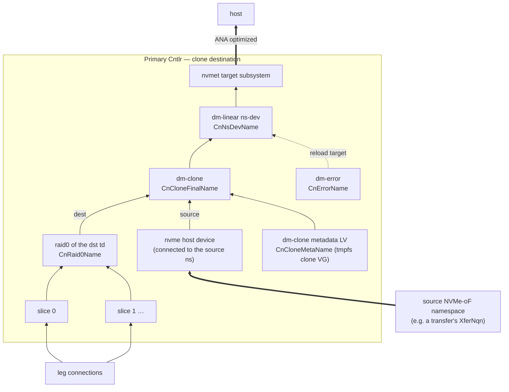

*Fig. `090Clone` — while a clone targets a td, its `CnNsDevName` is reloaded onto the
dm-clone; dm-clone pulls missing regions from the source and hydrates in the
background.*

**CreateClone** —
Errors: `ALREADY_EXISTS` clone key; `RESOURCE_EXHAUSTED` at `MaxCloneCntPerSp`;
`NOT_FOUND` `dst_td_name`; `FAILED_PRECONDITION` the dst td already targeted by another
clone; `INVALID_ARGUMENT` when `src_tr_conf` is empty, `src_nqn` invalid,
`src_slice_cnt ∉ [1,16]`, `src_stripe_size ≠ i×4KiB (1 ≤ i ≤ 256)`,
`src_block_size ≠ j×64KiB (1 ≤ j ≤ 16384)`, or `src_block_size` not a multiple of
`src_stripe_size` (§11.4 constraints).
Defaults: `dm_clone_conf` per §7; `auto_resume` as sent.
Precondition (not verifiable by the CP, documented contract [D3]): the destination td
MUST be **empty** — freshly created and never written. Clone crash recovery (§11.5)
equates "mapped in the destination thin pools" with "already copied", which only holds
for an initially empty td.
Action: STM: `clone_id` from `next_id`, `bm_cnt = 0`; write `Clone`, append
`clone_name_list`, bump `SpRev`. Reply `clone_id`. Primary-cntlr behavior — connect to
the source (`src_tr_conf_list` + `src_nqn`, hostnqn `CnHostNqn`,
`fast_io_fail_tmo = 5`, `ctrl_loss_tmo = -1`, retry until it succeeds), `lvcreate`
`CnCloneMetaName` in the clone VG, build dm-clone `CnCloneFinalName` (metadata = that
LV, dest = the dst td's `CnRaid0Name`, source = the connected nvme ns at `src_ns_idx`,
region size = this SP's `block_size`, `hydration_threshold`/`batch_size` from
`dm_clone_conf`), reload `CnNsDevName` onto the dm-clone, and, iff `auto_resume`,
resume the device and move the td's namespace(s) to ANA `optimized` — i.e. steps 1-5 of
§11.3's destination list. After a CN reboot the primary rebuilds the clone by the
§11.5 recovery procedure before letting any IO through.

**DeleteClone** —
Errors: `FAILED_PRECONDITION` when `force = false` and hydration is not complete —
checked outside the STM via `GetCntlrInfo` of the primary
(`clone_id_to_dm_clone.details` carries the dm-clone status; unreachable agent also ⇒
`FAILED_PRECONDITION`).
Action: STM: remove from `clone_name_list`, delete `Clone` + every `CloneBitmap`, set
`suspended = false` on every namespace whose `td_id == dst_td_id`, bump `SpRev`. The
primary reloads `CnNsDevName` back onto the raid0 (all data now local), removes the
dm-clone + metadata LV, disconnects the source, and deletes the clone's
`LocalCloneBmPath` files (§9.6). Reply `clone_id`.

**GetClone** — STM read. **UpdateCloneTrConf** — STM replace `src_tr_conf_list`, bump
`SpRev` (used when the source SP's cntlrs moved); the primary reconnects.

**AppendCloneBitmap** —
Errors: `INVALID_ARGUMENT` `slice_idx ≥ Clone.src_slice_cnt` or `≥ MaxCloneBmCnt`;
`INVALID_ARGUMENT` empty bitmap.
Action: STM: append the bytes to `CloneBitmap` key `bm_idx = slice_idx` (create if
absent), `bm_cnt = max(bm_cnt, slice_idx+1)`, bump `SpRev`. These are the **src
bitmaps**: bit *k* of source slice `slice_idx` covers `src_block_size` bytes of that
slice's local address space; **1 = the source never wrote there ⇒ skippable**. They are
a pure optimization delivered via `PushCloneBitmap` (§9.6) and may be applied at any
time, even after the dm-clone started serving IO (§11.5); durability never depends on
them. The chunk-append exists because callers page the source bitmap via
`GetThinDeviceBitmap` and because etcd values are size-limited.

### 8.10 Transfers (source side of a copy; fig. `100Transfer`)

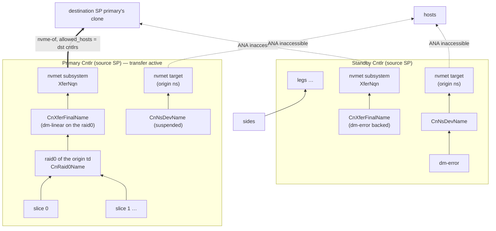

*Fig. `100Transfer` — after `CreateTransfer(auto_suspend = true)` the origin namespace
is retired everywhere; the xfer subsystem is the only live reader/writer of the bytes,
served by the primary.*

**CreateTransfer** —
Errors: `ALREADY_EXISTS`; `RESOURCE_EXHAUSTED` at `MaxXferCntPerSp`; `NOT_FOUND`
`ori_nqn` / `ori_ns_idx`; `INVALID_ARGUMENT` host-NQN rules on `allowed_hosts`
(callers put the destination cntlrs' `CnHostNqn`s here).
Action: STM: `xfer_id` from `next_id`, write `Transfer`, append `xfer_name_list`, bump
`SpRev`. Reply `xfer_id`. Every enabled cntlr creates the xfer stack: primary builds
`CnXferFinalName` = dm-linear on the origin td's raid0 and exports it as subsystem
`XferNqn` on the CN's port (nsid = `ori_ns_idx`, same `nguid`/`uuid` as the origin
namespace, `allowed_hosts` from the record, `Cntlr.cntlid_slot` bounds); standbys
export the same subsystem backed by a dm-error `CnXferFinalName` with ANA
`inaccessible` (fig. `100Transfer` right half). Iff `auto_suspend`, the primary first
(1) moves the origin namespace to ANA `inaccessible` on every cntlr, (2) suspends the
origin td's `CnNsDevName` — the destination clone is now the only reader/writer of the
bytes.

**DeleteTransfer** —
Semantics: `force = false` **finalizes** a completed hand-over: the STM additionally
sets `suspended = true` on the origin namespace, so the source stays retired after the
xfer object disappears. `force = true` **aborts**: `suspended` is left `false`, so the
next syncup restores normal service (resume dev, ANA back).
Action: STM: remove from `xfer_name_list`, delete `Transfer`, (maybe) flip `suspended`,
bump `SpRev`. Agents drop the xfer subsystem + dm devices. Reply `xfer_id`.

**GetTransfer** — STM read. **UpdateTransferHosts** — STM replace `allowed_hosts`, bump
`SpRev` (destination cntlr moved to another CN).

### 8.11 Migrations (fig. `080Migration`, §11.2)

**CreateMigration** —
Errors: `NOT_FOUND` `src_side_id` not found in any leg of the SP; `RESOURCE_EXHAUSTED`
at `MaxMigrCntPerSp` or no DN candidate (§6.5); `FAILED_PRECONDITION` the owning leg
already has 2 sides (a migration is already running on it).
Action: allocate one DN; STM: `migr_id` + `dst_side_id` from `next_id`; append a new
`Side` to the leg's `side_list` (`cntlid_slot` = a slot from `cntlid_slot_list`
different from the src side's — the only slot constraint sides have, §11.8;
`addr_port`/`nvme_tr_conf` copied from the dst DN); write
`Migration{migr_id, src_side_id, dst_side_id, dm_clone_conf, bm_cnt = 0}`, append
`migr_name_list`; dst-DN bookkeeping (`side_ptr_list`, `free_ext_cnt -= group.ext_cnt`,
capacity key per §5.6, `DnRev`); bump `SpRev`. Reply `migr_id`. Data-plane
choreography: §11.2.

**FinishMigration** —
Errors: `FAILED_PRECONDITION` when `force = false` and hydration is incomplete
(checked outside the STM via `GetSideInfo` of the **destination** side —
`migr_dm_clone.details`).
Action: STM: remove the **src** `Side` from the leg (the dst side becomes the only
one); src-DN bookkeeping (pointer out, extents back, capacity key per §5.6, `DnRev`);
delete `Migration` + every `MigrBitmap`, remove from `migr_name_list`; bump `SpRev`.
The dst side agent reloads its per-cntlr dm-linears from the dm-clone straight onto the
LV, drops the dm-clone + metadata LV + nvme host connection + the migration's
`LocalMigrBmPath` files (§9.6); the src DN agent sees the pointer disappear and tears
the side down. Reply `migr_id`.

**CancelMigration** — mirror rollback: STM removes the **dst** `Side` + `Migration` +
bitmaps, returns the dst DN's extents, bumps `SpRev` + dst `DnRev`. The src side
returns to normal service on the next `SyncupSide` (ANA back, migr export dropped);
the dst side agent tears its stack down, including the `LocalMigrBmPath` files.

**GetMigration** — STM read.

**AppendMigrationBitmap** —
Errors: `RESOURCE_EXHAUSTED` `bm_cnt ≥ MaxMigrBmCnt`.
Action: STM: write `MigrBitmap` at `bm_idx = bm_cnt`, `bm_cnt += 1`, bump `SpRev`. The
chunks concatenate (in `bm_idx` order) into one bitmap over the **leg's data region**:
bit *k* covers `block_size` bytes, **1 = never written ⇒ skippable**. Every append
creates a **new** chunk key, so a written chunk is immutable. Delivery to the
destination DN goes through `PushMigrBitmap` (§9.6); the dst side agent shifts by the
leg's `meta_blocks` (the meta region — md superblock, bitmap, health block — must
always be copied, §3.6) and `blkdiscard`s fully-skippable dm-clone regions.

### 8.12 Spare legs

**CreateSpareLeg** — Errors: `NOT_FOUND` `grp_id` not in the SP; `INVALID_ARGUMENT` the
group is RedundNone; `RESOURCE_EXHAUSTED` at `MaxSpareLegPerGrp` or no DN (§6.5).
Action: STM: new `Leg{leg_id, leg_idx = next unused idx in the group, one Side}`
appended to `spare_leg_list`; DN bookkeeping + `DnRev`; bump `SpRev`. Every cntlr
connects to the spare's side and health-checks it (§3.3 step 1), **but the spare is not
added to the md array** — it is pre-connected standby capacity only. Reply `leg_id`.

**DeleteSpareLeg** — Errors: `NOT_FOUND` `grp_id`/`leg_id`. Action: STM remove from
`spare_leg_list`, DN bookkeeping back, bump `SpRev`. Reply `leg_id`.

**SwitchSpareLeg** — the only way a spare becomes active; invoked by users or by the
dn-worker reaction of §10.4. Errors: `NOT_FOUND` ids not in the group's lists.
Action: STM swap: `spare_leg_id` moves to `leg_list` (taking the active role),
`target_leg_id` moves to `spare_leg_list`; bump `SpRev`. The primary then:
`mdadm --fail`/`--remove` the target if the array still lists it, `mdadm --add
--failfast` the promoted spare, and lets md rebuild onto it (write-intent bitmap keeps
this cheap when the target was only briefly absent — but a fresh spare gets a full
resync). Reply the current active + spare leg ids.

### 8.13 Bitmap reads

**GetThinDeviceBitmap** — inputs `td_name`, `slice_idx`, `start_block`, `block_cnt`.
The gateway resolves the primary cntlr's CN in an STM, then (outside) calls the agent's
`GetTdBitmap` to compute, from a dm-thin metadata snapshot of that slice's pool, the
mapping bitmap of the td's thin volume in that slice: bit *k* (for block
`start_block + k`, block = `block_size`) = **1 iff unmapped/never written**.
`block_cnt = 0` ⇒ to the end. Callers page through it and feed `AppendCloneBitmap` on
the destination.

**GetLegBitmap** — inputs `leg_id`, `start_block`, `block_cnt`. Same path via the
agent's `GetLegBm`; the agent walks the pool metadata of the owning slice, translates
pool-data blocks through the pool-data linear concat and the group geometry down to
this leg's **data region**, and returns bit *k* = **1 iff no pool block maps there**.
Callers feed `AppendMigrationBitmap`.

Note the wire convention for every bitmap RPC (`Get*Bitmap`, `Append*Bitmap`,
`Push*Bitmap`) is **1 = unwritten/skippable**, while thin-pool metadata natively
answers **mapped = written**; agents and callers invert once at the boundary (§11.4).

---

## 9. Agent services and agent behavior

### 9.1 Common agent rules

* **Local store.** The agent persists, per synced object, the serialized **last fully
  applied request** as a flat protobuf file: `SyncupDnRequest` at `LocalDnPath`,
  `SyncupSideRequest` at `LocalSidePath`, `SyncupCnRequest` at `LocalCnPath`,
  `SyncupCntlrRequest` at `LocalCntlrPath` — plus one file per received bitmap chunk at
  `LocalMigrBmPath`/`LocalCloneBmPath` (§4.6, §9.6). Every write goes to a temp file in
  the same dir, fsync, rename. The stored request contains the revision, so no separate
  revision record exists. On start the agent loads every file under its prefix,
  reconciles the system to it (full idempotent re-apply, §11.5 for clones), then
  serves. When an object disappears from its parent's pointer list, the agent tears its
  resources down and deletes the file(s).
* **Revision gate.** A `Syncup*`/`Push*` request with a revision **lower** than the
  stored one is rejected (`AgentReply.code != 0`, `details` explains). Equal revision:
  re-apply idempotently (workers retry). Higher: apply, then persist.
* **Full sync.** Every `Syncup*` request carries the complete desired state of its
  object — there is no partial mode. `SyncupDn.side_pointer_list` /
  `SyncupCn.cntlr_pointer_list` are authoritative: pointers in the request but not
  local ⇒ add; local but not in the request ⇒ move to a to-be-deleted list and tear
  their resources down (ids are never reused, so a deleted side/cntlr never comes
  back). The embedded object lists inside `SyncupSide`/`SyncupCntlr` diff the same way.
  Bitmap chunks are the one thing that never rides in a `Syncup*` request; they travel
  only over the dedicated `Push*Bitmap` streams (§9.6).
* Every reply embeds `AgentReply{code, details}` (0 = OK) and the current `*Info`
  (§9.5). All four `Syncup*` and both `Push*` RPCs are bidirectional streams: one
  request message yields one reply message; the worker keeps the stream open and reuses
  it — a `Syncup*` stream for successive revisions of the same target, a `Push*Bitmap`
  stream for all migrations/clones on the same node (§9.6).
* Shell execution uses the §7 timeouts; failures are captured into the affected
  resource's `ResInfo{status = RES_STATUS_ERROR, details}` rather than crashing the
  reconcile — the agent always converges as much as it can and reports the rest.
* **Bitmap durability.** Received `Push*Bitmap` chunks are persisted per chunk under
  `LocalMigrBmPath`/`LocalCloneBmPath`; the applied-index sets reported through
  `bm_info`/`bm_info_list` are derived from the files present, so they survive agent
  restarts and the worker does not have to re-push after one. Re-applying a chunk is
  always harmless — re-`blkdiscard`ing an already-hydrated dm-clone region is a no-op.
  Full protocol: §9.6.

### 9.2 `service DiskNodeAgent`

| rpc | behavior |
|---|---|
| `GetDnSize` | Return the byte size of the `--disk` block device (`lsblk --bytes`). Called by the gateway pre-registration; `dn_id` in the request is for logging only. |
| `SyncupDn` (stream) | Carries `revision`, `cluster_conf`, `side_pointer_list`. Ensure §3.1 base state (PV/VG, `migr-pv` + migration VG, the single nvmet port); diff the pointer list per §9.1; reply `DnInfo`. |
| `SyncupSide` (stream) | Carries one `side_pointer`, `revision`, `ext_cnt`, `sp_level`, `primary_cn_id`, `standby_id_list`, and — when this side is a migration endpoint — `migration` + `src_side`. Reject if the pointer is unknown (SyncupDn must introduce it first). Converge the §3.1 per-side stack: LV of `ext_cnt` extents (§9.4), per-CN dm-error/dm-linear/nvmet subsystem, primary vs standby table targets + ANA states, migration source/destination roles (§11.2). Reply `SideInfo` + `bm_info` (the applied migration-bitmap indexes, §9.6). |
| `PushMigrBitmap` (stream) | Deliver one `MigrBitmap` chunk (`side_pointer`, `revision`, `migr_id`, `bm_idx`, `bitmap`) to the **destination**-side agent, per the §9.6 protocol: persist the chunk at `LocalMigrBmPath`, then recompute + `blkdiscard` the fully-skippable dm-clone regions (§8.11, §11.4). One stream per DN, shared by every migration whose destination lives on it (§9.6). |
| `GetDnInfo` / `GetSideInfo` | Return the current `DnInfo` / `SideInfo` without changing anything. |

### 9.3 `service ControllerNodeAgent`

| rpc | behavior |
|---|---|
| `GetCnSize` | Return the capacity budget in bytes this CN is willing to host (0 = "use the default"); typically from local config. |
| `SyncupCn` (stream) | `revision`, `cluster_conf`, `cntlr_pointer_list`. Ensure §3.2 base state (tmpfs, loop, clone VG, the single nvmet port); diff pointers; reply `CnInfo`. |
| `SyncupCntlr` (stream) | One `cntlr_pointer`, `revision`, `bdev_conf`, `sp_level`, `cntlr`, `id_to_slice` (key = `sprintf(IdKeyFmt, slice_id)`), `td_list`, `nqn_to_subsystem`, `clone_list`, `xfer_list`, `migr_list`. Converge §3.3 (primary) or §3.4 (standby); a primary→standby or standby→primary flip follows §11.1 exactly; clone rebuild follows §11.5. Reply `CntlrInfo` + `bm_info_list` (the applied clone-bitmap indexes, one `BitmapInfo` per clone, §9.6). |
| `PushCloneBitmap` (stream) | Deliver one `CloneBitmap` chunk (`cntlr_pointer`, `revision`, `clone_id`, `bm_idx`, `bitmap`) to the **primary** cntlr's agent, per the §9.6 protocol: persist the chunk at `LocalCloneBmPath`, translate through §11.4, `blkdiscard` the dm-clone. Safe at any time (§11.5). One stream per CN, shared by every clone on it (§9.6). |
| `GetCnInfo` / `GetCntlrInfo` | Read-only live state. |
| `GetTdBitmap` / `GetLegBm` | Serve the §8.13 gateway reads from a dm-thin metadata snapshot (`dmsetup message ... reserve_metadata_snap`, read via `thin_dump`/direct parse, then `release_metadata_snap`): per-slice td mapping bitmap, or the leg-projected pool mapping bitmap. Reply bitmaps use the wire convention **1 = unmapped**. |

### 9.4 LV provisioning protocol (trim tags)

To guarantee a new side never leaks a previous tenant's data, DN agents create LVs in
three idempotent steps (restart-safe at every point):

1. `lvcreate --addtag not_trimmed --name {DnLvName} --extents {ext_cnt} {DnVgName}`
2. `blkdiscard --force {DnLvPath}`
3. `lvchange --deltag not_trimmed --addtag trimmed {DnLvPath}`

An LV carrying `not_trimmed` is never exported; on restart the agent redoes 2-3.
(`lvs --report-format json --options lv_name,lv_tags` is the probe.)

### 9.5 Live-state reporting

`ResInfo{res_name, status, details, epoch}` with `ResStatus`: `UNKNOWN`(no answer from
the node — set by *workers*, never by the agent itself), `MISSING`(agent hasn't created
it), `ERROR`(tried and failed; `details` = why / command output), `OK`. `epoch` = unix
seconds of the last status change. `revision` in each `*Info` = last fully applied
revision. Map keys in `SideInfo`/`CntlrInfo` are the obvious owner ids (cntlr_id,
td_id, slice_id, grp_id, leg_id, ns_id, ss_id, clone_id, xfer_id). dm-clone `details`
strings carry the raw `dmsetup status` line so hydration progress is visible through
`Inspect*`. `CntlrInfo.leg_id_to_leg` reflects the §3.6 health-check block IO: a leg
whose probe write/read fails (or times out per the nvme `fast_io_fail_tmo`) is reported
`RES_STATUS_ERROR` with the IO error in `details`.

### 9.6 Bitmap push protocol (`PushMigrBitmap` / `PushCloneBitmap`)

The skip bitmaps of §8.9/§8.11 reach the data plane exclusively through these two
**streaming** RPCs — never through `Syncup*`. Both follow one protocol; the table maps
the per-RPC roles:

| | `PushMigrBitmap` (`DiskNodeAgent`) | `PushCloneBitmap` (`ControllerNodeAgent`) |
|---|---|---|
| chunk source in etcd | `MigrBitmap` keys, `bm_idx` = append sequence `0 … bm_cnt−1` (≤ `MaxMigrBmCnt` = 4) | `CloneBitmap` keys, `bm_idx` = source `slice_idx` (< `src_slice_cnt` ≤ `MaxCloneBmCnt` = 16) |
| chunk meaning | chunks **concatenate in `bm_idx` order** into one bitmap over the leg's data region (§8.11); immutable once written | each chunk is a **self-positioned** per-source-slice bitmap (§8.9); `AppendCloneBitmap` may keep growing it |
| receiving agent | the DN hosting the migration's **destination** side | the CN hosting the **primary** cntlr (only it runs the dm-clone) |
| request fields | `side_pointer`, `revision`, `migr_id`, `bm_idx`, `bitmap` | `cntlr_pointer`, `revision`, `clone_id`, `bm_idx`, `bitmap` |
| local chunk file | `LocalMigrBmPath(cluster, dn, sp, migr, bm_idx)` | `LocalCloneBmPath(cluster, cn, sp, clone, bm_idx)` |
| applied-set report | `SyncupSideReply.bm_info` (`BitmapInfo.res_id = migr_id`) | `SyncupCntlrReply.bm_info_list` (one `BitmapInfo` per clone, `res_id = clone_id`) |
| apply action | shift by the leg's `meta_blocks` (§8.11), then §11.4 → `blkdiscard` on `DnMigrFinalName` | §11.4 → `blkdiscard` on `CnCloneFinalName` |

**Why chunked, why ordered.** A whole bitmap might be too large for one etcd value or
one gRPC message (`Get*Bitmap` is paged for the same reason), so it is split into
multiple parts and `bm_idx` fixes each part's position so the receiver can reassemble
the bitmap correctly. For migration chunks the position is by concatenation: chunk
*k*'s first bit sits at the summed bit length of chunks `0 … k−1`, so chunk *k* is only
interpretable once every lower chunk is present — delivery order matters. Clone chunks
are positioned by `bm_idx = slice_idx` alone and are order-independent among each
other. (With the defaults the bitmaps are small — a 1 TiB leg at 1 MiB `block_size` is
2^20 bits = 128 KiB — the chunking exists for the value-size limits and the paged
readers, not because bitmaps are inherently huge.)

**dnv-worker side** (sp role, §10.3):

1. **Learn what is missing from the syncup replies.** Every `SyncupSide` /
   `SyncupCntlr` reply returns the agent's applied sets as `BitmapInfo.bm_idx_list`:
   `bm_info` for the migration whose destination is that side, one `bm_info_list`
   entry per clone. The worker diffs each list against the chunk keys present in etcd;
   the indexes in etcd but not in `bm_idx_list` are exactly the missed parts still to
   deliver.
2. **Push one part per request.** Each missed part is written as one
   `PushMigrBitmapRequest` / `PushCloneBitmapRequest` carrying the addressing ids
   (`side_pointer` + `migr_id`, resp. `cntlr_pointer` + `clone_id`), the `revision`,
   the `bm_idx` and the raw chunk bytes.
3. **One in flight.** The worker sends the next request on a stream **only after the
   reply to the previous one has arrived**. Per migration/clone it pushes missed parts
   in ascending `bm_idx`; together with the one-in-flight rule this guarantees the
   in-order arrival that migration chunk concatenation requires.
4. **Stream sharing.** The worker keeps at most **one** `PushMigrBitmap` stream open
   per DN agent: **all migrations on the same DN share the same stream** — every
   migration (of every SP the worker owns) whose destination side lives on that DN is
   multiplexed over it, requests for different migrations simply interleaving.
   `PushCloneBitmap` works the same way on the CNs: at most one stream per CN agent,
   shared by all clones of all cntlrs the worker owns on that CN. (Contrast §9.1: the
   `Syncup*` streams are per object; the `Push*` streams are per node.)
5. **Targets.** Migration chunks go only to the destination side's DN; clone chunks go
   only to the CN currently hosting the primary cntlr. After a failover or a
   destination change the new node's syncup reply simply reports an empty/partial
   `bm_idx_list` and the worker pushes the missing parts there.
6. A reply with `AgentReply.code != 0` (stale revision; unknown `migr_id`/`clone_id`
   because the introducing `SyncupSide`/`SyncupCntlr` has not been applied yet) is not
   fatal: the worker re-pushes the part on its next sync round.

**dnv-agent side:**

1. **Gate** the request per §9.1: reject (`code != 0`) a stale revision or a
   `migr_id`/`clone_id` it does not know yet.
2. **Persist, then apply.** Write the chunk to its `LocalMigrBmPath` /
   `LocalCloneBmPath` file first (temp file + fsync + rename, §9.1); then recompute
   the fully-skippable dm-clone regions from **all** locally present chunks of that
   migration/clone (§11.4 math; migrations first shift by the leg's `meta_blocks`,
   §8.11) and apply them to the migration/clone dm-clone by `blkdiscard`ing
   `DnMigrFinalName` / `CnCloneFinalName`. If the dm-clone does not currently exist
   (not built yet, or suppressed by `sp_level`), the file still counts as applied —
   the agent re-applies every local chunk whenever it (re)creates the owning dm-clone.
3. **Reply.** The `Push*BitmapReply` carries only `AgentReply`; a `code = 0` reply is
   the acknowledgement the worker waits for before pushing the next part.
4. **Restart / rebuild.** On start the agent reloads every `Local*BmPath` file under
   its prefix and re-applies the chunks once the owning dm-clone is (re)built (agent
   restart, §11.5 clone rebuild, `sp_level` lowering) — re-application is idempotent.
   Because the applied sets in `bm_info`/`bm_info_list` are derived from the files on
   disk, they survive restarts and the worker never re-pushes what the node already
   holds. The files are deleted together with their object: when the migration/clone
   disappears from the synced desired state (or via §8.9/§8.11 teardown), the agent
   removes them with the rest of the local state.

**Grown clone chunks [D8].** `AppendCloneBitmap` may append more bytes to a `bm_idx`
that was already pushed and acknowledged. The worker therefore keeps an in-memory,
per-stream memo of the byte length it last pushed per `(clone_id, bm_idx)` and
re-pushes a chunk whose etcd value grew past that length; the agent overwrites the
stored file and re-applies whenever a received payload differs from it. If the worker
changes (crash, shard re-ownership) the memo is lost, and a chunk that grows afterwards
while staying in the acknowledged set may keep its shorter version at the agent —
accepted: src bitmaps are a pure optimization that never affects correctness (§8.9,
§11.5); the only cost is copying some regions that could have been skipped. Migration
chunks are immutable (every `AppendMigrationBitmap` creates a new `bm_idx`), so they
have no such caveat.

---

## 10. Workers

### 10.1 Membership and shard ownership

Each `dnv-worker` instance, per role it carries, registers
`{p} worker {role} {worker_uuid}` bound to an etcd lease and watches the registry.
Shard-code ownership uses rendezvous (HRW) hashing: for shard `s`, owner =
`argmax over live workers w of fnv64a(worker_uuid ∥ role ∥ s)` — deterministic on every
worker, no coordinator, and adding/removing a worker only moves ~1/n of the shards
(matching the "third worker takes ~1/3" behavior). A worker acts only on shards it
currently owns and re-evaluates on every membership change.

### 10.2 dn / cn roles

For each owned shard `s`, watch prefix `{p} dn_rev {s} ` (resp. `cn_rev`). On a `put`:
read the node's desired state (`DnConf` + `ClusterConf`; the sides' details are pushed
by the sp role) and call `SyncupDn` (resp. `SyncupCn`) with that revision. On a
`delete`: stop syncing/health-checking the node. Additionally poll owned nodes
(`GetDnInfo`/`GetCnInfo`, suggested every few seconds): on failure or bad status set
`DnConf.err_epoch`/`CnConf.err_epoch` = now (if 0) in an STM; clear to 0 on recovery.
The same STM maintains the node's capacity key per §5.6 (unhealthy ⇒ delete, recovered
⇒ recreate). `err_epoch`/capacity changes never bump revisions.

### 10.3 sp role

Watch `{p} sp_rev {s} ` per owned shard. On a bump: load the SP (SpConf, cntlrs,
slices, tds, subsystems, clones, xfers, migrs, bitmaps) and fan out `SyncupSide` to
**every side** of the SP and `SyncupCntlr` to **every cntlr**, with the new revision —
each request always carries the full desired state (§9.1). Bitmap chunks travel over
the dedicated `PushCloneBitmap`/`PushMigrBitmap` streams instead (§9.6): the replies'
`bm_info`/`bm_info_list` tell the worker which chunk indexes each agent already holds,
and it pushes the missed parts — one request in flight per per-node stream, in
ascending `bm_idx`. The replies' `*Info` also feed health: set/clear `err_epoch` on
`Cntlr`, `Leg`, `Side` records accordingly (STM, no rev bump) — in particular a
failing §3.6 health-check block turns into `Leg.err_epoch` (and `Side.err_epoch` when
the side path itself is the failing part).

### 10.4 Automatic reactions (`EventThreshold`)

All comparisons are `now − err_epoch ≥ threshold` with the SP's `event_threshold`
(0-valued fields fall back to the §7 defaults). All actions are ordinary STM mutations
that bump `SpRev`, so the data-plane choreography is the same as for the equivalent
manual RPC:

* `primary_unhealthy` (5 s): the primary cntlr is unhealthy ⇒ pick the healthy, enabled
  cntlr with the smallest `cntlr_id`, flip the `primary` booleans. This *is* the
  failover trigger of §11.1.
* `cntlr_unhealthy` (600 s): a (non-primary, or already-failed-over) cntlr stays
  unhealthy ⇒ replace it: internal `DeleteCntlr` (skipping the enabled check) + internal
  `CreateCntlr` on a fresh CN with the same `cntlid_slot`.
* `side_unhealthy` (600 s): a side stays unhealthy ⇒ start an internal migration of its
  leg to a fresh DN (§8.11); a pre-existing healthy migration of that leg is left alone.
* `leg_unhealthy` (1200 s): a leg stays unhealthy ⇒ if the group has a spare, perform an
  internal `SwitchSpareLeg` (§8.12 — the spare is only now `mdadm --add`-ed and
  rebuilt); otherwise create a spare on a fresh DN first, then switch.
* `pool_low_water_mark_pct`: not a worker action — it is compiled into the thin-pool
  table (§3.3) so the kernel emits a dm event; the agent surfaces data-space and
  metadata-space pressure as `RES_STATUS_ERROR`-with-details on the pool's `ResInfo`,
  and operators react with `GrowSlice` (data: `is_meta = false` with a chosen
  `ext_cnt`; metadata: `is_meta = true`, sized by the §8.5 ladder).

The worker never deletes user data on its own; every automatic action above only
re-homes redundancy or roles.

---

## 11. Procedures

### 11.1 Failover

An SP has multiple cntlrs; exactly one is primary. A failover switches the primary from
one cntlr (`old_primary`) to another (`new_primary`) and involves three kinds of
participants. The trigger is only ever an etcd change (§10.4 or `UpdateCntlrEnabled`),
delivered by revision-ordered syncups.

**old_primary** — on a `SyncupCntlr` saying it is not primary (revision higher than
everything it has seen):

1. Move all namespaces from the `optimized` ANA group state to `inaccessible`.
2. Wait until no inflight IO remains on the ns-dev layer.
3. Reload every td's `CnNsDevName` dm-linear onto its `CnErrorName`.
4. Clean up every resource a primary shouldn't have (raid0s, thin volumes, pools,
   pool-meta/data linears, md arrays) — leaving the §3.4 standby set.

**new_primary** — on a `SyncupCntlr` saying it is primary (highest revision):

1. Make sure all groups are available (§11.1.1).
2. Create the pools, thin volumes and raid0 devices (§3.3 steps 3-5).
3. Reload every td's `CnNsDevName` from `CnErrorName` onto its raid0 (or dm-clone,
   for an in-flight clone — after the §11.5 recovery if the clone state was lost).
4. Move all namespaces from `inaccessible` to `optimized`.

#### 11.1.1 "Make sure all groups are available"

Example: an SP with 2 slices, each slice 1 meta + 2 data groups, `RedundMdRaid1`
(2 legs/group) needs md-raid1 devices `slice{0,1}-{meta-grp0, data-grp0, data-grp1}`,
each over 2 leg devices. Cases when creating one raid1 (all commands with the §3.3
bitmap/failfast/data-offset options):

1. Both legs available:
   1. Neither has an md superblock ⇒ `mdadm --create` (with `--assume-clean` only when
      both legs are freshly trimmed).
   2. Exactly one has a superblock ⇒ `mdadm --assemble` with that leg, then
      `mdadm --add` the other.
   3. Both have superblocks ⇒ `mdadm --assemble` with both, then `mdadm --detail`; if
      one leg was left out for stale metadata, `mdadm --add` it again.
2. One leg available ⇒ `mdadm --assemble` **without** `--run`; mdadm decides:
   success ⇒ the group is available (degraded), failure ⇒ it is not.
3. No leg available ⇒ the group is not available.

A group is available in cases 1 and 2-success. **A leg is available** iff it has an
`optimized` path: normally its single side's export toward this CN is optimized; a
`non-optimized` path means the side currently exports dm-error and cannot be used.
During a migration the leg has a src and a dst side whose states pair as
`non-optimized`/`inaccessible` or `optimized`/`inaccessible`; any `optimized` state
makes the leg available. The §3.6 health-check block is the ongoing liveness probe on
top of this: an available leg whose probe IO fails is reported unhealthy and feeds
§10.4. Spare legs never participate in assembly (§8.12).

**sides** — on a `SyncupSide` (highest revision) showing a changed primary:

1. Move the old primary CN's subsystem from `optimized` to `non-optimized`.
2. Suspend the old primary CN's dm-linear.
3. Reload the new primary CN's dm-linear so it sits on the LV.
4. Move the new primary CN's subsystem from `non-optimized` to `optimized`.
5. Sleep `SideSwitchWait` = 300 s (grace so the old primary has drained, §11.1 step 2).
6. Reload the old primary CN's dm-linear back onto its dm-error and resume it.

### 11.2 Migration (side → side; fig. `080Migration`)

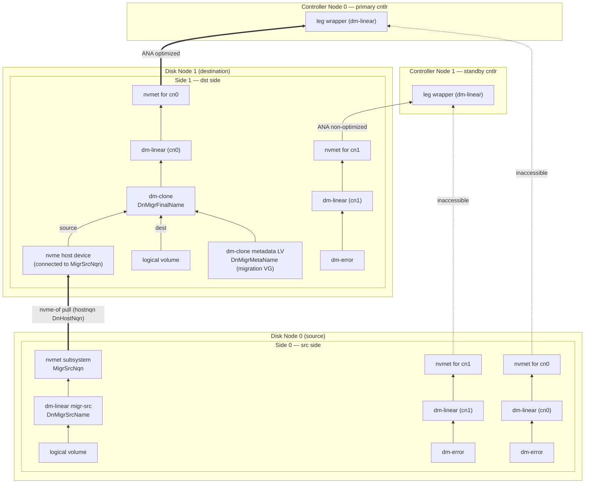

*Fig. `080Migration` — mid-migration: the leg temporarily owns two sides; the CN leg
wrappers were reloaded onto the destination side, whose dm-clone pulls from the
source.*

Starting a migration resembles a failover; the leg temporarily owns two sides.

**src side** (driven by its `SyncupSide` carrying the `Migration`):

1. Move every per-CN subsystem's namespace to `inaccessible` (all cntlrs).
2. Suspend every per-CN dm-linear.
3. Build `DnMigrSrcName` (linear on the LV) and export it via `MigrSrcNqn`,
   `allowed_hosts = [DnHostNqn(cluster, dst_dn)]`.

**dst side** (its `SyncupSide` carries `Migration` + `src_side`):

1. Create the per-CN subsystems/namespaces with dm-error backing, all `inaccessible`.
2. `lvcreate` `DnMigrMetaName` in the migration VG (metadata for the dm-clone).
3. `nvme connect` to `MigrSrcNqn` at `src_side.nvme_tr_conf` (hostnqn `DnHostNqn`,
   `fast_io_fail_tmo = 5`, `ctrl_loss_tmo = -1`), retrying until success.
4. Create the dm-clone `DnMigrFinalName`: metadata = step 2's LV, dest = the local side
   LV, source = the connected nvme device, region size = the SP's `block_size`,
   hydration knobs from `Migration.dm_clone_conf`.
5. Reload the **primary** CN's dm-linear onto the dm-clone; set that subsystem
   `optimized`, all other CNs' `non-optimized`.

IO now flows host → primary cntlr → dst side (dm-clone pulls missing regions from the
src on demand and hydrates in the background). The dm-clone metadata lives on disk (the
migration VG inside the DN VG), so a DN reboot resumes hydration where it left off — no
special recovery is needed, unlike clones (§11.5). The optional bitmap fast-path:
`GetLegBitmap` (paged) → `AppendMigrationBitmap` → worker `PushMigrBitmap` (§9.6) →
dst agent persists each chunk at `LocalMigrBmPath` and `blkdiscard`s never-written
regions so they are never copied (§8.11, §8.13, §11.4).
`FinishMigration` / `CancelMigration` per §8.11.

### 11.3 Transfer + clone = cross-SP live migration (figs `090Clone` §8.9, `100Transfer` §8.10)

A clone's source can be *any* NVMe-oF namespace; when the source is a dnv transfer the
pair performs live migration of a volume between SPs (even across clusters). Setup for
moving ss/ns from `sp1` to `sp2`:

* `sp2` gets an identical subsystem (same NQN) and namespace (same `ns_idx`, and the
  same `nguid`/`uuid` — pass them to `CreateNamespace`, §8.8) on a **fresh, empty**
  thin device [D3], so hosts aggregate `sp1`'s and `sp2`'s exports into one multipath
  device.
* `sp1` and `sp2` cntlrs MUST use disjoint `cntlid_slot`s (≤ 4 cntlrs each, 8 slots —
  exactly enough). If not, rotate a cntlr: `UpdateCntlrEnabled(false)` → `DeleteCntlr`
  → `CreateCntlr` with a free slot. Likewise the two SPs' cntlrs MUST NOT share CNs;
  rotate the same way if they do.
* Ensure `Namespace.suspended = false` on sp1 and `= true` on sp2
  (`UpdateNamespaceSuspended`).
* Collect the sp2 cntlrs' CN ids ⇒ `CnHostNqn` list.
* `CreateTransfer` on sp1 (`ori_nqn`/`ori_ns_idx`, `allowed_hosts` = that list,
  `auto_suspend = true`) — the sp1 primary then: (1) origin ns → `inaccessible`,
  (2) suspend its `CnNsDevName`, (3) create `CnXferFinalName` on the raid0, (4) export
  it via `XferNqn` per the Transfer.
* `CreateClone` on sp2 (`src_tr_conf_list` = sp1 cntlr endpoints, `src_nqn` =
  the transfer's `XferNqn`, `src_ns_idx = ori_ns_idx`, the source geometry
  `src_slice_cnt`/`src_stripe_size`/`src_block_size` = sp1's slice count / raid0 stripe
  / pool block size, `dst_td_name`, `auto_resume = true`) — the sp2 primary then:
  (1) connect to the targets, (2) create `CnCloneMetaName`, (3) create
  `CnCloneFinalName`, (4) reload `CnNsDevName` onto it and resume, (5) origin
  namespace → `optimized`. Hosts flip to sp2 transparently.
* Optional bitmap fast-path: per sp1 slice `GetThinDeviceBitmap` (paged) →
  `AppendCloneBitmap(slice_idx, …)` on sp2 → worker `PushCloneBitmap` (§9.6) → sp2
  primary persists each chunk at `LocalCloneBmPath` and `blkdiscard`s (§11.4). Safe
  while IO runs (§11.5).
* When hydration completes: `DeleteTransfer(force=false)` on sp1 (retires the source:
  `suspended = true`) and `DeleteClone` on sp2 (`suspended = false`, ns now backed by
  the local raid0). To abort instead: `DeleteClone(force=true)` on sp2 and
  `DeleteTransfer(force=true)` on sp1.

### 11.4 raid0 bitmap math

Definitions for one raid0 device: `slice_cnt` underlying devices, `stripe_size` chunk
size, and per-underlying-device write bitmaps whose bit granularity is `block_size`.
Constraints (validated in §8.9): `1 ≤ slice_cnt ≤ 16`; `stripe_size = i × 4 KiB,
1 ≤ i ≤ 256`; `block_size = j × 64 KiB, 1 ≤ j ≤ 16384`; `block_size = k × stripe_size,
k ≥ 1`. Address mapping for logical byte offset `off`: chunk `c = off / stripe_size`,
slice `= c mod slice_cnt`, slice-local offset `= (c div slice_cnt) × stripe_size +
(off mod stripe_size)`.

Worked example (`slice_cnt = 4`, `stripe_size = 16 KiB`, `block_size = 1 MiB`; here the
16 KiB chunks are drawn as 4 × 4 KiB rows for compactness): writing the 1st, 3rd, 7th
and 8th 4 KiB units of the logical device sets, in *written = 1* convention, bit 0 of
slice 0's bitmap, bits 0-1 of slice 2's, bit 1 of slice 3's, and nothing in slice 1's.

**Skip-bitmap function.** Given source geometry `A` (`slice_cnt_A`, `stripe_size_A`,
`block_size_A`, per-slice bitmaps, *written = 1*) and destination geometry `B`
(idem, bitmaps *copied = 1*, all-zero on first run), with the extra constraint that the
larger of the two stripe sizes is an integer multiple (`m > 1`) of the smaller, define
`region_size = min(stripe_size_A, stripe_size_B)` — so any region is contiguous inside
one chunk on **both** sides — and `region_cnt = min(size_A, size_B) / region_size`.
Output: a bitmap of `region_cnt` bits where bit `r` = 1 ⇔ region `r` need **not** be
copied ⇔ `NOT writtenA(r) OR copiedB(r)`, where `writtenA(r)` ORs and `copiedB(r)` ANDs
the covered source/destination bitmap bits after mapping region `r`'s byte range through
each side's address mapping. Consumers:

* `dnvctl admin clone` — a restartable userspace copier that reads/writes only the two
  top raid0 devices in `region_size` units, skipping 1-bits; B's bitmaps advance
  automatically as it writes (thin-pool mappings), so a crash simply re-runs the
  function. It may copy some zeroes (over-copy is fine); it must never skip written
  source data.
* The **agents** applying src `CloneBitmap`s / `MigrBitmap`s (§9.6): same math with no
  B term (dm-clone tracks its own hydration) and `region_size` = the dm-clone region
  (= destination `block_size`, which may exceed `stripe_size_A` — then a region spans
  several source slices and `writtenA` simply ORs across all of them); `blkdiscard`
  region `r` ⇔ `NOT writtenA(r)`. For migrations, first shift by `meta_blocks` (§8.11).
* Clone **crash recovery** (§11.5): B-side only — `blkdiscard` region `r` ⇔
  `copiedB(r)`.

Wire vs local conventions: every Gateway/etcd bitmap (`Get*Bitmap`, `Append*`,
`CloneBitmap`, `MigrBitmap`) is **1 = unwritten/skippable**; thin-pool metadata and the
formulas above use **written/copied = 1**. Invert exactly once at the boundary.

### 11.5 Clone crash recovery (destination-bitmap rebuild)

Clone progress durability does **not** rely on the src bitmaps in etcd; it relies on
the **destination thin-pool bitmaps**. The dst td starts empty [D3], and dm-clone
hydrates in region = `block_size` units, so after any crash "block mapped in a dst
thin pool" ⇔ "block already copied". The volatile clone metadata LV (tmpfs, §3.2) is
therefore rebuildable. Whenever the primary (re)builds a clone whose dm-clone metadata
is missing — CN reboot, failover to a cntlr that never ran it, tmpfs loss — it MUST:

1. Suspend the dm-linear `CnNsDevName` of the td's namespace (or make sure it is not
   created / not yet pointing anywhere live).
2. Read the **dst bitmaps**: the mapping bitmap of the dst td from every thin pool of
   the SP (per slice, *mapped = 1 = copied*).
3. Create the dm-clone with **hydration disabled** and a fresh metadata LV.
4. `blkdiscard` every dm-clone region whose bits are 1 in the dst bitmaps (§11.4,
   B-side only) — marking those regions "already hydrated".
5. Resume the dm-linear `CnNsDevName`; enable background hydration.

The dst bitmaps MUST be fully applied **before** the dm-clone handles any IO —
otherwise a read of an already-copied (and possibly since-rewritten) region would be
fetched from the source again, returning stale data over the newer local bytes. The
**src** bitmaps (§8.9) carry no such hazard — they only mark regions the source never
wrote — so they may keep arriving via `PushCloneBitmap` after IO has started; any src
chunks already persisted at `LocalCloneBmPath` are simply re-applied by the agent once
the dm-clone is rebuilt (§9.6), with no worker involvement.

### 11.6 Namespace suspend semantics

`suspended = true` ⇔ every cntlr keeps the td's `CnNsDevName` dm-suspended and the ns
ANA group `inaccessible`; `false` ⇔ normal §3.3/§3.4 behavior. Set by users
(`UpdateNamespaceSuspended`) and by the transfer/clone finalization (§8.9/§8.10).

### 11.7 SpLevel (see §8.4 UpdateStoragePoolLevel)

Levels gate agent behavior top-down for disaster recovery: each step removes one more
fragile layer until `SP_LEVEL_DISABLE` leaves only the LVs. Agents treat the level as
part of desired state (it rides in every `SyncupSide`/`SyncupCntlr`): raising it tears
layers down, lowering it rebuilds them.

### 11.8 cntlid slots

NVMe multipath requires distinct CNTLIDs among the controllers a host aggregates. dnv
partitions the cntlid space via
`/sys/kernel/config/nvmet/subsystems/{nqn}/attr_cntlid_{min,max}` into
`CnCntlidSlotCnt = DnCntlidSlotCnt = 8` slots, `Base = 10000`, `Step = 5000`, on both
CNs and DNs: slot *s* ⇒ `attr_cntlid_min = 10000 + s×5000`,
`attr_cntlid_max = attr_cntlid_min + 5000` (slot 0 = 10000-15000, … slot 7 =
45000-50000). All slots come from `SpConf.cntlid_slot_list`. Rules:

* Every **cntlr** of an SP uses a slot distinct from every other cntlr of the same SP
  (host-facing multipath aggregates them).
* A **side** uses one slot for all its per-CN exports. Sides of one SP MAY share slots
  freely — each side subsystem has a unique NQN, so no host-side aggregation occurs.
  The **only** side constraint: when a leg is being migrated, the src side and the dst
  side MUST use different slots.
* Two SPs joined by transfer+clone MUST use disjoint slot sets across their cntlrs
  (§11.3) — their host-facing subsystems share NQNs.

---

## 12. dnv-cdc

`dnv-cdc --etcd-endpoints … --range 0,1,…` serves the NVMe-oF Central Discovery
Controller (well-known NQN `nqn.2014-08.org.nvmexpress.discovery`) to hosts. `--range h`
claims every shard code whose first hex digit is `h` (range `0` = shards `00…0f`, range
`1` = `10…1f`, …), i.e. it watches the `{p} cdc ` prefix and filters on the
`{shard_code}` key field. For each `CdcEntry` it advertises discovery log entries
(`nqn` × every `NvmeTrConf` in `nvme_tr_conf_list`) to hosts whose hostnqn is in
`allowed_hosts` (empty ⇒ everyone), and emits discovery-log-change AENs on any watched
change — hosts running `nvme-stas` then connect/disconnect automatically (this is what
makes `DeleteSubsystem`, `CreateCntlr`, `UpdateCntlrEnabled` transparent to hosts).
Deploy ≥ 2 instances with complementary ranges; hosts are configured with all cdc
endpoints.

---

## 13. Components: invocation reference

```shell
dnv-gateway --grpc-network tcp --grpc-address 192.168.0.20:29527 \
  --etcd-endpoints 192.168.0.10:2379,192.168.0.11:2379,192.168.0.12:2379

dnv-worker --etcd-endpoints 192.168.0.10:2379,192.168.0.11:2379,192.168.0.12:2379 \
  --roles dn,cn,sp

dnv-agent dn --grpc-network tcp --grpc-address 192.168.0.20:29528 \
  --tr-type tcp --adr-fam ipv4 --tr-addr 192.168.0.20 --tr-svc-id 4200 \
  --local-store /var/tmp \
  --disk /dev/disk/by-uuid/4425c6a8-dc27-40a3-9fd5-0cc41f534360

dnv-agent cn --grpc-network tcp --grpc-address 192.168.0.20:29529 \
  --tr-type tcp --adr-fam ipv4 --tr-addr 192.168.0.20 --tr-svc-id 4200 \
  --local-store /var/tmp

dnv-cdc --etcd-endpoints ... --range 0,1,2,3,4,5,6,7
dnv-cdc --etcd-endpoints ... --range 8,9,a,b,c,d,e,f
```

Every flag is also settable via config file and environment (viper). The agent's
`--tr-*` flags define the node's single nvmet port (`NvmeTrConf`), mirrored into
`DnConf`/`CnConf` at creation; `--local-store` sets the `localStorPrefix` under which
the §4.6 state files live. `dnvctl` subcommand sketch: `dnvctl dn|cn|sp|vol create|…`,
`dnvctl admin update_etcd | move_dn | move_cn | clone` (the §11.4 copier).

---

## Appendix A — command-pattern crib sheet

Agents converge with stock tooling; the exact invocations below are normative patterns
(placeholders in `{}`). Probing uses `--report-format json` for LVM, `mdadm --detail`,
`dmsetup status/table`, `nvme list-subsys -o json`, and configfs reads for nvmet.

**LVM (DN):**

```shell
pvcreate {disk}
vgcreate --physicalextentsize {extent_size}B {DnVgName} {disk}
lvcreate --addtag not_trimmed --name {DnLvName} --extents {ext_cnt} {DnVgName}
blkdiscard --force {DnLvPath}
lvchange --deltag not_trimmed --addtag trimmed {DnLvPath}
lvremove --yes {DnLvPath}
# migration VG (once per DN):
lvcreate --name migr-pv --size {DefaultMigrVgSize}B {DnVgName}
vgcreate --physicalextentsize {DefaultMigrVgExtSize}B {DnMigrVgName} {DnMigrPvPath}
lvcreate --name {DnMigrMetaName} --size {meta_size}B {DnMigrVgName}
```

**CN clone VG (tmpfs-backed):**

```shell
mount -t tmpfs -o size=2G tmpfs {CnTmpfsPath}
truncate --size {DefaultCloneVgSize} {CnTmpFilePath}
losetup --find --show {CnTmpFilePath}          # → {loopdev}
pvcreate {loopdev}
vgcreate --physicalextentsize {DefaultCloneVgExtSize}B {CnCloneVgName} {loopdev}
lvcreate --name {CnCloneMetaName} --size {meta_size}B {CnCloneVgName}
```

**md-raid1** (`{data_offset_k} = meta_blocks × block_size / 1024`, §3.6; every member
is failfast; masking udev incremental assembly for dnv arrays —
`SUBSYSTEM=="block", ENV{MD_NAME}=="dnv-*", ENV{SYSTEMD_READY}="0"` — is recommended so
only the agent assembles):

```shell
mdadm --create /dev/md/{CnMdDevName} --name {CnMdArrayName} --level 1 \
  --raid-devices {n} --bitmap internal --bitmap-chunk {bitmap_chunk_k}K \
  --data-offset {data_offset_k}K --failfast --homehost any --run {leg_devs...} \
  [--assume-clean]                       # only when §11.1.1 case 1.1 allows it
mdadm --assemble /dev/md/{CnMdDevName} --name {CnMdArrayName} {leg_devs...}
mdadm /dev/md/{CnMdDevName} --add --failfast {leg_dev}
mdadm /dev/md/{CnMdDevName} --fail {leg_dev} ; mdadm /dev/md/{CnMdDevName} --remove {leg_dev}
mdadm --stop /dev/md/{CnMdDevName}
mdadm --zero-superblock {leg_dev}        # only on explicit teardown of a leg
```

**device-mapper** (`dmsetup create {name} --table "…"`; sizes in 512 B sectors):

```text
error :          0 {sectors} error
linear:          0 {sectors} linear {dev} {offset_sectors}
  # RedundNone group device: {dev} = leg, {offset} = meta_blocks × block_size / 512
striped (raid0): 0 {sectors} striped {slice_cnt} {stripe_sectors} {dev0} 0 {dev1} 0 …
thin-pool:       0 {sectors} thin-pool {meta_dev} {data_dev} {block_sectors} {low_water_mark}
  messages: create_thin {dev_id} | create_snap {dev_id} {ori_id} | delete {dev_id}
thin:            0 {sectors} thin {pool_dev} {dev_id}
clone:           0 {sectors} clone {meta_dev} {dest_dev} {src_dev} {region_sectors} \
                   2 no_hydration …     # then: dmsetup message {dev} 0 enable_hydration
  knobs: dmsetup message {dev} 0 hydration_threshold {n} / hydration_batch_size {n}
  status: dmsetup status {dev}   # "clone" line → hydrated/total regions (§9.5 details)
suspend/resume/reload: dmsetup suspend|resume {name} ; dmsetup reload {name} --table "…"
discard hydrated-marking: blkdiscard --offset {r×region} --length {region} {clone_dev}
```

**nvmet (configfs, both node kinds — one port per node):**

```shell
# port (once, from the --tr-* flags):
mkdir /sys/kernel/config/nvmet/ports/1
echo {tr_addr}  > .../ports/1/addr_traddr ; echo {tr_svc_id} > .../ports/1/addr_trsvcid
echo {tr_type}  > .../ports/1/addr_trtype ; echo {adr_fam}   > .../ports/1/addr_adrfam
# subsystem:
mkdir .../subsystems/{nqn}
echo {cntlid_min} > .../subsystems/{nqn}/attr_cntlid_min      # §11.8
echo {cntlid_max} > .../subsystems/{nqn}/attr_cntlid_max
echo {serial} > .../attr_serial ; echo {model} > .../attr_model    # CN host-facing
echo 0 > .../attr_allow_any_host ; ln -s .../hosts/{hostnqn} .../subsystems/{nqn}/allowed_hosts/
mkdir .../subsystems/{nqn}/namespaces/{nsid}
echo {device_path} > .../namespaces/{nsid}/device_path
echo {uuid} > .../device_uuid ; echo {nguid} > .../device_nguid    # CN host-facing
echo {ag_id} > .../namespaces/{nsid}/ana_grpid                     # agent-local id [D4]
echo 1 > .../namespaces/{nsid}/enable
ln -s .../subsystems/{nqn} .../ports/1/subsystems/{nqn}
echo optimized|non-optimized|inaccessible > .../ports/1/ana_groups/{ag_id}/ana_state
```

**nvme host (all dnv-internal connections):**

```shell
nvme connect --transport {tr_type} --traddr {tr_addr} --trsvcid {tr_svc_id} \
  --nqn {subsys_nqn} --hostnqn {CnHostNqn|DnHostNqn} \
  --fast-io-fail-tmo {DefaultNvmeFastIoFailTmo} --ctrl-loss-tmo -1
nvme disconnect --nqn {subsys_nqn}
```

**Id calculators (Go):**

```go
func clusterNameToId(name string) uint64 { h := fnv.New64a(); h.Write([]byte(name)); return h.Sum64() }
func getShortId(clusterId, nodeId uint64) uint64 {
    h := fnv.New64a()
    h.Write([]byte(fmt.Sprintf("%016x%016x", clusterId, nodeId)))
    return h.Sum64() & 0x0000FFFFFFFFFFFF
}
```

## Appendix B — recorded design decisions

* **[D1] Leg wrapper.** A cn-local dm-linear wraps each leg's active side device so a
  migration can swap sides underneath md without md noticing. Kernel nvme multipath
  cannot merge the two sides (different subsystem NQNs), so the wrapper — not
  multipath — is the indirection layer, reloaded when ANA flips.
* **[D2] Subsystem identity.** `serial = %016x(ss_id)`, `model = "dnv"` — stable across
  cntlrs so hosts see one device.
* **[D3] Empty destination td.** Clone correctness (precondition in §8.9) and crash
  recovery (§11.5) both assume the dst td was never written before the clone; "mapped
  ⇒ copied" holds only then. The CP cannot verify it cheaply; it is a documented
  contract, satisfied trivially by creating the td right before `CreateClone`.
* **[D4] Node-local ANA group ids.** With one port per node and no `ag_id` in the
  schema, each agent hands out nvmet `ana_grpid`s itself, one per exported namespace,
  unique per port only. No cross-node meaning; nothing to persist in etcd.
* **[D5] Location copy in capacity values.** `DnConf`/`CnConf.location` is
  authoritative; the capacity key's value carries a copy so allocator scans stay
  read-only range scans. The STM that changes `location`-relevant state rewrites both.
* **[D6] Health-block payload.** The §3.6 probe writes magic + writer id + unix
  timestamp and reads it back with O_DIRECT; success within the nvme/cmd timeouts =
  healthy. Multiple cntlrs probing the same block concurrently is harmless — the
  content is never interpreted beyond "IO completed".
* **[D7] Push-bitmap durability.** Every received `Push*Bitmap` chunk is persisted as
  its own file under `LocalMigrBmPath`/`LocalCloneBmPath` and the applied sets reported
  in `bm_info`/`bm_info_list` are derived from the files, so agent restarts never force
  a re-push and a rebuilt dm-clone can re-apply src bitmaps locally (§9.6, §11.5). The
  accepted gap: a clone chunk grown by `AppendCloneBitmap` after its last push is
  re-delivered only while the pushing worker keeps its in-memory length memo — src
  bitmaps never affect correctness, so a missed tail only costs some avoidable copying.

<!-- end of design_v001.md -->
