# distributed-nvme (dnv) — Design

Conventions:

* `{p}` is the etcd key prefix `DnvPrefix` = `"dnv"`.
* All numeric ids are `uint64`, rendered in keys and device names with
  `IdKeyFmt = "%016x"` (16 lower-case hex digits) unless stated otherwise.
* "STM" = software transactional memory, i.e. the Go etcd `clientv3/concurrency` STM.
* `block_size` unqualified always means the SP's `DmPoolConf.data_block_size`.
* Figures are Mermaid diagrams embedded in this document, named `000DiskNode` …
  `100Transfer`; "fig. `040Slice` (§3.3)" refers to the diagram of that name in the
  given section.
* MUST / SHOULD in the RFC sense.

---

## 1. System overview

dnv is a distributed block-storage system. It aggregates the raw disks of many **disk
nodes (DN)** into **storage pools (SP)**, runs the volume logic (thin provisioning,
striping, redundancy, snapshots, cloning, live migration) on **controller nodes (CN)**,
and exports virtual volumes to **hosts** over **NVMe-oF** with native NVMe multipath and
ANA. The control plane keeps all desired state in **etcd**; stateless control-plane
processes (gateway, workers, cdc) and per-node agents converge the data plane to that
desired state. See fig. `070Cluster` below.

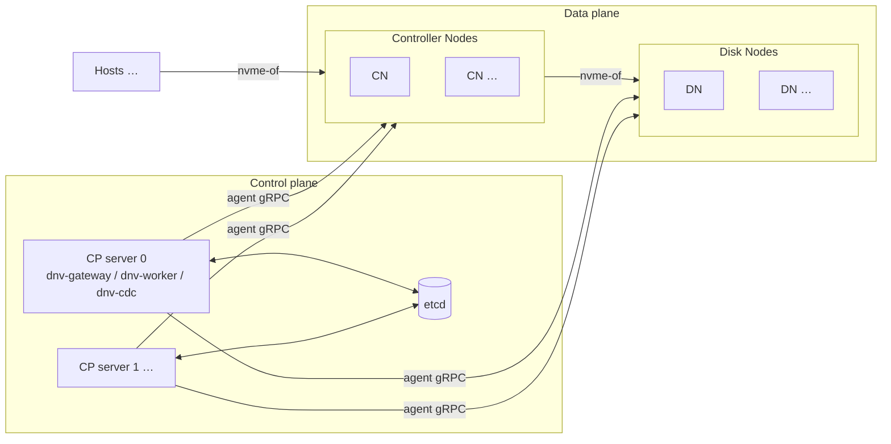

*Fig. `070Cluster` — physical view: hosts, data plane, control plane.*

Process / RPC view:

```
Hosts  ──nvme-of──▶  Controller Nodes (cntlrs)  ──nvme-of──▶  Disk Nodes (sides)
                          ▲            ▲                            ▲
                          └── SyncupCn/SyncupCntlr        SyncupDn/SyncupSide
                              + CheckCn/CheckCntlr        + CheckDn/CheckSide
                                   │                                │
              dnv-gateway ──▶ etcd ◀── dnv-worker (roles dn,cn,sp) ─┘
                                   ▲
                              dnv-cdc (discovery)
```

Processes (all use [viper](https://github.com/spf13/viper) for flags / config file /
environment variables; see §13):

| binary       | role |
|--------------|------|
| `dnv-gateway`| Serves the `Gateway` gRPC service to users/CLI. Reads and writes etcd. Calls agents only for `GetDnSize`/`GetCnSize`, the `Get*Info` behind its `Inspect*` and behind the `force = false` hydration checks of `DeleteClone`/`FinishMigration` (§8.9/§8.11), and the `Get*Bm` bitmap reads (the worker never calls `Get*Info` — it watches through `Check*`, §9.7/§10.2). |
| `dnv-worker` | One binary, roles `dn`, `cn`, `sp` (any subset per instance). Watches revision keys in etcd, shards work by shard code, drives agents via the unary `SyncupDn`, `SyncupSide`, `SyncupCn`, `SyncupCntlr`, `PushCloneBitmap`, `PushMigrBitmap` (§9.6) and watches them through the `CheckDn`/`CheckSide`/`CheckCn`/`CheckCntlr` streams (§9.7). Also performs health checking and the automatic reactions of §10.4 (primary election, replacements, thin-pool auto-grow, leg repair). Normative spec: `dnv-worker.md`. |
| `dnv-agent dn` / `dnv-agent cn` | Runs on every DN / CN. Serves `DiskNodeAgent` / `ControllerNodeAgent`. Owns the local device-mapper / mdadm / nvmet state (and, on a DN, the [D13] on-disk extent metadata; no LVM anywhere — [D13] removed it from the DN, [D14] from the CN); persists the last applied request per object (and every received bitmap chunk) as protobuf files under `Local*Path` (§9.1, §9.6). |
| `dnv-cdc`    | NVMe-oF Central Discovery Controller. Watches the `cdc` keys and serves discovery + AENs to hosts. |
| `dnvctl`     | CLI over the Gateway. Also carries the userspace copier of §11.4. |

## 2. Terminology and object model

| term | meaning |
|------|---------|
| **cluster** | Namespace for everything else. Identified by `cluster_name`; `cluster_id = fnv64a(cluster_name ∥ creation_epoch)` (§5.2), where `creation_epoch` is stamped once at `CreateCluster`. Deleting and recreating a cluster under the same name therefore yields a **different** `cluster_id`. One etcd installation can host many clusters. |
| **DN, disk node** | A machine contributing one raw block device (`--disk`). The device carries the [D13] dnv disk format; capacity is handed out as **extents** from its data area. |
| **CN, controller node** | A machine running the volume logic. Contributes no persistent storage (only a tmpfs for clone metadata) but has a capacity budget in extents. |
| **extent** | The allocation unit for both DN space and CN budget. Size = `ClusterConf.dn_bin_conf.extent_size`, default `DefaultDnExtSize` = 1 GiB. Counts are always rounded **down** (10 GiB + 3 MiB = 10 extents). |
| **SP, storage pool** | The unit of volume service. Owns cntlrs, slices, thin devices, subsystems, clones, transfers, migrations. Identified by `sp_name` (user visible) and `sp_id` (internal, used in device names / keys; reverse lookup via `sp_id_to_name`). |
| **cntlr** | One SP instance on one CN. Exactly one cntlr of an SP is **primary** (runs the full device stack and serves IO); the others are **standby** (keep leg connections, export dm-error, ANA inaccessible). `1 ≤ cntlr_cnt ≤ MaxCntlrCntPerSp(4)`, default 2. Figs `020ControllerNode` (§3.2), `030PrimaryCntlr` (§3.3), `050StandbyCntlr` (§3.4). |
| **slice** | A vertical shard of an SP. Each slice is one dm thin-pool on the primary. Thin devices are striped (raid0) across all slices. `1 ≤ slice_cnt ≤ MaxSliceCntPerSp(16)`, fixed at SP creation. Fig. `040Slice` (§3.3). |
| **group** | A contiguous chunk of pool space inside a slice. Each slice has ≥1 **meta group** (backs the thin-pool metadata device) and ≥1 **data group** (backs the thin-pool data device). `GrowSlice` appends groups. A group is either a single leg (RedundNone) or an md-raid1 over its legs (RedundMdRaid1). Every leg of a group reserves a small **meta region** at its start (md superblock + write-intent bitmap + health block, §3.6); only the remaining **data region** feeds the pool. |
| **leg** | One replica of a group. Backed by exactly one **side** normally, two sides while that leg is being migrated. Groups may also carry **spare legs** (`MaxSpareLegPerGrp` = 2) — connected and health-checked, but not md members until a switch (§8.12). |
| **side** | The DN-resident part of a leg: one side device `DnSideName` (a dm-linear over the side's [D13] extent runs) plus, per cntlr, a dm-error + dm-linear + nvmet subsystem exported to that cntlr's CN. Figs `000DiskNode`, `010Side` (§3.1). |
| **thin device (td)** | A user volume: one dm-thin volume per slice + one raid0 (dm striped) across the per-slice thin volumes on the primary. Snapshots are thin devices with `ori_id` set. `created` marks a td whose thin volume the primary has reported `OK` in every slice (§10.3); only a created td can be snapshotted, and an origin cannot be deleted while a snapshot of it is uncreated (§8.7). |
| **subsystem (ss) / namespace (ns)** | The host-facing NVMe-oF objects. A namespace binds an `ns_idx` (NSID) of a subsystem to a thin device. Fig. `060VirtualVolume` (§3.5). |
| **clone** | Pull-copy of an external NVMe-oF namespace into a local thin device via dm-clone, on the primary cntlr. Fig. `090Clone` (§8.9). |
| **transfer (xfer)** | The source-side counterpart of a clone: exports a local namespace's raid0 over a dedicated subsystem so another SP (possibly another cluster) can clone from it. Fig. `100Transfer` (§8.10). Clone + transfer = cross-SP live migration of a volume (§11.3). |
| **migration (migr)** | Side-level live move of one leg's data from one DN to another via dm-clone on the destination DN. Fig. `080Migration` (§11.2). §11.2. |
| **shard code** | `uint32` in `[0,256)`, formatted `ShardCodeFmt = "%02x"`. Every DN, CN and SP gets one at creation; workers and cdc split ownership by shard code. |
| **revision** | Monotonic `uint64` per DN / CN / SP stored in `DnRev`/`CnRev`/`SpRev`. Bumped whenever the agent-visible desired state changes; drives the worker→agent sync (§9, §10). Also the optimistic-concurrency token carried in mutating requests. The rev keys are id-keyed (`dn_id`/`cn_id`/`sp_id`) and carry the node's `addr_port` (resp. the SP's `sp_name`) in the **value**, so one watch event gives a worker both the revision and the handle it needs to act (§5.5). |
| **location** | Free-form failure-domain string per node (rack/zone), stored in `DnConf`/`CnConf` (a copy rides in the capacity-key value for scan efficiency [D5]). Used for anti-affinity during allocation (§6). |
| **creation_epoch** | `time.Now().UnixNano()` of the moment the cluster was created, stored in `ClusterConf.creation_epoch`. Gateway-generated (not a request field), immutable, and the second input of the `cluster_id` hash (§5.2). Unrelated to `err_epoch`, which is in unix **seconds**. |
| **err_epoch** | Unix seconds when the object was last detected unhealthy by a worker; `0` = healthy. Compared against `EventThreshold` to trigger the automatic reactions of §10.4. A node with `err_epoch != 0` also loses its capacity key (§5.6). |

Ownership hierarchy (etcd side):

```
ClusterConf
├── DnGlobal / CnGlobal / SpGlobal            (id + shard bookkeeping)
├── DnConf(addr_port)  ──side_ptr_list──▶ (sp_id, leg_id, side_id) it hosts
├── CnConf(addr_port)  ──cntlr_ptr_list─▶ (sp_id, cntlr_id) it hosts
└── SpConf(sp_name)
    ├── Cntlr(cntlr_id)                        one per CN, one primary
    ├── Slice(slice_id)
    │   ├── meta_grp_list: Group ── leg_list: Leg ── side_list: Side
    │   │                        └─ spare_leg_list: Leg ── Side
    │   └── data_grp_list: (same shape)
    ├── ThinDevice(td_name), Subsystem(nqn)+Namespace, Clone(clone_name),
    │   Transfer(xfer_name), Migration(migr_name)  (+ bitmap keys)
    └── SpName (sp_id → sp_name reverse map), SpRev, CdcEntry per ss
```

### 2.1 Cardinality limits (from `constants.go`)

| limit | value | limit | value |
|---|---|---|---|
| `MaxDnCntPerCluster` | 1024 | `MaxCnCntPerCluster` | 1024 |
| `MaxSpCntPerCluster` | 4096 | `MaxTdCntPerSp` | 1024 |
| `MaxSsCntPerSp` | 4 | `MaxNsCntPerSs` | 4 |
| `MaxHostCntPerSs` | 8 | `MaxSliceCntPerSp` | 16 |
| `MinCntlrCntPerSp` / `MaxCntlrCntPerSp` / default | 1 / 4 / 2 | `MaxCntlrCntPerCn` | 256 |
| `MaxCloneCntPerSp` | 64 | `MaxXferCntPerSp` | 4 |
| `MaxMigrCntPerSp` | 4 | `MaxSideCntPerDn` | 1024 |
| `MaxLegPerGrp` | 8 | `MaxSpareLegPerGrp` | 2 |
| `MaxCloneBmCnt` | 16 | `MaxMigrBmCnt` | 4 |
| `ShardBucketSize` | 256 | `MaxListCnt` / `DefaultListCnt` | 1024 / 64 |

---

## 3. Data-plane device stacks

The data plane is built from stock Linux pieces: device-mapper targets
(`error`, `linear`, `striped` a.k.a. raid0, `thin-pool`, `thin`, `clone`), md-raid1 and
the kernel `nvmet` target / `nvme` host. Every device dnv creates has a deterministic
name (§4) so agents are fully idempotent and crash-restartable.

### 3.1 Disk node (figs `000DiskNode`, `010Side`)

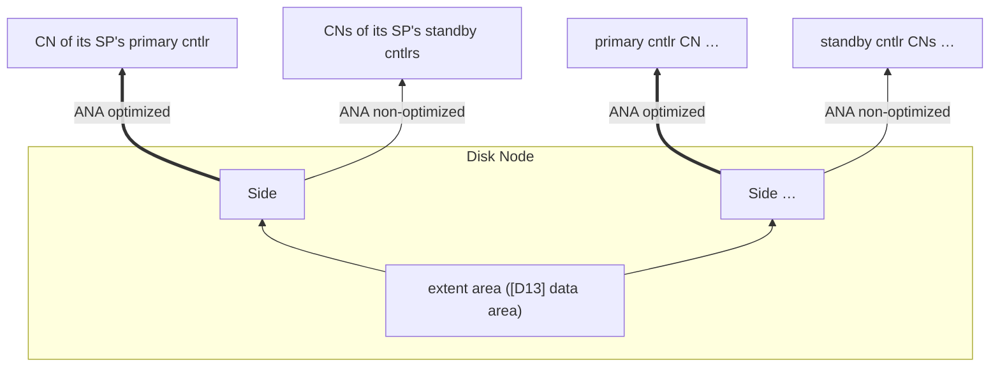

*Fig. `000DiskNode` — one DN: its extent area hands extents to the sides it hosts;
every side exports one path per cntlr of its SP.*

Per DN, once (created by the dn agent at first `SyncupDn`):

1. The **dnv disk format** [D13] on the `--disk` device. Fixed byte offsets,
   all constants in `constants.go`:
   * `DnHeaderOffset = 0`, `DnHeaderSize = 4096` — a self-describing header block
     (magic `DNVDISK1`, version, a CRC32, and a `DnDiskHeader` carrying `cluster_id`,
     `dn_id`, `extent_size`, a random 64-bit `format_uuid` and the three layout
     fields `data_offset`, `clone_meta_offset`, `clone_meta_size`).
   * `DnTableSlotAOffset = 4 MiB` / `DnTableSlotBOffset = 20 MiB`, each
     `DnTableSlotSize = 16 MiB` — the two alternating **volume-table** slots (magic
     `DNVTABL1`, the header's `format_uuid`, a monotonic `seq`, a CRC32 and a
     `DnDiskTable`). Every mutation writes the slot that is *not* the newest valid one,
     so a torn write can only damage the older copy.
   * `DnCloneMetaOffset = 64 MiB`, `DnCloneMetaSize = 192 MiB`,
     `DnCloneMetaUnit = 4 MiB` — 48 dm-clone metadata slots for migrations whose
     **destination** side lives on this DN.
   * `DnDataOffset = 256 MiB` — the start of the extent area. Extent *i* lives at byte
     `DnDataOffset + i*extent_size`; the offset is 1 MiB-aligned rather than
     extent-aligned on purpose, so `usable = disk_size − DnDataOffset` is a pure
     constant subtraction `GetDnSize` can answer before `extent_size` is known.
   The on-disk table — not the agent's local store — is authoritative for extent
   placement, so a node that loses `--local-store` but keeps its disk rebuilds exactly
   the same devices.
2. Exactly **one** nvmet port, built from `DnConf.nvme_tr_conf` (which mirrors the
   agent's `--tr-type/--adr-fam/--tr-addr/--tr-svc-id` flags). Every subsystem this DN
   ever exports — all side subsystems and all migration-source subsystems — attaches to
   this single port.

Per **side** (one per hosted leg replica):

* A **side device** `DnSideName` (dm kind `4`): one dm-linear whose targets concatenate
  the extent runs the volume table allocated to `(sp_id, side_id)`, `Group.ext_cnt`
  extents in total. Provisioning MUST follow the §9.4 protocol: the record is created
  with `zeroed_bits` all 0, the assembled device is zeroed batch by batch with
  `blkdiscard --zeroout` through the dm-linear, each batch's bits are persisted as it
  completes, and no per-CN export stack is converged until the side's `provisioned`
  flag is `true` **and** every bit is set ([D15]). Everything above the side device —
  the per-CN stacks, the migration endpoints — sees one ordinary single-device backing
  reference.
* Per cntlr of the SP (primary and standbys — the side learns their CN ids from
  `SyncupSideRequest.side_conf.primary_cn_id` / `standby_id_list`):
  * a dm-error device `DnErrorName` sized like the side device,
  * a dm-linear device `DnLinearName` whose table points at the **side device** for the
    primary cntlr's CN and at the **dm-error** device for every standby CN,
  * an nvmet subsystem `SideToCnNqn(cluster,sp,leg,cn)` on the DN's port,
    `allowed_hosts = [CnHostNqn(cluster,cn)]`, `attr_cntlid_min/max` from
    `side_conf.cntlid_slot` (the etcd `Side.cntlid_slot`, §11.8), exposing one namespace
    backed by the dm-linear device.
    ANA state of the namespace: its `ana_grpid` selects one of the port's three
    fixed ANA groups [D4] — the `optimized` group for the primary CN's subsystem,
    the `non-optimized` group for standby CNs' subsystems (a standby path
    therefore exists but errors out — a pre-connected placeholder that makes
    failover fast).

    The NQN names the **leg**, not the side, and carries no `dn` component (§4.4), so
    while a leg is being migrated its src and dst sides — on two different DNs — export
    the same subsystem NQN toward the same CN. For the CN's kernel to merge them into
    one multipath namespace instead of rejecting a duplicate, both sides MUST present
    the same namespace identity: `nsid = 1`, `device_uuid`/`device_nguid` derived
    deterministically from `(cluster_id, sp_id, leg_id)`, `attr_serial = %016x(leg_id)`,
    `attr_model = "dnv"` — and, per §11.8, cntlid slots that do **not** overlap.

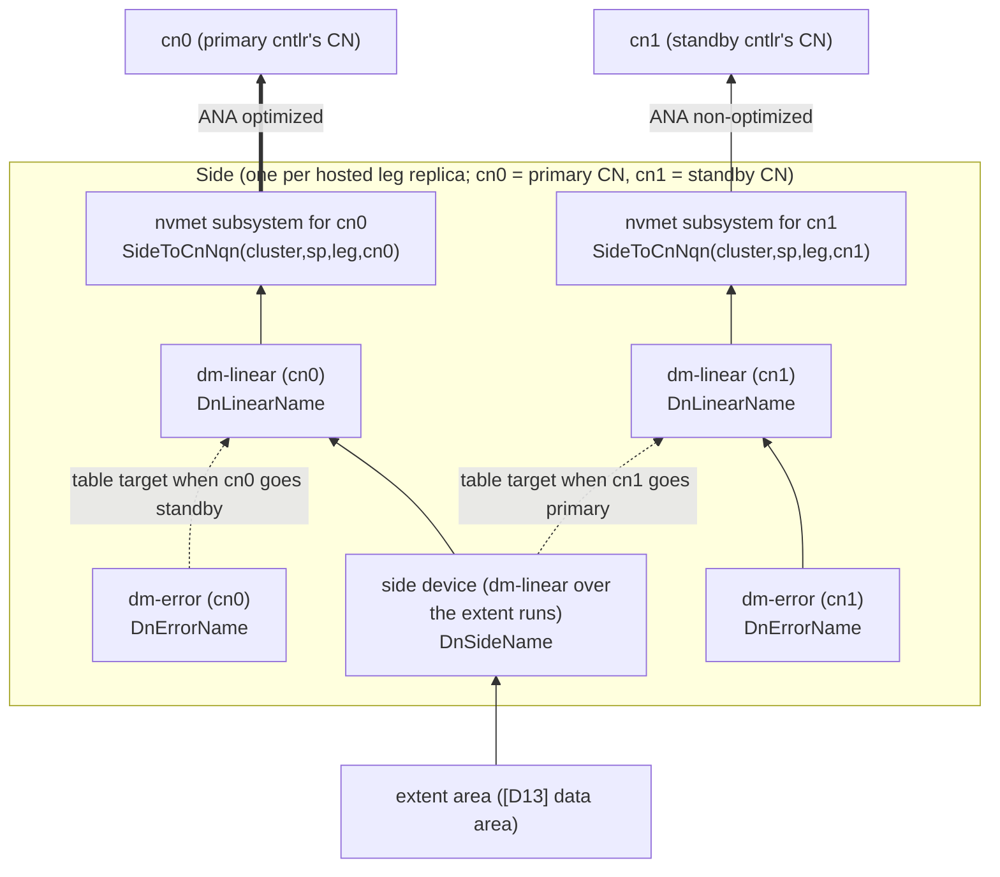

*Fig. `010Side` — one side and its per-CN export stacks. Failover only reloads the
dm-linear tables and flips ANA (dashed alternatives).*

Failover and migration only ever *reload* the dm-linear tables and flip ANA states; the
exported namespace object never changes, so CN NVMe connections survive.

Additionally, while this DN hosts the **source** side of a migration (its
`SyncupSide` carries `migr_src_conf`): a dm-linear
`DnMigrSrcName` on top of the side device, exported through subsystem `MigrSrcNqn` (same port)
with `allowed_hosts = [DnHostNqn(cluster, migr_src_conf.dst_dn_id)]`. While it hosts
the **destination** side (`migr_dst_conf`): an nvme host connection to
`MigrSrcNqn(cluster, migr_dst_conf.src_dn_id, sp, migr_id)` at
`migr_dst_conf.src_nvme_tr_conf` (hostnqn `DnHostNqn`), a
dm-clone metadata **slot** in the [D13] clone-metadata area — whole `DnCloneMetaUnit`
units, with its first 8 KiB zeroed before its record is persisted so a previous
tenant's bytes can never be misparsed as a dm-clone superblock — fronted by a wrapper
dm-linear `DnMigrMetaDmName` (dm kind `5`), because the dm-clone target reads its
metadata device from sector 0 and takes no offset argument; and a
dm-clone device `DnMigrFinalName` (dest = the local side device, source = the connected
nvme device, region size = `migr_dst_conf.block_size`). The per-cntlr dm-linears of the
destination side sit on top of the dm-clone (primary CN) / dm-error (standbys). See
fig. `080Migration` (§11.2) and §11.2.

### 3.2 Controller node, common (fig. `020ControllerNode`)

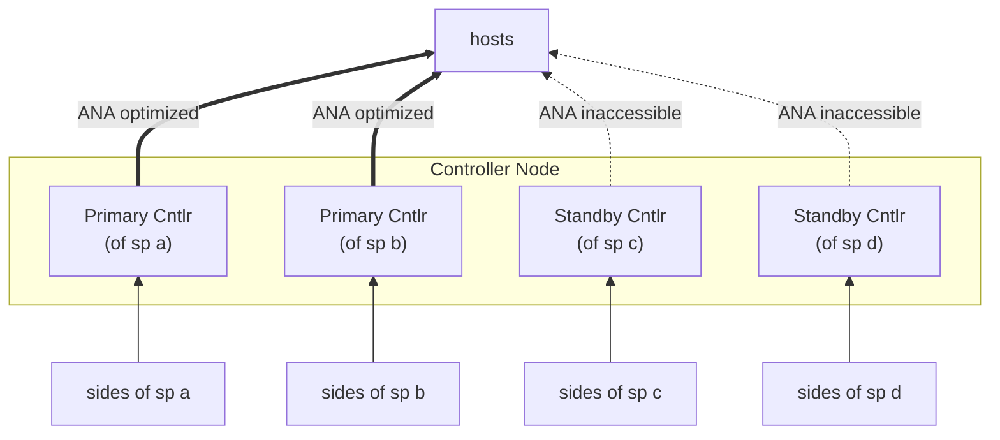

*Fig. `020ControllerNode` — one CN hosts up to `MaxCntlrCntPerCn` cntlrs of different
SPs, in a mix of primary and standby roles.*

Per CN, once (created by the cn agent at first `SyncupCn`):

1. tmpfs mounted at `CnTmpfsPath = {tmpfs_prefix}/{cluster_id}-{cn_id}`
   (`DefaultTmpfsPrefix = /tmp/dnv-tmpfs`), sized `DefaultCnTmpfsSize` = 2 GiB —
   `CnCloneMetaAreaSize` (1 GiB) plus slack.
2. A **sparse** file `tmp-file` (`CnTmpFilePath`) of `CnCloneMetaAreaSize` = 1 GiB
   inside it, attached to **one** free loop device. That loop device is the CN's
   **clone-metadata arena**; it is re-learned on every converge with
   `losetup --associated {CnTmpFilePath}` and never persisted (loop names are
   unpredictable, and a second loop per CN is never wanted). The arena is carved into
   `CnCloneMetaAreaSize / CnCloneMetaUnit` = 256 **units** of `CnCloneMetaUnit` = 4 MiB
   — "unit", never "extent": an extent is the 1 GiB allocation unit of §2. A clone's
   dm-clone metadata device is a **wrapper dm-linear** `CnCloneMetaDmName` (CN dm kind
   `b`, `cnagent.md` §2.1) over `ceil((4 MiB + region_cnt bytes) / CnCloneMetaUnit)`
   **contiguous** units, first-fit, with `region_cnt = td.size / block_size`; the
   wrapper exists for the same reason `DnMigrMetaDmName` does — dm-clone reads its
   superblock from sector 0 and takes no offset argument. **The kernel's dm tables are
   the allocation registry**: enumerating this CN's kind-`b` wrappers and reading their
   `0 {len} linear {loopdev_majmin} {offset_sectors}` tables reconstructs the used map, so
   there is no on-file allocation table and none of the [D13] header/CRC/A-B machinery
   is needed — the arena is volatile *together with* the kernel's dm state (a reboot
   clears both, an agent restart preserves both). Before creating a wrapper the agent
   hole-punches the range with plain
   `blkdiscard --offset {off} --length {len} {loopdev}`, so a recycled unit can never
   hand a new dm-clone a previous clone's valid dm-clone superblock; **`--zeroout` is
   forbidden here** — it would materialize up to the whole arena in RAM and defeat the
   sparse file. Arena exhaustion ⇒ the clone's resources report `RES_STATUS_ERROR`
   ([D14]). The metadata is deliberately volatile: after a reboot a clone is rebuilt
   from the **destination thin-pool bitmaps** (§11.5) — copied blocks are exactly the
   mapped blocks of the destination td, so no clone state needs to survive the CN.
3. Exactly **one** nvmet port from `CnConf.nvme_tr_conf`; every host-facing subsystem
   and every transfer subsystem of every cntlr on this CN attaches to it.
4. **QoS** from `SyncupCnRequest.qos_ratio` (a copy of `ClusterConf.qos_ratio`,
   §10.2). Limits are size-proportional: for a device of `size` bytes,
   `iops = size / bytes_per_iops` and `bps = size / bytes_per_bps` (a zero divisor
   leaves that limit unset). The agent programs them through the cgroup io controller
   (`io.max`, keyed by the device's MAJ:MIN, as `riops`/`wiops` and `rbps`/`wbps`):
   `strict = false` ⇒ limit every dm thin-pool (`CnPoolFinalName`) on the CN by its
   data-device size; `strict = true` ⇒ additionally limit every leg device by the
   leg's size. Limits are (re)applied on every `SyncupCn` and whenever one of these
   devices is (re)created.

   **Open issue — enforcement mechanism (decide when QoS is implemented).** `io.max`
   is a *(cgroup, device)* limit, not a device-wide cap: a bio is throttled only if
   it is charged to a cgroup that configured a limit for that device. Host IO enters
   through nvmet **kernel threads**, which live in the root cgroup (and cannot leave
   it under cgroup v2), and the root cgroup exposes no `io.max` — so limits written
   in any agent-created cgroup would bind the agent's own tools but not host
   traffic. Candidate mechanisms: cgroup v1 `blkio.throttle` mounted hybrid (v1's
   root **does** expose per-device throttle files, and kthreads sit in root); a
   small nvmet patch associating each namespace's bios with a configurable blkcg
   (the loop driver's `kthread_associate_blkcg` pattern — v2 `io.max` then works as
   specified); `queue/nr_requests` (device-global, but a concurrency cap, not
   iops/bps); network-level `tc` (bps only). Whatever binds, note: a leg-level limit
   also throttles md bitmap/superblock writes, resync and the §3.6 health-check
   probe — tight limits can fake "leg unhealthy" — and a pool-data limit throttles
   clone/migration hydration; those flows need headroom or exemption.

   **Until the issue is decided, QoS is deferred**: the cn agent accepts and
   persists `qos_ratio` and programs no limit at all (`cnagent.md` CN6) — writing
   `io.max` from an agent cgroup would bind nothing that matters and only pretend.

A CN hosts up to `MaxCntlrCntPerCn` cntlrs of different SPs; at most one cntlr **per SP**
per CN.

### 3.3 Primary cntlr (figs `030PrimaryCntlr`, `040Slice`)

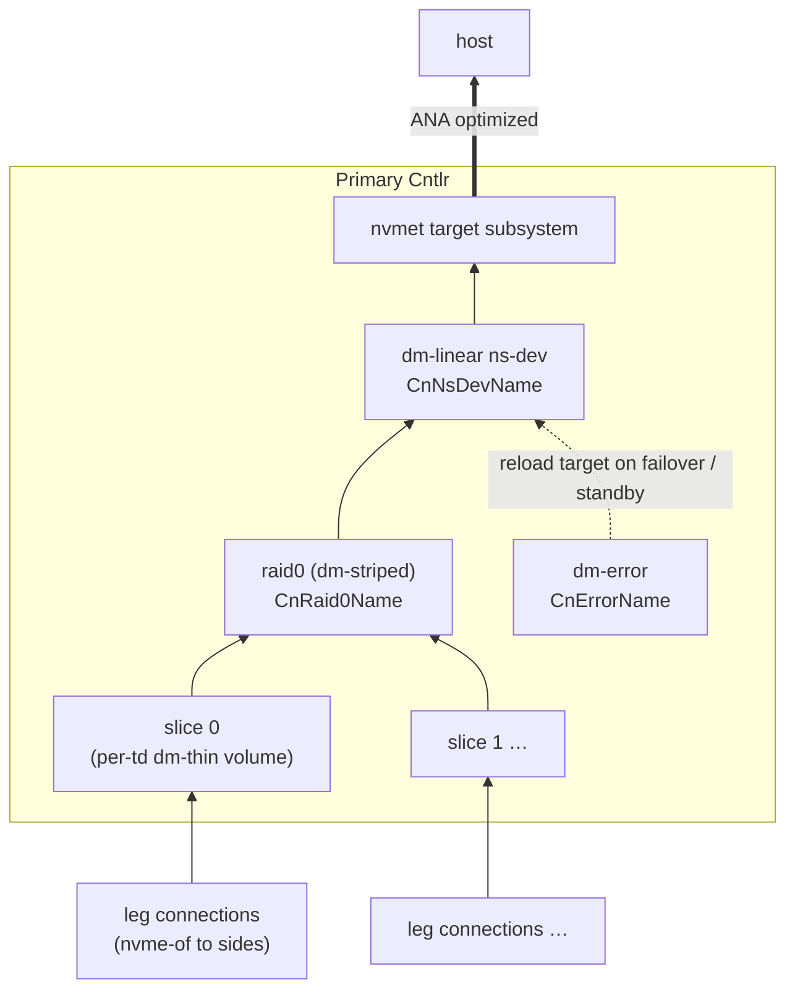

*Fig. `030PrimaryCntlr` — the primary's per-td path for one thin device.*

Bottom-up, everything below is created/owned by the cn agent when `SyncupCntlr` says
`Cntlr.primary = true` ("make sure all groups are available", §11.1):

1. **Legs.** For each side of each leg (spare legs included): `nvme connect` to
   `SideToCnNqn(cluster, sp, leg, cn_id = this CN)` at `Side.nvme_tr_conf`, hostnqn =
   `CnHostNqn(cluster, cn)`, `--hostid = NvmeHostId(hostnqn)`,
   `--fast_io_fail_tmo = DefaultNvmeFastIoFailTmo`(5),
   `--ctrl-loss-tmo = -1` (reconnect forever). Because every side of a leg exports that
   one NQN with one namespace identity (§3.1, §4.4), the connections of a leg land in a
   single subsystem: the kernel presents **one** nvme multipath namespace device per
   leg, with one controller (one path) per connected side, and routes IO down the
   `optimized` path. A single-side leg is simply that device with one path; during a
   migration the same device gains the destination side as a second path and the ANA
   flip switches IO over — no device change, nothing above the leg notices [D1]. The
   **leg device** is a cn-local dm-linear wrapper over that multipath namespace device,
   kept as the leg-level indirection point (it is what a spare-leg swap or a teardown
   reloads onto an error target). The agent runs the §3.6 health-check IO against every
   connected leg (spares too) and reports per leg in `CntlrInfo.leg_id_to_leg`.
2. **Groups.** RedundNone: the group device is a dm-linear over the single leg's
   **data region** (offset `meta_blocks × block_size`, §3.6). RedundMdRaid1: an
   md-raid1 `CnMdDevName`/`CnMdArrayName` over the member leg devices — always with an
   **internal write-intent bitmap** (`--bitmap=internal`, `--bitmap-chunk` =
   `RedundMdRaid1.bitmap_chunk_block_cnt × block_size`), always with **failfast**
   members, and `--data-offset = meta_blocks × block_size` (§3.6). Assembly rules
   (create vs assemble vs add) are in §11.1.1. **Spare legs are not md members**: they
   stay connected, wrapped and health-checked, and are only `--add`-ed by an explicit
   `SwitchSpareLeg` (§8.12).
3. **Per slice** (fig. `040Slice`): a dm-linear concat `CnPoolMetaName` over the slice's
   meta group devices (in `meta_grp_list` order) and a dm-linear concat `CnPoolDataName`
   over its data group devices; a dm thin-pool `CnPoolFinalName` (metadata dev = pool
   meta, data dev = pool data, block size = `block_size`, `low_water_mark` = data-dev
   blocks × (100 − `DmPoolConf.low_water_mark_pct`) / 100 — i.e. the dm event fires
   exactly when the pool's **usage** exceeds `low_water_mark_pct`%, the condition the
   §10.4 auto-grow acts on; both values from
   `SyncupCntlrRequest.bdev_conf.dm_pool_conf`; `low_water_mark_pct = 0` ⇒
   `DefaultPoolLowWatermarkPct` = 50; `> 100` ⇒ the agent passes `low_water_mark = 0`
   — no dm events — as the value only means "auto-grow off", §10.4).
4. **Per thin device × slice**: a dm-thin volume `CnThinDevName`, created with pool
   message `create_thin {dev_id}` or `create_snap {dev_id} {ori_id}` — sent only while
   `ThinDevice.created == false`; a created td's volume is attached with a bare
   `dmsetup create` (`cnagent.md` CN14, `ThinDeviceCreated.md` U4) — virtual size =
   `ThinDevice.size / slice_cnt`.
5. **Per thin device**: a dm-striped raid0 `CnRaid0Name` across its per-slice thin
   volumes (slice order = `slice_idx`), chunk = `DmRaid0Conf.stripe_size`; a dm-error
   `CnErrorName` of the same size (permanent reload target). **Per namespace** (§8.8):
   a dm-linear `CnNsDevName(cluster, cn, sp, ns_id)` — **the** namespace backing
   device — whose table points at its td's raid0 (normal), the dm-clone
   `CnCloneFinalName` (while a clone targets that td, fig. `090Clone` §8.9), or
   dm-error (standby / failover / suspended transitions). Namespaces backed by the
   same td each have their own `CnNsDevName` over the same raid0.
6. **Host-facing nvmet**: per `Subsystem` a nvmet subsystem on the CN's port with
   `attr_cntlid_min/max` from `Cntlr.cntlid_slot`, `serial`/`model` from the etcd
   `Subsystem`, allowed hosts as configured (empty list ⇒ `attr_allow_any_host=1`);
   per `Namespace` an nvmet namespace `nsid = ns_idx`, `device_path` = the
   namespace's own `CnNsDevName`, `uuid`/`nguid` from the etcd record, membership
   of the fixed `optimized` ANA group
   [D4] (primary) unless `suspended` (§8.8) — suspended ⇒ dm device
   suspended + ns moved to the `inaccessible` group everywhere.
7. **Clones / transfers / migrations** hosted by the SP, per §11.

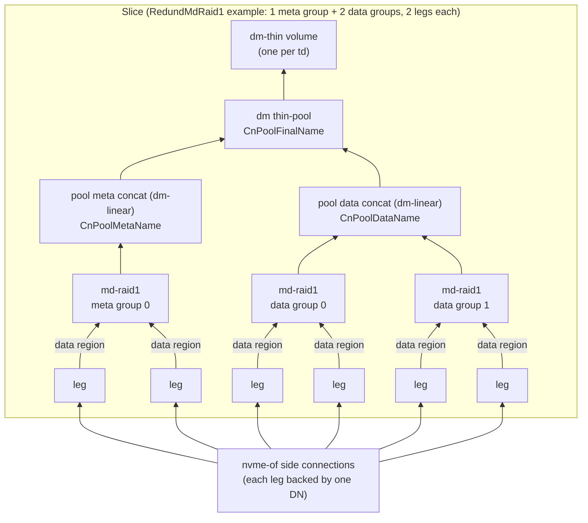

*Fig. `040Slice` — the per-slice stack of step 3. Every leg starts with its meta
region (md superblock + write-intent bitmap + health block, §3.6); only the data
region becomes an md member / pool space.*

### 3.4 Standby cntlr (fig. `050StandbyCntlr`)

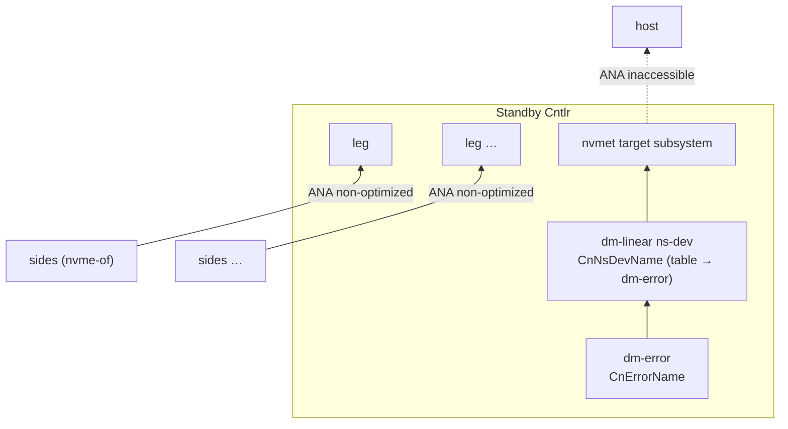

*Fig. `050StandbyCntlr` — pre-connected but dark: legs stay connected, the exported
namespaces error out.*

A standby keeps only: the leg nvme connections + leg wrappers + health-check IO
(step 1 above), the per-td `CnErrorName` and per-namespace `CnNsDevName` (table →
dm-error), and the
host-facing nvmet objects with every namespace in the `inaccessible` ANA group [D4]. It has
**no** md arrays, pools, thin volumes or raid0s ("cleanup all resources that a primary
shouldn't have"). For a transfer it also keeps the dm-error-backed `CnXferFinalName` +
xfer subsystem counterparts (fig. `100Transfer` right half, §8.10).

### 3.5 Host view (fig. `060VirtualVolume`)

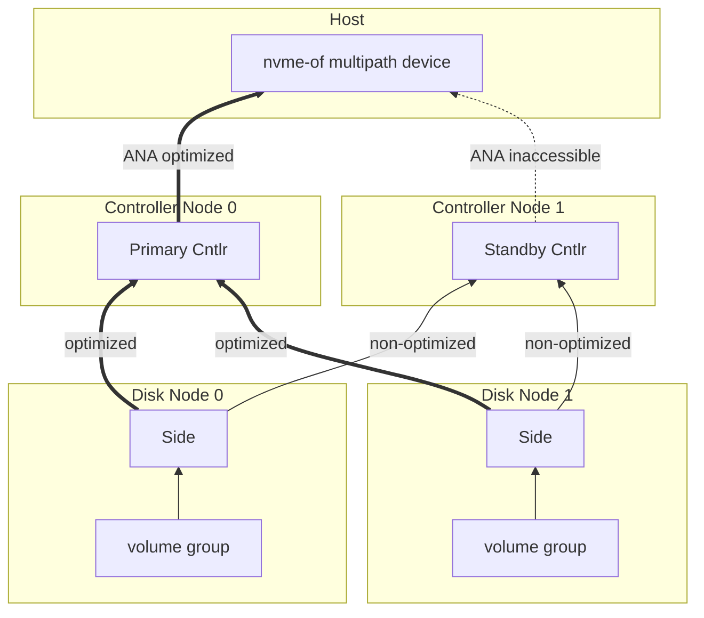

*Fig. `060VirtualVolume` — one virtual volume end to end: same subsystem NQN and
namespace identity from every cntlr, aggregated by the host kernel.*

A host discovers the SP's subsystems through dnv-cdc, connects to every enabled cntlr's
port, and the kernel aggregates the paths into one nvme multipath device because all
cntlrs export the same subsystem NQN and the same namespace identity (`nguid`/`uuid`),
with distinct cntlids guaranteed by cntlid slots (§11.8). Primary path ANA `optimized`,
standby paths `inaccessible`.

### 3.6 Group on-leg layout: meta region, data region, health block

Every leg's side device of a group is split into a **meta region** (`meta_blocks` blocks of
`block_size`) followed by the **data region** (`data_blocks` blocks). Both counts are
computed automatically — never configured — and stored in the `Group`:

```
total_group_blocks = ext_cnt × extent_size / block_size
bitmap_chunk       = RedundMdRaid1.bitmap_chunk_block_cnt × block_size
bitmap_bits        = ceil(ext_cnt × extent_size / bitmap_chunk)
bitmap_bytes       = 256 + ceil(bitmap_bits / 8)        # 256 = md bitmap superblock
bitmap_blocks      = ceil(bitmap_bytes / block_size)

RedundMdRaid1: meta_blocks = 1 (md superblock) + bitmap_blocks + 1 (health block)
RedundNone:    meta_blocks = 1 (health block only)
data_blocks        = total_group_blocks − meta_blocks
```

The meta region must be large enough for the md superblock and the internal
write-intent bitmap, **plus an additional 4 KiB used for the leg health check**: the
health-check area is the **last 4 KiB of the last meta block** (byte offsets
`meta_blocks × block_size − 4096 … meta_blocks × block_size`). The **primary**
cntlr's cn agent periodically writes and reads back this 4 KiB block through each
connected leg device — spare legs included — (direct IO, a magic + timestamp payload
[D6]) to decide whether the leg is healthy, covering the whole path CN → side →
side device even when md would otherwise mask a member failure. A **standby** cntlr cannot
run the block probe — its path to every side deliberately terminates in the side's
dm-error (§3.1), so block IO through it can never succeed — and instead reports
leg health from transport liveness: a live controller per side with the expected
ana_state (`cnagent.md` CN11); that is what failover readiness actually needs from
a standby. md never touches this area:
the superblock sits at 4 KiB into block 0, the bitmap right after it (the
`bitmap_blocks` reservation is an upper bound), and member data starts at
`--data-offset = meta_blocks × block_size`. On migration the meta region is copied
verbatim like any other bytes (the md superblock must move with the data, §8.11).

With the defaults (1 GiB extents, 1 MiB blocks, 128-block bitmap chunks) a 1 TiB group
gets `bitmap_bits = 8192`, `bitmap_bytes = 1280`, `bitmap_blocks = 1`, so
`meta_blocks = 3` — 3 MiB of overhead per leg.

---

## 4. Naming

All formats below are normative. `NameFmt` is constructed from the prefixes in
`constants.go`: `dmPrefix = DmPrefix = "dnv"`, `nqnPrefix = NqnPrefix =
"nqn.2024-01.io.dnv"`, `tmpfsPrefix = DefaultTmpfsPrefix`, `localStorPrefix =
DefaultLocalStorPrefix = "/var/tmp"`. Unless noted, every id field is `%016x` and every
kind field is `%01x`, joined by `-`. The signatures and formats in this section are
normative and match `name_fmt.go`. Two of them deserve their rationale up front: a
side subsystem is keyed by `leg_id` and carries **no** `dn_id`, so the two sides of a
leg export one and the same NQN from their two DNs (§4.4, §11.2); a transfer NQN
carries no node id either — every enabled cntlr of the SP exports the same transfer
subsystem (§8.10), so the destination clone can pull through any of them.

The `{cluster}` component of every name below is the `cluster_id` (`%016x`), never the
`cluster_name`. Because `cluster_id` now folds in `ClusterConf.creation_epoch` (§5.2), a
cluster deleted and recreated under the same name produces a disjoint set of dm/md/
NQN/local-file names, so a new incarnation never collides with leftovers of the old one
on a node that was not cleaned up.

### 4.1 dm-device kinds

DN-side (`dmKindDn*`): `0` error, `1` linear, `2` migr-src, `3` migr-final(dm-clone),
`4` side (the [D13] extent-run concat), `5` migr-meta (the dm-clone metadata wrapper).
CN-side (`dmKindCn*`): `0` pool-meta, `1` pool-data, `2` pool-final(thin-pool),
`3` thin-dev, `4` raid0, `5` error, `6` ns-dev, `7` clone-final(dm-clone),
`8` xfer-final. CN kinds `9` (leg wrapper `CnLegName`), `a` (RedundNone group device
`CnGrpName`) and `b` (clone-metadata wrapper `CnCloneMetaDmName`, [D14]) are
cn-agent-internal and are **defined in `cnagent.md` §2.1**; they follow the same
`dnv-{cluster}-{cn}-{kind}-…` format as §4.2's rows.

### 4.2 dm device names (`dmsetup` names; node path = `DmPath` = `/dev/mapper/{name}`)

| function | format |
|---|---|
| `DnErrorName(cluster,dn,sp,side,cn)`  | `dnv-{cluster}-{dn}-0-{sp}-{side}-{cn}` |
| `DnLinearName(cluster,dn,sp,side,cn)` | `dnv-{cluster}-{dn}-1-{sp}-{side}-{cn}` |
| `DnMigrSrcName(cluster,dn,sp,migr)`   | `dnv-{cluster}-{dn}-2-{sp}-{migr}` |
| `DnMigrFinalName(cluster,dn,sp,migr)` | `dnv-{cluster}-{dn}-3-{sp}-{migr}` |
| `DnSideName(cluster,dn,sp,side)`      | `dnv-{cluster}-{dn}-4-{sp}-{side}` — the side's data device ([D13]) |
| `DnMigrMetaDmName(cluster,dn,sp,migr)`| `dnv-{cluster}-{dn}-5-{sp}-{migr}` — wrapper over the dm-clone metadata slot |
| `CnPoolMetaName(cluster,cn,sp,slice)` | `dnv-{cluster}-{cn}-0-{sp}-{slice}` |
| `CnPoolDataName(cluster,cn,sp,slice)` | `dnv-{cluster}-{cn}-1-{sp}-{slice}` |
| `CnPoolFinalName(cluster,cn,sp,slice)`| `dnv-{cluster}-{cn}-2-{sp}-{slice}` |
| `CnThinDevName(cluster,cn,sp,td,slice)`| `dnv-{cluster}-{cn}-3-{sp}-{td}-{slice}` |
| `CnRaid0Name(cluster,cn,sp,td)`       | `dnv-{cluster}-{cn}-4-{sp}-{td}` |
| `CnErrorName(cluster,cn,sp,td)`       | `dnv-{cluster}-{cn}-5-{sp}-{td}` |
| `CnNsDevName(cluster,cn,sp,ns)`       | `dnv-{cluster}-{cn}-6-{sp}-{ns}` — one per **namespace**, not per td (§3.3 step 5, §8.8) |
| `CnCloneFinalName(cluster,cn,sp,clone)`| `dnv-{cluster}-{cn}-7-{sp}-{clone}` |
| `CnXferFinalName(cluster,cn,sp,xfer)` | `dnv-{cluster}-{cn}-8-{sp}-{xfer}` |

The leg wrapper of §3.3 step 1 is agent-internal — it is CN dm kind `9`, `CnLegName`
in `cnagent.md` §2.1 — and, like kinds `a` and `b`, is not part of the cross-component
contract [D1].

### 4.3 md names (node path = `MdPath` = `/dev/md/{name}`)

`getShortId(clusterId, nodeId) = uint32(fnv64a(sprintf("%016x%016x", clusterId,
nodeId)))` — the hash's low 32 bits. With `sliceIdxM = slice_idx | 0x80` when the
group is a **meta** group, else `slice_idx`:

* `CnMdDevName(cluster,cn,sp,sliceIdx,grpIdx,isMeta)` =
  `{shortId:%08x}{sp_id:%016x}{sliceIdxM:%02x}{grpIdx:%02x}` — 28 hex chars, no
  separators, so even as the kernel disk name of a named array (`md_` + 28 = 31) it
  stays within `DISK_NAME_LEN` (32); used for `/dev/md/{name}`.
* `CnMdArrayName(sp,sliceIdx,grpIdx,isMeta)` =
  `dnv-{sp_id:%016x}-{sliceIdxM:%02x}-{grpIdx:%02x}` — used for `mdadm --name` (the
  array's superblock name; 26 chars, within mdadm's 32-byte name limit). The fixed
  `dnv-` prefix is what the Appendix A udev guard matches (`ENV{MD_NAME}=="dnv-*"`).

`grpIdx` is the group's index inside its `meta_grp_list` / `data_grp_list` (stable:
groups are only appended, never removed).

### 4.4 NQNs

nqnKinds: `0` DnHost, `1` CnHost, `2` SideToCn, `3` MigrSrc, `4` Xfer. `:` joined.

| function | format |
|---|---|
| `DnHostNqn(cluster,dn)` | `nqn.2024-01.io.dnv:0:{cluster}:{dn}` — hostnqn a DN uses when it connects out (migration destination pulling from the source). |
| `CnHostNqn(cluster,cn)` | `nqn.2024-01.io.dnv:1:{cluster}:{cn}` — hostnqn a CN uses toward sides, migr-src and xfer targets; also what users put into `Transfer.allowed_hosts`. |
| `SideToCnNqn(cluster,sp,leg,cn)` | `nqn.2024-01.io.dnv:2:{cluster}:{sp}:{leg}:{cn}` — subsystem a side exports to one CN. Keyed by the **leg**, with no `dn` component: during a migration the leg's src and dst sides sit on two different DNs and export this identical NQN, so the CN's kernel aggregates the two exports into a single nvme multipath namespace and ANA decides which path carries IO (§11.2, [D1]). Outside a migration a leg has one side and the subsystem exists once. |
| `MigrSrcNqn(cluster,dn,sp,migr)` | `nqn.2024-01.io.dnv:3:{cluster}:{dn}:{sp}:{migr}` — subsystem the migration source side exports to the destination DN. |
| `XferNqn(cluster,sp,xfer)` | `nqn.2024-01.io.dnv:4:{cluster}:{sp}:{xfer}` — subsystem a transfer exports; no node id, so every enabled cntlr of the SP exports the identical subsystem (§8.10) and the destination clone may pull through any of them. The destination SP's user passes it as `Clone.src_nqn`. |

### 4.5 tmpfs / file names

**LVM survives nowhere in dnv** — [D13] removed it from the DN, [D14] from the CN. A DN
carries the [D13] disk format, a CN carries the loop-backed clone-metadata arena of §3.2
step 2, and every dnv device name is a dm name from §4.2 (kinds `9`/`a`/`b` per §4.1).

| function | value |
|---|---|
| `CnTmpfsPath(cluster,cn)` | `{tmpfs_prefix}/{cluster:%016x}-{cn:%016x}` |
| `CnTmpFileName` / `CnTmpFilePath` | `tmp-file` / `{CnTmpfsPath}/tmp-file` |

### 4.6 Agent local-store paths

The agent's persistent state (§9.1) lives as flat protobuf files under
`localStorPrefix` (`--local-store`). `{bm_idx}` is formatted with
`BmIdxFmt = "%02x"`:

| function | path | content |
|---|---|---|
| `LocalDnPath(cluster,dn)` | `{prefix}/dn-{cluster}-{dn}` | last applied `SyncupDnRequest` |
| `LocalSidePath(cluster,dn,sp,side)` | `{prefix}/side-{cluster}-{dn}-{sp}-{side}` | last applied `SyncupSideRequest` |
| `LocalCnPath(cluster,cn)` | `{prefix}/cn-{cluster}-{cn}` | last applied `SyncupCnRequest` |
| `LocalCntlrPath(cluster,cn,sp,cntlr)` | `{prefix}/cntlr-{cluster}-{cn}-{sp}-{cntlr}` | last applied `SyncupCntlrRequest` |
| `LocalMigrBmPath(cluster,dn,sp,migr,bm_idx)` | `{prefix}/migr-bm-{cluster}-{dn}-{sp}-{migr}-{bm_idx}` | one received `PushMigrBitmapRequest` chunk (§9.6) |
| `LocalCloneBmPath(cluster,cn,sp,clone,bm_idx)` | `{prefix}/clone-bm-{cluster}-{cn}-{sp}-{clone}-{bm_idx}` | one received `PushCloneBitmapRequest` chunk (§9.6) |

---

## 5. etcd data model

### 5.1 Key grammar

Every stored protobuf message has one key schema, declared as a comment above the
message in `schema.proto`. Fields of a key are joined by a single space `" "`.
Formatting: ids with `IdKeyFmt = "%016x"`, shard codes with `ShardCodeFmt = "%02x"`,
free extent counts with `FreeSpaceFmt = "%016x"`, `bin_idx` with `BinIdxFmt = "%01x"`,
bitmap indexes with `BmIdxFmt = "%02x"`. **Every id in a key uses `IdKeyFmt`** — e.g.
with `ClusterId = 0xebada5168620c5fe`, `SpId = 17` the `SpName` key is
`dnv sp_id_to_name ebada5168620c5fe 0000000000000011`. Values are the binary-serialized
protobuf messages.

### 5.2 cluster_id derivation

`cluster_id` is derived from **two** inputs: the `cluster_name` and the cluster's
`ClusterConf.creation_epoch` (`time.Now().UnixNano()`, stamped by the gateway inside
`CreateCluster` and never changed afterwards).

```go
func getClusterId(clusterName string, creationEpoch uint64) uint64 {
    h := fnv.New64a()
    h.Write([]byte(clusterName))
    var epochBytes [8]byte
    binary.BigEndian.PutUint64(epochBytes[:], creationEpoch)
    h.Write(epochBytes[:])
    return h.Sum64()
}
```

The epoch is appended to the raw name bytes as exactly 8 **big-endian** bytes — no
separator, no text formatting. Consequences that the rest of this document relies on:

* **`cluster_id` is not computable from a request alone.** `{p} cluster_conf
  {cluster_name}` is the only name-keyed message; every other cluster-scoped key is
  `cluster_id`-keyed (`WorkerReg`, §5.3, is the one cluster-independent key and
  carries neither).
  So any RPC beyond `CreateCluster`/`ListClusters` must first read `ClusterConf` to learn
  `creation_epoch`, derive `cluster_id`, and only then build its keys (§5.8, §8 preamble).
* **Delete + recreate under the same name yields a fresh `cluster_id`,** hence a fresh
  etcd key space and fresh node-local names — `getShortId` (§4.3), the dm names of
  §4.2 and the NQNs of §4.4 all fold in `cluster_id`. Leftover keys or leftover
  node-local objects of a previous incarnation can never be mistaken for the new one,
  and a re-created cluster never inherits stale agent state.
* **`creation_epoch` is immutable.** It is not a `CreateClusterRequest` field and no RPC
  updates it; rewriting it in etcd orphans every other key of the cluster.

### 5.3 Key table

| message | key | notes |
|---|---|---|
| `ClusterConf` | `{p} cluster_conf {cluster_name}` | the only **name**-keyed message; holds `creation_epoch` (the second `cluster_id` input, §5.2) + cluster-wide QoS/bdev/bin/alloc conf |
| `DnGlobal`    | `{p} dn_global {cluster_id}` | `next_id`, `shard_bucket[256]` |
| `CnGlobal`    | `{p} cn_global {cluster_id}` | idem |
| `SpGlobal`    | `{p} sp_global {cluster_id}` | idem |
| `DnRev`       | `{p} dn_rev {shard_code} {cluster_id} {dn_id}` | watched by dn-role workers; value = `addr_port` + `revision` |
| `CnRev`       | `{p} cn_rev {shard_code} {cluster_id} {cn_id}` | watched by cn-role workers; value = `addr_port` + `revision` |
| `SpRev`       | `{p} sp_rev {shard_code} {cluster_id} {sp_id}` | watched by sp-role workers; value = `sp_name` + `revision` |
| `DnConf`      | `{p} dn_conf {cluster_id} {addr_port}` | includes `location` |
| `CnConf`      | `{p} cn_conf {cluster_id} {addr_port}` | includes `location` |
| `DnCapacity`  | `{p} dn_capacity {cluster_id} {bin_idx} {free_ext_cnt} {addr_port}` | allocation index, §5.6; value = location copy [D5] |
| `CnCapacity`  | `{p} cn_capacity {cluster_id} {free_ext_cnt} {addr_port}` | idem |
| `CdcEntry`    | `{p} cdc {cluster_id} {shard_code} {sp_id} {ss_id}` | shard_code = the SP's; watched by dnv-cdc |
| `SpConf`      | `{p} sp_conf {cluster_id} {sp_name}` | |
| `Cntlr`       | `{p} cntlr {cluster_id} {sp_id} {cntlr_id}` | |
| `Slice`       | `{p} slice {cluster_id} {sp_id} {slice_id}` | groups/legs/sides embedded |
| `ThinDevice`  | `{p} thin_device {cluster_id} {sp_id} {td_name}` | |
| `Subsystem`   | `{p} subsystem {cluster_id} {sp_id} {nqn}` | namespaces embedded |
| `Clone`       | `{p} clone {cluster_id} {sp_id} {clone_name}` | |
| `CloneBitmap` | `{p} clone_bitmap {cluster_id} {sp_id} {clone_name} {bm_idx}` | bm_idx = source slice_idx |
| `Transfer`    | `{p} transfer {cluster_id} {sp_id} {xfer_name}` | |
| `Migration`   | `{p} migration {cluster_id} {sp_id} {migr_name}` | |
| `MigrBitmap`  | `{p} migration_bitmap {cluster_id} {sp_id} {migr_name} {bm_idx}` | bm_idx = append sequence 0… |
| `SpName`      | `{p} sp_id_to_name {cluster_id} {sp_id}` | reverse lookup for admin/log analysis; still needed because `SpRev` — which also carries `sp_name` — can only be addressed with the SP's `shard_code` [D10] |
| `WorkerReg` | `{p} worker {role} {seed}` | worker registry; value = the writer's heartbeat `epoch` (unix seconds, informational — liveness is judged by the observer's own clock); refreshed every `DefaultVoteWorkerInterval`, **no lease**; deleted by its owner on shutdown or by peers once committed dead (§10.1, `dnv-worker.md` §6) |

### 5.4 Globals: id allocation + shard buckets

`DnGlobal`/`CnGlobal`/`SpGlobal` each hold `next_id` (starts at 1) and
`shard_bucket` of length `ShardBucketSize` = 256, all zeros at cluster creation.
Creating a DN/CN/SP inside the STM:

1. `id = next_id; next_id += 1`. Ids are never reused ("all ids in a cluster are
   incremental"), which lets agents assume a deleted object never comes back.
2. `shard_code` = index of the **smallest** bucket value, first index on ties;
   `shard_bucket[shard_code] += 1`. Example: `NextId=18`,
   `ShardBucket=[52,76,13,17,2,5,2]` ⇒ `DnId=18`, `ShardCode=4`, then `NextId=19`,
   `ShardBucket=[52,76,13,17,3,5,2]` (real length is always 256).
3. `sum(shard_bucket)` is the live object count — the `Max*CntPerCluster` check never
   needs a range query. Deletion decrements the bucket.

Per-SP sub-object ids (`cntlr_id`, `slice_id`, `grp_id`, `leg_id`, `side_id`, `ss_id`,
`ns_id`, `td_id`, `clone_id`, `xfer_id`, `migr_id`) all come from the single
`SpConf.next_id` counter (starts at 1). Thin-device `dev_id`s come from
`SpConf.next_dev_id` (starts at 1; `ori_id = 0` means "no origin") and are never reused.

### 5.5 Revision keys and the sync fan-out

The rev keys are addressed by **id**: `{p} dn_rev {shard_code} {cluster_id} {dn_id}`,
and likewise `{cn_id}` / `{sp_id}`. Their values hold the `revision` (starts at 1 on
creation) **plus the mutable handle the watching worker needs**: `DnRev.addr_port` /
`CnRev.addr_port` (the agent's gRPC endpoint, i.e. the `DnConf`/`CnConf` key suffix) and
`SpRev.sp_name` (the `SpConf` key suffix) [D10]. Rules:

* Any STM that changes agent-visible desired state of a DN / CN / SP bumps the matching
  revision **once** (even if it touched many sub-keys).
* `err_epoch` and capacity-key maintenance never bump revisions (they only gate CP
  scheduling). Every SpConf/sub-object mutation listed in §8 bumps `SpRev` unless the
  RPC spec says otherwise.
* The request-side `DnRev`/`CnRev`/`SpRev` fields are optimistic-concurrency tokens: the
  STM MUST assert `stored.revision == request.revision` and fail the RPC with `ABORTED`
  ("stale revision") on mismatch. Only `revision` participates — the `addr_port`/
  `sp_name` a client echoes back from `Get*` inside that message is **ignored** on the
  request path (it is never a way to rename or relocate anything); the RPC still names
  its target by `addr_port`/`sp_name` in its own top-level field. `Get*` returns the
  current token.
* The handle in the value is a copy of the authoritative one (`DnConf`/`CnConf` are
  keyed by `addr_port`, `SpConf` by `sp_name`). No v001 RPC changes a node's `addr_port`
  or an SP's `sp_name`; any path that does MUST rewrite the rev value in the same STM,
  and **without** deleting and recreating the rev key: the key is id-based and therefore
  stable, so watchers see one `put`, not a `delete` + `put` that would read as "node
  removed, then a different node added".
* Workers watch the rev prefixes of the shard codes they own and react per §10. A watch
  event is self-sufficient: the key gives `cluster_id` + the object id, the value gives
  the revision and the `addr_port`/`sp_name` needed to form the next key or dial the
  agent — no extra lookup just to learn where to go.

### 5.6 Capacity index keys

`DnCapacity`/`CnCapacity` are pure indexes for the allocator: the key encodes
`(bin_idx,) free_ext_cnt` so a lexicographic range scan returns nodes ordered by free
space (the zero-padded `%016x` makes lexical order = numeric order). The value carries a
copy of the node's `location` so a scan needs no extra point reads; `DnConf`/`CnConf`
is authoritative [D5].

**Presence rule.** A node has a capacity key **iff it is currently allocatable**. The
capacity key is absent while any of these holds:

* DN: `len(side_ptr_list) ≥ MaxSideCntPerDn`; CN: `len(cntlr_ptr_list) ≥ MaxCntlrCntPerCn`
* `err_epoch != 0` (unhealthy)
* `disabled == true`
* DN: `free_ext_cnt < 1 << bin0_shift` (with the default `bin0_shift = 0`: fewer than
  1 free extent); CN: `free_ext_cnt == 0`

Whichever STM changes one of those inputs (allocation/free of extents, pointer-list
growth/shrink, a worker setting/clearing `err_epoch`) also deletes/rewrites the
capacity key in the same transaction — delete-if-present, recreate-when-allocatable.
Consequently the §6 allocator never has to filter by health or flags: everything it can
see is eligible (it still applies black/white lists, location dedupe and the per-SP CN
exclusion).

### 5.7 page_token

`base64.StdEncoding.EncodeToString(lastReturnedKey)`; decode with
`base64.StdEncoding.DecodeString` and range from the **next** key. Decode failure ⇒
`INVALID_ARGUMENT`. Empty token ⇒ start of prefix. List RPCs never use the STM — but
every list except `ListClusters` still needs one plain read of
`{p} cluster_conf {cluster_name}` first (`NOT_FOUND` if absent) to derive the
`cluster_id` its prefix is built from (§5.2).

### 5.8 STM discipline

Unless a spec says otherwise, all etcd reads/writes of one RPC happen in **one** STM
transaction. Prepare everything computable outside beforehand (name formatting,
candidate lists) to keep transactions short. `cluster_id` is **not** among them: since
§5.2 it depends on `ClusterConf.creation_epoch`, so the `{p} cluster_conf {cluster_name}`
read is the first step **inside** the STM and every other key of the RPC is formatted
from the `cluster_id` derived there. Doing it in-STM also makes the transaction fail
correctly when the cluster is concurrently deleted or recreated. Network calls to agents
(GetDnSize/GetCnSize, the `Get*Info` behind `Inspect*` and behind the §8.9/§8.11
`force = false` hydration checks, bitmap reads) MUST happen **outside** (before/after) the
STM; when such a call needs `cluster_id`, do a plain pre-read of `ClusterConf` for it and
let the in-STM read stay authoritative.

### 5.9 UNEXPECTED_ERROR → `ABORTED`

The catch-all `ABORTED` covers: STM-client errors (not app logic inside the STM),
protobuf (de)serialization errors, etcd connection errors — plus the specific `ABORTED`
cases listed per RPC (missing invariant keys, agent RPC failures where specified, stale
revision tokens).

---

## 6. Allocation (extents, bins, candidates)

### 6.1 Size → extents

Everything is allocated in extents of `extent_size` (cluster-wide,
`ClusterConf.dn_bin_conf.extent_size`, default 1 GiB). Counts round **down**. A DN's
`total_ext_cnt` = floor(`GetDnSize` reply / `extent_size`); the agent already reports
the data-area bytes (`disk size − DnDataOffset`, [D13]), so no further subtraction
exists.
A CN's `total_ext_cnt` = floor(capacity budget / extent_size) where the budget comes
from `GetCnSize` (0 ⇒ `DefaultCnCap` = 4 TiB; > `MaxCnCap` = 64 TiB ⇒ clamp; a nonzero
reply below `MinCnCap` is treated like 0).

### 6.2 DN bins

With `DnBinConf` shifts (`0 ≤ bin0 < bin1 < bin2 < bin3 ≤ 63`, defaults 0/4/8/12) define
`level_i = 1 << bin_i_shift` (defaults 1/16/256/4096). A DN with free extents `f` sits in
bin `b` where `level_b ≤ f < level_{b+1}` (bin3: `f ≥ level3`; `f < level0` ⇒ no bin,
§5.6). Bins balance two failure modes: (a) always draining one big DN before touching the
next, and (b) spreading so thin that no single DN can satisfy a request although the
cluster has plenty of space in aggregate.

### 6.3 Finding DN candidates

Input: `CandExtCnt` (needed free extents per candidate), `CandCnt` (how many wanted),
plus `BlackList`/`WhiteList` of `addr_port`s from the `NodeSelector` (empty white list =
all DNs; black list always excludes, even if white-listed). Health, flags, fullness and
side-count eligibility are already enforced by key presence (§5.6).

1. Start `LocList = []`, `DnList = []`.
2. Pick the smallest bin `b` whose range can hold `CandExtCnt` (skip bins with
   `level_{b+1} ≤ CandExtCnt`). For `b … 3`: range-scan
   `{p} dn_capacity {cluster_id} {b} ` **descending** (largest free first); for each DN:
   stop this bin when `free < CandExtCnt`; skip if filtered by the lists or if its
   `location` is already in `LocList`; else append to `DnList`+`LocList`; return as soon
   as `len(DnList) ≥ CandCnt`.
3. After bin 3, return whatever was collected (the caller decides whether it is enough).

The `LocList` rule gives location anti-affinity for free: two legs of one group can never
land in the same failure domain in one allocation round.

### 6.4 Finding CN candidates

Same as §6.3 but there are no bins: one descending scan over
`{p} cn_capacity {cluster_id} `; skip black-listed / non-white-listed /
duplicate-location CNs, plus CNs already hosting a cntlr of the same SP.

### 6.5 Per-operation allocation

* **CreateStoragePool — DNs.** For every group to create (per slice: 1 meta + 1 data):
  `CandExtCnt` = that group's `ext_cnt` — the initial **data** group of each slice uses
  `ext_cnt = init_ext_cnt`; the initial **meta** group of each slice always uses
  `ext_cnt = 1` (first rung of the §8.5 meta ladder). `RequiredCnt` = legs per group
  (RedundNone: 1, RedundMdRaid1: 2); `DnCandCnt = RequiredCnt ×
  AllocConf.dn_batch_size`. Get candidates (§6.3); `< RequiredCnt` ⇒
  `RESOURCE_EXHAUSTED`; pick `RequiredCnt` **randomly** from the list; add the picked
  DNs to the BlackList; continue with the next group. The growing black list means
  every leg of the SP lands on a distinct DN.
* **CreateStoragePool — CNs.** `CandExtCnt` = sum of `ext_cnt` over **all** groups of the
  SP; `RequiredCnt = 1`, `CnCandCnt = cn_batch_size`; repeat `cntlr_cnt` times, random
  pick, black-list the pick.
* **GrowSlice**: like the DN flow for exactly one group — the new one. Its black list is
  seeded with the request's own `NodeSelector.black_list` and nothing else, and the
  gateway never appends to it: one scan-and-pick round serves the whole group, so a
  brand-new group normally scans against an empty list, and its legs still land on
  distinct DNs because the §6.3 `LocList` rule already left the candidate list they are
  drawn from with one entry per DN and per location. DNs already carrying another group
  of the slice or SP stay allowed on purpose — a grow spreads the new group, it does
  not avoid the slice's existing ones. Meta-group sizes follow the §8.5 ladder.
* **CreateMigration**: one DN, `CandExtCnt` = the group's `ext_cnt`; black list starts
  with the DNs (and thus locations) of every leg/side of the group.
* **CreateSpareLeg**: one DN, same black-list seeding as CreateMigration.
* **CreateCntlr**: one CN, `CandExtCnt` = sum of all group `ext_cnt`s of the SP.

Free-extent bookkeeping in the same STM as the pick: each leg's DN
`free_ext_cnt -= group.ext_cnt`; each cntlr's CN `free_ext_cnt -= Σ group.ext_cnt`;
capacity keys maintained per §5.6; reverse on delete.

---

## 7. Common validation

* `MaxStrSize` = 64 bytes for `cluster_name`, `addr_port`, `sp_name`, `td_name`,
  `clone_name`, `xfer_name`, `migr_name`, `location`, `NvmeTrConf` members,
  `Subsystem.serial/model`. Names additionally MUST match
  `ValidStrPattern = ^[a-zA-Z0-9\-_/.:]+$`.
* NQNs: length ≤ `MaxNqnLength` = 223 and match `ValidNqnPattern`. The pattern
  requires a `:` after the domain part, so the well-known discovery NQN
  `nqn.2014-08.org.nvmexpress.discovery` can never validate — `CreateSubsystem` needs
  no separate rejection for it.
* `addr_port` looks like `192.168.0.17:9000` — the gRPC endpoint of the node's agent.
* Bounded numeric parameters (reject outside `[Min, Max]`, substitute the `Default*`
  when a proto3 zero is received and a default exists):

| parameter | min | max | default |
|---|---|---|---|
| `dn_bin_conf.extent_size` | 64 MiB | 1 TiB | 1 GiB |
| `alloc_conf.dn_batch_size` / `cn_batch_size` | 1 | 1024 | 16 |
| `dm_pool_conf.data_block_size` | 64 KiB | 1 GiB | 1 MiB |
| `dm_pool_conf.low_water_mark_pct` | 1 | 100 | 50 (`DefaultPoolLowWatermarkPct`; `0` selects it). Values > 100 are accepted and switch the §10.4 auto-grow **off** (`schema.proto`); the agent then passes `low_water_mark = 0` to the thin-pool table — no dm events |
| `dm_raid0_conf.stripe_size` | 4 KiB | 64 MiB | 64 KiB |
| `redund_md_raid1.bitmap_chunk_block_cnt` | 1 | 1024 | 128 |
| (dm region block cnt, same meaning) | 1 | 1024 | 128 |
| `DmCloneConf.hydration_threshold` (clone) | 1 | 8 | 1 |
| `DmCloneConf.hydration_batch_size` (clone) | 1 | 4 | 1 |
| `DmCloneConf.hydration_threshold` (migr) | 1 | 8 | 1 |
| `DmCloneConf.hydration_batch_size` (migr) | 1 | 4 | 1 |
| `EventThreshold.primary_unhealthy` (s) | ≥1 | — | 5 |
| `EventThreshold.cntlr_unhealthy` (s) | ≥1 | — | 600 |
| `EventThreshold.side_unhealthy` (s) | ≥1 | — | 600 |
| `EventThreshold.leg_unhealthy` (s) | ≥1 | — | 1200 |
| `health_check_conf.dn_interval` / `cn_interval` / `side_interval` / `cntlr_interval` (s) | 1 | 3600 | 5 (`{Min,Max,Default}HealthCheckInterval`) |
| list `count` | 1 | 1024 | 64 |

* `EventThreshold.leg_unhealthy` MUST be greater than
  `EventThreshold.side_unhealthy` after the defaults above are resolved
  (`INVALID_ARGUMENT` otherwise): the §10.4 leg repair fires on the side
  threshold when the DN itself looks dead and on the leg threshold when only
  the cntlr's path is bad, so the leg threshold is the longer wait by
  construction (`dnv-worker.md` §11.5).
* `QosRatio.bytes_per_iops` / `bytes_per_bps` are deliberately **not**
  range-checked: `0` means "that limit is unset" (§3.2 step 4); any non-zero value
  is accepted as-is.
* `bdev_feature_list` MUST be empty in this version (`INVALID_ARGUMENT` otherwise);
  `RedundConf` accepts only `redund_none` and `redund_md_raid1`.
* `ClusterConf.creation_epoch` is never user input — no request message carries it, it is
  stamped by `CreateCluster` (§8.1) and no range check applies. It is a raw `UnixNano`
  value, not the unix-seconds convention used by `err_epoch`.
* Default-value resolution order everywhere: request field → the owning SP's stored conf
  → `ClusterConf` → `constants.go` default → proto3 zero.
* `CmdSoftTimeout` = 3 s / `CmdHardTimeout` = 5 s: agents SIGTERM a shell command at the
  soft timeout and SIGKILL at the hard timeout, reporting `RES_STATUS_ERROR` with the
  command output in `details`.

---

## 8. `service Gateway` — RPC specifications

Format follows the project convention: **Errors / Defaults / Action**. Errors common to
every RPC and therefore not repeated: `INVALID_ARGUMENT` for any §7 violation on any
supplied field; `ABORTED` per §5.9; `ABORTED` "stale revision" whenever the request's
`DnRev`/`CnRev`/`SpRev` token mismatches the stored one (§5.5). Default
`cluster_name = DefaultClusterName = "default"` for every RPC that takes one. Every RPC
except `CreateCluster` and `ListClusters` starts by reading
`{p} cluster_conf {cluster_name}` (`NOT_FOUND` if absent) — not only as an existence
check but because `cluster_id = fnv64a(cluster_name ∥ ClusterConf.creation_epoch)`
(§5.2) is the prefix of every other key it will touch. An RPC that names an SP then also
resolves `{p} sp_conf {cluster_id} {sp_name}` (`NOT_FOUND` if absent); both checks are
implied below and both live inside the RPC's STM (§5.8). All mutating SP RPCs except
`DeleteStoragePool` fail with `FAILED_PRECONDITION` when `SpConf.deleting == true` (the
field is otherwise reserved for a future asynchronous teardown).

### 8.1 Clusters

**CreateCluster** — the only RPC that computes `cluster_id` without reading
`ClusterConf` first, because it is the RPC that mints `creation_epoch`.
Errors: `ALREADY_EXISTS` if `{p} cluster_conf {cluster_name}` exists or any of
`{p} dn_global|cn_global|sp_global {cluster_id}` exists (hash-collision guard); checks
inside the STM.
Defaults: §7 tables for every `ClusterConf` member. `creation_epoch` is **not** a request
field: the gateway stamps it `time.Now().UnixNano()` once, immediately before entering
the STM, and derives `cluster_id` from it per §5.2. Internal STM retries of that one
attempt reuse the stamped epoch, so they stay idempotent; a client that retries after a
failed `CreateCluster` stamps a new epoch and thus targets a different `cluster_id` —
which is why the collision guard is re-evaluated inside every attempt's STM.
Action: one STM creates `ClusterConf` (from the request plus the stamped
`creation_epoch`), and `DnGlobal`, `CnGlobal`, `SpGlobal` each with `next_id = 1` and
`shard_bucket` = 256 zeros. Reply `cluster_id`.
`ClusterConf` is **write-once**: `qos_ratio`, `bdev_conf`, `dn_bin_conf`,
`alloc_conf` and `health_check_conf` can only be set here — no `UpdateCluster*` RPC
exists, deliberately; changing them means creating a new cluster. (`bdev_conf`
defaults can still be overridden per SP at `CreateStoragePool`, §8.4.)

**DeleteCluster** —
Errors: `NOT_FOUND` cluster; `FAILED_PRECONDITION` if any key exists under
`{p} dn_conf {cluster_id} `, `{p} cn_conf {cluster_id} ` or `{p} sp_conf {cluster_id} `.
Action: one STM reads `ClusterConf` for `creation_epoch`, derives `cluster_id` (§5.2),
runs the checks above, then deletes `ClusterConf`, `DnGlobal`, `CnGlobal`, `SpGlobal`.
Reply the deleted `cluster_id` — a subsequent `CreateCluster` with the same name will
report a different one.

**GetCluster** — Errors: `NOT_FOUND` cluster; `ABORTED` if a global key is missing.
Action: one STM reads `ClusterConf` (name-keyed), derives `cluster_id` from its
`creation_epoch` (§5.2), then reads the three `{cluster_id}`-keyed globals. Reply carries
`cluster_name`, `cluster_id` and the four messages; `creation_epoch` is visible inside
the returned `ClusterConf`.

**ListClusters** — Errors: `INVALID_ARGUMENT` on bad `count`/token. Defaults:
`count = DefaultListCnt`, token = "". Action: no STM; range `{p} cluster_conf ` prefix,
return up to `count` `{cluster_name}`s + next token (§5.7). This is the one list that
needs no `cluster_id`, because `ClusterConf` is the only name-keyed message; use
`GetCluster` to turn a listed name into its `cluster_id`.

### 8.2 Disk nodes

**CreateDiskNode** —
Errors: `NOT_FOUND` cluster; `ALREADY_EXISTS` `dn_conf` key; `RESOURCE_EXHAUSTED`
`sum(DnGlobal.shard_bucket) ≥ MaxDnCntPerCluster`; `INVALID_ARGUMENT` if `nvme_tr_conf`
is empty or the reported disk size yields `total_ext_cnt < 1`; `ABORTED` if `dn_global`
missing or `GetDnSize` fails.
Defaults: `location = addr_port`; `disabled` as sent.
Action: (pre-STM) call `DiskNodeAgent.GetDnSize` at `addr_port` with `dn_id = 0` (the id
is only for logging; the agent doesn't need it) and compute `total_ext_cnt` (§6.1). One
STM then: allocate `dn_id` + `shard_code` from `DnGlobal` (§5.4); write `DnConf`
(`disabled`, `err_epoch = 0`, `nvme_tr_conf`, `location`, empty `side_ptr_list`,
`total_ext_cnt`, `free_ext_cnt = total_ext_cnt`); write `DnCapacity` at the computed
`bin_idx` iff allocatable per §5.6; write the `DnRev` key
`{p} dn_rev {shard_code} {cluster_id} {dn_id}` with `revision = 1` and
`addr_port` = the node's endpoint (its appearance makes the owning dn-worker start
syncing and health-checking the node); update `DnGlobal`. Reply `dn_id`. Later changes
to `disabled` go through `UpdateDiskNodeDisabled` below (and
`UpdateControllerNodeDisabled` for CNs, §8.3).

**DeleteDiskNode** —
Errors: `NOT_FOUND` cluster/dn; `FAILED_PRECONDITION` `side_ptr_list` not empty (delete
or migrate the owning SPs first); `ABORTED` `dn_global` missing / stale `dn_rev`.
Action: one STM reads `DnConf` (for `dn_id` + `shard_code`, which the id-keyed `DnRev`
key is built from), deletes `DnRev` (the worker stops health checking; the agent process
can simply be stopped — no desired state remains), `DnConf`, and the `DnCapacity` key if
present (§5.6); `DnGlobal.shard_bucket[shard_code] -= 1`. Reply `dn_id`.

**GetDiskNode** — Errors: `NOT_FOUND`; `ABORTED` if the `DnRev` that must exist is
missing. Action: one STM reads `DnConf` (by `addr_port`) and then `DnRev` (by the
`dn_id` + `shard_code` just read) into the reply — the request names the node by
`addr_port`, so `DnConf` must be read first.

**ListDiskNodes** — like ListClusters (paging per §5.7), but over
`{p} dn_conf {cluster_id} `, returning the `{addr_port}` suffixes. Like every non-cluster
list it first reads `{p} cluster_conf {cluster_name}` (`NOT_FOUND` if absent) to derive
the `cluster_id` in that prefix (§5.2); the range itself still uses no STM.

**UpdateDiskNodeDisabled** —
Errors: `NOT_FOUND` cluster/dn; `ABORTED` stale `dn_rev`.
Action: one STM reads `DnConf`, checks the `dn_rev` token (§5.5), sets
`DnConf.disabled = request.disabled` and maintains the `DnCapacity` key per §5.6
(`disabled = true` ⇒ delete the key if present; `false` ⇒ recreate it iff the node is
otherwise allocatable). Idempotent. `disabled` only gates CP scheduling (§5.6), so —
like `err_epoch` and capacity-key maintenance (§5.5) — it bumps no revision and reaches
no agent; sides already hosted by the node keep running. Reply `dn_id`.

**InspectDiskNode** — Errors: `NOT_FOUND`; `ABORTED` if the agent gRPC fails.
Action: STM-read `DnConf` for the ids (they address the agent request and the log
line); then, outside the STM, call `DiskNodeAgent.GetDnInfo` and return its
`revision` + `DnInfo` (`InspectDiskNodeReply.applied_revision` — renamed from
`revision`, update_04.md U1 — = the agent's last applied revision, so callers can
diff it against `GetDiskNode`'s desired `DnRev.revision`).

### 8.3 Controller nodes

Mirror images of §8.2 against `cn_conf`/`cn_capacity`/`cn_rev`/`CnGlobal`, with these
differences:

* **CreateControllerNode** calls `ControllerNodeAgent.GetCnSize` (`cn_id = 0`) and maps
  the reply to `total_ext_cnt` per §6.1 (0 ⇒ default 4 TiB, clamp to 64 TiB).
  `RESOURCE_EXHAUSTED` at `MaxCnCntPerCluster`.
* **DeleteControllerNode**: `FAILED_PRECONDITION` if `cntlr_ptr_list` not empty.
* **UpdateControllerNodeDisabled**: as `UpdateDiskNodeDisabled` against `CnConf` /
  `CnCapacity`, with the `cn_rev` token; reply `cn_id`.
* **InspectControllerNode** calls `ControllerNodeAgent.GetCnInfo`; reply
  `applied_revision` + `cn_info` (§8.2's diff semantics, against `CnRev`).

### 8.4 Storage pools

**CreateStoragePool** —
Errors: `ALREADY_EXISTS` `sp_conf` key; `RESOURCE_EXHAUSTED` when
`sum(SpGlobal.shard_bucket) ≥ MaxSpCntPerCluster`, when < `cntlr_cnt` eligible CNs, or
when DN allocation fails (§6.5); `INVALID_ARGUMENT` when: `cntlr_cnt` outside
`[MinCntlrCntPerSp, MaxCntlrCntPerSp]`; `slice_cnt` outside `[1, MaxSliceCntPerSp]`;
`init_ext_cnt == 0`; `init_ext_cnt × extent_size` exceeds what one slice's data groups
may hold; `cntlid_slot_list` has duplicates, values ≥ `CnCntlidSlotCnt`(8) or fewer
entries than `cntlr_cnt`; any §7 violation in `bdev_conf` / `event_threshold`.
Defaults: `cntlr_cnt = DefaultCntlrCntPerSp`(2); `cntlid_slot_list = [0..7]`;
`bdev_conf` member-wise from `ClusterConf.bdev_conf` then constants (`redund_conf`
unset ⇒ `redund_none`, and `dnvctl` defaults it to `redund_md_raid1` on the CLI);
`event_threshold` member-wise from the §7 defaults.
Action:
1. Pre-STM: resolve defaults; plan groups: per slice one **data** group with
   `ext_cnt = init_ext_cnt` and one **meta** group with `ext_cnt = 1` (§8.5 ladder);
   compute every group's `meta_blocks`/`data_blocks` per §3.6.
2. Pre-STM candidate scan + STM commit may be retried as a unit on STM conflict. In the
   STM: allocate `sp_id`/`shard_code` from `SpGlobal`; run the §6.5 DN and CN picks
   against the capacity keys; write `SpConf` (`next_id` advanced past all consumed ids,
   `next_dev_id = 1`, `bdev_conf`, `event_threshold`, `cntlid_slot_list`,
   `sp_level = SP_LEVEL_READWRITE`, `deleting = false`, id/name lists filled);
   `SpName`; one `Cntlr` per picked CN, created in pick order (the first created —
   smallest `cntlr_id` — gets `primary = true`, the rest `primary = false`; all
   `disabled = false`; `cntlid_slot` = the next unused entry of `cntlid_slot_list` in
   list order — §11.8 requires all cntlr slots of one SP distinct; `addr_port` +
   `nvme_tr_conf` copied from the CN); one `Slice` per slice
   (`slice_idx` 0…, groups → legs (`leg_idx` 0…) → one `Side` each:
   `addr_port`/`nvme_tr_conf` copied from the picked DN, `cntlid_slot` =
   `cntlid_slot_list[0]` (sides of different legs may share slots, §11.8),
   `provisioned = false` ([D15] — every new `Side` is written unprovisioned and is
   flipped by the sp-worker, §10.3), `err_epoch = 0`); update every
   picked DN's `DnConf.side_ptr_list`/`free_ext_cnt`/`DnCapacity` per §5.6 and bump each
   `DnRev` once; likewise every picked CN (`cntlr_ptr_list`) and `CnRev`; write the
   `SpRev` key `{p} sp_rev {shard_code} {cluster_id} {sp_id}` with `revision = 1` and
   `sp_name` = the requested name; update `SpGlobal`.
3. Reply `sp_id`. Workers then converge: dn-workers push the new side pointers
   (`SyncupDn`), sp-workers push side + cntlr configs (`SyncupSide`/`SyncupCntlr`), and
   the primary builds §3.3.

The SP does **not** serve immediately: every side it just created is
`provisioned = false`, so the DN agents build the side devices and zero them (§9.4)
while the CN stacks stay deferred and report `RES_STATUS_PROVISIONING` — healthy, not
ready, no action needed. On the standing fast-Write-Zeroes hardware assumption ([D15],
§9.4) this is seconds, not minutes. Progress is visible through `InspectSide`
(`SideInfo.zeroed_ext_cnt` / `total_ext_cnt`) and through `GetStoragePool` (each
`Side.provisioned`); the sp-worker flips the flags and the normal watch fan-out brings
the SP up (§10.3).

**DeleteStoragePool** —
Errors: `FAILED_PRECONDITION` if any of `td_name_list`, `nqn_list`, `clone_name_list`,
`xfer_name_list`, `migr_name_list` is non-empty (user-created objects first; cntlrs,
slices, groups, legs, sides were created implicitly and are deleted implicitly).
Action: one STM: read `SpConf`, all `Cntlr`s, all `Slice`s; per side: remove the pointer
from its DN's `side_ptr_list`, return `group.ext_cnt` to `free_ext_cnt`, maintain the
`DnCapacity` key (§5.6), bump that `DnRev` once per DN; per cntlr: remove the pointer
from its CN, return the SP footprint to `free_ext_cnt`, maintain `CnCapacity`, bump
`CnRev` once per CN; delete every `Cntlr`, `Slice`, `SpName`, `SpRev` (addressed by the
SP's `shard_code` + `sp_id` from `SpConf`), `SpConf`;
`SpGlobal.shard_bucket[shard_code] -= 1`. Agents notice the shrunken pointer lists via
`SyncupDn`/`SyncupCn` and tear the local stacks down; the sp-worker notices the deleted
`SpRev` and stops dispatching. Reply `sp_id`.

**GetStoragePool** — one STM reads `SpConf`, `SpRev`, every `Cntlr` in `cntlr_id_list`
and every `Slice` in `slice_id_list` (same order) into the reply; a missing listed key ⇒
`ABORTED`.

**ListStoragePools** — prefix `{p} sp_conf {cluster_id} `, returns `{sp_name}`s.

**UpdateStoragePoolCntlidSlotList** — Errors: `INVALID_ARGUMENT` duplicates / values ≥ 8
/ list missing a slot currently used by any cntlr or side of the SP. Action: STM write +
bump `SpRev`. Reply `sp_id`.

**UpdateStoragePoolLevel** — Action: STM set `SpConf.sp_level`, bump `SpRev`; workers
propagate it to every side and cntlr (the field rides in both `Syncup*` requests).
Levels (each includes all restrictions above it): `READWRITE`(0) normal;
`READONLY`(16) every user-facing namespace read-only — reads served, writes fail;
enforced on the CN by reloading the namespace's `CnNsDevName` onto a dm-flakey
`error_writes` table over its normal backing ([D11]); hydration unaffected;
`NO_CLONE`(32) also don't build clone dm-clones; `NO_THINPOOL`(48) also no thin pools;
`NO_REDUND`(64) also no raid1; `NO_MIGRATION`(80) also no migration dm-clones;
`NO_SIDE`(96) also don't export sides; `DISABLE`(112) agents keep only the DN side
data devices and their extent records (and, on a CN, the equivalent bottom layer).
Side zeroing (§9.4) runs at **every** level, `DISABLE` included — it is bottom-layer
provisioning, exactly like the trim it replaced. Levels exist for staged disaster recovery / maintenance (§11.7).

**FindStoragePoolNames** — no STM required beyond one snapshot read; for each requested
`sp_id` read `{p} sp_id_to_name {cluster_id} {sp_id}` and put found pairs into the reply
map. **Ids omitted from the reply are unknown ids** — the caller interprets absence as
"no such sp_id"; the call itself never fails on unknown ids. This is the reverse lookup
used by admin tooling and log analysis, since keys and device names carry `sp_id`, not
`sp_name`.

### 8.5 GrowSlice

Errors: `NOT_FOUND` `slice_id` not in `SpConf.slice_id_list`; `INVALID_ARGUMENT`
`is_meta == false` and `ext_cnt == 0`, or `is_meta == true` and `ext_cnt != 0` (the
request's `ext_cnt` is only this data/meta **exclusivity signal** — group sizes are
computed, see below); `FAILED_PRECONDITION` `is_meta == true` and the slice's
meta total is already at the 16 GiB cap, or `sp_level ≥ SP_LEVEL_NO_THINPOOL` (the
model op refuses with "sp level suppresses reactions" — pools are suppressed at
those levels, so there is nothing to grow; the same gate guards §8.12's
CreateSpareLeg/SwitchSpareLeg); `RESOURCE_EXHAUSTED` when no DN candidates
(§6.5) or when any cntlr's CN has `free_ext_cnt` below the new group's `ext_cnt`. That
last code is the gateway's pre-check answer (gateway.md §5.4, GW7): a CN whose budget
falls short only between that pre-check and the deciding STM is refused in-STM by
`chargeSpCns`, which can only fail as a precondition, so the caller sees
`FAILED_PRECONDITION` for the same shortfall.
Meta ladder: the sizes of a slice's meta groups are fixed by rule, not by the caller —
the first meta group (created with the SP) is **1 extent**; each further meta grow adds
`1, 2, 4, 8, …` extents (the additions double, i.e. the new group's `ext_cnt` equals
the slice's current meta total in extents), stopping once the total meta size reaches
**16 GiB** (with 1 GiB extents the totals run 1 → 2 → 4 → 8 → 16). 16 GiB is the
dm-thin metadata ceiling, so further meta growth is refused.
Action: allocate legs for one new group. `is_meta` selects the list, and the new
group's size is always computed, never taken from the request: a **data** grow
appends a group of the slice's **first data group's** `ext_cnt` — the original
allocation unit, exactly like the §10.4 auto-grow (gateway.md D-E, pinned by
`TestGrowSliceData`) — and a **meta** grow's `ext_cnt` comes from the ladder.
Compute `meta_blocks`/`data_blocks` (§3.6); in the STM append
`Group{grp_id, ext_cnt, meta_blocks, data_blocks, legs+sides}` to the slice (every new
`Side` written `provisioned = false`, [D15]), update the
involved DNs (+`DnRev`s) and every cntlr CN's budget (+`CnRev`s), bump `SpRev`. Agents
extend the pool-meta/pool-data linear tables and resize the thin pool online — but the
growth is **deferred on the CN** while the new group still contains a provisioning leg:
the concat and the pool keep their old, effective size and keep reporting `OK` at that
size, and the grow completes by itself once the leg clears (§9.4, §10.4).
The "one grow per pool at a time" pending rule (§10.4; dnv-worker.md AR6) binds only
the sp-worker's internal auto-grow, which judges "pending" by the primary's reported
usage; a user-driven GrowSlice is explicit operator intent, holds no such report and
is **not** so gated (update_04.md U7 pins it) — stacked grows are absorbed by the
deferred growth above, though every stacked group's DN extents are charged
immediately. Reply `slice_id`, `grp_id`.

### 8.6 Cntlrs

**CreateCntlr** —
Errors: `RESOURCE_EXHAUSTED` `len(cntlr_id_list) ≥ MaxCntlrCntPerSp` or no eligible CN
(§6.4/§6.5 — capacity-key presence already implies healthy, enabled and not full);
`INVALID_ARGUMENT` `cntlid_slot` not in `SpConf.cntlid_slot_list` or already used by
another **cntlr** of the SP (§11.8).
Action: pick a CN (§6.5); STM: new `Cntlr` (`primary = false`, `disabled = false`),
append id, CN bookkeeping + `CnRev`, append the CN's `nvme_tr_conf` to every `CdcEntry`
of the SP, bump `SpRev`. The sp-worker's next `SyncupSide` round tells every side about
the new standby (`side_conf.standby_id_list`), and the sides grow a dm-error/dm-linear/nvmet
export for it (§3.1). Reply `cntlr_id`.

**DeleteCntlr** —
Errors: `NOT_FOUND` id not in list; `FAILED_PRECONDITION` `primary == true` or
`disabled == false` (disable first so a failover has already happened before the record
disappears).
Action: STM: remove id + `Cntlr` key; CN bookkeeping (+footprint back, `CnRev`); remove
the CN's `nvme_tr_conf` from every `CdcEntry`; bump `SpRev`. Sides drop the export;
the cn agent tears down its stack. Reply `cntlr_id`.

**UpdateCntlrEnabled** —
Action: STM set `Cntlr.disabled = !request.enabled`; on disable remove / on enable
append the CN's `nvme_tr_conf` in every `CdcEntry`; bump `SpRev`. Idempotent. A
disabled cntlr leaves primary eligibility and its namespaces go ANA-inaccessible;
disabling the current primary triggers the §10.4 primary re-election; disabling the
last enabled cntlr is allowed but stops IO (dnvctl prints a warning). Reply `cntlr_id`,
`enabled`.

**InspectCntlr** — read the `Cntlr` in an STM for its `addr_port`; outside the STM
call `ControllerNodeAgent.GetCntlrInfo(cluster_id, cn_id, sp_id, cntlr_id)`; agent
failure ⇒ `ABORTED`. Reply `applied_revision` (the revision of the last Syncup the
agent applied for this cntlr — diff it against `GetStoragePool`'s desired `SpRev`,
§8.2's semantics) + `CntlrInfo`.

**InspectSide** — locate the side by scanning the SP's slices in the STM (bounded by
`MaxSliceCntPerSp × groups × MaxLegPerGrp`), get its DN; outside the STM call
`DiskNodeAgent.GetSideInfo(cluster_id, dn_id, side_pointer)`. Reply
`applied_revision` + `SideInfo`. Both
Inspect RPCs are the way to watch clone/migration hydration before
`DeleteClone`/`FinishMigration`.

### 8.7 Thin devices

**CreateThinDevice** —
Errors: `ALREADY_EXISTS` td key; `RESOURCE_EXHAUSTED` `len(td_name_list) ≥
MaxTdCntPerSp`; `NOT_FOUND` `ori_name` set but absent; `FAILED_PRECONDITION` `ori_name`
set and the origin's `created == false` (checked after `NOT_FOUND`);
`INVALID_ARGUMENT` `size == 0` or
`size` not a multiple of `slice_cnt × DmRaid0Conf.stripe_size` (dm-striped needs equal,
chunk-aligned members; sizes SHOULD also be multiples of `block_size`).
Defaults: `ori_name = ""` (fresh device, not a snapshot); when `ori_name` is set and
`size == 0`, `size` = the origin's size (a snapshot may also be created larger).
Action: STM: `td_id` from `next_id`, `dev_id` from `next_dev_id++`,
`ori_id` = origin's `dev_id` or 0; write `ThinDevice` (`created = false`), append
`td_name_list`, bump `SpRev`. Reply `td_id`, `dev_id`. The primary creates one thin volume per slice
(a `create_thin` / `create_snap` pool message while `created == false`; a bare
`dmsetup create` once the flag is set) + the raid0/error of §3.3 (namespace
devices are per `Namespace` and appear with §8.8).

**Snapshot point-in-time (update_02.md U1).** A td is striped across every
slice, so a snapshot is crash-consistent only if all `slice_cnt` `create_snap`
messages capture one instant. The primary therefore quiesces the **origin
td's raid0** (`CnRaid0Name`) around the whole per-slice sequence: suspend the
raid0 (flushing every in-flight write), then per slice suspend the origin's
thin volume, send `create_snap`, resume the thin volume (the per-slice suspend
is dm-thin's own documented requirement and stays), and resume the raid0 only
after the last slice's message — on every error path too, so no device
outlives the sequence suspended ([D12]). The window is bounded by `slice_cnt`
dmsetup messages under the §7 timeouts. Residual: a primary crash *between*
two slices' messages still yields a torn snapshot (the per-slice snaps date
from different instants); a snapshot whose creation raced a primary crash
SHOULD be deleted and re-created (Appendix D). `cnagent.md` CN14 is the
agent-side spec.

**Materialization (`ThinDeviceCreated.md` U2/U3).** `ThinDevice.created` is
written `false` here and set `true` exactly once by the sp-worker, when a cntlr
has reported that td's thin volume `RES_STATUS_OK` in **every** slice of the SP
(§10.3). It is never cleared: a pool holds a thin id until a `delete {dev_id}`
reaches it — sent by the td's own deletion or, when that fan-out also demoted the
applying cntlr (or suppressed its pool) so CN14's pool-presence gate skipped the
message, by the CN14 **activation sweep** at the next re-creation of the pool
device. Either way a later bad row is a health event
(`err_epoch`), not evidence the id is gone. A td deleted and re-created under the
same name is a different td — new `td_id`, new `dev_id`, `created = false` — and
`dev_id`s are never reused, so an old snapshot's `ori_id` can never resolve to it.
The refusal's details are `origin {ori_name} is not created yet; wait for
ListThinDevices to report created = true`, and nothing is written — no key, no
`next_id`/`next_dev_id` consumption, no `SpRev` bump. A snapshot *of a snapshot*
follows the same rule: the **immediate** origin must be created, and that
snapshot's own materialization is what later makes it eligible as an origin.

*Snapshot creation is the only gated operation.* `create_snap` is the one
operation with a kernel-level dependency on the origin's id already being in each
slice pool. `CreateNamespace`/`UpdateNamespaceDev` on an uncreated td are allowed
— the ns-dev parks on the td's `CnErrorName` and the namespace stays inaccessible
until the backing chain exists (`cnagent.md` CN16); `CreateClone` with an uncreated
destination is allowed ([D3], the destination td is empty by construction);
`GetThinDeviceBitmap` is not gated, and a slice whose pool does not hold the id yet
fails in the agent (`thin device {dev_id} not in the metadata snapshot`, CN26),
which surfaces as `ABORTED` like any other agent RPC failure (§5.9).

*The client's wait primitive* is `ListThinDevices`: poll until the td reads
`created == true`, then snapshot it. `CreateThinDevice` never blocks (§5.8 keeps
every RPC short). Typical latency is one fan-out — the `SpRev` bump of
`CreateThinDevice` sends `SyncupCntlr` to the primary, whose reply already reports
every slice `OK` in the common case, so the flip lands in the same round; worst
case is one `health_check_conf.cntlr_interval` later through `CheckCntlr` (§9.7).

*Interaction with `SpLevel` and provisioning.* At an `sp_level` that suppresses
pools the thin rows read `RES_STATUS_MISSING` / `"sp_level"` (`cnagent.md` CN19),
so no td of that SP ever flips and every snapshot request is refused until the
level is restored and a converge reports the rows `OK`. A td created while a slice
is still provisioning-deferred ([D15]) reads `RES_STATUS_PROVISIONING` in that
slice and flips when the last slice clears. Both are the intended meaning of "not
created yet".

**DeleteThinDevice** —
Errors: `FAILED_PRECONDITION` if the `td_id` is referenced by any `Namespace.td_id` of
any subsystem of the SP (read `nqn_list` + every `Subsystem` in the same STM — bounded
by `MaxSsCntPerSp × MaxNsCntPerSs`, cheap) or by any `Clone.dst_td_id`;
`FAILED_PRECONDITION` if any td of the SP has `ori_id ==` this td's `dev_id` and
`created == false` (read `td_name_list` + every `ThinDevice` in the same STM — the
`ListThinDevices` read set, bounded by `MaxTdCntPerSp`), with details naming the
blocking snapshot(s). Retire runs before build (`cnagent.md` CN9), so an origin
leaving `td_list` in the converge that would first materialize its snapshot sends
`delete {ori dev_id}` before `create_snap` and loses the snapshot for good; the guard
is what makes that unreachable. Details name the blocking snapshot(s):
`snapshot {td_name} of {target} is not created yet`. A snapshot with
`created == true` does **not** block, and because the match is on `dev_id`,
which is never reused, no stale snapshot can block a same-name recreate. The td
reads MAY be served as one range under the `{p} thin_device {cluster_id}
{sp_id} ` prefix where the `etcdutil` STM wrapper supports prefix reads (one
`etcd range` record, `log.md` §5.3) and per key otherwise; either way they are
inside the transaction, so a snapshot created concurrently conflicts it
(§5.8/§5.9 `ABORTED`, the client retries).
Action: STM: remove from `td_name_list`, delete the key, bump `SpRev`. `dev_id` is never
reused. Deleting the origin of snapshots is allowed — dm-thin snapshots stay valid —
once every snapshot of it is created. The
primary applies it with a `delete {dev_id}` message per slice pool. Reply `td_id`.

**ListThinDevices** — one STM reads `SpConf` + every td in `td_name_list` into
`name_to_td`; a missing listed key ⇒ `ABORTED`. `name_to_td` carries `created`; it is
the client's wait primitive before snapshotting.

### 8.8 Subsystems, namespaces

**CreateSubsystem** —
Errors: NQN rules of §7; `ALREADY_EXISTS` subsystem key; `RESOURCE_EXHAUSTED` at
`MaxSsCntPerSp`; `INVALID_ARGUMENT` `len(allowed_hosts) > MaxHostCntPerSs` or any entry
fails the NQN rules.
Action: STM: `ss_id` from `next_id`; `serial = sprintf("%016x", ss_id)`,
`model = "dnv"` [D2]; write `Subsystem` (empty `ns_list`), append `nqn_list`, write
`CdcEntry{nqn, nvme_tr_conf_list = tr confs of every enabled cntlr's CN,
allowed_hosts}`, bump `SpRev`. Reply `ss_id`.

**DeleteSubsystem** — Errors: `FAILED_PRECONDITION` `ns_list` non-empty (allowed_hosts
never block, they go implicitly). Action: STM remove from `nqn_list`, delete `Subsystem`
+ `CdcEntry`, bump `SpRev`. dnv-cdc sends a discovery-log-change AEN; hosts running
nvme-stas disconnect automatically. Reply `ss_id`.

**ListSubsystems** — STM read of `nqn_list` + each `Subsystem` into `nqn_to_subsystem`.

**UpdateSubsystemHosts** — STM update `Subsystem.allowed_hosts` and
`CdcEntry.allowed_hosts`, bump `SpRev`. Reply `ss_id`.

**CreateNamespace** —
Errors: `NOT_FOUND` nqn/td; `RESOURCE_EXHAUSTED` `len(ns_list) ≥ MaxNsCntPerSs`;
`INVALID_ARGUMENT` `ns_idx == 0`, `ns_idx` already used in this subsystem, or a
supplied `dev_uuid`/`dev_nguid` is malformed.
Defaults: empty `dev_uuid` ⇒ generate an RFC 4122 v4 uuid; empty `dev_nguid` ⇒ generate
16 random bytes (hex). Callers supply both only when the namespace must impersonate an
existing one — the transfer+clone flow of §11.3. `suspended` as sent (proto3 default
`false`); `true` creates the namespace already retired (§11.6) — this is how the clone
destination namespace of §11.3 is created.
Action: STM: `ns_id` from `next_id`; append
`Namespace{ns_id, ns_idx, td_id, dev_uuid, dev_nguid, suspended = request.suspended}`
to the subsystem, bump `SpRev`. Reply `ns_id`. `ns_idx` is the NVMe NSID. Every
cntlr creates the namespace's own dm-linear `CnNsDevName(…, ns_id)` (§3.3 step 5)
and the nvmet namespace on top of it. ANA group ids are
not stored — every namespace joins one of the three fixed node-local groups of [D4].

**DeleteNamespace** — STM remove the `ns_idx` entry, bump `SpRev`. Reply `ns_id`.

**UpdateNamespaceDev** — repoint the namespace at another td (`td_name`), e.g. to expose
a snapshot in place of the origin. STM update `td_id`, bump `SpRev`; agents reload
the namespace's own `CnNsDevName` onto the new td's raid0 (a dm reload — the nvmet
`device_path` never changes, so the switch is invisible to the host). Reply `ns_id`.

**UpdateNamespaceSuspended** — STM set `suspended`, bump `SpRev`. Suspended ⇒ every
cntlr suspends the namespace's `CnNsDevName` and moves the ns to the `inaccessible` ANA group;
resumed ⇒ reverse. Used by the transfer/clone choreography of §11.3. Reply `ns_id`.

### 8.9 Clones (destination side of a copy; fig. `090Clone`)

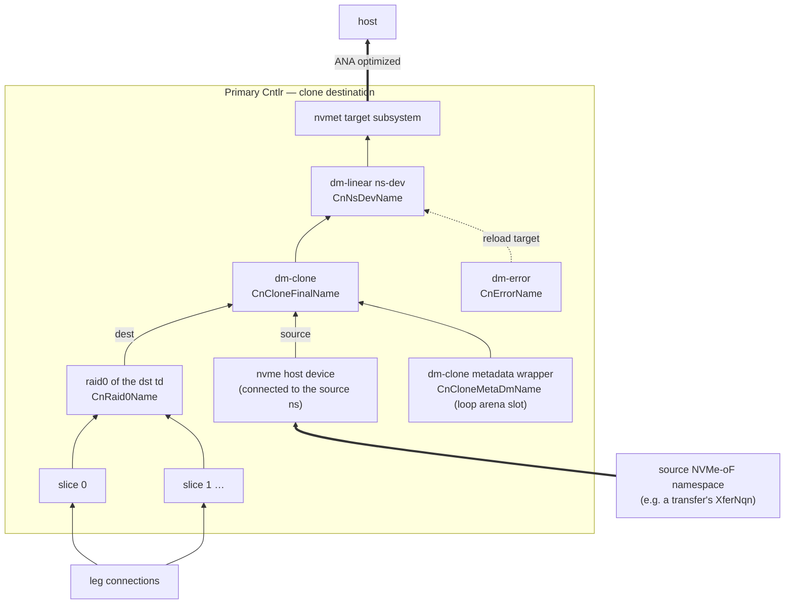

*Fig. `090Clone` — while a clone targets a td, the `CnNsDevName` of each namespace
backed by that td is reloaded onto the dm-clone; dm-clone pulls missing regions from
the source and hydrates in the background.*

**CreateClone** —
Errors: `ALREADY_EXISTS` clone key; `RESOURCE_EXHAUSTED` at `MaxCloneCntPerSp`;
`NOT_FOUND` `dst_td_name`; `FAILED_PRECONDITION` the dst td already targeted by another
clone; `INVALID_ARGUMENT` when `src_tr_conf` is empty, `src_nqn` invalid,
`src_slice_cnt ∉ [1,16]`, `src_stripe_size ≠ i×4KiB (1 ≤ i ≤ 256)`,
`src_block_size ≠ j×64KiB (1 ≤ j ≤ 16384)`, or `src_block_size` not a multiple of
`src_stripe_size` (§11.4 constraints).
Defaults: `dm_clone_conf` per §7; `auto_resume` as sent.
Precondition (not verifiable by the CP, documented contract [D3]): the destination td
MUST be **empty** — freshly created and never written. Clone crash recovery (§11.5)
equates "mapped in the destination thin pools" with "already copied", which only holds
for an initially empty td.
Action: STM: `clone_id` from `next_id`, `bm_cnt = 0`; write `Clone`, append
`clone_name_list`, bump `SpRev`. Reply `clone_id`. Primary-cntlr behavior — connect to
the source (`src_tr_conf_list` + `src_nqn`, hostnqn `CnHostNqn`,
`fast_io_fail_tmo = 5`, `ctrl_loss_tmo = -1`, retry until it succeeds), allocate the
clone's contiguous units in the §3.2 arena, `blkdiscard` that range on the loop device
and `dmsetup create` the wrapper `CnCloneMetaDmName` ([D14]), build dm-clone
`CnCloneFinalName` (metadata = that
wrapper, dest = the dst td's `CnRaid0Name`, source = the connected nvme ns at `src_ns_idx`,
region size = this SP's `block_size`, `hydration_threshold`/`batch_size` from
`dm_clone_conf`), reload the dst td's namespaces' `CnNsDevName`s onto the dm-clone, and, iff `auto_resume`,
resume the device and move the td's namespace(s) to ANA `optimized` — i.e. steps 1-5 of
§11.3's destination list. After a CN reboot the primary rebuilds the clone by the
§11.5 recovery procedure before letting any IO through.

Admission note (update_02.md U4): the checks above gate `MaxCloneCntPerSp`
only. The binding ceiling is the primary CN's clone-metadata arena — 256
`CnCloneMetaUnit` units per **CN**, shared by every clone of every cntlr on
that CN (≥ 2 units per clone ⇒ at most 128 concurrent clones per CN, far
fewer for large tds at small block sizes; `cnagent.md` CN18 carries the
arithmetic). The CP does not gate against it: an over-committed clone is
created normally and its `clone_id_to_meta` / `clone_id_to_dm_clone` rows
report `RES_STATUS_ERROR` until arena units free up. Callers MUST place
clones against the per-CN budget, not against `MaxCloneCntPerSp`; a future
gateway MAY track the budget in etcd.

**DeleteClone** —
Errors: `FAILED_PRECONDITION` when `force = false` and hydration is not complete —
checked outside the STM via `GetCntlrInfo` of the primary
(`clone_id_to_dm_clone.details` carries the dm-clone status; unreachable agent also ⇒
`FAILED_PRECONDITION`).
Action: STM: remove from `clone_name_list`, delete `Clone` + every `CloneBitmap`, set
`suspended = false` on every namespace whose `td_id == dst_td_id`, bump `SpRev`. The
primary reloads those namespaces' `CnNsDevName`s back onto the raid0 (all data now
local), removes the
dm-clone first and then its metadata wrapper `CnCloneMetaDmName` (whose arena units
become free again in the next registry enumeration, [D14]), disconnects the source, and deletes the clone's
`LocalCloneBmPath` files (§9.6). Reply `clone_id`.

**GetClone** — STM read. **UpdateCloneTrConf** — STM replace `src_tr_conf_list`, bump
`SpRev` (used when the source SP's cntlrs moved); the primary reconnects.

**AppendCloneBitmap** —
Errors: `INVALID_ARGUMENT` `slice_idx ≥ Clone.src_slice_cnt` or `≥ MaxCloneBmCnt`;
`INVALID_ARGUMENT` empty bitmap.
Action: STM: append the bytes to `CloneBitmap` key `bm_idx = slice_idx` (create if
absent), `bm_cnt = max(bm_cnt, slice_idx+1)`, bump `SpRev`. These are the **src
bitmaps**: bit *k* of source slice `slice_idx` covers `src_block_size` bytes of that
slice's local address space; **1 = the source never wrote there ⇒ skippable**. They are
a pure optimization delivered via `PushCloneBitmap` (§9.6) and may be applied at any
time, even after the dm-clone started serving IO (§11.5); durability never depends on
them. The chunk-append exists because callers page the source bitmap via
`GetThinDeviceBitmap` and because etcd values are size-limited.

### 8.10 Transfers (source side of a copy; fig. `100Transfer`)

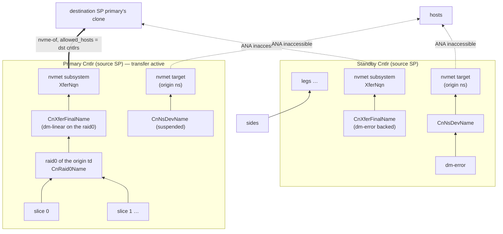

*Fig. `100Transfer` — after `CreateTransfer(auto_suspend = true)` the origin namespace
is retired everywhere; the xfer subsystem is the only live reader/writer of the bytes,
served by the primary.*

**CreateTransfer** —
Errors: `ALREADY_EXISTS`; `RESOURCE_EXHAUSTED` at `MaxXferCntPerSp`; `NOT_FOUND`
`ori_nqn` / `ori_ns_idx`; `INVALID_ARGUMENT` host-NQN rules on `allowed_hosts`
(callers put the destination cntlrs' `CnHostNqn`s here).
Action: STM: `xfer_id` from `next_id`, write `Transfer`, append `xfer_name_list`, bump
`SpRev`. Reply `xfer_id`. Every enabled cntlr creates the xfer stack: primary builds
`CnXferFinalName` = dm-linear on the origin td's raid0 and exports it as subsystem
`XferNqn` on the CN's port (nsid = `ori_ns_idx`, same `nguid`/`uuid` as the origin
namespace, `allowed_hosts` from the record, `Cntlr.cntlid_slot` bounds); standbys
export the same subsystem backed by a dm-error `CnXferFinalName` with ANA
`inaccessible` (fig. `100Transfer` right half). Iff `auto_suspend`, the primary first
(1) moves the origin namespace to ANA `inaccessible` on every cntlr, (2) suspends the
origin namespace's `CnNsDevName` — the destination clone is now the only
reader/writer of the bytes.

**DeleteTransfer** —
Semantics: `force = false` **finalizes** a completed hand-over: the STM additionally
sets `suspended = true` on the origin namespace, so the source stays retired after the
xfer object disappears. `force = true` **aborts**: `suspended` is left `false`, so the
next syncup restores normal service (resume dev, ANA back).
Action: STM: remove from `xfer_name_list`, delete `Transfer`, (maybe) flip `suspended`,
bump `SpRev`. Agents drop the xfer subsystem + dm devices. Reply `xfer_id`.

**GetTransfer** — STM read. **UpdateTransferHosts** — STM replace `allowed_hosts`, bump
`SpRev` (destination cntlr moved to another CN).

### 8.11 Migrations (fig. `080Migration`, §11.2)

**CreateMigration** —
Errors: `ALREADY_EXISTS` migration key; `NOT_FOUND` `src_side_id` not found in any leg
of the SP; `RESOURCE_EXHAUSTED` at `MaxMigrCntPerSp` or no DN candidate (§6.5);
`FAILED_PRECONDITION` the owning leg already has 2 sides (a migration is already
running on it), or `cntlid_slot_list` holds no slot different from the src side's
(§11.8 — such an SP cannot migrate this leg at all; gateway.md D-I).
Action: allocate one DN; STM: `migr_id` + `dst_side_id` from `next_id`; append a new
`Side` to the leg's `side_list` (`cntlid_slot` = a slot from `cntlid_slot_list`
different from the src side's — the only slot constraint sides have, §11.8;
`addr_port`/`nvme_tr_conf` copied from the dst DN; `provisioned = false`, [D15]); write
`Migration{migr_id, src_side_id, dst_side_id, dm_clone_conf, bm_cnt = 0}`, append
`migr_name_list`; dst-DN bookkeeping (`side_ptr_list`, `free_ext_cnt -= group.ext_cnt`,
capacity key per §5.6, `DnRev`); bump `SpRev`. Reply `migr_id`. The dst side therefore
provisions (§9.4) before any migration machinery starts; until the sp-worker flips it,
`migr_src_conf.dst_provisioned = false` keeps the src side serving untouched (§11.2).
Data-plane choreography: §11.2.

Admission note (update_02.md U4): the DN candidate scan covers **extents**
only. The destination DN's [D13] clone-metadata area — `DnCloneMetaSize` = 48
`DnCloneMetaUnit` slots per **DN**, shared by every destination role the node
hosts across every SP — is not part of admission: each migration costs
`ceil((4 MiB + region_cnt bytes) / DnCloneMetaUnit)` slots with `region_cnt`
= side bytes / `block_size` (≥ 2 — the base alone is one whole unit), so at
most 24 concurrent destination roles fit one DN, fewer for large sides at
small block sizes (`dnagent.md` DN13). A migration the area cannot serve is
still created; its `migr_dst_info` rows report `RES_STATUS_ERROR` until slots
free up. `MaxMigrCntPerSp` = 4 bounds none of this.

**FinishMigration** —
Errors: `FAILED_PRECONDITION` when `force = false` and hydration is incomplete
(checked outside the STM via `GetSideInfo` of the **destination** side —
`migr_dst_info.dm_clone_info.details`).
Action: STM: remove the **src** `Side` from the leg (the dst side becomes the only
one); src-DN bookkeeping (pointer out, extents back, capacity key per §5.6, `DnRev`);
delete `Migration` + every `MigrBitmap`, remove from `migr_name_list`; bump `SpRev`.
The dst side agent reloads its per-cntlr dm-linears from the dm-clone straight onto the
side device, drops the dm-clone + the metadata wrapper and its slot + the nvme host
connection + the migration's `LocalMigrBmPath` files (§9.6); the src DN agent sees the pointer disappear and tears
the side down. Reply `migr_id`.

**CancelMigration** — mirror rollback: STM removes the **dst** `Side` + `Migration` +
bitmaps, returns the dst DN's extents, bumps `SpRev` + dst `DnRev`. The src side
returns to normal service on the next `SyncupSide` (ANA back, migr export dropped);
the dst side agent tears its stack down, including the `LocalMigrBmPath` files.

**GetMigration** — STM read.

**AppendMigrationBitmap** —
Errors: `RESOURCE_EXHAUSTED` `bm_cnt ≥ MaxMigrBmCnt`.
Action: STM: write `MigrBitmap` at `bm_idx = bm_cnt`, `bm_cnt += 1`, bump `SpRev`. The
chunks concatenate (in `bm_idx` order) into one bitmap over the **leg's data region**:
bit *k* covers `block_size` bytes, **1 = never written ⇒ skippable**. Every append
creates a **new** chunk key, so a written chunk is immutable. Delivery to the
destination DN goes through `PushMigrBitmap` (§9.6); the dst side agent shifts by the
leg's `meta_blocks` (`migr_dst_conf.meta_blocks`, §3.6 — the meta region: md
superblock, bitmap, health block, must always be copied) and `blkdiscard`s
fully-skippable dm-clone regions.

### 8.12 Spare legs

**CreateSpareLeg** — Errors: `NOT_FOUND` `grp_id` not in the SP; `INVALID_ARGUMENT` the
group is RedundNone; `RESOURCE_EXHAUSTED` at `MaxSpareLegPerGrp` or no DN (§6.5);
`FAILED_PRECONDITION` at `sp_level ≥ SP_LEVEL_NO_THINPOOL` ("sp level suppresses
reactions", §8.5).
Action: STM: new `Leg{leg_id, leg_idx = next unused idx in the group, one Side}`
(that `Side` written `provisioned = false`, [D15]) appended to `spare_leg_list`; DN
bookkeeping + `DnRev`; bump `SpRev`. Every cntlr
connects to the spare's side and health-checks it (§3.3 step 1), **but the spare is not
added to the md array** — it is pre-connected standby capacity only. An unprovisioned
spare defers only itself — spares never assemble (§11.1.1) — and reports
`RES_STATUS_PROVISIONING` until it clears. Reply `leg_id`.

**DeleteSpareLeg** — Errors: `NOT_FOUND` `grp_id`/`leg_id`. Action: STM remove from
`spare_leg_list`, DN bookkeeping back, bump `SpRev`. Reply `leg_id`.

**SwitchSpareLeg** — the only way a spare becomes active; invoked by users or by the
sp-worker's leg repair of §10.4 (`dnv-worker.md` §11.5). Errors: `NOT_FOUND` ids not
in the group's lists; `FAILED_PRECONDITION` when the spare's side is not yet
`provisioned` ("spare side is not provisioned" — an unzeroed spare must never become
an md member, [D15]) or at `sp_level ≥ SP_LEVEL_NO_THINPOOL` ("sp level suppresses
reactions", §8.5).
Action: STM swap: `spare_leg_id` moves to `leg_list` (taking the active role),
`target_leg_id` moves to `spare_leg_list`; bump `SpRev`. The primary then:
`mdadm --fail`/`--remove` the target if the array still lists it, `mdadm --add
--failfast` the promoted spare, and lets md rebuild onto it (write-intent bitmap keeps
this cheap when the target was only briefly absent — but a fresh spare gets a full
resync). Reply the current active + spare leg ids.

### 8.13 Bitmap reads

**GetThinDeviceBitmap** — inputs `td_name`, `slice_idx`, `start_block`, `block_cnt`.
The gateway resolves the primary cntlr's CN in an STM, then (outside) calls the agent's
`GetThinDeviceBm` to compute, from a dm-thin metadata snapshot of that slice's pool, the
mapping bitmap of the td's thin volume in that slice: bit *k* (for block
`start_block + k`, block = `block_size`) = **1 iff unmapped/never written**.
`block_cnt = 0` ⇒ to the end. Callers page through it and feed `AppendCloneBitmap` on
the destination.

**GetLegBitmap** — inputs `leg_id`, `start_block`, `block_cnt`. Same path via the
agent's `GetLegBm`; the agent walks the pool metadata of the owning slice, translates
pool-data blocks through the pool-data linear concat and the group geometry down to
this leg's **data region**, and returns bit *k* = **1 iff no pool block maps there**.
Callers feed `AppendMigrationBitmap`.

Note the wire convention for every bitmap RPC (`Get*Bitmap`, `Append*Bitmap`,
`Push*Bitmap`) is **1 = unwritten/skippable**, while thin-pool metadata natively
answers **mapped = written**; agents and callers invert once at the boundary (§11.4).
The **bit order** is normative too: bits are **LSB-first within each byte** — bit *i*
lives at `bitmap[i/8] & (1 << (i%8))` — and the trailing pad bits of the last byte are
`0`. Chunks are byte-aligned, so migration's bit-level concatenation is plain byte
concatenation (§9.6, §11.4).

---

## 9. Agent services and agent behavior

### 9.1 Common agent rules

* **Local store.** The agent persists, per synced object, the serialized **last fully
  applied request** as a flat protobuf file: `SyncupDnRequest` at `LocalDnPath`,
  `SyncupSideRequest` at `LocalSidePath`, `SyncupCnRequest` at `LocalCnPath`,
  `SyncupCntlrRequest` at `LocalCntlrPath` — plus one file per received bitmap chunk at
  `LocalMigrBmPath`/`LocalCloneBmPath` (§4.6, §9.6). Every write goes to a temp file in
  the same dir, fsync, rename. The stored request contains the revision, so no separate
  revision record exists. On start the agent loads every file under its prefix,
  reconciles the system to it (full idempotent re-apply, §11.5 for clones), then
  serves. When an object disappears from its parent's pointer list, the agent tears its
  resources down and deletes the file(s).
* **Revision gate.** A `Syncup*`/`Push*` request with a revision **lower** than the
  stored one is rejected (`AgentReply.code != 0`, `details` explains). Equal revision:
  re-apply idempotently (workers retry). Higher: apply, then persist.
* **Full sync.** Every `Syncup*` request carries the complete desired state of its
  object — there is no partial mode. `SyncupDn.side_pointer_list` /
  `SyncupCn.cntlr_pointer_list` are authoritative: pointers in the request but not
  local ⇒ add; local but not in the request ⇒ move to a to-be-deleted list and tear
  their resources down (ids are never reused, so a deleted side/cntlr never comes
  back). The embedded object lists inside `SyncupSide`/`SyncupCntlr` diff the same way.
  Bitmap chunks are the one thing that never rides in a `Syncup*` request; they travel
  only over the dedicated `Push*Bitmap` RPCs (§9.6).
* **RPC shapes.** `Syncup*`, `Push*Bitmap`, `Get*Info`, `GetDnSize`/`GetCnSize` and
  `GetThinDeviceBm`/`GetLegBm` are unary; the four `Check*` RPCs are the only
  bidirectional streams (§9.7). `Syncup*`, `Push*Bitmap`, `Get*Info` and `Check*`
  replies embed `AgentReply{code, details}` (0 = OK); `Syncup*` and `Get*Info` replies
  also carry the current `*Info` (§9.5), and every `Syncup*`, `Get*Info` and `Check*`
  reply additionally carries the agent's last fully applied `revision` —
  the exact reply fields are listed per RPC in §9.2/§9.3. `Push*BitmapReply` carries
  only `AgentReply`; `GetDnSize`/`GetCnSize` and `GetThinDeviceBm`/`GetLegBm` return
  only their payload (`size` / `bitmap`) and report failure through the gRPC status. A
  worker issues the `Syncup*` calls for one object sequentially — the next revision
  only after the previous call returned.
* Shell execution uses the §7 timeouts; failures are captured into the affected
  resource's `ResInfo{status = RES_STATUS_ERROR, details}` rather than crashing the
  reconcile — the agent always converges as much as it can and reports the rest.
* **Bitmap durability.** Received `Push*Bitmap` chunks are persisted per chunk under
  `LocalMigrBmPath`/`LocalCloneBmPath`; the applied-index sets reported through
  `bm_info`/`bm_info_list` are derived from the files present, so they survive agent
  restarts and the worker does not have to re-push after one. Re-applying a chunk is
  always harmless — re-`blkdiscard`ing an already-hydrated dm-clone region is a no-op,
  which holds only because every dnv dm-clone carries `no_discard_passdown` ([D7],
  Appendix A). Full protocol: §9.6 [D7].

### 9.2 `service DiskNodeAgent`

| rpc | behavior |
|---|---|
| `GetDnSize` | Return the byte size of the `--disk` device's **data area** — the raw size (`lsblk --bytes`) minus the fixed `DnDataOffset` prefix of the [D13] format. A device at or below `DnDataOffset` is an `Internal` error. Called by the gateway pre-registration; `dn_id` in the request is for logging only. |
| `SyncupDn` | Carries `revision`, `side_pointer_list`, `extent_size` (the cluster's `dn_bin_conf.extent_size`, stamped into the disk header at format time and immutable thereafter, §3.1). Ensure §3.1 base state (the [D13] disk format, the single nvmet port); diff the pointer list per §9.1. Reply `agent_reply`, `revision`, `dn_info`. |
| `SyncupSide` | Carries one `side_pointer`, `revision`, `side_conf` (`ext_cnt`, `cntlid_slot`, `primary_cn_id`, `standby_id_list`, `sp_level`, `provisioned`) and — only when this side is a migration endpoint — `migr_src_conf` (`migr_id`, `dst_side_id`, `dst_dn_id`, `dst_provisioned`: the source role, §11.2) and/or `migr_dst_conf` (`migr_id`, `src_side_id`, `src_dn_id`, `src_nvme_tr_conf`, `block_size`, `meta_blocks`, `dm_clone_conf`, `bm_cnt`: the destination role). Reject if the pointer is unknown (SyncupDn must introduce it first). Converge the §3.1 per-side stack: the side device of `ext_cnt` extents and its zeroing state (§9.4), per-CN dm-error/dm-linear/nvmet subsystem, primary vs standby table targets + ANA states, migration source/destination roles (§11.2). Reply `agent_reply`, `revision`, `side_info` (which always reports `zeroed_ext_cnt` / `total_ext_cnt`, §9.4), `bm_info` (the applied migration-bitmap indexes, §9.6). |
| `PushMigrBitmap` | Deliver one `MigrBitmap` chunk (`side_pointer`, `revision`, `migr_id`, `bm_idx`, `bitmap`) to the **destination**-side agent, per the §9.6 protocol: persist the chunk at `LocalMigrBmPath`, then recompute + `blkdiscard` the fully-skippable dm-clone regions (§8.11, §11.4). Reply `agent_reply` only. |
| `GetDnInfo` / `GetSideInfo` | Return the current `DnInfo` / `SideInfo` without changing anything (`agent_reply`, `revision`, info). |
| `CheckDn` / `CheckSide` (stream) | Health streams, one per DN resp. per side, protocol in §9.7. Request: ids, `revision`, `show_info`; reply: `agent_reply`, `revision`, `dn_info` / `side_info`. |

### 9.3 `service ControllerNodeAgent`

| rpc | behavior |
|---|---|
| `GetCnSize` | Return the capacity budget in bytes this CN is willing to host (0 = "use the default"); typically from local config. |
| `SyncupCn` | `revision`, `qos_ratio`, `cntlr_pointer_list`. Ensure §3.2 base state (tmpfs, the 1 GiB sparse backing file, the single loop device — re-learned via `losetup --associated`, never persisted — and the single nvmet port; there is no VG, [D14]); accept and persist `qos_ratio` (enforcement is deferred until the §3.2 step 4 open issue is decided — the agent programs no limit, `cnagent.md` CN6); diff pointers. Reply `agent_reply`, `revision`, `cn_info`. |
| `SyncupCntlr` | One `cntlr_pointer`, `revision`, `bdev_conf` (incl. `dm_pool_conf.low_water_mark_pct`, §3.3), `sp_level`, `cntlr`, `id_to_slice` (key = `sprintf(IdKeyFmt, slice_id)`), `td_list`, `nqn_to_subsystem`, `clone_list`, `xfer_list`, `migr_list`. Converge §3.3 (primary) or §3.4 (standby); a primary→standby or standby→primary flip follows §11.1 exactly; clone rebuild follows §11.5. Reply `agent_reply`, `revision`, `cntlr_info`, `bm_info_list` (the applied clone-bitmap indexes, one `BitmapInfo` per clone, §9.6). |
| `PushCloneBitmap` | Deliver one `CloneBitmap` chunk (`cntlr_pointer`, `revision`, `clone_id`, `bm_idx`, `bitmap`) to the **primary** cntlr's agent, per the §9.6 protocol: persist the chunk at `LocalCloneBmPath`, translate through §11.4, `blkdiscard` the dm-clone. Safe at any time (§11.5). Reply `agent_reply` only. |
| `GetCnInfo` / `GetCntlrInfo` | Read-only live state (`agent_reply`, `revision`, info). |
| `GetThinDeviceBm` / `GetLegBm` | Serve the §8.13 gateway reads from a dm-thin metadata snapshot (`dmsetup message ... reserve_metadata_snap`, read via `thin_dump`/direct parse, then `release_metadata_snap`): per-slice td mapping bitmap, or the leg-projected pool mapping bitmap. Reply bitmaps use the wire convention **1 = unmapped**. |
| `CheckCn` / `CheckCntlr` (stream) | Health streams, one per CN resp. per cntlr, protocol in §9.7. Request: ids, `revision`, `show_info`; reply: `agent_reply`, `revision`, `cn_info` / `cntlr_info`. |

### 9.4 Side provisioning protocol (whole-side zeroing behind the `provisioned` gate)

dnv is a **multi-tenant** service: one tenant must never be able to read another
tenant's bytes. The trim protocol this section used to describe (`blkdiscard` of the
whole side device, then a `trimmed` flag) claimed that guarantee but could not give it
— discard-reads-zeros is not a hardware property (the kernel dropped
`discard_zeroes_data` in 4.12; NVMe DLFEAT read-zeroes is optional). Stale bytes also
break correctness where this design *assumes* zeros: a recycled meta-group extent can
hold a previous SP's valid thin-metadata superblock (a fresh pool would adopt stale
metadata), and a stale md superblock flips §11.1.1 into the wrong assembly case with no
`--zero-superblock` escape. Therefore **every side is fully zeroed before its first
export**, tracked per extent on disk, gated by a CP-visible `provisioned` flag ([D15]).

**Key invariant.** *Zeroed is a property of the side's allocation, not of the disk
extent* — extents freed and reallocated to a new side start all-not-zeroed again,
whatever happened to them before. "Logical extent *i*" is the *i*-th extent in the
concatenation of the record's `run_list`, i.e. bytes `[i, i+1) × extent_size` of the
`DnSideName` device.

**Standing hardware assumption (v1).** DN disks support **fast Write Zeroes**: at the
defaults, `DnZeroBatchExtCnt` = 10 × 1 GiB extents zero inside `CmdSoftTimeout` (3 s),
i.e. ≳3.3 GiB/s effective. Zeroing commands run under the ordinary §7 command timeouts;
there is no special zeroing timeout. Tuning for other hardware arrives later as
per-node agent flags — per-node because they describe hardware, while `ClusterConf` is
write-once and cluster-wide. Operators must then respect
`batch × extent_size ≤ WZ_rate × CmdSoftTimeout`; raising the global timeouts stretches
every command's bound, not just zeroing's.

**Protocol (dn agent), four idempotent steps, restart-safe at every point:**

1. Allocate the extent runs; persist the record with `zeroed_bits` all 0.
2. Build `DnSideName` (the multi-target dm-linear over the runs).
3. A **background zeroing goroutine** zeroes not-yet-zeroed extents in batches of
   `DnZeroBatchExtCnt` = 10, in order, **through the dm-linear** — the side is
   contiguous in device offsets there, so one command covers a batch regardless of
   physical fragmentation:
   `blkdiscard --zeroout --offset {done × extent_size} --length {min(batch, remaining) ×
   extent_size} {DmPath(DnSideName)}`; after each successful batch, persist that batch's
   bits in the volume table. `done` is the **lowest not-yet-set bit**, never a count of
   set bits: the two agree while the set bits are a contiguous prefix, and only the
   first-unset rule stays correct when they are not (the per-extent bits were chosen
   over a watermark precisely because they are strictly more general).
4. Per-CN export stacks are converged **only** when the request says
   `provisioned = true` **and** all bits are set.

**Converge matrix** (request `side_conf.provisioned` × local state):

| provisioned | record | bits | behavior | `side_dev_info` |
|---|---|---|---|---|
| false | absent | — | allocate (bits 0), build linear, ensure goroutine | `PROVISIONING` `"zeroing 0/n"` |
| false | present | partial | ensure linear + goroutine | `PROVISIONING` `"zeroing k/n"` |
| false | present | complete | linear ensured; no goroutine; no exports | `OK` (per-CN stacks report `PROVISIONING`) |
| true | present | complete | full §3.1 export converge | normal |
| true | present | partial | **refuse exports**; keep the goroutine (self-heals) | `ERROR` `"not zeroed"` |
| true | absent | — | **never allocate**; nothing converged | `ERROR` `"record missing"` |

Rules embedded there: allocation is permitted **only** at `provisioned = false`. At
`true`, a missing record means the data is gone (a lost or foreign disk); silently
re-allocating would present a zeroed impostor as the data-bearing leg, so it is a hard
resource error that feeds `err_epoch` and the replacement flows (raid1: spare-switch —
§10.4 does it automatically after `leg_unhealthy`; RedundNone: effectively delete-SP).
**The agent always trusts its own bits over the flag** — the disk is authoritative
([D13] spirit); the etcd flag is a gate, never evidence. The existing
ext-count-mismatch error is unchanged. Rows that refuse the exports report every
above-the-side resource as `RES_STATUS_PROVISIONING` with details `"side provisioning"`;
`ERROR` stays confined to `side_dev_info`. `SideInfo.zeroed_ext_cnt` /
`total_ext_cnt` are filled on every reply and every Check round; equal counts (and
`total > 0`) ⇒ fully zeroed.

**Zeroing goroutine rules** (the dn twin of the DN8/DN13 registries):

* Registry keyed by the side tuple; single-flight per side; created on demand by any
  converge (startup reconcile included) that finds zeroing needed; sides zero in
  parallel (no global cap in v1 — the fast-WZ assumption).
* Each batch: a fresh trace id; the `blkdiscard` runs **lock-free** and goes through
  the normal OsClient under the standard §7 timeouts — unlike the CN11 leg probe IO it
  is a *killable child process*, so no semaphore carve-out is needed; the table update
  afterwards takes the node-read plus the side's object lock.
* Batch failure/timeout: the killed command's output goes into `side_dev_info`
  `RES_STATUS_ERROR` details, and the next successful batch clears it back to
  `PROVISIONING`; the retry is paced by `DnZeroRetryInterval` = 5 seconds — never a hot
  loop. Partial zeros are harmless: the batch's bits stay unset and the batch is redone.
* Cancellation: side teardown (the pointer is removed), process exit and
  `CancelMigration` **cancel the goroutine and wait for it** before removing the dm
  device (the child holds it open; removal would otherwise fail EBUSY). Zeroing
  continues at every `sp_level`, `DISABLE` included (§11.7) — it is bottom-layer
  provisioning, like the trim it replaced.
* Process exit: goroutines derive from the agent's root context and are tracked in a
  WaitGroup the serve loop waits on after `GracefulStop`, so **no orphan `blkdiscard`
  child ever outlives the agent**.
* Fail-fast hardware check at the DN base state: `write_zeroes_max_bytes` of the
  `--disk` device's sysfs queue directory reading `0` means the kernel would fall back
  to writing zero pages at bulk speed and the assumption cannot hold ⇒
  `meta_info = RES_STATUS_ERROR "disk lacks Write Zeroes"`, which flows into
  `err_epoch` → capacity-key removal (§5.6, §10.2), taking the unsuitable DN out of
  allocation. An absent or unreadable attribute is **not** a verdict.

**Probe.** The read-only probes (`GetSideInfo`, `CheckSide`) never allocate and never
start or stop a goroutine: a missing record ⇒ `RES_STATUS_MISSING` while the flag is
`false` and `RES_STATUS_ERROR "record missing"` once it is `true`; incomplete bits ⇒
`RES_STATUS_PROVISIONING` with details `"zeroing {k}/{n}"` while the flag is `false`
and `RES_STATUS_ERROR "not zeroed"` once it is `true`; a table that does not match the
record's runs ⇒ `RES_STATUS_ERROR`.

### 9.5 Live-state reporting

`ResInfo{res_name, status, details, epoch}` with `ResStatus`: `UNKNOWN`(no answer from
the node — set by *workers*, never by the agent itself), `MISSING`(agent hasn't created
it), `ERROR`(tried and failed; `details` = why / command output — *needs
intervention*), `OK`, `PROVISIONING`(deliberately not created / being prepared —
**healthy, not ready, no action needed**). `epoch` = unix
seconds of the last status change. The `revision` returned next to an `*Info`
(`Syncup*`, `Check*`, `Get*Info` replies) = last fully applied revision. Map keys in
`SideInfo`/`CntlrInfo` are the obvious owner ids (`cn_id` for a side's per-CN export
stack; td_id, slice_id, grp_id, leg_id, ns_id, ss_id, clone_id, xfer_id in `CntlrInfo`,
with `td_id_to_thin_info[td].slice_id_to_dm_thin` for the per-td × slice thin volumes;
the sp-worker's `created` flip reads exactly these rows, §10.3).
dm-clone `details`
strings carry the raw `dmsetup status` line so hydration progress is visible through
`Inspect*`. `CntlrInfo.leg_id_to_leg` reflects the §3.6 health check: on the primary, the
block-probe IO — a leg whose probe write/read fails (or stays in flight past the
probe's stall bound) is reported `RES_STATUS_ERROR` with the IO error in `details`;
on a standby, transport liveness + expected ana_state (§3.6, `cnagent.md` CN11).

`RES_STATUS_PROVISIONING` **never** sets `err_epoch` (§10.2/§10.3) and never counts as
a bad status for the capacity keys of §5.6: it marks a resource excluded from the
*effective* desired state while a side of its backing chain is still zeroing (§9.4,
[D15]). Only the deferred resources carry it — a serving thin pool keeps reporting `OK`
with its raw `dmsetup status` details even while a grow is deferred, so the §10.4
auto-grow keeps parsing them. `SideInfo` additionally reports `zeroed_ext_cnt` and
`total_ext_cnt` on every reply and every Check round; `zeroed_ext_cnt ==
total_ext_cnt > 0` on a side whose synced `provisioned` was `false` is the sp-worker's
flip condition (§10.3).

### 9.6 Bitmap push protocol (`PushMigrBitmap` / `PushCloneBitmap`)

The skip bitmaps of §8.9/§8.11 reach the data plane exclusively through these two
**unary** RPCs — never through `Syncup*`. Both follow one protocol; the table maps
the per-RPC roles:

| | `PushMigrBitmap` (`DiskNodeAgent`) | `PushCloneBitmap` (`ControllerNodeAgent`) |
|---|---|---|
| chunk source in etcd | `MigrBitmap` keys, `bm_idx` = append sequence `0 … bm_cnt−1` (≤ `MaxMigrBmCnt` = 4) | `CloneBitmap` keys, `bm_idx` = source `slice_idx` (< `src_slice_cnt` ≤ `MaxCloneBmCnt` = 16) |
| chunk meaning | chunks **concatenate in `bm_idx` order** into one bitmap over the leg's data region (§8.11); immutable once written | each chunk is a **self-positioned** per-source-slice bitmap (§8.9); `AppendCloneBitmap` may keep growing it |
| receiving agent | the DN hosting the migration's **destination** side | the CN hosting the **primary** cntlr (only it runs the dm-clone) |
| request fields | `side_pointer`, `revision`, `migr_id`, `bm_idx`, `bitmap` | `cntlr_pointer`, `revision`, `clone_id`, `bm_idx`, `bitmap` |
| local chunk file | `LocalMigrBmPath(cluster, dn, sp, migr, bm_idx)` | `LocalCloneBmPath(cluster, cn, sp, clone, bm_idx)` |
| applied-set report | `SyncupSideReply.bm_info` (`BitmapInfo.res_id = migr_id`) | `SyncupCntlrReply.bm_info_list` (one `BitmapInfo` per clone, `res_id = clone_id`) |
| apply action | shift by the leg's `meta_blocks` (§8.11), then §11.4 → `blkdiscard` on `DnMigrFinalName` | §11.4 → `blkdiscard` on `CnCloneFinalName` |

**Why chunked, why ordered.** A whole bitmap might be too large for one etcd value or
one gRPC message (`Get*Bitmap` is paged for the same reason), so it is split into
multiple parts and `bm_idx` fixes each part's position so the receiver can reassemble
the bitmap correctly. For migration chunks the position is by concatenation: chunk
*k*'s first bit sits at the summed bit length of chunks `0 … k−1`, so chunk *k* is only
interpretable once every lower chunk is present — delivery order matters. Clone chunks
are positioned by `bm_idx = slice_idx` alone and are order-independent among each
other. (With the defaults the bitmaps are small — a 1 TiB leg at 1 MiB `block_size` is
2^20 bits = 128 KiB — the chunking exists for the value-size limits and the paged
readers, not because bitmaps are inherently huge.)

**dnv-worker side** (sp role, §10.3):

1. **Learn what is missing from the syncup replies.** Every `SyncupSide` /
   `SyncupCntlr` reply returns the agent's applied sets as `BitmapInfo.bm_idx_list`:
   `bm_info` for the migration whose destination is that side, one `bm_info_list`
   entry per clone. The worker diffs each list against the chunk keys present in etcd;
   the indexes in etcd but not in `bm_idx_list` are exactly the missed parts still to
   deliver.
2. **Push one part per request.** Each missed part is written as one
   `PushMigrBitmapRequest` / `PushCloneBitmapRequest` carrying the addressing ids
   (`side_pointer` + `migr_id`, resp. `cntlr_pointer` + `clone_id`), the `revision`,
   the `bm_idx` and the raw chunk bytes.
3. **One in flight per migration/clone.** The worker issues the next `Push*Bitmap`
   call for a migration/clone **only after the reply to the previous one has
   arrived**, and pushes its missed parts in ascending `bm_idx`; together this
   guarantees the in-order arrival that migration chunk concatenation requires.
4. **Independence across objects.** Calls for different migrations/clones are
   independent unary calls and MAY run concurrently, also toward the same agent; only
   the per-object ordering of step 3 matters. (Contrast the `Check*` streams of §9.7,
   which are long-lived and one per object.)
5. **Targets.** Migration chunks go only to the destination side's DN; clone chunks go
   only to the CN currently hosting the primary cntlr. After a failover or a
   destination change the new node's syncup reply simply reports an empty/partial
   `bm_idx_list` and the worker pushes the missing parts there.
6. A reply with `AgentReply.code != 0` (stale revision; unknown `migr_id`/`clone_id`
   because the introducing `SyncupSide`/`SyncupCntlr` has not been applied yet) is not
   fatal: the worker re-pushes the part on its next sync round.

**dnv-agent side:**

1. **Gate** the request per §9.1: reject (`code != 0`) a stale revision or a
   `migr_id`/`clone_id` it does not know yet.
2. **Persist, then apply.** Write the chunk to its `LocalMigrBmPath` /
   `LocalCloneBmPath` file first (temp file + fsync + rename, §9.1); then recompute
   the fully-skippable dm-clone regions from **all** locally present chunks of that
   migration/clone (§11.4 math; migrations first shift by the leg's `meta_blocks`,
   §8.11) and apply them to the migration/clone dm-clone by `blkdiscard`ing
   `DnMigrFinalName` / `CnCloneFinalName`. If the dm-clone does not currently exist
   (not built yet, or suppressed by `sp_level`), the file still counts as applied —
   the agent re-applies every local chunk whenever it (re)creates the owning dm-clone.
3. **Reply.** The `Push*BitmapReply` carries only `AgentReply`; a `code = 0` reply is
   the acknowledgement the worker waits for before pushing the next part. A chunk whose
   persist **failed** is acked `code = 0` too — both agents log the error and reply OK:
   the ack only releases the next part, and a chunk whose index was **not yet applied**
   stays out of the applied set — that set is derived from the files present (§9.1) — so
   the object's next `Syncup*` reply reports the index as missing and the worker
   re-pushes it. Nothing else schedules that re-push, and the failed persist does not
   schedule the `Syncup*` either: unlike the `code != 0` case of the worker side's
   step 6 above, a `code = 0` ack raises no re-sync request, and the object's periodic
   rounds are `Check*` rounds (§9.7), whose replies carry no applied set. So the chunk
   waits for whatever re-issues the object's `Syncup*` anyway — a revision bump, or a
   `Check*` round the agent rejects or answers with another revision — with no timer
   and no push-side retry of its own; until then its regions are copied instead of
   skipped, which costs only the optional bitmap fast path of §8.9/§8.11. The one case
   that does not heal even that way, once the `Syncup*` comes, is a failed persist of
   a *grown* clone chunk [D8]: the index is already in the applied set with its
   shorter payload, and the `code = 0` ack also refreshes the worker's per-chunk memo,
   so the agent keeps the shorter version until that chunk grows again — the same
   bounded, correctness-neutral loss [D8] already accepts (migration chunks are
   immutable, so the DN side never hits it).
4. **Restart / rebuild.** On start the agent reloads every `Local*BmPath` file under
   its prefix and re-applies the chunks once the owning dm-clone is (re)built (agent
   restart, §11.5 clone rebuild, `sp_level` lowering) — re-application is idempotent.
   Because the applied sets in `bm_info`/`bm_info_list` are derived from the files on
   disk, they survive restarts and the worker never re-pushes what the node already
   holds. The files are deleted together with their object: when the migration/clone
   disappears from the synced desired state (or via §8.9/§8.11 teardown), the agent
   removes them with the rest of the local state.

**Grown clone chunks [D8].** `AppendCloneBitmap` may append more bytes to a `bm_idx`
that was already pushed and acknowledged. The worker therefore keeps an in-memory
memo per `(clone_id, bm_idx)` of the etcd `mod_revision` of the chunk it last pushed
(dnv-worker.md BM5, the normative rule for the implementation: an append is a `Put`
on the chunk key, so a growth shows up in the revision the worker's keys-only scan of
the chunk keys already carries, and needs no chunk value to detect) and re-pushes a
chunk whose `mod_revision` advanced past it; the agent overwrites the stored file and
re-applies whenever a received payload differs from it. If the worker changes (crash,
shard re-ownership) the memo is lost, and a chunk that grows afterwards
while staying in the acknowledged set may keep its shorter version at the agent —
accepted: src bitmaps are a pure optimization that never affects correctness (§8.9,
§11.5); the only cost is copying some regions that could have been skipped. Migration
chunks are immutable (every `AppendMigrationBitmap` creates a new `bm_idx`), so they
have no such caveat.

### 9.7 Check streams (`CheckDn` / `CheckSide` / `CheckCn` / `CheckCntlr`)

The four `Check*` RPCs are the only bidirectional streams of the agent services. They
carry no desired state — `Syncup*` does that — and exist so a worker can watch an
object's live state cheaply instead of polling `Get*Info`:

* **One stream per object.** The owning worker keeps one `CheckDn` per DN, one
  `CheckSide` per side, one `CheckCn` per CN and one `CheckCntlr` per cntlr open for as
  long as it owns the object (§10.1). Rounds are **worker-initiated**: one request per
  health round, exactly one reply per request, never an unsolicited agent message. The
  round interval is the object kind's field of `ClusterConf.health_check_conf`
  (`dn_interval` / `cn_interval` / `side_interval` / `cntlr_interval`, seconds; `0` ⇒
  `DefaultHealthCheckInterval` = 5, bounds `[MinHealthCheckInterval,
  MaxHealthCheckInterval]` = [1, 3600], §7).
* **Request:** the object ids (`cluster_id` + `dn_id`/`cn_id`, plus `side_pointer` /
  `cntlr_pointer`), `revision` = the worker's current **desired** revision for the
  object (`dnv-worker.md` RW4 — the agents ignore this request field; the mismatch
  check below is the worker comparing the *reply's* revision against desired), and
  `show_info`.
* **Reply:** `agent_reply`, `revision` = the agent's last fully applied revision for the
  object, and the `*Info`:
  * `show_info = true` ⇒ the agent always fills the complete current `*Info` (§9.5);
  * `show_info = false` ⇒ the `*Info` is filled only when something changed since the
    previous reply on this stream — a leg became unhealthy, a thin pool crossed its
    low water mark, a resource changed status at all (including
    `RES_STATUS_PROVISIONING` → `RES_STATUS_OK`), or a side's `zeroed_ext_cnt` advanced
    (§9.4: the sp-worker's flip rule of §10.3 reads those counters, so their progress
    **is** a change and needs no blanket carve-out) — and is left unset otherwise. The
    first reply on a fresh stream always carries the full `*Info`.
* **Revision check.** A reply whose `revision` differs from the request's means the
  agent has not applied the revision the worker believes current (or does not know the
  object at all: `agent_reply.code != 0`); the worker re-issues the object's `Syncup*`.
* **Health.** The worker turns a broken stream, a missing reply within the round
  timeout, or `RES_STATUS_ERROR` entries in the `*Info` into the `err_epoch` updates of
  §10.2/§10.3 (`RES_STATUS_UNKNOWN` is what the worker records itself while the stream
  is dead, §9.5). The `Check*` replies are the primary health signal; the `Syncup*`
  replies are the secondary one.

---

## 10. Workers

### 10.1 Membership and shard ownership

Membership is heartbeat-based; `dnv-worker.md` §6 is the normative specification and
[D17] the decision record — this section is the summary. Each `dnv-worker` process
generates one random **seed** (a v4 uuid) per incarnation and, for every role it
carries, keeps the key `{p} worker {role} {seed}` refreshed with a `WorkerReg{epoch}`
value every `DefaultVoteWorkerInterval` (10 s). Every worker watches the three registry
prefixes. A registration whose put has not been observed for 2 × interval is *dead*, one
that is being refreshed is *live* — judged by the observer's **own monotonic clock**
since the put it last saw, never by comparing the stored epoch with local time. Every
observed transition (appear, disappear, reappear) starts that registration's own
`DefaultVoteWorkerGraceTime` (60 s) timer; if the transition still holds when the timer
fires, the change is committed into the observer's **effective membership** and shard
ownership is recomputed — a flapping worker never becomes effective and never blocks
others. A worker applies the same rule to its own registration, so it drives nothing
during its first grace window, and every observer deletes the key of a registration it
has committed dead (there is no lease to expire it).

Shard ownership: per role, for shard `s`, each effective member `w` holds
`vote_ticket = sha256(fmt.Sprintf("%s-%s-%02x", seed, role, s))`; the member with the
largest ticket (32-byte `bytes.Compare`) owns `s`. Deterministic on every worker, no
coordinator, and a membership change moves only the shards whose winner changed
(~1/n — the "third worker takes ~1/3" behavior). A worker acts only on shards it
currently owns, creates and stops its per-shard workers gracefully on every effective
change, and **fences** itself — stops driving everything and rejoins as a fresh
identity — when its own heartbeat cannot reach etcd for 2 × interval, when its own
puts stop being echoed by its watch, or when it sees its own key deleted by a peer.

### 10.2 dn / cn roles

For each owned shard `s`, watch prefix `{p} dn_rev {s} ` (resp. `cn_rev`). On a `put`:
the key yields `cluster_id` + `dn_id` (resp. `cn_id`) and the value yields `revision` +
`addr_port`; read the node's desired state with that `addr_port`
(`DnConf` at `{p} dn_conf {cluster_id} {addr_port}`, plus `ClusterConf` — it supplies
`SyncupDn.extent_size` from `dn_bin_conf` and `SyncupCn.qos_ratio`; the sides'
details are pushed by the sp role) and call `SyncupDn` (resp. `SyncupCn`) at that same
`addr_port` with that revision. A `put` whose only change is `addr_port` (a moved node,
§5.5) therefore re-syncs the node at its new endpoint without the worker ever seeing the
node disappear. On a `delete`: stop syncing/health-checking the node and close its
`Check*` stream. Additionally keep a `CheckDn`/`CheckCn` stream (§9.7) open to every
owned node, one request per `health_check_conf.dn_interval`/`cn_interval` seconds
(§9.7): on a broken stream, a missed reply or a `RES_STATUS_ERROR` entry
set `DnConf.err_epoch`/`CnConf.err_epoch` = now (if 0) in an STM; clear to 0 on
recovery; on a `revision` mismatch re-issue `SyncupDn`/`SyncupCn`. The same STM maintains the node's capacity key per §5.6 (unhealthy ⇒ delete, recovered
⇒ recreate). `err_epoch`/capacity changes never bump revisions.
`RES_STATUS_PROVISIONING` is **not** a bad status and never sets `err_epoch` or removes
a capacity key ([D15], §9.5); a DN whose `meta_info` reports
`"disk lacks Write Zeroes"` (§9.4) is a plain `ERROR` and does lose its capacity key.

### 10.3 sp role

Watch `{p} sp_rev {s} ` per owned shard; the key yields `cluster_id` + `sp_id`, the
value `revision` + `sp_name` (the `SpConf` key suffix — no `sp_id_to_name` lookup needed
on this path). On a bump: load the SP (SpConf, cntlrs,
slices, tds, subsystems, clones, xfers, migrs, bitmaps) and fan out `SyncupSide` to
**every side** of the SP and `SyncupCntlr` to **every cntlr**, with the new revision —
each request always carries the full desired state (§9.1). Resolve each side's DN and
each cntlr's CN by reading `DnConf`/`CnConf` at the record's endpoint
(`Side.addr_port` / `Cntlr.addr_port` — those keys are endpoint-addressed, §5.3):
that yields the `dn_id`/`cn_id` the `Syncup*` requests and the
`migr_src_conf.dst_dn_id`/`migr_dst_conf.src_dn_id` fields carry (cacheable per
round; a moved node re-resolves on its next `DnRev`/`CnRev` event, §5.5). Bitmap chunks travel over
the dedicated `PushCloneBitmap`/`PushMigrBitmap` calls instead (§9.6): the replies'
`bm_info`/`bm_info_list` tell the worker which chunk indexes each agent already holds,
and it pushes the missed parts — one call in flight per migration/clone, in
ascending `bm_idx`. The `Syncup*` replies and, continuously, the `CheckSide`/
`CheckCntlr` streams the sp-worker keeps open to every side and cntlr of its SPs
(§9.7; one round per `health_check_conf.side_interval`/`cntlr_interval` seconds)
feed health: set/clear `err_epoch` on
`Cntlr`, `Leg`, `Side` records accordingly (STM, no rev bump) — in particular a
failing §3.6 health-check block turns into `Leg.err_epoch` (and `Side.err_epoch` when
the side path itself is the failing part). `RES_STATUS_PROVISIONING` entries never set
`err_epoch` on any of the three ([D15], §9.5).

**Provisioning gate ([D15], §9.4).** The sp-worker fills `SideConf.provisioned` from
the etcd `Side.provisioned`, and `MigrSrcConf.dst_provisioned` from the migration's
**dst** side's flag. **Flip rule**: on any `SyncupSide`/`CheckSide` reply where the
synced `provisioned` was `false` and `zeroed_ext_cnt == total_ext_cnt > 0`, the worker
sets `Side.provisioned = true` in an STM and bumps `SpRev` once (several sides of one
SP MAY batch into one STM). The normal watch fan-out then re-syncs the sides (now
exporting) and the cntlrs (now connecting). There are no long gRPC deadlines and no
Check-round exemptions — every RPC stays short.

**Materialization flip (`ThinDeviceCreated.md` U3).** The sp role already consumes
every `SyncupCntlrReply` and every `CheckCntlrReply` for `err_epoch` maintenance; the
`created` flip is one more consumer of the same replies — no new RPC, no polling, no
timer, and `GetCntlrInfo` replies are not a source. A reply `R` from **any** cntlr of
SP `S` (thin rows are only ever filled by a cntlr acting as primary, and the ids live
in the shared pool metadata on the DN legs) **completes** a td `X` of `S` when all four
hold: (1) `R.agent_reply.code == 0`; (2)
`R.cntlr_info.td_id_to_thin_info[X.td_id]` exists; (3) the key set of its
`slice_id_to_dm_thin` equals the SP's slice ids exactly — every slice, no extra, no
missing; (4) every row's `status == RES_STATUS_OK`. Anything else — no entry (a
standby, `cnagent.md` CN14 "primary only"), a partial map, any
`MISSING`/`ERROR`/`PROVISIONING`/`UNKNOWN` row — is "not yet". The reply's `revision`
is **not** compared with anything: thin ids are monotonic facts about the pool
metadata, and identity is guarded in the STM below. `show_info = false` Check replies
suffice, because §9.7 delivers the `*Info` whenever any resource changed status and
`MISSING → OK` is such a change.

*Candidates* are the tds of `R` that are complete and that the worker's loaded state of
`S` shows `created == false`. A reply that completes no candidate causes no etcd traffic
at all. If the candidate set is non-empty the worker runs **one STM**: for each
candidate re-read `{p} thin_device {cluster_id} {sp_id} {td_name}` and skip it when the
key is absent (deleted meanwhile), when its `td_id` differs (deleted and re-created
under the same name), or when `created` is already `true` (another worker or a
concurrent reply got there first) — otherwise set `created = true` and write the record;
then, if at least one record was written, bump `SpRev` **once** (the key is id-based and
is updated, never deleted and re-created, §5.5). Nothing written ⇒ no bump. Several tds
completed by one reply share the one STM and the one bump, and a pending `provisioned`
flip of the same SP MAY be folded into the same transaction — the two rules are
independent and both bump once. The reads and writes log as ordinary `etcd
get`/`etcd put` records inside the STM (`log.md` §5.3); a retried transaction
logs them twice, which is expected. Replies do not get one STM each: the sp
worker drains every report pending on its channel at that moment — across
replies and across cntlrs — and folds all their candidates into the one STM.
Only the primary fills thin rows, so one reply per round per SP remains the
common case, and the fold is at most one STM and one bump regardless.

The bump re-fans the SP, which is how `created` reaches the cn agent (`cnagent.md`
CN14). It cannot loop: the worker reloads the SP on its own bump, and the re-sync's
reply — reporting the same rows `OK` — finds no candidate. The flip is idempotent and
observation-driven, so a worker restart or a shard-ownership change (§10.1) needs no
recovery step: the new owner's first reply on a fresh Check stream carries the complete
`*Info` and flips whatever is complete and still `false`. Nothing flips for the thin
rows of a cntlr at a pool-suppressing `sp_level`, of a provisioning-deferred slice, of a
standby, or of a td whose message or create failed.

### 10.4 Automatic reactions (`EventThreshold`, thin-pool auto-grow)

Two families of automation, both the **dnv-worker's** job (agents only report): the
`EventThreshold` reactions, triggered when any threshold is breached, and the
thin-pool auto-grow driven by `DmPoolConf.low_water_mark_pct`. Threshold comparisons
are `now − err_epoch ≥ threshold` with the SP's `event_threshold`
(0-valued fields fall back to the §7 defaults). All actions are ordinary STM mutations
that bump `SpRev`, so the data-plane choreography is the same as for the equivalent
manual RPC. The sp-worker evaluates them once per SP per health round, applies at most
one per pass in the priority failover → auto-grow → cntlr replacement → leg repair, and
suppresses all of them for a deleting SP, at `sp_level ≥ SP_LEVEL_NO_THINPOOL`, and for
disabled cntlrs (`dnv-worker.md` §11):

* `primary_unhealthy` (5 s): the primary cntlr is unhealthy ⇒ pick the healthy, enabled
  cntlr with the smallest `cntlr_id`, flip the `primary` booleans. This *is* the
  failover trigger of §11.1.
* `cntlr_unhealthy` (600 s): a (non-primary, or already-failed-over) cntlr stays
  unhealthy ⇒ replace it: internal `DeleteCntlr` (skipping the enabled check) + internal
  `CreateCntlr` on a fresh CN with the same `cntlid_slot`.
* `side_unhealthy` (600 s) and `leg_unhealthy` (1200 s) — **leg repair**, one procedure
  with two triggers (`dnv-worker.md` §11.5). The sp-worker believes a leg needs replacing
  when either (1) the leg has been unhealthy from the cntlr's perspective for
  `leg_unhealthy` — the primary reports it has no healthy path, which may be a CN↔DN
  connectivity problem, hence the longer wait — or (2) the leg is unhealthy from the
  cntlr's perspective **and** its side has been unhealthy for `side_unhealthy` — the side
  reports an error or the worker cannot talk to the DN, so the DN itself is probably
  dead, hence the shorter wait (§7 requires `leg_unhealthy > side_unhealthy`). Repair: if
  the group already has a **ready** spare (`Side.provisioned == true` and the primary
  reports its leg `RES_STATUS_OK`), perform an internal `SwitchSpareLeg` (§8.12 — the
  spare is only now `mdadm --add`-ed and rebuilt from the healthy leg); otherwise create
  a spare on a fresh DN first (internal `CreateSpareLeg`, black list = the DNs of every
  leg and spare of the group) and switch on a later pass once it is ready. The replaced
  leg stays parked in `spare_leg_list` for the operator; `RedundNone` groups have no
  spare and are never repaired automatically; a leg with two sides (a migration in
  flight) is left alone. The older rule — an internal migration of the leg off an
  unhealthy side — is withdrawn: every condition that sets `Side.err_epoch` also prevents
  the source DN from serving the migration, so it could not succeed as an automatic
  action; `CreateMigration` remains the operator's tool for moving data off a
  degraded-but-readable DN.
* `DmPoolConf.low_water_mark_pct` (not an `EventThreshold` field) — **thin-pool
  auto-grow**, the sp-worker's task. The agent reports every slice pool's data and
  metadata usage (used/total blocks from `dmsetup status`, carried in the pool
  `ResInfo.details` per §9.5 and delivered through the `CheckCntlr` stream, §9.7).
  When a pool's **data** usage exceeds `low_water_mark_pct`%, the worker runs an
  internal `GrowSlice` (`is_meta = false`, `ext_cnt` = the slice's first data group's
  `ext_cnt` — grow by the original allocation unit); when its **metadata** usage
  exceeds the same percentage, an internal `GrowSlice(is_meta = true)` (ladder-sized,
  §8.5). One grow per pool at a time: no second grow starts while the previous one is
  not yet visible in the reported usage. A grow whose new group still contains a
  provisioning leg is **deferred on the CN**: the concat and the pool keep their old,
  effective size and keep reporting `OK` at that size with their raw `dmsetup status`
  details, while only the deferred group's own rows report `RES_STATUS_PROVISIONING`;
  the grow completes by itself when the leg clears, and the "one grow per pool at a
  time" rule is unaffected because the serving pool's usage details keep flowing (§9.4,
  §9.5, [D15]). Auto-grow is **best-effort** — a grow can find no DN candidates, and
  nothing reserves space ahead — so a pool's data space can run out before a grow
  lands. The agent writes no feature arguments to the thin-pool table (`cnagent.md`
  CN13), so an exhausted pool behaves as dm-thin's default `queue_if_no_space`: IO
  needing a new block queues for the kernel's `no_space_timeout` (a dm-thin module
  parameter, 60 s by default) and then fails with EIO, while already-provisioned
  blocks keep serving; operators SHOULD alert on pool usage well before 100 %
  (`risks_and_gaps.md` RK4). `low_water_mark_pct > 100` disables this
  automation (§7); operators then grow manually.

The worker never deletes user data on its own; every automatic action above only
re-homes redundancy or roles.

---

## 11. Procedures

### 11.1 Failover

An SP has multiple cntlrs; exactly one is primary. A failover switches the primary from
one cntlr (`old_primary`) to another (`new_primary`) and involves three kinds of
participants. The trigger is only ever an etcd change (§10.4 or `UpdateCntlrEnabled`),
delivered by revision-ordered syncups.

**old_primary** — on a `SyncupCntlr` saying it is not primary (revision higher than
everything it has seen):

1. Move all namespaces from the `optimized` ANA group to the `inaccessible` one.
2. Wait until no inflight IO remains on the ns-dev layer.
3. Reload every td's `CnNsDevName` dm-linear onto its `CnErrorName`.
4. Clean up every resource a primary shouldn't have (raid0s, thin volumes, pools,
   pool-meta/data linears, md arrays) — leaving the §3.4 standby set.

**new_primary** — on a `SyncupCntlr` saying it is primary (highest revision):

1. Make sure all groups are available (§11.1.1).
2. Create the pools, thin volumes and raid0 devices (§3.3 steps 3-5).
3. Reload every td's `CnNsDevName` from `CnErrorName` onto its raid0 (or dm-clone,
   for an in-flight clone — after the §11.5 recovery if the clone state was lost).
4. Move all namespaces from `inaccessible` to `optimized`.

**Host-visible errors when the old primary is alive but CP-unreachable
([D16]).** The common failover — a dead CN — is clean from the host's side:
its paths drop, IO queues, and the new primary's `optimized` flip releases it.
An old primary that keeps running while only its **control-plane**
connectivity is lost cannot apply the syncup that demotes it: its host-facing
namespaces stay in the `optimized` ANA group while the sides fence its data
paths underneath ([D16] in §11.1.1 explains why that is still write-safe).
Its md arrays then fail, and the errors nvmet returns on the
still-`optimized` path are target-internal (DNR), not path errors — host
multipath does **not** retry them on the new primary's path, so applications
can see IO errors until the old primary reconnects to the CP and applies its
demotion, or is stopped. Accepted for v1 and recorded in [D16].

#### 11.1.1 "Make sure all groups are available"

Example: an SP with 2 slices, each slice 1 meta + 2 data groups, `RedundMdRaid1`
(2 legs/group) needs md-raid1 devices `slice{0,1}-{meta-grp0, data-grp0, data-grp1}`,
each over 2 leg devices. Cases when creating one raid1 (all commands with the §3.3
bitmap/failfast/data-offset options):

1. Both legs available:
   1. Neither has an md superblock ⇒ `mdadm --create` (with `--assume-clean` only when
      **neither leg carries an md superblock**, which after the §9.4 zeroing is exactly
      the freshly-provisioned case — the old wording said "freshly trimmed", a claim
      `blkdiscard` never funded because discard does not imply zeros; the zeroout does,
      and the superblock check is the evidence the CN actually has, [D15]).
   2. Exactly one has a superblock ⇒ `mdadm --assemble` with that leg, then
      `mdadm --add` the other.
   3. Both have superblocks ⇒ `mdadm --assemble` with both, then `mdadm --detail`; if
      one leg was left out for stale metadata, `mdadm --add` it again.
2. One leg available ⇒ `mdadm --assemble` **without** `--run`; mdadm decides:
   success ⇒ the group is available (degraded), failure ⇒ it is not.
3. No leg available ⇒ the group is not available.

A group is available in cases 1 and 2-success. **A leg is available** iff it has an
`optimized` path: normally its single side's export toward this CN is optimized; a
`non-optimized` path means the side currently exports dm-error and cannot be used.
During a migration the leg has a src and a dst side whose states pair as
`non-optimized`/`inaccessible` or `optimized`/`inaccessible`; any `optimized` state
makes the leg available. The §3.6 health-check block is the ongoing liveness probe on
top of this: an available leg whose probe IO fails is reported unhealthy and feeds
§10.4. Spare legs never participate in assembly (§8.12).

**Why unordered fan-out is write-safe ([D16]).** The sp-worker pushes the
failover's `SyncupSide`/`SyncupCntlr` calls with no cross-side ordering, so
mid-failover the old primary can still hold a live path to one leg while the
new primary already owns another. Two mechanisms make that harmless, and both
are load-bearing: (a) each side's flip is **atomic within one DN converge** —
the old primary's dm-linear reloads onto dm-error in the same pass that puts
the new primary's onto the side device — so a single leg never has two
writers; and (b) across the legs of a group, **md's own arbitration**
decides: a leg whose superblock still claims a clean full array cannot be
started degraded on its own (case 2's assemble-without-`--run` refuses when
the survivor's Array State does not account for the missing members), and
once both legs are reachable the event counts pick the newer one and resync
overwrites the stale leg. dnv adds no fencing epoch of its own in v1, so (b)
is an explicit dependency on mdadm semantics; the integration suite MUST
re-cover it whenever the deployed mdadm version changes.

**sides** — on a `SyncupSide` (highest revision) showing a changed primary. One
converge pass, no waits and no suspensions ([D12]):

1. Move the old primary CN's subsystem from `optimized` to `non-optimized`.
2. Reload the old primary CN's dm-linear onto its dm-error device.
3. Reload the new primary CN's dm-linear so it sits on the side device.
4. Move the new primary CN's subsystem from `non-optimized` to `optimized`.

The agent does all four in a single `SyncupSide` converge. Note the
implemented intra-pass ordering: the dm reloads (steps 2-3) happen in
`ensureCnDm`, before `ensureCnExports` writes the two `ana_grpid`s
(steps 1 and 4). The end state is the one listed; the difference is only that
the old path errors briefly instead of being demoted first, which the CN's
multipath layer handles as a failed path. Demoting before fencing would be a
strict improvement and is the intended eventual order — it is listed above for
that reason — but the reordering is not part of this change.

### 11.2 Migration (side → side; fig. `080Migration`)

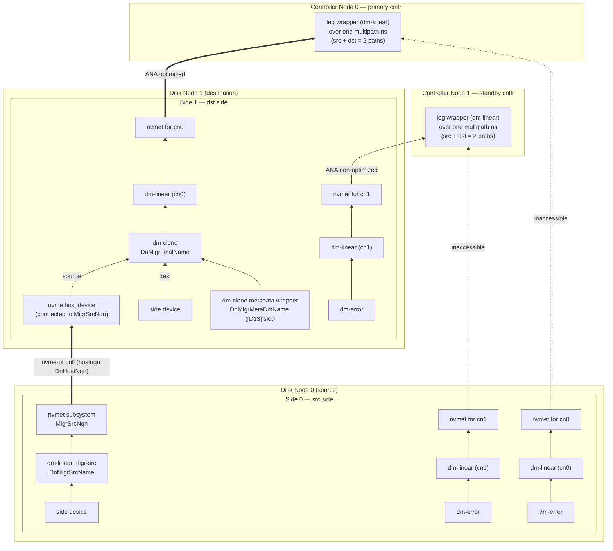

*Fig. `080Migration` — mid-migration: the leg temporarily owns two sides. Both export
the same `SideToCnNqn`, so each CN sees one multipath namespace with two paths; ANA
moved IO onto the destination path, whose dm-clone pulls from the source. The leg
wrappers are untouched by the switch.*

Starting a migration resembles a failover; the leg temporarily owns two sides.

**Phase 0 — the destination provisions first.** `CreateMigration` writes the dst `Side`
with `provisioned = false` (§8.11), so the dst DN runs only the §9.4 protocol: allocate
runs, build `DnSideName`, zero it batch by batch. No per-CN stacks, no metadata slot,
no `nvme connect`, no dm-clone; the `migr_dst_info.*` rows report
`RES_STATUS_PROVISIONING`.

For the **src** side, `migr_src_conf.dst_provisioned = false` is normative and means:
**behave exactly as if `migr_src_conf` were absent** — keep serving normally, no fence,
no suspension, no migr-src export — differing only in reporting the would-be
`migr_src_info.*` rows as `RES_STATUS_PROVISIONING`. Without this gate the src would
fence the primary's path at migration start and the leg would have **no serving path
for the whole zeroing window**.

When the sp-worker flips the dst side (§10.3), the next fan-out carries
`side_conf.provisioned = true` on the dst and `migr_src_conf.dst_provisioned = true` on
the src, and both roles run the sequences below unchanged; the dst's connect retry of
step 3 absorbs any cross-side ordering. The cost is added **migration-start latency** —
one whole-side zeroing pass (seconds under the fast-Write-Zeroes assumption of §9.4)
before any data moves. `CancelMigration` during the zeroing window cancels the zeroing
goroutine and waits for it before the dm devices are removed (§9.4).

**src side** (driven by its `SyncupSide` carrying `migr_src_conf` = `migr_id`,
`dst_side_id`, `dst_dn_id`, `dst_provisioned = true`):

1. Move every per-CN subsystem's namespace to `inaccessible` (all cntlrs).
2. Retire every per-CN dm-linear, in two phases ([D12]):
   a. **Suspend** it where it is, and hold it suspended for at least
      `SuspendSeconds` = 60 s. Its namespace is already `inaccessible` from step 1,
      so the only IO this absorbs is what the old primary still had in flight.
   b. At the end of the window, **reload** it onto its dm-error device. Because
      device-mapper releases a suspended device's deferred bios against whatever
      table is live at resume, and the reload installs dm-error *before* resuming,
      the absorbed IO is failed here rather than replayed onto the side's data —
      which is what would otherwise let the source silently diverge from the
      destination after hydration had already copied the region.
   The window is a floor, not a schedule: (b) runs on the first converge at or
   after the deadline, which a timer arranges so no RPC waits for it. It is also a
   hard bound — a device is never left suspended beyond it, including across an
   agent restart, because a suspended dm target queues IO forever and wedges any
   block-device scanner that touches it.
3. Build `DnMigrSrcName` (linear on the side device) and export it via `MigrSrcNqn`,
   `allowed_hosts = [DnHostNqn(cluster, migr_src_conf.dst_dn_id)]`.

**dst side** (its `SyncupSide` carries `migr_dst_conf`: `migr_id`, `src_side_id`,
`src_dn_id`, `src_nvme_tr_conf`, `block_size`, `meta_blocks`, `dm_clone_conf`,
`bm_cnt`):

1. Create the per-CN subsystems/namespaces with dm-error backing, all `inaccessible`.
2. Allocate the dm-clone metadata slot in the [D13] clone-metadata area (zeroing its
   first 8 KiB before its record is persisted) and build its wrapper dm-linear
   `DnMigrMetaDmName`.
3. `nvme connect` to `MigrSrcNqn(cluster, migr_dst_conf.src_dn_id, sp, migr_id)` at
   `migr_dst_conf.src_nvme_tr_conf` (hostnqn `DnHostNqn`, `fast_io_fail_tmo = 5`,
   `ctrl_loss_tmo = -1`), retrying until success.
4. Create the dm-clone `DnMigrFinalName`: metadata = step 2's wrapper, dest = the local
   side device `DnSideName`, source = the connected nvme device, region size = `migr_dst_conf.block_size`
   (= the SP's `block_size`), hydration knobs from `migr_dst_conf.dm_clone_conf`.
5. Reload the **primary** CN's dm-linear onto the dm-clone; set that subsystem
   `optimized`, all other CNs' `non-optimized`. Each CN already holds a connection to
   this side (same NQN as the src side, so it is a second path of the leg's existing
   multipath namespace, §3.3); the ANA change alone moves IO from the src path to the
   dst path — no `nvme connect` and no dm reload happens on the CN side.

IO now flows host → primary cntlr → dst side (dm-clone pulls missing regions from the
src on demand and hydrates in the background). The dm-clone metadata lives on disk (the
[D13] clone-metadata area of the disk), so a DN reboot resumes hydration where it left off — no
special recovery is needed, unlike clones (§11.5). The optional bitmap fast-path:
`GetLegBitmap` (paged) → `AppendMigrationBitmap` → worker `PushMigrBitmap` (§9.6) →
dst agent persists each chunk at `LocalMigrBmPath` and `blkdiscard`s never-written
regions so they are never copied (§8.11, §8.13, §11.4).
`FinishMigration` / `CancelMigration` per §8.11.

### 11.3 Transfer + clone = cross-SP live migration (figs `090Clone` §8.9, `100Transfer` §8.10)

A clone's source can be *any* NVMe-oF namespace; when the source is a dnv transfer the
pair performs live migration of a volume between SPs (even across clusters). Setup for
moving ss/ns from `sp1` to `sp2`:

* `sp2` gets an identical subsystem (same NQN) and namespace (same `ns_idx`, and the
  same `nguid`/`uuid` — pass them to `CreateNamespace`, §8.8) on a **fresh, empty**
  thin device [D3], so hosts aggregate `sp1`'s and `sp2`'s exports into one multipath
  device.
* `sp1` and `sp2` cntlrs MUST use disjoint `cntlid_slot`s (≤ 4 cntlrs each, 8 slots —
  exactly enough). If not, rotate a cntlr: `UpdateCntlrEnabled(false)` → `DeleteCntlr`
  → `CreateCntlr` with a free slot. Likewise the two SPs' cntlrs MUST NOT share CNs;
  rotate the same way if they do.
* Ensure `Namespace.suspended = false` on sp1 and `= true` on sp2 (create the sp2
  namespace with `CreateNamespace(suspended = true)`, or `UpdateNamespaceSuspended` on
  an existing one).
* Collect the sp2 cntlrs' CN ids ⇒ `CnHostNqn` list.
* `CreateTransfer` on sp1 (`ori_nqn`/`ori_ns_idx`, `allowed_hosts` = that list,
  `auto_suspend = true`) — the sp1 primary then: (1) origin ns → `inaccessible`,
  (2) suspend its `CnNsDevName`, (3) create `CnXferFinalName` on the raid0, (4) export
  it via `XferNqn` per the Transfer.
* `CreateClone` on sp2 (`src_tr_conf_list` = sp1 cntlr endpoints, `src_nqn` =
  the transfer's `XferNqn`, `src_ns_idx = ori_ns_idx`, the source geometry
  `src_slice_cnt`/`src_stripe_size`/`src_block_size` = sp1's slice count / raid0 stripe
  / pool block size, `dst_td_name`, `auto_resume = true`) — the sp2 primary then:
  (1) connect to the targets, (2) allocate arena units and create the metadata wrapper
  `CnCloneMetaDmName` ([D14]), (3) create
  `CnCloneFinalName`, (4) reload the ns's `CnNsDevName` onto it and resume, (5) origin
  namespace → `optimized`. Hosts flip to sp2 transparently.
* Optional bitmap fast-path: per sp1 slice `GetThinDeviceBitmap` (paged) →
  `AppendCloneBitmap(slice_idx, …)` on sp2 → worker `PushCloneBitmap` (§9.6) → sp2
  primary persists each chunk at `LocalCloneBmPath` and `blkdiscard`s (§11.4). Safe
  while IO runs (§11.5).
* When hydration completes: `DeleteTransfer(force=false)` on sp1 (retires the source:
  `suspended = true`) and `DeleteClone` on sp2 (`suspended = false`, ns now backed by
  the local raid0). To abort instead: **first retire the sp2 namespace**
  (`DeleteNamespace` — not merely suspend it, because `DeleteClone` unconditionally
  sets `suspended = false` on the dst td's namespaces, §8.9, which would resume it
  `optimized` over the partial copy and hand the host a second, divergent path);
  then `DeleteClone(force=true)` on sp2 and `DeleteTransfer(force=true)` on sp1
  (sp1 resumes serving; the sp2 td and its partial bytes remain until deleted).
  **Aborting after the cutover discards every write served through sp2**: with
  `auto_resume` the sp2 namespace became the serving path at `CreateClone`, its
  writes live only on the abandoned sp2 td, and sp1 resumes from its retained
  copy, which stopped receiving writes at `CreateTransfer(auto_suspend)` — so an
  abort is lossless only while nothing has written via sp2
  (`risks_and_gaps.md` RK3).

### 11.4 raid0 bitmap math

Definitions for one raid0 device: `slice_cnt` underlying devices, `stripe_size` chunk
size, and per-underlying-device write bitmaps whose bit granularity is `block_size`.
Constraints (validated in §8.9): `1 ≤ slice_cnt ≤ 16`; `stripe_size = i × 4 KiB,
1 ≤ i ≤ 256`; `block_size = j × 64 KiB, 1 ≤ j ≤ 16384`; `block_size = k × stripe_size,
k ≥ 1`. Address mapping for logical byte offset `off`: chunk `c = off / stripe_size`,
slice `= c mod slice_cnt`, slice-local offset `= (c div slice_cnt) × stripe_size +
(off mod stripe_size)`.

Worked example (`slice_cnt = 4`, `stripe_size = 16 KiB`, `block_size = 1 MiB`; here the
16 KiB chunks are drawn as 4 × 4 KiB rows for compactness): writing the 1st, 3rd, 7th
and 8th 4 KiB units of the logical device sets, in *written = 1* convention, bit 0 of
slice 0's bitmap, bits 0-1 of slice 2's, bit 1 of slice 3's, and nothing in slice 1's.

**Skip-bitmap function.** Given source geometry `A` (`slice_cnt_A`, `stripe_size_A`,
`block_size_A`, per-slice bitmaps, *written = 1*) and destination geometry `B`
(idem, bitmaps *copied = 1*, all-zero on first run), with the extra constraint that the
larger of the two stripe sizes is an integer multiple (`m > 1`) of the smaller, define
`region_size = min(stripe_size_A, stripe_size_B)` — so any region is contiguous inside
one chunk on **both** sides — and `region_cnt = min(size_A, size_B) / region_size`.
Output: a bitmap of `region_cnt` bits where bit `r` = 1 ⇔ region `r` need **not** be
copied ⇔ `NOT writtenA(r) OR copiedB(r)`, where `writtenA(r)` ORs and `copiedB(r)` ANDs
the covered source/destination bitmap bits after mapping region `r`'s byte range through
each side's address mapping. Consumers:

* A **userspace copier** — restartable, reads/writes only the two top raid0 devices in
  `region_size` units, skipping 1-bits; B's bitmaps advance automatically as it writes
  (thin-pool mappings), so a crash simply re-runs the function. It may copy some zeroes
  (over-copy is fine); it must never skip written source data.
* The **agents** applying src `CloneBitmap`s / `MigrBitmap`s (§9.6): same math with no
  B term (dm-clone tracks its own hydration) and `region_size` = the dm-clone region
  (= destination `block_size`, which may exceed `stripe_size_A` — then a region spans
  several source slices and `writtenA` simply ORs across all of them); `blkdiscard`
  region `r` ⇔ `NOT writtenA(r)`. For migrations, first shift by `meta_blocks` (§8.11).
* Clone **crash recovery** (§11.5): B-side only — `blkdiscard` region `r` ⇔
  `copiedB(r)`.

Wire vs local conventions: every Gateway/etcd bitmap (`Get*Bitmap`, `Append*`,
`CloneBitmap`, `MigrBitmap`) is **1 = unwritten/skippable**; thin-pool metadata and the
formulas above use **written/copied = 1**. Invert exactly once at the boundary. Bit
addressing is **LSB-first within each byte** in *both* conventions: bit *i* is
`bitmap[i/8] & (1 << (i%8))`, and the trailing pad bits of the last byte are `0` (§8.13).
Only the *meaning* of a set bit is inverted at the boundary, never the bit order.

### 11.5 Clone crash recovery (destination-bitmap rebuild)

Clone progress durability does **not** rely on the src bitmaps in etcd; it relies on
the **destination thin-pool bitmaps**. The dst td starts empty [D3], and dm-clone
hydrates in region = `block_size` units, so after any crash "block mapped in a dst
thin pool" ⇔ "block already copied". The volatile clone metadata — arena units under
the wrapper `CnCloneMetaDmName` (tmpfs + loop, §3.2 step 2) — is
therefore rebuildable. Whenever the primary (re)builds a clone whose dm-clone metadata
is missing or unusable — CN reboot, failover to a cntlr that never ran it, tmpfs loss,
or a metadata-wrapper probe mismatch (wrong length, or a table backed by a stale loop
path after a tmpfs remount, [D14]) — it MUST:

1. Suspend the dm-linear `CnNsDevName` of every namespace backed by the td (or make
   sure none is created / pointing anywhere live yet).
2. Read the **dst bitmaps**: the mapping bitmap of the dst td from every thin pool of
   the SP (per slice, *mapped = 1 = copied*).
3. Create the dm-clone with **hydration disabled** and a freshly allocated, freshly
   hole-punched metadata wrapper ([D14]).
4. `blkdiscard` every dm-clone region whose bits are 1 in the dst bitmaps (§11.4,
   B-side only) — marking those regions "already hydrated".
5. Resume those `CnNsDevName`s; enable background hydration.

The dst bitmaps MUST be fully applied **before** the dm-clone handles any IO —
otherwise a read of an already-copied (and possibly since-rewritten) region would be
fetched from the source again, returning stale data over the newer local bytes. The
**src** bitmaps (§8.9) carry no such hazard — they only mark regions the source never
wrote — so they may keep arriving via `PushCloneBitmap` after IO has started; any src
chunks already persisted at `LocalCloneBmPath` are simply re-applied by the agent once
the dm-clone is rebuilt (§9.6), with no worker involvement.

### 11.6 Namespace suspend semantics

`suspended = true` ⇔ every cntlr keeps the namespace's `CnNsDevName` dm-suspended and
the ns in the `inaccessible` ANA group; `false` ⇔ normal §3.3/§3.4 behavior. Set by users
(`CreateNamespace.suspended`, `UpdateNamespaceSuspended`) and by the transfer/clone
finalization (§8.9/§8.10).

### 11.7 SpLevel (see §8.4 UpdateStoragePoolLevel)

Levels gate agent behavior top-down for disaster recovery: each step removes one more
fragile layer until `SP_LEVEL_DISABLE` leaves only the bottom storage layer — on a
DN, each side's data device `DnSideName` and its [D13] extent record. Side zeroing
(§9.4) is part of that bottom layer and keeps running at `SP_LEVEL_DISABLE`. Agents treat the level as
part of desired state (it rides in every `SyncupSide`/`SyncupCntlr`): raising it tears
layers down, lowering it rebuilds them.

`SP_LEVEL_READONLY` means exactly one thing: **every user-facing namespace of §8.8 —
the ones backed by `CnNsDevName` — serves reads and fails writes with an IO error.**
Nothing else. It is enforced **on the CN only**, by reloading each such namespace's
`CnNsDevName` onto a dm-flakey `error_writes` table over its normal backing
(Appendix A); never by a block-device read-only flag, and never on the DN ([D11]).
Two measured facts rule out a bdev flag at any layer: nvmet opens a namespace's
backing device `BLK_OPEN_READ | BLK_OPEN_WRITE`, so the top device of an export can
never be read-only; and a read-only flag *below* the top does not stop writes that
device-mapper remaps onto it, since `bio_check_ro()` runs at top-level bio submission
only. The DN additionally cannot fail writes at all — md superblock and bitmap writes,
resync, failover assembly and the §3.6 health-check block writes must keep flowing at
these levels — so the DN's behavior below `SP_LEVEL_NO_MIGRATION` is identical to
`SP_LEVEL_READWRITE`. Clone and migration hydration is likewise **not** paused:
hydration is infrastructure IO, not user IO. The accepted gap: a CN that has not yet
converged to the new revision keeps serving writes until it syncs — there is no
DN-side enforcement point that could close it.

### 11.8 cntlid slots

NVMe multipath requires distinct CNTLIDs among the controllers a host aggregates. dnv
partitions the cntlid space via
`/sys/kernel/config/nvmet/subsystems/{nqn}/attr_cntlid_{min,max}` into
`CnCntlidSlotCnt = DnCntlidSlotCnt = 8` slots, `Base = 10000`, `Step = 5000`, on both
CNs and DNs: slot *s* ⇒ `attr_cntlid_min = 10000 + s×5000`,
`attr_cntlid_max = attr_cntlid_min + 5000` (slot 0 = 10000-15000, … slot 7 =
45000-50000). All slots come from `SpConf.cntlid_slot_list`. Rules:

* Every **cntlr** of an SP uses a slot distinct from every other cntlr of the same SP
  (host-facing multipath aggregates them).
* A **side** uses one slot for all its per-CN exports. Sides of **different legs** MAY
  share slots freely — their subsystem NQNs differ, so no CN-side aggregation occurs.
  The sides of **one** leg are aggregated by the CN (they share an NQN, §4.4), so when
  a leg is being migrated the src side and the dst side MUST use different slots —
  otherwise the two controllers the CN merges could pick the same CNTLID and the
  kernel would refuse the second path.
* Two SPs joined by transfer+clone MUST use disjoint slot sets across their cntlrs
  (§11.3) — their host-facing subsystems share NQNs.

---

## 12. dnv-cdc

`dnv-cdc --etcd-endpoints … --range 0,1,… --tr-type tcp --adr-fam ipv4 --tr-addr …
--tr-svc-id 8009` serves the NVMe-oF Central Discovery Controller (well-known NQN
`nqn.2014-08.org.nvmexpress.discovery`) to hosts over the NVMe/TCP endpoint those
`--tr-*` flags name (`cdc.md` §6; `--tr-type` accepts only `tcp`). `--range h`
claims every shard code whose first hex digit is `h` (range `0` = shards `00…0f`,
range `1` = `10…1f`, …), i.e. it watches the `{p} cdc ` prefix and filters on the
`{shard_code}` key field; `--range` defaults to all sixteen ranges, so a
single-instance deployment needs no sharding flags. For each `CdcEntry` it
advertises discovery log entries (`nqn` × every `NvmeTrConf` in
`nvme_tr_conf_list`) to hosts whose hostnqn is in `allowed_hosts` (empty ⇒
everyone), and emits a discovery-log-change AEN to exactly those hosts whose
rendered, filtered log page content actually changes — a change invisible to a host
both before and after produces neither an AEN nor a generation-counter (GENCTR)
bump for it, and that counter is per (instance, hostnqn), lasting only while the
host holds a live connection (`cdc.md` §0 #5/#6). Hosts running `nvme-stas` then
connect/disconnect automatically (this is what makes `DeleteSubsystem`,
`CreateCntlr`, `UpdateCntlrEnabled` transparent to hosts). Deploy ≥ 2 instances with
complementary ranges; hosts are configured with all cdc endpoints.

---

## 13. Components: invocation reference

```shell
dnv-gateway --grpc-network tcp --grpc-address 192.168.0.20:29527 \
  --etcd-endpoints 192.168.0.10:2379,192.168.0.11:2379,192.168.0.12:2379

dnv-worker --etcd-endpoints 192.168.0.10:2379,192.168.0.11:2379,192.168.0.12:2379 \
  --roles dn,cn,sp --vote-interval 10 --vote-grace-time 60 --etcd-dial-timeout 5

dnv-agent dn --grpc-network tcp --grpc-address 192.168.0.20:29528 \
  --tr-type tcp --adr-fam ipv4 --tr-addr 192.168.0.20 --tr-svc-id 4200 \
  --local-store /var/tmp \
  --disk /dev/disk/by-uuid/4425c6a8-dc27-40a3-9fd5-0cc41f534360

dnv-agent cn --grpc-network tcp --grpc-address 192.168.0.20:29529 \
  --tr-type tcp --adr-fam ipv4 --tr-addr 192.168.0.20 --tr-svc-id 4200 \
  --local-store /var/tmp --capacity 8796093022208

dnv-cdc --etcd-endpoints ... --range 0,1,2,3,4,5,6,7 \
  --tr-type tcp --adr-fam ipv4 --tr-addr 192.168.0.10 --tr-svc-id 8009

dnv-cdc --etcd-endpoints ... --range 8,9,a,b,c,d,e,f \
  --tr-type tcp --adr-fam ipv4 --tr-addr 192.168.0.11 --tr-svc-id 8009
```

Every flag is also settable via config file and environment (viper). The worker's
flags are specified in `dnv-worker.md` §5 (`--roles` defaults to all three; the vote
timers default to `DefaultVoteWorkerInterval`/`DefaultVoteWorkerGraceTime`). The agent's
`--tr-*` flags define the node's single nvmet port (`NvmeTrConf`), mirrored into
`DnConf`/`CnConf` at creation; `--local-store` sets the `localStorPrefix` under which
the §4.6 state files live. `--capacity` is cn-only (a DN's size is read off its
`--disk`): it is the byte budget `GetCnSize` replies verbatim, i.e. the per-node input
to the §6.1 CN extent count, whose divisor `extent_size` is the cluster-wide
`dn_bin_conf.extent_size` instead. Its default **0** means "no opinion", which
makes the control plane substitute `DefaultCnCap` (4 TiB). `dnvctl` subcommand sketch:
`dnvctl dn|cn|sp|vol create|…`, plus the §11.4 copier.

---

## Appendix A — command-pattern crib sheet

Agents converge with stock tooling; the exact invocations below are normative patterns
(placeholders in `{}`). Probing uses `mdadm --detail`, `dmsetup status/table/ls`,
`losetup --associated`, sysfs walks under `/sys/class/nvme*`, and configfs reads for
nvmet.

**[D13] DN disk metadata:** there are no shell commands here. The dn agent reads and
writes the header block, the two volume-table slots and the dm-clone metadata slots
directly on the `--disk` device through `OsClient.ReadBlock`/`WriteBlock` (buffered
pread/pwrite + `fdatasync`; see `osclient.md` §4.5). Never `dd` — the lab's uutils dd
0.8.0 silently mishandles `iflag=`/`oflag=direct`. The only shell command in the side
provisioning path is the §9.4 zeroing (the old whole-device `blkdiscard --force` trim
is superseded — `--zeroout` zeroes, discard did not):

```shell
blkdiscard --zeroout --offset {done_ext × extent_size} \
  --length {min(DnZeroBatchExtCnt, remaining) × extent_size} {DmPath(DnSideName)}
# one batch per command, in order, through the dm-linear; each successful batch's
# zeroed_bits are persisted before the next one starts (§9.4, [D15]).
# Fail-fast precondition: the disk's queue/write_zeroes_max_bytes must not read 0.
```

**CN clone-metadata arena (tmpfs + one loop device; no LVM, [D14]):**

```shell
mount -t tmpfs -o size={DefaultCnTmpfsSize} tmpfs {CnTmpfsPath}
truncate --size {CnCloneMetaAreaSize} {CnTmpFilePath}
losetup --find --show {CnTmpFilePath}            # first converge → {loopdev}
losetup --associated {CnTmpFilePath}             # every later converge: re-learn {loopdev}
# per clone, on allocate — recycled-unit guard, hole-punch only, NEVER --zeroout:
blkdiscard --offset {unit_start × CnCloneMetaUnit} \
           --length {unit_count × CnCloneMetaUnit} {loopdev}
dmsetup create {CnCloneMetaDmName} --table \
  "0 {unit_count × CnCloneMetaUnit / 512} linear {loopdev_majmin} {unit_start × CnCloneMetaUnit / 512}"
# {loopdev} is the path losetup reports (/dev/loopN); {loopdev_majmin} is its major:minor,
# which is what a dm table names and what `dmsetup table` reads back.
# registry read-back (the dm tables ARE the allocation table):
dmsetup ls | grep '^dnv-{cluster}-{cn}-b-' ; dmsetup table {CnCloneMetaDmName}
```

**md-raid1** (`{data_offset_k} = meta_blocks × block_size / 1024`, §3.6; every member
is failfast). So that only the agent assembles dnv arrays, mask udev incremental
assembly with an `/etc/udev/rules.d/63-dnv-md.rules` that imports the md envs itself
— `MD_NAME` does not exist before the stock `64-md-raid-assembly.rules` runs its own
import, so a bare `ENV{MD_NAME}` match in an earlier file never fires:

```text
ACTION=="add|change", SUBSYSTEM=="block", ENV{ID_FS_TYPE}=="linux_raid_member", \
  IMPORT{program}="/sbin/mdadm --examine --export $devnode"
ENV{MD_NAME}=="dnv-*|*:dnv-*", ENV{SYSTEMD_READY}="0"
```

`CnMdArrayName`'s fixed `dnv-` prefix (§4.3) is what the rule matches; the `*:dnv-*`
alternative covers the `homehost:name` form `mdadm --examine --export` reports when a
homehost is stored (`--homehost any` below keeps the stored name bare). The mask works
because the stock `64-md-raid-assembly.rules` skips devices carrying
`ENV{SYSTEMD_READY}=="0"` — verify that skip exists in the deployed mdadm's rules. On
dedicated CN hosts two blunter alternatives need no name matching at all: `mdadm.conf`
`AUTO -all` (arrays with explicit `ARRAY` lines — e.g. the OS array — still assemble;
unlisted dnv arrays never do), or shadowing the stock rule entirely via
`ln -s /dev/null /etc/udev/rules.d/64-md-raid-assembly.rules`. The commands:

```shell
mdadm --create /dev/md/{CnMdDevName} --name {CnMdArrayName} --level 1 \
  --raid-devices {n} --bitmap internal --bitmap-chunk {bitmap_chunk_k}K \
  --data-offset {data_offset_k}K --failfast --homehost any --run {leg_devs...} \
  [--assume-clean]                       # only when §11.1.1 case 1.1 allows it
mdadm --assemble /dev/md/{CnMdDevName} --name {CnMdArrayName} {leg_devs...}
mdadm /dev/md/{CnMdDevName} --add --failfast {leg_dev}
mdadm /dev/md/{CnMdDevName} --fail {leg_dev} ; mdadm /dev/md/{CnMdDevName} --remove {leg_dev}
mdadm --stop /dev/md/{CnMdDevName}
# `mdadm --zero-superblock` is deliberately NEVER run (cnagent.md CN12): a leg
# only ever leaves an array into the spare list — where its stale superblock
# makes a later re-add cheap — or out of existence together with its side.
```

**device-mapper** (`dmsetup create {name} --table "…"`; sizes in 512 B sectors):

```text
error :          0 {sectors} error
linear:          0 {sectors} linear {dev} {offset_sectors}
flakey (readonly ns): 0 {sectors} flakey {dev} 0 0 1 1 error_writes
  # permanently down (up=0, down=1); reads pass, writes error ([D11])
  # RedundNone group device: {dev} = leg, {offset} = meta_blocks × block_size / 512
striped (raid0): 0 {sectors} striped {slice_cnt} {stripe_sectors} {dev0} 0 {dev1} 0 …
thin-pool:       0 {sectors} thin-pool {meta_dev} {data_dev} {block_sectors} {low_water_mark}
  messages: create_thin {dev_id} | create_snap {dev_id} {ori_id} | delete {dev_id}
thin:            0 {sectors} thin {pool_dev} {dev_id}
clone:           0 {sectors} clone {meta_dev} {dest_dev} {src_dev} {region_sectors} \
                   2 no_hydration no_discard_passdown \
                   4 hydration_threshold {t} hydration_batch_size {b}
                   # then: dmsetup message {dev} 0 enable_hydration
  knobs: dmsetup message {dev} 0 hydration_threshold {n} / hydration_batch_size {n}
  status: dmsetup status {dev}   # "clone" line → hydrated/total regions (§9.5 details)
  # Both features are mandatory on every dnv dm-clone — cn clone and dn migration alike
  # — because `blkdiscard` must stay metadata-only ([D7], §9.6, §11.4, §11.5).
suspend/resume/reload: dmsetup suspend|resume {name} ; dmsetup reload {name} --table "…"
multi-target table (--table is single-line only, so it travels on stdin):
  printf '0 {len0} linear {dev} {off0}\n0 {len1} linear {dev} {off1}\n' | dmsetup create {name}
  # same for `dmsetup reload {name}`; used for the side device DnSideName ([D13])
discard hydrated-marking: blkdiscard --offset {r×region} --length {region} {clone_dev}
  # metadata-only: no_discard_passdown keeps this off the destination device ([D7])
```

**nvmet (configfs, both node kinds — one port per node):**

```shell
# port (once, from the --tr-* flags), with the three fixed ANA groups [D4]:
mkdir /sys/kernel/config/nvmet/ports/1
echo {tr_addr}  > .../ports/1/addr_traddr ; echo {tr_svc_id} > .../ports/1/addr_trsvcid
echo {tr_type}  > .../ports/1/addr_trtype ; echo {adr_fam}   > .../ports/1/addr_adrfam
mkdir .../ports/1/ana_groups/2 ; mkdir .../ports/1/ana_groups/3
echo optimized     > .../ports/1/ana_groups/1/ana_state    # AnaGrpIdOptimized (default group)
echo non-optimized > .../ports/1/ana_groups/2/ana_state    # AnaGrpIdNonOptimized
echo inaccessible  > .../ports/1/ana_groups/3/ana_state    # AnaGrpIdInaccessible
# subsystem:
mkdir .../subsystems/{nqn}
echo {cntlid_min} > .../subsystems/{nqn}/attr_cntlid_min      # §11.8
echo {cntlid_max} > .../subsystems/{nqn}/attr_cntlid_max
echo {serial} > .../attr_serial ; echo {model} > .../attr_model    # CN host-facing + DN side
echo 0 > .../attr_allow_any_host ; ln -s .../hosts/{hostnqn} .../subsystems/{nqn}/allowed_hosts/
mkdir .../subsystems/{nqn}/namespaces/{nsid}
echo {device_path} > .../namespaces/{nsid}/device_path
echo {uuid} > .../device_uuid ; echo {nguid} > .../device_nguid    # CN host-facing + DN side
echo {ana_grpid} > .../namespaces/{nsid}/ana_grpid                 # fixed group id [D4]
echo 1 > .../namespaces/{nsid}/enable
ln -s .../subsystems/{nqn} .../ports/1/subsystems/{nqn}
# every later ANA transition rewrites the ns ana_grpid; a group's ana_state is
# never touched again after port setup:
echo {ana_grpid} > .../namespaces/{nsid}/ana_grpid
```

**nvme host (all dnv-internal connections):**

```shell
nvme connect --transport {tr_type} --traddr {tr_addr} --trsvcid {tr_svc_id} \
  --nqn {subsys_nqn} --hostnqn {CnHostNqn|DnHostNqn} \
  --hostid {NvmeHostId(hostnqn)} \
  --fast_io_fail_tmo {DefaultNvmeFastIoFailTmo} --ctrl-loss-tmo -1
nvme disconnect --nqn {subsys_nqn}
```

Two spellings here are load-bearing and must not be "tidied":

- `--fast_io_fail_tmo` carries **underscores**. nvme-cli defines that one
  option as `OPT_INT("fast_io_fail_tmo", 'F', …)` and its argconfig
  `getopt_long` table takes the name verbatim, so `--fast-io-fail-tmo` is
  rejected with `unrecognized option`. Every neighbouring option
  (`--ctrl-loss-tmo`, `--reconnect-delay`, `--keep-alive-tmo`) really is
  dashed.
- `--hostid` is always passed, derived from the hostnqn as 16 bytes of
  `sha256("dnv-hostid:{hostnqn}")` rendered RFC-4122-shaped
  (`common.NvmeHostId`, the `DnNsIdentity` idiom). The kernel keeps a strict
  1:1 hostnqn↔hostid mapping (`nvmf_host_add` rejects a second hostnqn under
  a known hostid with `EINVAL`, "found same hostid … but different
  hostnqn"), and nvme-cli fills an omitted `--hostid` from the node-wide
  `/etc/nvme/hostid`. dnv picks a hostnqn per identity, so an implicit
  hostid makes every connect hostage to whatever claimed that file first: an
  unrelated NVMe-oF mount under `/etc/nvme/hostnqn` is enough to fail dnv's
  first connect, and two dnv identities on one node collide with each other.

**Reading host state** — one subsystem's namespace device, controller
liveness and per-path ANA state are read from **sysfs**, never from
`nvme list-subsys -o json`:

```shell
/sys/class/nvme-subsystem/{subsys}/subsysnqn     # keys the lookup
/sys/class/nvme-subsystem/{subsys}/{nvmeXnY}     # the multipath ns device
/sys/class/nvme/{nvmeX}/{address,state,transport}
/sys/class/nvme/{nvmeX}/{nvmeXcYnZ}/ana_state    # the only place ANA lives
```

`nvme list-subsys -o json` lists **no namespaces at all** (nvme-cli 2.16,
with or without `--verbose`) — a subsystem entry is just Name, NQN and
Paths — and no `ANAState` unless given a namespace block device, which for
an all-inaccessible namespace answers with an empty list indistinguishable
from "not connected".

**Id calculators (Go):**

```go
func getClusterId(name string, creationEpoch uint64) uint64 {
    h := fnv.New64a()
    h.Write([]byte(name))
    var b [8]byte
    binary.BigEndian.PutUint64(b[:], creationEpoch) // 8 big-endian bytes, no separator
    h.Write(b[:])
    return h.Sum64()
}
func getShortId(clusterId, nodeId uint64) uint32 {
    h := fnv.New64a()
    fmt.Fprintf(h, "%016x%016x", clusterId, nodeId)
    return uint32(h.Sum64())
}
```

## Appendix B — recorded design decisions

* **[D1] Leg identity and the leg wrapper.** A side subsystem's NQN names the *leg*,
  not the side, and omits the `dn_id` (§4.4), so both sides of a migrating leg export
  the same NQN with the same namespace identity (§3.1) from two different DNs. Kernel
  nvme multipath therefore merges them: the CN holds **one** namespace device per leg
  with one path per side, and a migration is an ANA flip between paths — md never sees
  a device change, and the switch costs no reconnect and no dm reload. The cost is the
  §11.8 rule that the two sides of a migrating leg must use disjoint cntlid slots. A
  cn-local dm-linear still wraps that namespace device as the leg-level indirection
  point (spare-leg swap, teardown onto an error target); it is no longer the mechanism
  that survives a side swap.
* **[D2] Subsystem identity.** `serial = %016x(ss_id)`, `model = "dnv"` — stable across
  cntlrs so hosts see one device.
* **[D3] Empty destination td.** Clone correctness (precondition in §8.9) and crash
  recovery (§11.5) both assume the dst td was never written before the clone; "mapped
  ⇒ copied" holds only then. The CP cannot verify it cheaply; it is a documented
  contract, satisfied trivially by creating the td right before `CreateClone`.
* **[D4] Three fixed ANA groups per node.** Every node's single port carries exactly
  three ANA groups, created at port setup with fixed ids and states that are never
  rewritten afterwards: `AnaGrpIdOptimized = 1` (`optimized`; nvmet's always-present
  default group), `AnaGrpIdNonOptimized = 2` (`non-optimized`),
  `AnaGrpIdInaccessible = 3` (`inaccessible`) — constants in `constants.go`. Every
  ANA transition moves the namespace by rewriting its `ana_grpid` — safe on a live
  namespace precisely because the target group always exists (a nonexistent grpid
  blackholes IO). The fixed set stays far from the kernel's 128-groups-per-port cap
  regardless of namespace count, and leaves nothing to allocate, persist (in etcd or
  locally), or recover after an agent restart. Group ids have no cross-node meaning.
* **[D5] Location copy in capacity values.** `DnConf`/`CnConf.location` is
  authoritative; the capacity key's value carries a copy so allocator scans stay
  read-only range scans. The STM that changes `location`-relevant state rewrites both.
* **[D6] Health-block payload.** The §3.6 probe writes magic + writer id + unix
  timestamp and reads it back with O_DIRECT; success within the nvme/cmd timeouts =
  healthy. Multiple cntlrs probing the same block concurrently is harmless — the
  content is never interpreted beyond "IO completed".
* **[D7] Push-bitmap durability.** Every received `Push*Bitmap` chunk is persisted as
  its own file under `LocalMigrBmPath`/`LocalCloneBmPath` and the applied sets reported
  in `bm_info`/`bm_info_list` are derived from the files, so agent restarts never force
  a re-push and a rebuilt dm-clone can re-apply src bitmaps locally (§9.6, §11.5).
  Both dm-clone features — `no_hydration` **and** `no_discard_passdown` — are mandatory
  on **every** dnv dm-clone (cn clone and dn migration alike, Appendix A) because
  `blkdiscard` must stay metadata-only: with passdown enabled dm-clone also remaps the
  discard to the destination device, and passdown is on by default whenever the
  destination's discard granularity is ≤ one region — which both a raid0-over-thin (cn)
  and a dm-linear over a raw disk (dn) satisfy. Without it the idempotent re-apply this
  decision assumes (and §9.1's "re-`blkdiscard`ing an already-hydrated region is a
  no-op") would destroy acknowledged writes: a chunk read from the CN thin metadata
  *before* a host write hydrated region *r* can arrive *after* it, and the resulting
  discard would reach the destination. The
  accepted gap: a clone chunk grown by `AppendCloneBitmap` after its last push is
  re-delivered only while the pushing worker keeps its in-memory revision memo — src
  bitmaps never affect correctness, so a missed tail only costs some avoidable copying.
* **[D8] Grown clone chunks.** `AppendCloneBitmap` may grow an already-acknowledged
  `bm_idx`; the worker re-pushes when it observes growth, and a worker change can
  leave the shorter version at the agent — accepted, because src bitmaps only ever
  cost extra copying, never correctness (§9.6, §11.5).
* **[D9] `creation_epoch` in `cluster_id`.** Hashing only the name made `cluster_id` a
  pure function of a user-chosen string: a cluster deleted and recreated under the same
  name reused the whole key space and every derived node-local name (`getShortId`, dm
  names, NQNs), so any leftover etcd key or leftover device from the old incarnation was
  silently adopted by the new one. Mixing in a gateway-stamped `creation_epoch`
  (`UnixNano`) makes each incarnation a distinct id, at the cost of one `ClusterConf`
  read before any other key can be formatted (§5.2, §5.8). The epoch lives in
  `ClusterConf` rather than in the key so that `cluster_name` stays the user-facing
  handle and `ListClusters` keeps working off a plain name prefix.
* **[D11] Read-only is a CN-only mechanism, never a bdev flag.**
  `SP_LEVEL_READONLY` means "every user-facing namespace serves reads and fails
  writes", and is implemented by reloading each `CnNsDevName` onto a dm-flakey
  `error_writes` table (§11.7, Appendix A). A block-device read-only flag cannot
  work anywhere in the stack: nvmet opens a namespace's backing device
  `BLK_OPEN_READ | BLK_OPEN_WRITE`, so an export's top device fails
  `echo 1 > namespaces/1/enable` with `EACCES` when it is read-only; and a read-only
  flag below the top is bypassed entirely by device-mapper remapping — both measured
  on the lab kernel (`dnagent_issue_00.md` issue 1). Nor can the DN fail writes as a
  substitute: md superblock/bitmap writes, resync, failover assembly and the §3.6
  health-check probe must keep flowing at every read-only level. Consequently the DN
  has **no** read-only behavior at all — every level below `SP_LEVEL_NO_MIGRATION`
  behaves there like `SP_LEVEL_READWRITE` — and hydration is never paused.
* **[D12] Fencing ends in a table reload onto an error target, and any suspension
  before it is bounded.** A path being decommissioned is retired by reloading it onto
  its dm-error: dm-error's `map` returns `DM_MAPIO_KILL`, so the bio completes
  immediately with `BLK_STS_IOERR`, which is the correct outcome for a path that is
  going away.

  The §11.2 migration cutover precedes that reload with a **bounded** suspension of
  `SuspendSeconds` = 60 s, so that IO the old primary still had in flight is absorbed
  rather than instantly failed. This is safe only because of the ordering: device-mapper
  releases a suspended device's deferred bios against whatever table is live at resume,
  and the reload installs dm-error *before* resuming, so the absorbed IO is **errored at
  the end of the window, never replayed** onto the side's data. Replaying it is the
  outcome that matters — on a migration source it could land after hydration had already
  copied that region, silently diverging src and dst.

  Everything else about a suspension remains hostile, which is why the bound is
  load-bearing rather than advisory. A suspended dm target queues bios forever with no
  timeout and no error path, so (a) any block-device scanner that touches it blocks in
  uninterruptible D state — `exit_aio` then makes that task unkillable and the node
  needs a reboot — and (b) `dmsetup remove` on it does not succeed
  (`dnagent_issue_00.md` issue 2). The agent therefore: never suspends anywhere except
  this one window; never lets a device outlive it, including across an agent restart
  (a linear found suspended with no recorded start is retired at once rather than
  starting a second window); and resumes a fenced linear before any teardown step runs
  over it. The §11.1 side failover has no window at all — it reloads onto dm-error
  directly, and its old 300 s grace sleep is deleted with the suspension it protected.
  The residual exposure is external tooling — udev, `blkid`, an operator's `lsblk` —
  reading a source's linears during those 60 s; no dnv agent scans block devices any
  more ([D13] removed the dn agent's LVM commands and [D14] the cn agent's).

  One residual is recorded but not mechanised: a **transfer** origin's ns-dev
  suspension (§8.10, §11.3) is **unbounded** — unlike this migration window it has no
  `SuspendSeconds` floor or ceiling — so external scanners that touch it still block in
  D state for as long as the transfer runs. The agents' own exposure to that ended with
  [D14] (no more LVM scans on the CN either; `cnagent.md` CN16). The operational blast
  radius deserves stating plainly (update_02.md U5): a transfer hydrating a large td
  runs for hours, and for that whole time any block-device walk on the CN — a udev
  worker, `blkid`, `lsblk`, a monitoring or backup agent — that opens the suspended
  ns-dev wedges unkillably until the transfer ends. Operators SHOULD keep scanners off
  dnv devices on CNs while transfers run (the spirit of the Appendix A udev guard). A
  bounded alternative was considered and left undecided: after a grace window, reload
  the origin ns-dev onto its dm-error the way this fence does — hosts already queue
  against the `inaccessible` ANA state, and the xfer path never maps the ns-dev. Note
  only; no mechanism change was decided.
* **[D13] The DN carries a self-describing dnv disk format; LVM is gone from the dn
  agent.** LVM left for three measured reasons. (a) Its label scan reads every block
  device on the node, so any dnv device in a bad state takes the whole node's LVM down
  with it — `dnagent_issue_00.md` issue 2 is one instance of that class, and [D12]
  removes only that instance. (b) The old layout needed `devices/scan_lvs = 1` in
  `/etc/lvm/lvm.conf` because the per-DN migration VG sat on a *logical volume*
  (`migr-pv`); depending on host LVM configuration for correctness is a deployment
  hazard. (c) LVM brings global locks, per-command process spawns and version-to-version
  behavior differences into a converge path that must stay bounded by the §7 timeouts.
  What replaced it: the §3.1 format — a CRC-protected header block, two alternating
  CRC-protected volume-table slots (so a torn write can only damage the older copy),
  a fixed clone-metadata slot area, and an extent area at `DnDataOffset`; all of it read
  and written Go-natively through `OsClient.ReadBlock`/`WriteBlock`. The side "LV"
  becomes one aggregate dm-linear `DnSideName` concatenating the side's extent runs, and
  the dm-clone metadata LV becomes a slot plus a wrapper dm-linear `DnMigrMetaDmName`.
  **The on-disk volume table, not the agent's local store, is authoritative for extent
  placement**: converge is lookup-or-allocate, so a node that loses `--local-store` but
  keeps its disk recovers exactly the layout it had — which is also why the agent's
  orphan sweep is driven by the DN's authoritative `side_pointer_list` and never by
  "this side has no local state" (`dnagent.md` DN6). A disk already formatted for a
  different cluster/dn/extent_size is refused, never overwritten (parity with `pvcreate`
  refusing a foreign PV), and that refusal is enforced at the metadata layer: an
  unconfirmed disk rejects every mutation, because a failed `SyncupDn` does not stop the
  `SyncupSide` calls that follow it (§9.1). Changing any layout constant later is a
  header-version bump, not a tweak.
* **[D14] LVM is gone from the CN too; the clone-metadata arena is a slot allocator.**
  The CN clone VG had reintroduced on the CN exactly the failure class [D13](a) evicted
  from the DN: a bare `vgs`/`lvs` label scan reads every block device on the node, and
  on a CN that includes suspended transfer-origin ns-devs (lab-measured to wedge LVM in
  unkillable D-state `exit_aio`; `ignore_suspended_devices` / `global_filter` do not
  help), error targets, md members and pathless multipath legs — and the cn agent ran
  those scans on every converge and every Check round. Replacement (§3.2 step 2, §4.5,
  Appendix A): one tmpfs-backed sparse 1 GiB file (`CnTmpFilePath`,
  `CnCloneMetaAreaSize`) on **one** loop device — re-learned every converge with
  `losetup --associated`, never persisted, because loop names are unpredictable and a
  per-clone loop sprawl is unwanted — carved into 256 `CnCloneMetaUnit` = 4 MiB units
  and handed out first-fit in **contiguous** runs to wrapper dm-linears
  `CnCloneMetaDmName` (CN dm kind `b`, `cnagent.md` §2.1; the wrapper exists because
  dm-clone reads its superblock from sector 0 and takes no offset, the same reason
  `DnMigrMetaDmName` does). **The kernel's dm tables are the allocation registry** —
  each wrapper's `0 {len} linear {loopdev_majmin} {offset_sectors}` records its own allocation,
  and the arena is volatile *together with* the dm state (a reboot clears both, an agent
  restart preserves both) — so there is no on-file allocation table and none of [D13]'s
  header/CRC/A-B machinery is needed. Every allocation hole-punches its range with plain
  `blkdiscard` first, because a freed unit still holds the previous clone's valid
  dm-clone superblock and hole-punch gives guaranteed zeros by *file* semantics (no
  device DLFEAT involved) while releasing the tmpfs pages; `--zeroout` is **forbidden**
  there because it would materialize up to the whole arena in RAM. Rationale = the
  [D13](a) label-scan class eliminated rather than mitigated, one less dependency
  (lvm2), and CN naming as deterministic as everything else. Arena exhaustion is the old
  `lvcreate`-ENOSPC equivalent (`RES_STATUS_ERROR` on the clone's resources); orphaned
  kind-`b` wrappers are removed by reconcile, which frees their units; a wrapper whose
  length or backing loop path no longer matches the currently probed loop device is
  `RES_STATUS_ERROR` and is repaired by the §11.5 clone rebuild.
* **[D15] Whole-side zeroing behind a `provisioned` gate; `RES_STATUS_PROVISIONING`.**
  dnv is multi-tenant, so a new side must never expose a previous tenant's bytes. The
  §9.4 trim protocol could not deliver that: `blkdiscard` does not imply zeros (the
  kernel dropped `discard_zeroes_data` in 4.12; NVMe DLFEAT read-zeroes is optional).
  Nor was it enough for correctness — a recycled meta-group extent can carry a valid
  thin-pool metadata superblock a fresh pool would adopt, and a stale md superblock puts
  §11.1.1 in the wrong assembly case with no `--zero-superblock` escape. Every side is
  therefore fully zeroed with `blkdiscard --zeroout` before its first export, with
  per-extent progress in `zeroed_bits` on the authoritative volume table ([D13]), gated
  by the CP-visible `Side.provisioned` flag that the sp-worker flips when the agent
  reports `zeroed_ext_cnt == total_ext_cnt > 0` (§9.4, §10.3). Resources deferred while
  a side underneath them zeroes report the new `RES_STATUS_PROVISIONING` — *healthy, not
  ready, no action needed* — which **never** sets `err_epoch`; `ERROR` keeps meaning
  *needs intervention*, which is why a missing record at `provisioned = true` (data loss
  on a lost or foreign disk) stays `ERROR` and feeds §10.4 rather than looking
  transitional. The zeroing runs as a background, lock-free, batched goroutine under the
  ordinary §7 timeouts, on the standing assumption that DN disks have fast Write Zeroes
  (checked fail-fast against the disk's `write_zeroes_max_bytes`); a synchronous
  whole-side zeroing inside one `SyncupSide` was rejected because a node-read holder plus
  one queued `SyncupDn` writer would freeze the whole DN agent. Two things this finally
  funds honestly: §11.1.1's `--assume-clean` and the fresh-thin-pool metadata assumption.
* **[D16] Failover fencing has no epoch; safety = per-side atomic flip + md
  arbitration.** A failover's only cross-node coordination is the revisioned,
  unordered fan-out of §10.3. Correctness rests on two things (§11.1.1): each
  DN converges its side's old-primary→dm-error and new-primary→side-device
  reloads in one pass, so one leg never has two writers; and mdadm's assembly
  rules arbitrate across legs — a stale leg whose superblock claims a clean
  full array will not start degraded alone, and event counts plus resync
  direction repair divergence once both legs return. md behavior is therefore
  a load-bearing dependency, pinned by the integration suite. The accepted
  cost is the alive-but-CP-partitioned old primary of §11.1: fenced at the
  DNs but still advertising `optimized`, it returns DNR internal errors that
  host multipath does not fail over from, so applications can see EIO until
  it re-syncs or is stopped. A v2 that wants to close both edges adds a
  fencing epoch checked on the data path (NVMe reservations, or a
  per-revision gate at the side exports) — not more ordering in the worker,
  which cannot reach a partitioned node anyway.
* **[D10] Id-keyed revision keys.** `DnRev`/`CnRev`/`SpRev` are keyed by
  `dn_id`/`cn_id`/`sp_id`, not by the `addr_port`/`sp_name` that keys the matching
  `DnConf`/`CnConf`/`SpConf`; the mutable handle moved into the value. The key is then
  immutable for the object's whole life, so relocating a node or renaming an SP —
  however that is eventually driven — stays a single `put` on the rev key rather than a
  `delete` + `put`, which a watching worker would otherwise have to interpret as one
  object leaving and another arriving — with a revision restarting at 1 and a spurious
  teardown in between. It also makes a watch event self-contained: the worker learns
  where to dial (`addr_port`) or which `SpConf` to read (`sp_name`) straight from the
  value it just received (§5.5, §10.2, §10.3). `SpName` (`sp_id_to_name`) survives the
  change because reaching `SpRev` from an `sp_id` alone would require knowing the SP's
  `shard_code`, which only `SpConf` — reached by name — carries.
* **[D17] Worker membership by heartbeat, grace windows and sha256 tickets; no lease.**
  §10.1 originally bound each worker registration to an etcd lease and derived ownership
  by HRW over `fnv64a`. `dnv-worker.md` replaces both: a worker refreshes
  `{p} worker {role} {seed}` every `DefaultVoteWorkerInterval`; observers judge liveness
  by their own monotonic clock since the last put they saw (2 × interval ⇒ dead); every
  observed transition must hold for `DefaultVoteWorkerGraceTime` before it changes the
  observer's effective membership; ownership is the largest `sha256(seed-role-shard)`
  among effective members. Why not the lease: a lease expiry is a single server-side
  event with no notion of "stable" — a worker flapping at the keep-alive boundary
  reshuffles ownership on every flap, and a newly started worker takes its shards
  instantly while the old owners still hold them. The explicit scheme makes appear,
  disappear and reappear first-class, testable transitions with one damping rule, keeps
  a dead worker's last heartbeat visible to operators, and depends on no lease keep-alive
  semantics. Why observer-local time rather than the stored epoch: comparing a writer's
  wall clock with a reader's makes correctness depend on NTP — a clock running ahead
  would let one worker claim every shard while the others keep theirs, undetected; the
  epoch in the value is therefore informational. The costs, all accepted: a rescan needs
  2 × interval before it can declare anyone dead; a fresh worker drives nothing for its
  first grace window; ownership changes overlap or gap by a few seconds across workers
  (safe because every `Syncup*` is idempotent under the agents' revision gate and every
  etcd reaction is STM-guarded); and dead keys are garbage-collected by their observers
  instead of expiring — which is also what lets a worker detect that the fleet has given
  up on it (it sees its own key deleted) and rejoin as a fresh identity.

## Appendix C — Amendments

Recorded for traceability; the edits are already applied. Companion documents record
their own edits to this file in their §5 sections. The `update_01.md`–`update_03.md`
ledgers themselves have been retired from `doc/` (fully applied); their U-item ids
stay citable — resolve them through the entries below and the companion documents'
own amendment sections.

* `update_01.md` U1 — Appendix A's dm-clone pattern spells out
  `2 no_hydration no_discard_passdown`, and [D7] records that both features are
  mandatory on **every** dnv dm-clone (cn clone and dn migration alike) because
  `blkdiscard` must stay metadata-only. §9.1's "re-`blkdiscard` is a no-op" sentence now
  names the feature it depends on.
* `update_01.md` U3 — LVM leaves the CN. §1, §2, §3 preamble, §3.1, §3.2 step 2, §3.6,
  §4 preamble, §4.1, §4.2, §4.5 (retitled; `CnCloneVgName`/`CnCloneMetaName`/
  `CnCloneMetaPath` deleted), §5.2, §8.9, §9.3, §11.3, §11.5, Appendix A and [D9]/[D12]
  now describe the loop-backed clone-metadata arena with kind-`b` wrapper linears and
  carry no LVM reference outside the historical rationale of [D13]/[D14]; new decision
  **[D14]**.
* `update_01.md` U4 — the §9.4 trim protocol is replaced by whole-side zeroing behind
  the `provisioned` gate; §3.1, §8.4, §8.5, §8.11, §8.12, §9.2, §9.5, §9.7, §10.2-§10.4,
  §11.1.1, §11.2, §11.7 and Appendix A follow; new status `RES_STATUS_PROVISIONING` and
  new decision **[D15]**. The §8/§10 items specify worker and gateway behavior that is
  not implemented yet — this document is their spec.
* `update_01.md` U5 — §4.1 points at `cnagent.md` §2.1 for CN dm kinds `9`/`a`/`b` (and
  §4.2's stale "name it like a dm kind if desired" line is corrected); §8.13 and §11.4
  pin the LSB-first wire bitmap bit order; [D12] records the unbounded transfer-origin
  suspension residual.
* `update_02.md` U1 — §8.7 gains the snapshot point-in-time rule (quiesce the
  origin td's raid0 around the per-slice `create_snap` sequence; `cnagent.md`
  CN14 is the agent-side spec).
* `update_02.md` U3 — §11.1/§11.1.1 document the failover safety argument and
  the alive-but-CP-partitioned old primary's host-visible error window; new
  decision **[D16]**.
* `update_02.md` U4 — §8.9/§8.11 record that clone/migration admission does
  not check the per-CN arena / per-DN clone-metadata slot budgets, and the
  per-DN ceiling (≤ 24 destination roles) is stated for the first time
  outside a code comment (`dnagent.md` DN13).
* `update_02.md` U5 — the [D12] transfer-origin residual now carries its
  operational blast radius and the considered-but-undecided bounded
  alternative.
* `update_02.md` U6/U7 — new Appendix D (v1 assumptions and known limits);
  the three `Cntlr` field references that carried a stale `cn_` prefix on
  `addr_port` now use the schema's field name (×3).
* `ThinDeviceCreated.md` U1-U5 — `ThinDevice` gains `created`; §8.7 gates snapshot
  creation and origin deletion on it; §10.3 gains the materialization flip; §2, §3.3
  and `cnagent.md` CN14 record that a created td is never messaged and that the
  snapshot pre-pass owns every snapshot message; §9.5 names the rows the flip reads;
  Appendix D updated. The §8/§10 items specify gateway and worker behaviour that is
  not implemented yet — this document is their spec.
* `dnv-worker.md` — §10.1 replaced by the heartbeat/grace/ticket membership (new
  decision **[D17]**); the §5.3 registry row becomes the `WorkerReg` message; §10.4's
  `side_unhealthy` migration is withdrawn and both `side_unhealthy` and `leg_unhealthy`
  now trigger the one leg-repair procedure (create spare → switch, old leg parked); §7
  requires `leg_unhealthy > side_unhealthy`; §8.12 attributes the spare switch to the
  sp-worker; §13 shows the worker's flags; Appendix D gains the worker's limits.
  `dnv-worker.md` is the normative spec of `worker/`, `model/`, `etcdutil/` and
  `cmd/dnv-worker`; the `WorkerReg` schema addition is applied with `make gen` at
  implementation time.

<!-- end of design_v001.md -->

### Integration-run fixes (first on-hardware run of the U1-U5 tree)

Found by running `integtest/dnagent_test.sh` and `integtest/cnagent_test.sh`
against two real VMs (kernel 7.0, nvme-cli 2.16, mdadm 4.5) — the first
execution of either suite since `update_01.md` was applied. All five were
real agent defects, not harness problems; every one is now covered by a unit
test that fails without the fix.

* **IR1 — `nvme connect --fast_io_fail_tmo`** (Appendix A, §4.2 leg connect). The
  option is spelled with underscores in nvme-cli; `--fast-io-fail-tmo` is rejected
  outright with `unrecognized option`, so no dnv-internal connection could ever be
  made. Appendix A now records the spelling and why it must not be "tidied".
* **IR2 — every dnv connect passes `--hostid`** (Appendix A, §4.2). New helper
  `common.NvmeHostId(hostnqn)` = 16 bytes of `sha256("dnv-hostid:{hostnqn}")`,
  RFC-4122-shaped, the `DnNsIdentity` idiom. The kernel keeps a 1:1
  hostnqn↔hostid mapping and nvme-cli fills an omitted `--hostid` from the
  node-wide `/etc/nvme/hostid`, so an implicit id fails `EINVAL` as soon as any
  other identity on the node — another dnv role, or an unrelated NVMe-oF mount
  under `/etc/nvme/hostnqn` — holds it.
* **IR3 — nvme host state is read from sysfs** (Appendix A, new "Reading host
  state" block). `nvme list-subsys -o json` lists no namespaces at all and no
  `ANAState`, so the §11.2 destination could never find its migration source's
  block device. Both roles now walk `/sys/class/nvme-subsystem` +
  `/sys/class/nvme`, which is what the cn role already did for legs.
* **IR5 — namespace identity is compared canonically** (§3.1, Appendix A). nvmet
  reads `device_uuid`/`device_nguid` back dash-separated and lower-cased whatever
  form was written, while `DnNsIdentity` yields the uuid dashed and the nguid
  bare. A byte-wise compare made every converge disable, rewrite and re-enable a
  healthy namespace, and every probe report it `RES_STATUS_ERROR`.

## Appendix D — v1 assumptions and known limits (update_02.md U6)

Recorded so that scale, recovery and security expectations are explicit
rather than discovered. None of these is a defect in the mechanisms above;
each is a boundary v1 accepts, with the intended direction noted where one
exists.

* **One primary per SP is the volume throughput ceiling.** Every td of an SP
  is served by its single primary cntlr; slices shard *within* that CN, never
  across CNs. The aggregate bandwidth of one volume is one CN's. Scale-out is
  by storage pool — spread SPs (and so their primaries) across CNs.
* **Revision granularity is the SP.** Any `SpRev` bump re-fans the complete
  desired state to every side and every cntlr of the SP (§9.1 full sync,
  §10.3). During initial provisioning each side's `provisioned` flip is
  itself a bump, so a large SP's bring-up costs O(sides × (sides + cntlrs))
  syncups; the §10.3 allowance to batch several flips into one STM is the
  intended mitigation. Steady state is one fan-out per user mutation.
* **The agent node lock has head-of-line blocking.** A pending node write
  (`SyncupDn`/`SyncupCn`) blocks every new node-read acquisition behind the
  slowest in-flight object converge. Converges are bounded per command (§7),
  but on a node where many commands run to their timeouts, one sick object
  can delay every other object's converge and Check round by up to a whole
  converge pass. Accepted: object locks keep steady-state concurrency, and
  the §9.4 zeroing loop's try-acquire rule keeps the one long-running
  background writer out of that queue.
* **No thin-metadata repair path is specified.** Pool metadata is redundant
  at the block layer (meta groups can be RedundMdRaid1), but there is no
  `thin_check`-on-activate or `thin_repair` flow for a pool whose dm-thin
  metadata is corrupt. Until an update specifies one, a pool-metadata
  `RES_STATUS_ERROR` is an operator-intervention event (activate read-only,
  `thin_repair` onto fresh space by hand).
* **The fabric is trusted.** gRPC is plaintext (grpc.md §4), etcd access is
  whatever the deployment configures, and data-plane access control is
  hostnqn allow-lists — a spoofable identifier. NVMe in-band authentication
  and TLS are out of scope for v1. The [D15] multi-tenant guarantee is about
  *stored bytes* (no tenant ever reads another's stale blocks); it does not
  defend against an attacker on the storage network. Deploy on an isolated,
  trusted fabric.
* **QoS is deferred** — the §3.2 step 4 open issue, restated here for
  completeness: agents accept and persist `qos_ratio` and enforce nothing
  (`cnagent.md` CN6).
* **Snapshot creation is not atomic across a primary crash.** With
  update_02.md U1 a snapshot is point-in-time against live IO, but a crash
  between two slices' `create_snap` messages still leaves a torn snapshot
  (§8.7); delete and re-create it. `ThinDevice.created` certifies
  materialization, not point-in-time consistency: a torn snapshot still flips
  to `created` once every slice's volume exists.
* **A created td is never re-created by message.** A td the sp-worker has
  flipped to `created` is attached with a bare `dmsetup create`; if a pool no
  longer holds its id the row reads `RES_STATUS_ERROR` on every converge and
  no message ever re-creates it (`ThinDeviceCreated.md` U4-S2). This
  supersedes the older behaviour, which would silently hand the live `dev_id`
  a fresh, empty volume, and it belongs next to the "no thin-metadata repair
  path" limit above: pool-metadata loss is an operator-intervention event.
* **Worker membership tolerates, but does not repair, a partitioned observer.** A
  worker whose registry watch drops a peer's events while its own heartbeats still
  succeed sees that peer go stale and, after the grace window, claims its shards;
  correct peers see nothing wrong. The double-driving is bounded — the victim sees
  its key deleted, fences and rejoins as a fresh identity, and every agent-side
  effect is idempotent — but not prevented ([D17], `dnv-worker.md` Appendix B).
* **Undriven windows are part of the membership design.** A fresh worker drives
  nothing for its first `DefaultVoteWorkerGraceTime`; a crashed worker's shards are
  undriven for 2 × `DefaultVoteWorkerInterval` + the grace window (80 s with the
  defaults); a fenced worker's shards until the peers commit it dead. Revision keys
  are durable, so nothing is lost — convergence is delayed, not skipped.
* **A group's spare list can fill with parked legs.** Every leg repair parks the
  replaced leg in `spare_leg_list` and `MaxSpareLegPerGrp` = 2, so after two repairs
  of one group the worker can only log `reaction skipped` until an operator runs
  `DeleteSpareLeg` (`dnv-worker.md` §11.5).
