# architecture.md — dnv design

This document owns the design of dnv as a whole: the system overview, the
object model, the data-plane device stacks, naming, the etcd data model,
allocation, common validation, the `service Gateway` API contract, the
agent contract both roles share, the worker contract, the procedures that
span components, the recorded design decisions [D1] to [D17] and the v1
assumptions and known limits. It leans on the component documents for how
each component carries its part out — `gateway.md` for the gateway,
`dnv-worker.md` for the workers with `model` and `etcdutil`, `dnagent.md`
and `cnagent.md` for the agent and its two roles, `cdc.md` for discovery
and `dnvctl.md` for the CLI —, on `log.md`, `grpc.md` and `osclient.md` for
logging, the interceptors and OS access, on `layout.md` and
`dependencies.md` for packages and modules, on `pb/schema.proto` for every
message, and on `glossary.md` for the vocabulary.

## System overview

dnv is a distributed block-storage system. It aggregates the raw disks of
many **disk nodes (DN)** into **storage pools (SP)**, runs the volume logic
(thin provisioning, striping, redundancy, snapshots, cloning, live
migration) on **controller nodes (CN)**, and exports virtual volumes to
**hosts** over **NVMe-oF** with native NVMe multipath and ANA. The control
plane keeps all desired state in **etcd**; stateless control-plane
processes (gateway, workers, cdc) and per-node agents converge the data
plane to that desired state. See fig. `070Cluster`.

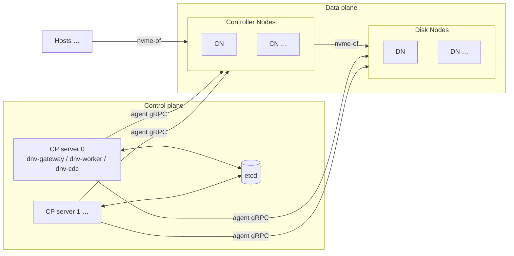
```mermaid
flowchart LR
    H["Hosts …"]
    subgraph dp["Data plane"]
        subgraph CNs["Controller Nodes"]
            CN0["CN"]
            CN1["CN …"]
        end
        subgraph DNs["Disk Nodes"]
            DN0["DN"]
            DN1["DN …"]
        end
    end
    subgraph cp["Control plane"]
        CPS0["CP server 0<br/>dnv-gateway / dnv-worker / dnv-cdc"]
        CPS1["CP server 1 …"]
        ETCD[("etcd")]
        CPS0 <--> ETCD
        CPS1 <--> ETCD
    end
    H -->|"nvme-of"| CNs
    CNs -->|"nvme-of"| DNs
    CPS0 -->|"agent gRPC"| CNs
    CPS0 -->|"agent gRPC"| DNs
    CPS1 -->|"agent gRPC"| CNs
    CPS1 -->|"agent gRPC"| DNs
```

*Fig. `070Cluster` — physical view: hosts, data plane, control plane.*

Process and RPC view:

```
Hosts  ──nvme-of──▶  Controller Nodes (cntlrs)  ──nvme-of──▶  Disk Nodes (sides)
                          ▲            ▲                            ▲
                          └── SyncupCn/SyncupCntlr        SyncupDn/SyncupSide
                              + CheckCn/CheckCntlr        + CheckDn/CheckSide
                                   │                                │
              dnv-gateway ──▶ etcd ◀── dnv-worker (roles dn,cn,sp) ─┘
                                   ▲
                              dnv-cdc (discovery)
```

The processes all bind flags, a config file and environment variables
through viper (Components: invocation reference):

* `dnv-gateway` serves the `Gateway` gRPC service to users and CLIs. It
  reads and writes etcd, and calls agents only for `GetDnSize` and
  `GetCnSize`, the `Get*Info` behind its `Inspect*` RPCs and behind the
  `force` false hydration checks of `DeleteClone` and `FinishMigration`
  (Clones, Migrations), and the `Get*Bm` bitmap reads (Bitmap reads). The
  worker never calls `Get*Info`: it watches through `Check*` (Check
  streams, dn / cn roles). `gateway.md` owns it.
* `dnv-worker` is one binary with the roles `dn`, `cn` and `sp`, any subset
  per instance. It watches the revision keys in etcd, shards the work by
  shard code, drives agents through the unary `SyncupDn`, `SyncupSide`,
  `SyncupCn`, `SyncupCntlr`, `PushCloneBitmap` and `PushMigrBitmap`
  (Bitmap push protocol) and watches them through the `CheckDn`,
  `CheckSide`, `CheckCn` and `CheckCntlr` streams (Check streams). It also
  performs health checking and the automatic reactions — primary election,
  replacements, thin-pool auto-grow, leg repair (Automatic reactions).
  `dnv-worker.md` owns it.
* `dnv-agent dn` and `dnv-agent cn` run on every DN and CN and serve
  `DiskNodeAgent` and `ControllerNodeAgent`. The agent owns the local
  device-mapper, mdadm and nvmet state — on a DN also the [D13] on-disk
  extent metadata; dnv uses no LVM anywhere ([D13], [D14]) — and persists
  the last accepted request per object, and every received bitmap chunk, as
  protobuf files in its local store (Common agent rules, Bitmap push
  protocol, Agent local-store paths). `dnagent.md` and `cnagent.md` own it.
* `dnv-cdc` is the NVMe-oF Central Discovery Controller: it watches the
  `cdc` keys and serves discovery and AENs to hosts (dnv-cdc). `cdc.md`
  owns it.
* `dnvctl` is the CLI over the `Gateway` service, owned by `dnvctl.md`. The
  userspace copier of raid0 bitmap math is not part of it.

## Terminology and object model

Every numeric id is a uint64, rendered with `IdKeyFmt` in keys and device
names unless stated otherwise. The shard code and the thin-device `dev_id`
and `ori_id` (with their `SpConf.next_dev_id` counter) are uint32: the
shard code is a key field of `DnRev`, `CnRev`, `SpRev` and `CdcEntry`,
rendered with `ShardCodeFmt` (Key grammar, Key table), while `dev_id` and
`ori_id` are rendered into no key or device name. `block_size` unqualified
always means the SP's `DmPoolConf.data_block_size`.

* **cluster** — The namespace for everything else. Identified by
  `cluster_name`; `cluster_id` is the fnv64a hash of `cluster_name` followed
  by `creation_epoch` (cluster_id derivation), where `creation_epoch` is
  stamped once at `CreateCluster`. Deleting and recreating a cluster under
  the same name therefore yields a **different** `cluster_id`. One etcd
  installation can host many clusters.
* **DN, disk node** — A machine contributing one raw block device
  (`--disk`). The device carries the [D13] dnv disk format; capacity is
  handed out as **extents** from its data area.
* **CN, controller node** — A machine running the volume logic. It
  contributes no persistent storage (only a tmpfs for clone metadata) but
  has a capacity budget in extents.
* **extent** — The allocation unit for both DN space and CN budget, of
  `ClusterConf.dn_bin_conf.extent_size` bytes (default
  `DefaultDnExtSize`). Counts are always rounded **down**.
* **SP, storage pool** — The unit of volume service. It owns cntlrs,
  slices, thin devices, subsystems, clones, transfers and migrations, and
  is identified by `sp_name` (user visible) and `sp_id` (internal, used in
  device names and keys; reverse lookup through `sp_id_to_name`).
* **cntlr** — One SP instance on one CN. Exactly one cntlr of an SP is
  **primary**: it runs the full device stack and serves IO. The others are
  **standby**: they keep the leg connections, export dm-error and are ANA
  inaccessible. `cntlr_cnt` runs from `MinCntlrCntPerSp` to
  `MaxCntlrCntPerSp`, default `DefaultCntlrCntPerSp`. Figs
  `020ControllerNode`, `030PrimaryCntlr` and `050StandbyCntlr` (Controller
  node, common; Primary cntlr; Standby cntlr).
* **slice** — A vertical shard of an SP. Each slice is one dm thin-pool on
  the primary, and thin devices are striped (raid0) across all slices.
  `slice_cnt` runs from one to `MaxSliceCntPerSp` and is fixed at SP
  creation. Fig. `040Slice` (Primary cntlr).
* **group** — A contiguous chunk of pool space inside a slice. Each slice
  has at least one **meta group**, which backs the thin-pool metadata
  device, and at least one **data group**, which backs the thin-pool data
  device; `GrowSlice` appends groups. A group is either a single leg
  (`RedundNone`) or an md-raid1 over its legs (`RedundMdRaid1`). Every leg
  of a group reserves a small **meta region** at its start — md
  superblock, write-intent bitmap and health block (Group on-leg layout:
  meta region, data region, health block); only the remaining **data
  region** feeds the pool.
* **leg** — One replica of a group, backed by exactly one **side**
  normally and by two sides while that leg is being migrated. A group may
  also carry up to `MaxSpareLegPerGrp` **spare legs**: connected and
  health-checked, but not md members until a switch (Spare legs).
* **side** — The DN-resident part of a leg: one side device `DnSideName`
  (a dm-linear over the side's [D13] extent runs) plus, per cntlr, a
  dm-error, a dm-linear and an nvmet subsystem exported to that cntlr's
  CN. Figs `000DiskNode` and `010Side` (Disk node).
* **thin device (td)** — A user volume: one dm-thin volume per slice plus
  one raid0 (dm striped) across the per-slice thin volumes on the primary.
  Snapshots are thin devices with `ori_id` set. `created` marks a td whose
  thin volume the primary has reported `OK` in every slice (sp role); only
  a created td can be snapshotted, and an origin cannot be deleted while a
  snapshot of it is uncreated (Thin devices).
* **subsystem (ss), namespace (ns)** — The host-facing NVMe-oF objects. A
  namespace binds an `ns_idx` (NSID) of a subsystem to a thin device. Fig.
  `060VirtualVolume` (Host view).
* **clone** — A pull-copy of an external NVMe-oF namespace into a local
  thin device through dm-clone, on the primary cntlr. Fig. `090Clone`
  (Clones).
* **transfer (xfer)** — The source-side counterpart of a clone: it exports
  a local namespace's raid0 over a dedicated subsystem so that another SP,
  possibly of another cluster, can clone from it. Fig. `100Transfer`
  (Transfers). Clone plus transfer is the cross-SP live migration of a
  volume (Transfer + clone = cross-SP live migration).
* **migration (migr)** — The side-level live move of one leg's data from
  one DN to another through dm-clone on the destination DN. Fig.
  `080Migration` (Migration).
* **shard code** — A uint32 below `ShardBucketSize`, formatted with
  `ShardCodeFmt`. Every DN, CN and SP gets one at creation; workers and the
  cdc split ownership by shard code.
* **revision** — A monotonic uint64 per DN, CN and SP, stored in `DnRev`,
  `CnRev` and `SpRev`. It is bumped whenever the agent-visible desired
  state changes and drives the worker-to-agent sync (Agent services and
  agent behavior, Workers). It is also the optimistic-concurrency token
  carried in mutating requests. The rev keys are id-keyed (`dn_id`,
  `cn_id`, `sp_id`) and carry the node's `addr_port`, or the SP's
  `sp_name`, in the **value**, so one watch event gives a worker both the
  revision and the handle it needs to act (Revision keys and the sync
  fan-out).
* **location** — A free-form failure-domain string per node (rack, zone),
  stored in `DnConf` and `CnConf`; a copy rides in the capacity-key value
  for scan efficiency ([D5]). Allocation uses it for anti-affinity
  (Allocation).
* **creation_epoch** — The unix time in nanoseconds of the moment the
  cluster was created, stored in `ClusterConf.creation_epoch`.
  Gateway-generated (not a request field), immutable, and the second input
  of the `cluster_id` hash (cluster_id derivation). Unrelated to
  `err_epoch`, which is in unix **seconds**.
* **err_epoch** — The unix seconds at which a worker found the object
  unhealthy after last seeing it healthy; zero while it is healthy. It
  stays put while the object stays unhealthy (`dnv-worker.md` HL3), and it
  is compared against the `EventThreshold` to trigger the automatic
  reactions (Automatic reactions). A node with a nonzero `err_epoch` also
  loses its capacity key (Capacity index keys).
* **settling** — `Cntlr.settling`: true from the moment a cntlr becomes
  primary — created as one by `CreateStoragePool`, promoted by a failover,
  created as one by a sole-primary replacement, or re-enabled by
  `UpdateCntlrEnabled` while still primary (Cntlrs) — until the worker
  first observes it clean in that role, enabled, at the revision it drives
  and with its stack built, the rows its `sp_level` suppresses aside
  (`dnv-worker.md` HL2 says which rows read as built), or until a failover
  demotes it first. While it is set, the failover holds an unhealthy
  primary to `cntlr_unhealthy` instead of `primary_unhealthy` when that is
  the longer; a `disabled` one still fails over at once (`dnv-worker.md`
  AR5). It is health bookkeeping of the same kind as `err_epoch`: set by
  the op that makes the cntlr primary, cleared by the observation that
  proves the role, in a write that bumps no revision, or by the failover
  that demotes it.

Ownership hierarchy (etcd side):

```
ClusterConf
├── DnGlobal / CnGlobal / SpGlobal            (id + shard bookkeeping)
├── DnConf(addr_port)  ──side_ptr_list──▶ (sp_id, leg_id, side_id) it hosts
├── CnConf(addr_port)  ──cntlr_ptr_list─▶ (sp_id, cntlr_id) it hosts
└── SpConf(sp_name)
    ├── Cntlr(cntlr_id)                        one per CN, one primary
    ├── Slice(slice_id)
    │   ├── meta_grp_list: Group ── leg_list: Leg ── side_list: Side
    │   │                        └─ spare_leg_list: Leg ── Side
    │   └── data_grp_list: (same shape)
    ├── ThinDevice(td_name), Subsystem(nqn)+Namespace, Clone(clone_name),
    │   Transfer(xfer_name), Migration(migr_name)  (+ bitmap keys)
    └── SpName (sp_id → sp_name reverse map), SpRev, CdcEntry per ss
```

### Cardinality limits

The cardinality limits are constants of `common/constants.go`, which holds
their values:

* per cluster: `MaxDnCntPerCluster`, `MaxCnCntPerCluster` and
  `MaxSpCntPerCluster`;
* per SP: `MaxTdCntPerSp`, `MaxSsCntPerSp`, `MaxCloneCntPerSp`,
  `MaxXferCntPerSp` and `MaxMigrCntPerSp`; the slice count up to
  `MaxSliceCntPerSp`, default `DefaultSliceCntPerSp`; the cntlr count from
  `MinCntlrCntPerSp` to `MaxCntlrCntPerSp`, default
  `DefaultCntlrCntPerSp`;
* per subsystem: `MaxNsCntPerSs` namespaces and `MaxHostCntPerSs` allowed
  hosts;
* per node: `MaxSideCntPerDn` sides on a DN, `MaxCntlrCntPerCn` cntlrs on a
  CN;
* per group and slice: `MaxLegPerGrp` legs, a ceiling nothing enforces —
  `MaxAllocLegPerGrp` is the allocator's real per-group leg count —,
  `MaxSpareLegPerGrp` spare legs, and `MaxGrpCntPerSlice` groups in
  **each** of a slice's two group lists (md names, GrowSlice);
* bitmaps: `MaxCloneBmCnt` chunks per source slice bitmap of a clone and
  `MaxMigrBmCnt` chunks per migration bitmap; `CloneBmChunkBytes` is one
  clone chunk's capacity **and** its positioning quantum (Bitmap push
  protocol);
* transactions: `EtcdMaxTxnOps` is the `--max-txn-ops` every etcd serving
  dnv must be started with, sized by the widest shape of
  `CreateStoragePool` (Storage pools, Components: invocation reference;
  `gateway.md`, Additions to `common/constants.go`) and pinned by a test;
  the sp drain's batch and the created flip's transaction are bounded
  transactions over etcd's default limit too (`dnv-worker.md` SPD13,
  RW19). `MaxDelGrpPerTxn` is the groups one sp drain batch removes
  (`dnv-worker.md` SPD10), `MaxDelBmPerTxn` the clone bitmap chunk keys
  one clone drain batch deletes (`dnv-worker.md` CLD8), and
  `MaxFlipCreatedPerTxn` the tds one created-flip transaction carries
  (sp role, `dnv-worker.md` RW19);
* cntlid slots: `CnCntlidSlotCnt` and `DnCntlidSlotCnt`, the slots of the
  cntlid partition (cntlid slots); the gateway refuses a `cntlid_slot` or
  `cntlid_slot_list` value at or above `CnCntlidSlotCnt`;
* conf bounds: `MinChunkBlockCnt`, `MaxChunkBlockCnt` and
  `DefaultChunkBlockCnt` for `redund_md_raid1.bitmap_chunk_block_cnt`
  (Common validation); `MinAllocDnBatchSize`, `MaxAllocDnBatchSize` and
  `DefaultAllocDnBatchSize` for `alloc_conf.dn_batch_size`, and
  `MinAllocCnBatchSize`, `MaxAllocCnBatchSize` and `DefaultAllocCnBatchSize`
  for `alloc_conf.cn_batch_size` (Per-operation allocation, Common
  validation);
* `ShardBucketSize`, the number of shard codes and the length of every
  global's `shard_bucket`; `MaxListCnt` and `DefaultListCnt`, the bound and
  the default of a paged list's `count`.

## Data-plane device stacks

The data plane is built from stock Linux pieces: the device-mapper targets
error, linear, striped (raid0), thin-pool, thin and clone, md-raid1, and the
kernel nvmet target and nvme host. Every device dnv creates has a
deterministic name (Naming), so agents are fully idempotent and
crash-restartable. The port link is the last step of building every
nvmet subsystem, on either node kind, after its attributes, its allowed
hosts and its namespaces: on the DN any failure before it holds the link
back, while on the CN a namespace that fails to build does not. Teardown
runs in reverse, the port link first (`dnagent.md` SH19). The CN's host-facing and transfer subsystems and
a DN's side exports carry a cntlid range, a serial and a model, and their
namespaces an identity; a migration-source export carries none of them,
only its allowed host and its namespace's "device_path" and ANA group.
Every subsystem, that one included, has "attr_allow_any_host" written "0"
with its attributes, before its host links are made
(Primary cntlr, step 6). A later ANA transition rewrites only the
namespace's "ana_grpid" ([D4]).

### Disk node

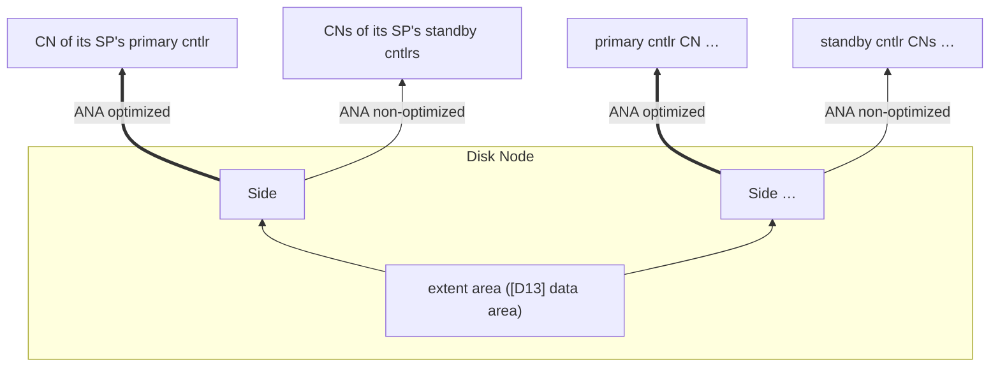
```mermaid
flowchart BT
    subgraph dn["Disk Node"]
        VG["extent area ([D13] data area)"]
        S0["Side"]
        S1["Side …"]
        VG --> S0
        VG --> S1
    end
    S0 ==>|"ANA optimized"| P0["CN of its SP's primary cntlr"]
    S0 -->|"ANA non-optimized"| B0["CNs of its SP's standby cntlrs"]
    S1 ==>|"ANA optimized"| P1["primary cntlr CN …"]
    S1 -->|"ANA non-optimized"| B1["standby cntlr CNs …"]
```

*Fig. `000DiskNode` — one DN: its extent area hands extents to the sides it
hosts; every side exports one path per cntlr of its SP.*

Per DN, once (created by the dn agent at the first `SyncupDn`):

1. The **dnv disk format** [D13] on the `--disk` device, at fixed byte
   offsets that are constants of `common/constants.go`:
   * the header block at `DnHeaderOffset`, `DnHeaderSize` bytes: a
     self-describing header — a magic, a format version, a CRC32 and a
     `DnDiskHeader` carrying `cluster_id`, `dn_id`, `extent_size`, a random
     64-bit `format_uuid` and the three layout fields `data_offset`,
     `clone_meta_offset` and `clone_meta_size`;
   * the two alternating **volume-table** slots at `DnTableSlotAOffset` and
     `DnTableSlotBOffset`, each `DnTableSlotSize` bytes — a magic, the
     header's `format_uuid`, a monotonic `seq`, a CRC32 and a
     `DnDiskTable`. Every mutation writes the slot that is *not* the newest
     valid one, so a torn write can only damage the older copy;
   * the clone-metadata area at `DnCloneMetaOffset`, `DnCloneMetaSize`
     bytes in units of `DnCloneMetaUnit`: dm-clone metadata space for the
     migrations whose **destination** side lives on this DN. A slot is a
     contiguous run of whole units and every migration costs at least two
     of them, the fixed dm-clone metadata base alone filling one, so the
     area bounds the destination roles one DN can hold (Migrations,
     `dnagent.md` DN13);
   * the extent area from `DnDataOffset`. Extent *i* lives at
     `DnDataOffset` plus *i* times `extent_size`; the offset is fixed rather
     than extent-aligned on purpose, so the usable size, the disk size minus
     `DnDataOffset`, is a pure constant subtraction `GetDnSize` can answer
     before `extent_size` is known.

   The two envelopes are fixed; `agent/dnagent/diskmeta.go` holds their byte
   layout. Every integer in them is **little-endian**, and both checksums
   are CRC-32 over the IEEE polynomial. The header block holds the magic,
   the format version (one value is accepted), the length of the serialized
   `DnDiskHeader`, the serialized header, zero padding, and its CRC, which
   covers the whole block except its own four bytes — magic, version,
   length, protobuf and the padding alike. A volume-table slot holds the
   magic, the copy of the header's `format_uuid`, `seq`, the length of the
   serialized `DnDiskTable`, its CRC and the serialized table, and the
   slot's CRC covers the envelope **and** the body: everything but the CRC
   field itself. What is left out is the write padding — a slot is written
   as a whole number of blocks — which carries nothing. Covering the body
   alone would leave `seq` unprotected, and one flipped bit there could make
   the stale slot outrank the live one and roll the whole volume table back.
   A slot is a candidate only when its magic matches, its `format_uuid`
   equals the header's — which is what makes a slot left over from an
   earlier format of the same disk lose, whatever its `seq` —, its envelope
   and body fit within `DnTableSlotSize`, its CRC matches and its body
   parses; among the candidates the higher `seq` wins. A valid header with
   no valid slot is a hard error, never a silently empty table, because the
   format writes slot A before the header (`dnagent.md` DN5).

   The on-disk table — not the agent's local store — is authoritative for
   extent placement, so a node that loses `--local-store` but keeps its disk
   rebuilds exactly the same devices.
2. Exactly **one** nvmet port, built from `DnConf.nvme_tr_conf`, which
   mirrors the agent's `--tr-type`, `--adr-fam`, `--tr-addr` and
   `--tr-svc-id` flags. Every subsystem this DN ever exports — all side
   subsystems and all migration-source subsystems — attaches to this single
   port. The port is one per **agent**, not one per kernel: it lives at the
   configfs id `NvmetPortId` unless the agent is started with
   `--nvmet-port-id` (`dnagent.md` CM2). Several dn agents may therefore
   share one kernel, each taking a distinct port id and a transport address
   of its own (a different `--tr-addr` or `--tr-svc-id`): an agent's
   transport conf is copied into `Side.nvme_tr_conf` (Storage pools) and is
   what a CN dials to reach that DN's sides (Primary cntlr, step 1), so two
   DNs answering on one address would be indistinguishable to it. Each also
   needs its own `--disk` and its own `--local-store` prefix: the names of
   Agent local-store paths do carry `cluster_id` and `dn_id`, but the store is
   read back by **kind** prefix alone, so two dn agents sharing a prefix
   would adopt and converge each other's records at startup (`dnagent.md`
   CM2, SH6). Agents that keep the default id co-own the default port
   instead, which is what lets a dn and a cn agent on one node share one
   port: `EnsurePort` is probe-first and writes only what differs
   (`dnagent.md` SH19). Sharing a kernel also carries one placement rule —
   the `SideToCnNqn` note under **Per side** below.

Per **side** (one per hosted leg replica):

* A **side device** `DnSideName` (dm kind `DmKindDnSide`): one dm-linear
  whose targets concatenate the extent runs the volume table allocated to
  (`sp_id`, `side_id`), `ext_cnt` extents of the `Group` in total.
  Provisioning must follow the Side provisioning protocol: the record is
  created with `zeroed_bits` all clear, the assembled device is zeroed batch
  by batch with `blkdiscard --zeroout` through the dm-linear, each batch's
  bits are persisted as it completes, and no per-CN export stack is
  converged until the side's `provisioned` flag is true **and** every bit is
  set ([D15]). Everything above the side device — the per-CN stacks, the
  migration endpoints — sees one ordinary single-device backing reference.
* Per cntlr of the SP, primary and standbys (the side learns their CN ids
  from `side_conf.primary_cn_id` and `standby_id_list` of the
  `SyncupSideRequest`):
  * a dm-error device `DnErrorName` sized like the side device,
  * a dm-linear device `DnLinearName` whose table points at the **side
    device** for the primary cntlr's CN and at the **dm-error** device for
    every standby CN,
  * an nvmet subsystem `SideToCnNqn` of the cluster, sp, leg and cn on the
    DN's port, whose allowed hosts are that CN's `CnHostNqn` alone and whose
    "attr_cntlid_min" and "attr_cntlid_max" come from
    `side_conf.cntlid_slot` (the etcd `Side.cntlid_slot`, cntlid slots),
    exposing one namespace backed by the dm-linear device. The namespace's
    "ana_grpid" selects one of the port's three fixed ANA groups [D4]: the
    optimized group for the primary CN's subsystem, the non-optimized group
    for the standby CNs' subsystems. A standby path therefore exists but
    errors out — a pre-connected placeholder that makes failover fast.

    The NQN names the **leg**, not the side, and carries no dn component
    (NQNs), so while a leg is being migrated its src and dst sides — on two
    different DNs — export the same subsystem NQN toward the same CN. For
    the CN's kernel to merge them into one multipath namespace instead of
    rejecting a duplicate, both sides must present the same namespace
    identity: namespace id one, "device_uuid" and "device_nguid" derived
    deterministically from (`cluster_id`, `sp_id`, `leg_id`) by `DnNsIdentity`,
    "attr_serial" the leg id rendered with `IdKeyFmt`, "attr_model" the
    fixed dnv model — and, per cntlid slots, cntlid ranges that do **not**
    overlap.

    That identical NQN is also what stops two dn agents sharing a kernel
    from holding the two sides of one leg. A distinct `--nvmet-port-id`
    gives each agent its own port, but nvmet subsystems are **not** under
    the port — a subsystem's configfs directory is kernel-global and the
    port only links to it — so both agents would converge that one
    subsystem and its one namespace, each writing its own side device into
    the same "device_path", and either one's teardown would run
    `RemoveSubsystem` against the whole of it. No other dn-side name names
    an object the two would fight over: `DnSideName`, `DnErrorName`,
    `DnLinearName`, `DnMigrMetaDmName`, `DnMigrSrcName`, `DnMigrFinalName`,
    `MigrSrcNqn`, `DnHostNqn`, `LocalDnPath`, `LocalSidePath` and
    `LocalMigrBmPath` all carry `dn_id` (dm device names, NQNs, Agent
    local-store paths), and the ANA groups are nested under the port. Two
    dn-built names carry no `dn_id` and are harmless all the same:
    `CnHostNqn` of the cluster and cn, whose kernel-global host directory
    both agents merely create — with `mkdir -p`, and no code path anywhere
    removes a host — and the namespace identity `DnNsIdentity` of the
    cluster, sp and leg above, which lives inside the one subsystem the NQN
    rule already covers.

    Only a **migration** ever gives a leg two sides, so the rule is a
    placement one, not an agent-flag one: register every DN of one kernel
    under the same `location` and the first tier of Per-operation
    allocation keeps a migration destination (and a spare leg) off the
    source's kernel. Two things bound that. An omitted `location` defaults
    to the node's own `addr_port` (Disk nodes), so agents left to the
    default are separate failure domains and nothing keeps them apart at
    all; and even under a shared `location` the second tier of
    Per-operation allocation rescans without the exclusion rather than
    refuse to place, so the guarantee holds only while some other domain
    still has a free DN.

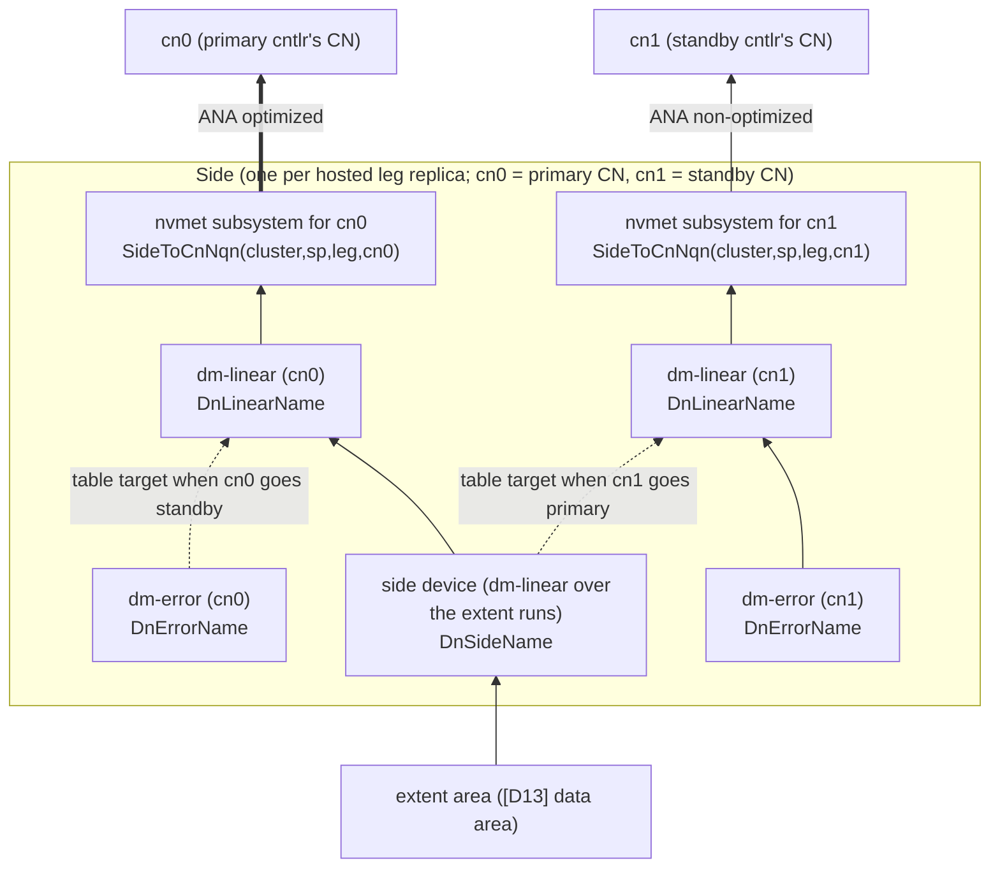
```mermaid
flowchart BT
    subgraph side["Side (one per hosted leg replica; cn0 = primary CN, cn1 = standby CN)"]
        LV["side device (dm-linear over<br/>the extent runs)<br/>DnSideName"]
        E0["dm-error (cn0)<br/>DnErrorName"]
        L0["dm-linear (cn0)<br/>DnLinearName"]
        N0["nvmet subsystem for cn0<br/>SideToCnNqn(cluster,sp,leg,cn0)"]
        E1["dm-error (cn1)<br/>DnErrorName"]
        L1["dm-linear (cn1)<br/>DnLinearName"]
        N1["nvmet subsystem for cn1<br/>SideToCnNqn(cluster,sp,leg,cn1)"]
        LV --> L0
        L0 --> N0
        E1 --> L1
        L1 --> N1
        E0 -.->|"table target when cn0 goes standby"| L0
        LV -.->|"table target when cn1 goes primary"| L1
    end
    VG["extent area ([D13] data area)"] --> LV
    N0 ==>|"ANA optimized"| CN0["cn0 (primary cntlr's CN)"]
    N1 -->|"ANA non-optimized"| CN1["cn1 (standby cntlr's CN)"]
```

*Fig. `010Side` — one side and its per-CN export stacks. Failover only
reloads the dm-linear tables and flips ANA (dashed alternatives).*

Failover and migration only ever *reload* the dm-linear tables and flip ANA
states; the exported namespace object never changes, so the CNs' NVMe
connections survive.

Additionally, while this DN hosts the **source** side of a migration (its
`SyncupSide` carries `migr_src_conf`): a dm-linear `DnMigrSrcName` on top of
the side device, exported through the subsystem `MigrSrcNqn` (same port)
whose allowed hosts are the `DnHostNqn` of `migr_src_conf.dst_dn_id`. While
it hosts the **destination** side (`migr_dst_conf`): an nvme host connection
to the `MigrSrcNqn` of the cluster, `migr_dst_conf.src_dn_id`, sp and
migration at `migr_dst_conf.src_nvme_tr_conf` (hostnqn `DnHostNqn`); a
dm-clone metadata **slot** in the [D13] clone-metadata area — whole
`DnCloneMetaUnit` units, with its head zeroed before its record is
persisted so a previous tenant's bytes can never be misparsed as a dm-clone
superblock — fronted by a wrapper dm-linear `DnMigrMetaDmName` (dm kind
`DmKindDnMigrMeta`), because the dm-clone target reads its metadata device
from sector zero and takes no offset argument; and a dm-clone device
`DnMigrFinalName` (dest the local side device, source the connected nvme
device, region size `migr_dst_conf.block_size`). The per-cntlr dm-linears of
the destination side sit on top of the dm-clone (primary CN) or the dm-error
(standbys). See fig. `080Migration` and Migration; the agent's sequence is
`dnagent.md` DN12 and DN13.

### Controller node, common

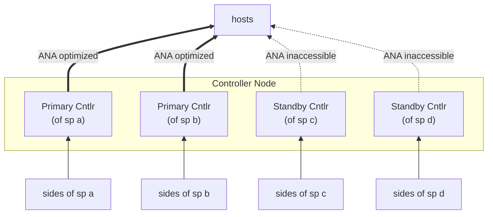
```mermaid
flowchart BT
    subgraph cn["Controller Node"]
        P0["Primary Cntlr<br/>(of sp a)"]
        P1["Primary Cntlr<br/>(of sp b)"]
        S0["Standby Cntlr<br/>(of sp c)"]
        S1["Standby Cntlr<br/>(of sp d)"]
    end
    LA["sides of sp a"] --> P0
    LB["sides of sp b"] --> P1
    LC["sides of sp c"] --> S0
    LD["sides of sp d"] --> S1
    P0 ==>|"ANA optimized"| H["hosts"]
    P1 ==>|"ANA optimized"| H
    S0 -.->|"ANA inaccessible"| H
    S1 -.->|"ANA inaccessible"| H
```

*Fig. `020ControllerNode` — one CN hosts up to `MaxCntlrCntPerCn` cntlrs of
different SPs, in a mix of primary and standby roles.*

Per CN, once (created by the cn agent at the first `SyncupCn`):

1. A tmpfs mounted at `CnTmpfsPath`, under `DefaultTmpfsPrefix` and named
   by the cluster and cn ids, sized `DefaultCnTmpfsSize`: the arena size
   `CnCloneMetaAreaSize` plus slack.
2. A **sparse** file `CnTmpFilePath` of `CnCloneMetaAreaSize` bytes inside
   it, attached to **one** free loop device. That loop device is the CN's
   **clone-metadata arena**; it is re-learned on every converge with
   `losetup --associated` of the file and never persisted (loop names are
   unpredictable, and a second loop per CN is never wanted). The arena is
   carved into **units** of `CnCloneMetaUnit` — "unit", never "extent": an
   extent is the allocation unit of Terminology and object model. A clone's
   dm-clone metadata device is a **wrapper dm-linear** `CnCloneMetaDmName`
   (cn dm kind `DmKindCnCloneMeta`, `cnagent.md`, Additions to `common`)
   over a first-fit run of **contiguous** units sized for the dm-clone
   metadata of the clone's region count, the destination td's size over
   `block_size` (`cnagent.md` CN18); the wrapper exists for the same reason
   `DnMigrMetaDmName` does — dm-clone reads its superblock from sector zero
   and takes no offset argument. **The kernel's dm tables are the
   allocation registry**: enumerating this CN's wrappers and reading their
   linear tables, each naming the loop device and an offset, reconstructs
   the used map, so there is no on-file allocation table and none of the
   [D13] header, CRC and A/B slot machinery is needed — the arena is
   volatile *together with* the kernel's dm state (a reboot clears both, an
   agent restart preserves both; `cnagent.md` CN5). Before creating a
   wrapper the agent hole-punches the range with a plain `blkdiscard` of
   it, so a recycled unit can never hand a new dm-clone a previous clone's
   valid dm-clone superblock; **`--zeroout` is forbidden here** — it would
   materialize up to the whole arena in RAM and defeat the sparse file.
   Arena exhaustion ⇒ the clone's resources report `RES_STATUS_ERROR`
   ([D14]). The metadata is deliberately volatile: after a reboot a clone
   is rebuilt from the **destination thin-pool bitmaps** (Clone crash
   recovery) — the copied blocks are exactly the mapped blocks of the
   destination td, so no clone state needs to survive the CN.
3. Exactly **one** nvmet port from `CnConf.nvme_tr_conf`; every
   host-facing subsystem and every transfer subsystem of every cntlr on
   this CN attaches to it. As on a disk node the port is one per **agent**,
   at the configfs id `NvmetPortId` unless `--nvmet-port-id` says otherwise
   (`dnagent.md` CM2); a cn agent that keeps the default co-owns the
   default port with a dn agent on the same node. Unlike the dn case,
   distinct port ids do **not** make two cn agents on one kernel safe, so
   run at most one: the host-facing subsystem NQN is the one the user
   passed to `CreateSubsystem` and every cntlr of that SP exports it
   (Primary cntlr, step 6; Host view; cntlid slots), `XferNqn` carries no
   node id (NQNs), and `CnMdArrayName` — the superblock name given to
   `mdadm --name` — carries neither cluster nor cn id (md names). Placement
   does not reliably separate them either: Per-operation allocation keeps
   the cntlrs of one SP in distinct `location`s only at tier 1, so two cn
   agents of one kernel registered under one `location` can still take two
   cntlrs of an SP once a pick finds no CN with room outside the domains
   that SP's cntlrs already hold — which any SP with more cntlrs than the
   cluster has domains with room reaches — and a cntlr replacement, which
   excludes only the surviving cntlrs' domains (`dnv-worker.md` AR7), can
   land on the other cn agent of the failed cntlr's kernel even at tier 1;
   under the default `location`, the node's `addr_port` (Controller nodes),
   they are simply two CNs to the allocator.
4. **QoS** from `SyncupCnRequest.qos_ratio`, a copy of
   `ClusterConf.qos_ratio` (dn / cn roles). Limits are size-proportional:
   for a device of `size` bytes the IOPS limit is `size` over
   `bytes_per_iops` and the bandwidth limit `size` over `bytes_per_bps` (a
   zero divisor leaves that limit unset). The agent is to program them
   through the cgroup io controller ("io.max", keyed by the device's
   major:minor, as read and write IOPS and bandwidth limits): `strict` false
   ⇒ limit every dm thin-pool (`CnPoolFinalName`) on the CN by its
   data-device size; `strict` true ⇒ additionally limit every leg device by
   the leg's size. Limits are to be (re)applied on every `SyncupCn` and
   whenever one of these devices is (re)created.

   **The enforcement mechanism is an open issue.** "io.max" is a (cgroup,
   device) limit, not a device-wide cap: a bio is throttled only if it is
   charged to a cgroup that configured a limit for that device. Host IO
   enters through nvmet **kernel threads**, which live in the root cgroup
   (and cannot leave it under cgroup v2), and the root cgroup exposes no
   "io.max" — so limits written in any agent-created cgroup would bind the
   agent's own tools but not host traffic. Whatever mechanism binds, a
   leg-level limit also throttles md bitmap and superblock writes, resync
   and the leg health probe (Group on-leg layout: meta region, data region,
   health block) — tight limits can fake "leg unhealthy" — and a pool-data
   limit throttles clone and migration hydration; those flows need headroom
   or exemption.

   **Until the issue is decided, QoS is deferred**: the cn agent accepts and
   persists `qos_ratio` and programs no limit at all (`cnagent.md` CN6) —
   writing "io.max" from an agent cgroup would bind nothing that matters and
   only pretend.

A CN hosts up to `MaxCntlrCntPerCn` cntlrs of different SPs; at most one
cntlr **per SP** per CN.

### Primary cntlr

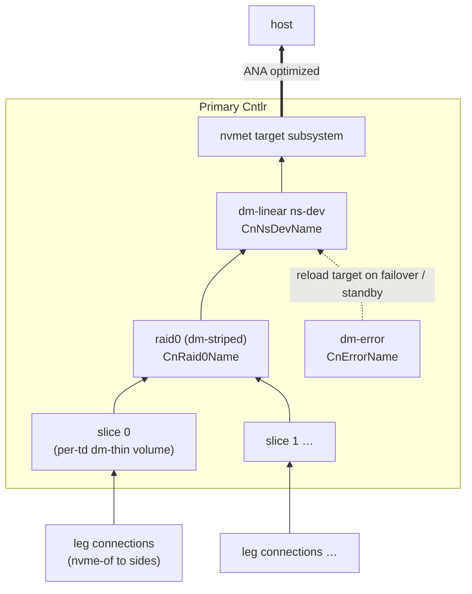
```mermaid
flowchart BT
    subgraph pc["Primary Cntlr"]
        SL0["slice 0<br/>(per-td dm-thin volume)"]
        SL1["slice 1 …"]
        R["raid0 (dm-striped)<br/>CnRaid0Name"]
        NS["dm-linear ns-dev<br/>CnNsDevName"]
        T["nvmet target subsystem"]
        E["dm-error<br/>CnErrorName"]
        SL0 --> R
        SL1 --> R
        R --> NS
        NS --> T
        E -.->|"reload target on failover / standby"| NS
    end
    G0["leg connections<br/>(nvme-of to sides)"] --> SL0
    G1["leg connections …"] --> SL1
    T ==>|"ANA optimized"| H["host"]
```

*Fig. `030PrimaryCntlr` — the primary's per-td path for one thin device.*

Bottom-up, everything below is created and owned by the cn agent when
`SyncupCntlr` says `Cntlr.primary` is true ("Make sure all groups are
available"):

1. **Legs.** For each provisioned side of each leg, spare legs included —
   a side whose `provisioned` is false exports nothing yet and is skipped
   (`cnagent.md` CN10): `nvme connect` to the `SideToCnNqn` of the
   cluster, sp, leg and this CN at
   `Side.nvme_tr_conf`, with the hostnqn `CnHostNqn` of the cluster and cn
   and the flags of `dnagent.md` SH20 — the host id `NvmeHostId` of that
   hostnqn, a fast IO fail timeout of `DefaultNvmeFastIoFailTmo`, and a
   controller-loss timeout that reconnects forever. Because every side of a
   leg exports that one NQN with one namespace identity (Disk node, NQNs),
   the connections of a leg land in a single subsystem: the kernel presents
   **one** nvme multipath namespace device per leg, with one controller (one
   path) per connected side, and routes IO down the optimized path. A
   single-side leg is simply that device with one path; during a migration
   the same device gains the destination side as a second path and the ANA
   flip switches IO over — no device change, nothing above the leg notices
   [D1]. The **leg device** is a cn-local dm-linear wrapper over that
   multipath namespace device, and it is what md and the group devices
   consume as the leg ([D1] gives the reasons).
   The agent runs the health-check IO of Group on-leg layout: meta region,
   data region, health block, against every connected leg, spares too, and
   reports per leg in `CntlrInfo.leg_id_to_leg` (`cnagent.md` CN10, CN11).
2. **Groups.** `RedundNone`: the group device is a dm-linear over the
   single leg's **data region**, at the offset `meta_blocks` times
   `block_size` (Group on-leg layout: meta region, data region, health
   block). `RedundMdRaid1`: an md-raid1 `CnMdDevName`/`CnMdArrayName` over
   the member leg devices — always with an **internal write-intent bitmap**
   whose chunk is `RedundMdRaid1.bitmap_chunk_block_cnt` times
   `block_size`, always with **failfast** members, and with the data offset
   `meta_blocks` times `block_size` (`cnagent.md` CN12). The assembly rules
   (create vs assemble vs add) are in "Make sure all groups are available".
   **Spare legs are not md members**: they stay connected, wrapped and
   health-checked, and are only added by an explicit `SwitchSpareLeg`
   (Spare legs).
3. **Per slice** (fig. `040Slice`): a dm-linear concat `CnPoolMetaName` over
   the slice's meta group devices (in `meta_grp_list` order) and a dm-linear
   concat `CnPoolDataName` over its data group devices; a dm thin-pool
   `CnPoolFinalName` whose metadata device is the pool meta, whose data
   device is the pool data and whose block size is `block_size`, with a
   low-water mark derived from the data device's blocks and
   `DmPoolConf.low_water_mark_pct` so that the dm event fires exactly when
   the pool's **usage** exceeds `low_water_mark_pct` percent, the condition
   the auto-grow acts on (Automatic reactions). Both values come from the
   `dm_pool_conf` of the `SyncupCntlrRequest`'s `bdev_conf`. A zero
   `low_water_mark_pct` is invalid: the control plane stores
   `DefaultPoolLowWatermarkPct` instead (Common validation), and the agent
   refuses the whole `SyncupCntlr` rather than defaulting it itself (Common
   agent rules). Above one hundred percent the agent passes a zero
   low-water mark — no dm events — as the value only means "auto-grow off"
   (Automatic reactions; `cnagent.md` CN13).
4. **Per thin device and slice**: a dm-thin volume `CnThinDevName`, created
   with the pool message "create_thin" of `dev_id` or "create_snap" of
   `dev_id` and `ori_id` — sent only while `ThinDevice.created` is false; a
   created td's volume is attached with a bare `dmsetup create`
   (`cnagent.md` CN14) — of virtual size `ThinDevice.size` over
   `slice_cnt`.
5. **Per thin device**: a dm-striped raid0 `CnRaid0Name` across its
   per-slice thin volumes (slice order `slice_idx`), with the chunk
   `DmRaid0Conf.stripe_size`, and a dm-error `CnErrorName` of the same size,
   the permanent reload target. **Per namespace** (Subsystems, namespaces):
   a dm-linear `CnNsDevName` of the cluster, cn, sp and `ns_id` — **the**
   namespace backing device — whose table points at its td's raid0
   (normal), at the dm-clone `CnCloneFinalName` (while a clone targets that
   td, fig. `090Clone`), or at the dm-error (standby, failover, parked — the
   state of any ns-dev pointed at its td's dm-error, Namespace suspend
   semantics, which includes every effectively suspended namespace).
   Namespaces backed by the same td each have their own `CnNsDevName` over
   the same raid0 (`cnagent.md` CN15, CN16).
6. **Host-facing nvmet**: per `Subsystem` an nvmet subsystem on the CN's
   port, with "attr_cntlid_min" and "attr_cntlid_max" from
   `Cntlr.cntlid_slot`, `serial` and `model` from the etcd `Subsystem`, and
   the allowed hosts as configured. The allowed hosts are the only
   admission gate of every subsystem dnv builds, host-facing or
   dnv-internal, a transfer subsystem included, whose record's list is
   used verbatim: a subsystem admits exactly the hosts its list names, and
   an empty list admits no host. A storage export defaults to deny: a
   `Subsystem` created without hosts, to have its namespaces attached
   before any host is let in, stays closed, its `CdcEntry` shown to no host
   (`cdc.md` DS4), until its hosts are granted; an empty list revokes every
   host; and host-facing and internal subsystems share one rule. dnv never
   sets "attr_allow_any_host", a mode no dnv flow needs: an agent writes it
   "0" before it links a subsystem's hosts, because nvmet refuses a new host
   link while it is set, and the same write closes a subsystem found with
   it set (`EnsureSubsystem`). Per `Namespace`: an nvmet namespace whose
   nsid is `ns_idx`, whose "device_path" is the namespace's own
   `CnNsDevName`, whose "uuid" and "nguid" come from the etcd record, and
   which is a member of the fixed optimized ANA group [D4] (primary) unless
   `suspended` (Subsystems, namespaces) — suspended ⇒ the ns-dev is parked
   on its td's dm-error and the namespace moved to the inaccessible group
   everywhere (Namespace suspend semantics; `cnagent.md` CN16).
7. **Clones, transfers and migrations** hosted by the SP, per Procedures.

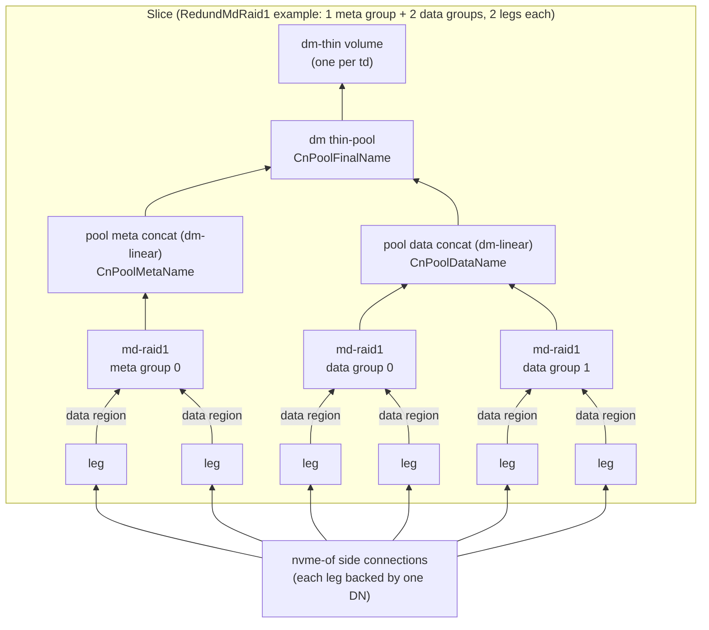
```mermaid
flowchart BT
    subgraph slice["Slice (RedundMdRaid1 example: 1 meta group + 2 data groups, 2 legs each)"]
        TD["dm-thin volume<br/>(one per td)"]
        TP["dm thin-pool<br/>CnPoolFinalName"]
        PM["pool meta concat (dm-linear)<br/>CnPoolMetaName"]
        PD["pool data concat (dm-linear)<br/>CnPoolDataName"]
        MG0["md-raid1<br/>meta group 0"]
        DG0["md-raid1<br/>data group 0"]
        DG1["md-raid1<br/>data group 1"]
        ML0["leg"]
        ML1["leg"]
        DL0["leg"]
        DL1["leg"]
        DL2["leg"]
        DL3["leg"]
        TP --> TD
        PM --> TP
        PD --> TP
        MG0 --> PM
        DG0 --> PD
        DG1 --> PD
        ML0 -->|"data region"| MG0
        ML1 -->|"data region"| MG0
        DL0 -->|"data region"| DG0
        DL1 -->|"data region"| DG0
        DL2 -->|"data region"| DG1
        DL3 -->|"data region"| DG1
    end
    X["nvme-of side connections<br/>(each leg backed by one DN)"] --> ML0
    X --> ML1
    X --> DL0
    X --> DL1
    X --> DL2
    X --> DL3
```

*Fig. `040Slice` — the per-slice stack of step 3. Every leg starts with its
meta region (md superblock, write-intent bitmap and health block; Group
on-leg layout: meta region, data region, health block); only the data
region becomes an md member or pool space.*

### Standby cntlr

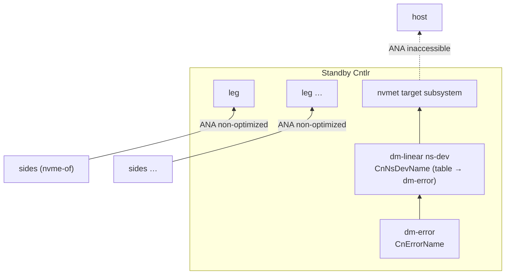
```mermaid
flowchart BT
    subgraph sc["Standby Cntlr"]
        L0["leg"]
        L1["leg …"]
        E["dm-error<br/>CnErrorName"]
        NS["dm-linear ns-dev<br/>CnNsDevName (table → dm-error)"]
        T["nvmet target subsystem"]
        E --> NS
        NS --> T
    end
    S0["sides (nvme-of)"] -->|"ANA non-optimized"| L0
    S1["sides …"] -->|"ANA non-optimized"| L1
    T -.->|"ANA inaccessible"| H["host"]
```

*Fig. `050StandbyCntlr` — pre-connected but dark: legs stay connected, the
exported namespaces error out.*

A standby keeps only: the leg nvme connections and leg wrappers (Primary
cntlr, step 1) — whose health it reports from transport liveness, since it
cannot run the block probe (`cnagent.md` CN11) —, the per-td
`CnErrorName` and the per-namespace `CnNsDevName` (table → dm-error), and
the host-facing nvmet objects with every namespace in the inaccessible ANA
group [D4]. It has
**no** md arrays, pools, thin volumes or raid0s ("cleanup all resources that
a primary shouldn't have"). For a transfer it also keeps the
dm-error-backed `CnXferFinalName` and the transfer subsystem counterparts
(fig. `100Transfer`, right half; Transfers).

### Host view

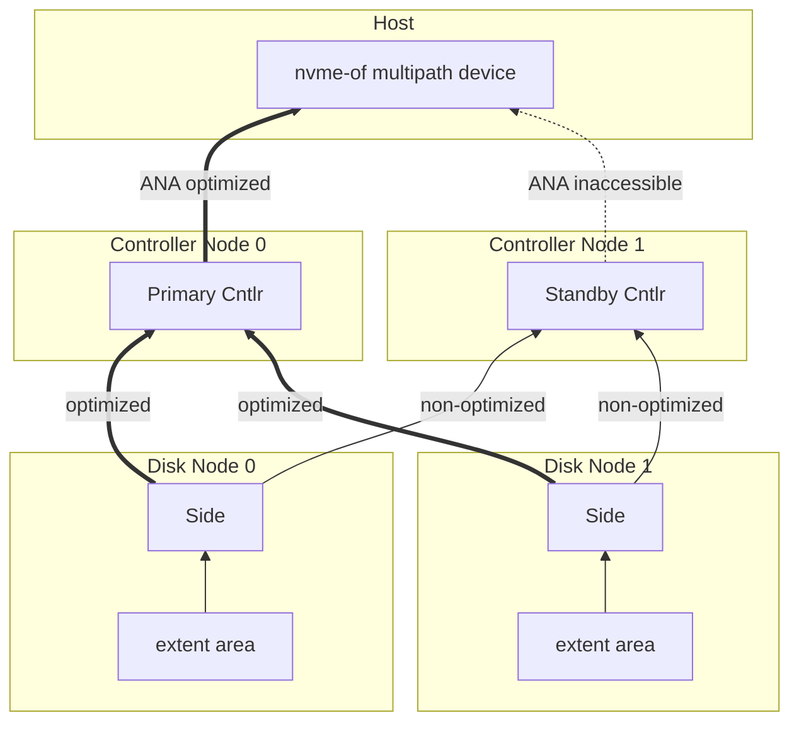
```mermaid
flowchart BT
    subgraph host["Host"]
        MP["nvme-of multipath device"]
    end
    subgraph cn0["Controller Node 0"]
        PC["Primary Cntlr"]
    end
    subgraph cn1["Controller Node 1"]
        SC["Standby Cntlr"]
    end
    subgraph dn0["Disk Node 0"]
        EA0["extent area"] --> SD0["Side"]
    end
    subgraph dn1["Disk Node 1"]
        EA1["extent area"] --> SD1["Side"]
    end
    SD0 ==>|"optimized"| PC
    SD1 ==>|"optimized"| PC
    SD0 -->|"non-optimized"| SC
    SD1 -->|"non-optimized"| SC
    PC ==>|"ANA optimized"| MP
    SC -.->|"ANA inaccessible"| MP
```

*Fig. `060VirtualVolume` — one virtual volume end to end: the same subsystem
NQN and namespace identity from every cntlr, aggregated by the host
kernel.*

A host discovers the SP's subsystems through dnv-cdc, connects to every
enabled cntlr's port, and the kernel aggregates the paths into one nvme
multipath device because all cntlrs export the same subsystem NQN and the
same namespace identity ("nguid" and "uuid"), with distinct cntlids
guaranteed by cntlid slots. Primary path ANA optimized, standby paths
inaccessible.

### Group on-leg layout: meta region, data region, health block

Every leg's side device of a group is split into a **meta region**
(`meta_blocks` blocks of `block_size`) followed by the **data region**
(`data_blocks` blocks). Both counts are computed automatically — never
configured — and stored in the `Group`; `model/ops.go` holds the
arithmetic. The group spans `ext_cnt` extents of `extent_size` bytes. A
`RedundMdRaid1` group's meta region is one block for the md superblock, the
blocks that hold the internal write-intent bitmap — the md bitmap superblock
plus one bit per bitmap chunk of the group, a chunk being
`RedundMdRaid1.bitmap_chunk_block_cnt` blocks, rounded up to whole blocks —
and one block for the health block; a `RedundNone` group's meta region is
the health block's one block alone. The data region is the rest.

The meta region must be large enough for the md superblock and the internal
write-intent bitmap, **plus the health block used for the leg health
check**: the last `LegHealthBlockSize` bytes of the last meta block. The
**primary** cntlr's cn agent periodically writes and reads back this block
through each connected leg device — spare legs included — (direct IO, a
magic, writer id and timestamp payload, [D6]) to decide whether the leg is
healthy, covering the whole path CN → side → side device even when md would
otherwise mask a member failure. A **standby** cntlr cannot run the block
probe — its path to every side deliberately terminates in the side's
dm-error (Disk node), so block IO through it can never succeed — and
instead reports leg health from transport liveness: a live controller per
side with the expected "ana_state" (`cnagent.md` CN11); that is what
failover readiness actually needs from a standby. md never touches this
area: the superblock sits at its fixed offset in block zero, the bitmap
right after it (the bitmap's block reservation is an upper bound), and
member data starts at the data offset of `meta_blocks` times `block_size`.
On migration the meta region is copied verbatim like any other bytes (the
md superblock must move with the data, Migrations).

## Naming

The formats below are normative and match `common/name_fmt.go`, whose
`NameFmt` builds its dm, NQN, tmpfs and local-store names from the
prefixes of `common/constants.go`:
`DmPrefix` for dm names, `NqnPrefix` for NQNs, `DefaultTmpfsPrefix` for the
CN tmpfs, and the agent's `--local-store` directory (default
`DefaultLocalStorPrefix`) for the local store. In the layouts below {dm},
{nqn}, {tmpfs} and {prefix} stand for those prefixes. Unless noted, every id
field is rendered with `IdKeyFmt` and the fields are joined by "-" (an
NQN's by ":"); a dm name's kind field is the two-character code of
dm-device kinds, an NQN's a bare hex digit (NQNs). Two of the formats
deserve their rationale up front: a side subsystem is keyed by `leg_id` and
carries **no** `dn_id`, so the two sides of a leg export one and the same
NQN from their two DNs (NQNs, Migration); a transfer NQN carries no node id
either — every enabled cntlr of the SP exports the same transfer subsystem
(Transfers), so the destination clone can pull through any of them.

The {cluster} component of every name below is the `cluster_id`, never the
`cluster_name`. Because `cluster_id` folds in `ClusterConf.creation_epoch`
(cluster_id derivation), a cluster deleted and recreated under the same name
produces a disjoint set of dm-device, NQN and local-file names, so a new
incarnation never collides with leftovers of the old one on a node that was
not cleaned up. The one cluster-free name is the mdadm superblock name
`CnMdArrayName` (md names): it folds in only `sp_id`, which restarts at one
in every cluster, so a recreated cluster can reproduce a superblock name
byte for byte. The exposure is bounded — every create and assemble names its
member devices explicitly ("Make sure all groups are available") and a
reused side is zeroed ([D15]) before it re-enters an array — but a stale
array of a previous incarnation on an uncleaned node is not distinguishable
by its superblock name alone.

### dm-device kinds

The kind is a **role letter plus a hex digit** (Teardown by sweep): `d` for
a dn-agent device, `c` for a cn-agent one. The letter is not decoration. One
kernel can host both agents, and `dn_id` and `cn_id` come from two separate
counters (`DnGlobal.next_id`, `CnGlobal.next_id`; Globals: id allocation +
shard buckets) that hand out the same numbers, so a bare digit would leave a
dn side device and a cn raid0 of the same digit with the same field count
and nothing for a parse to separate them by. An agent decides what to
remove by reading back the names the kernel holds (Teardown by sweep), so
the hazard is mis-attribution: a name decoded into the wrong role is a
device torn down by the wrong agent. Non-attribution is the safe failure: a
name that carries a dnv prefix but decodes to nothing is dropped by every
attribution path — a failed `ParseDmName` keeps the device out of each
agent's own set, an md array with such a member is never stopped, and an
NQN in the dnv namespace that does not decode is never touched
(`IsDnvNqn`) — so no agent ever sweeps it, except under a cn's kind-`cb`
prefix: that prefix already names the role, the cluster and the cn, and
that cn's node-level sweep removes an unwanted name under it without
decoding the rest (`cnagent.md` CN2).

The kinds are the `DmKind` constants. DN side: `d0` error, `d1` linear,
`d2` migr-src, `d3` migr-final (dm-clone), `d4` side (the [D13] extent-run
concat), `d5` migr-meta (the dm-clone metadata wrapper). CN side: `c0`
pool-meta, `c1` pool-data, `c2` pool-final (thin-pool), `c3` thin-dev, `c4`
raid0, `c5` error, `c6` ns-dev, `c7` clone-final (dm-clone), `c8`
xfer-final. The CN kinds `c9` (the leg wrapper `CnLegName`), `ca` (the
`RedundNone` group device `CnGrpName`) and `cb` (the clone-metadata wrapper
`CnCloneMetaDmName`, [D14]) are cn-agent-internal and are defined in
`cnagent.md`, Additions to `common`; they follow the same
{dm}-{cluster}-{cn}-{kind}-… layout as the rows of dm device names.

### dm device names

These are the `dmsetup` names; a device's node path is `DmPath` of its
name, under /dev/mapper.

| function | layout |
|---|---|
| `DnErrorName` | {dm}-{cluster}-{dn}-d0-{sp}-{side}-{cn} |
| `DnLinearName` | {dm}-{cluster}-{dn}-d1-{sp}-{side}-{cn} |
| `DnMigrSrcName` | {dm}-{cluster}-{dn}-d2-{sp}-{migr} |
| `DnMigrFinalName` | {dm}-{cluster}-{dn}-d3-{sp}-{migr} |
| `DnSideName` | {dm}-{cluster}-{dn}-d4-{sp}-{side} — the side's data device ([D13]) |
| `DnMigrMetaDmName` | {dm}-{cluster}-{dn}-d5-{sp}-{migr} — the wrapper over the dm-clone metadata slot |
| `CnPoolMetaName` | {dm}-{cluster}-{cn}-c0-{sp}-{slice} |
| `CnPoolDataName` | {dm}-{cluster}-{cn}-c1-{sp}-{slice} |
| `CnPoolFinalName` | {dm}-{cluster}-{cn}-c2-{sp}-{slice} |
| `CnThinDevName` | {dm}-{cluster}-{cn}-c3-{sp}-{td}-{slice} |
| `CnRaid0Name` | {dm}-{cluster}-{cn}-c4-{sp}-{td} |
| `CnErrorName` | {dm}-{cluster}-{cn}-c5-{sp}-{td} |
| `CnNsDevName` | {dm}-{cluster}-{cn}-c6-{sp}-{ns} — one per **namespace**, not per td (Primary cntlr, Subsystems, namespaces) |
| `CnCloneFinalName` | {dm}-{cluster}-{cn}-c7-{sp}-{clone} |
| `CnXferFinalName` | {dm}-{cluster}-{cn}-c8-{sp}-{xfer} |

The leg wrapper of Primary cntlr is agent-internal — it is CN dm kind `c9`,
`CnLegName` in `cnagent.md`, Additions to `common` — and, like kinds `ca`
and `cb`, is not part of the cross-component contract [D1].

`common.ParseDmName` is the reverse of this table, and how a sweep decides
whether a name the kernel handed back is its own — except under a cn's
kind-`cb` prefix, which that cn's node-level sweep matches without decoding
(dm-device kinds). It is strict on purpose:
the dm prefix, a kind this build knows, and exactly the id count that kind
carries, each a full `IdKeyFmt` field. A name that does not decode exactly
is "not a dnv name" rather than a partly-read one, because the caller's next
move is a removal. Every kind of both roles carries the **sp id first**,
which is what lets a sweep group a node's devices by storage pool without
consulting any stored plan (Teardown by sweep).

### md names

`getShortId` of a cluster id and a node id is the low half of the fnv64a
hash of the two ids, each rendered with `IdKeyFmt` and concatenated. The
slice field of both md names is the group's slice index with its high bit
set when the group is a **meta** group, the plain slice index otherwise;
slice and group fields are two hex digits each.

* `CnMdDevName` of a cluster, cn, sp, slice index, group index and meta flag
  is {short}{sp}{slice}{grp}: the short id of the cluster and the cn in
  eight hex digits, then the sp id, the slice field and the group index,
  with no separators — so that even as the kernel disk name of a named array
  (the name behind an "md_" prefix) it stays within the kernel's disk-name
  limit ("DISK_NAME_LEN"). It names the node path, `MdPath` of the name,
  under /dev/md.
* `CnMdArrayName` of an sp, slice index, group index and meta flag is
  {dnv}-{sp}-{slice}-{grp}, where {dnv} is `DnvPrefix`: the array's mdadm
  `--name`, its superblock name, within mdadm's name limit. Its fixed
  prefix is what the udev mask of Components: invocation reference matches,
  so that only the agent assembles dnv arrays (the cn integration suite
  installs one, `install_udev_rule`).

The group index is the group's index inside its `meta_grp_list` or
`data_grp_list` (stable: a surviving group is never renumbered, because
groups are appended at the tail and removed only from the tail, by the
drain of a deleting SP, `dnv-worker.md` SPD10). Its two
hex digits bound it, so `GrowSlice` refuses to append to a list that
already holds `MaxGrpCntPerSlice` groups (GrowSlice): the index always fits
its field, and a test fails if the ceiling is raised past what the field
can carry.

### NQNs

The NQN kinds are the `NqnKind` constants: `0` DnHost, `1` CnHost, `2`
SideToCn, `3` MigrSrc, `4` Xfer. The fields of an NQN are joined by ":".

| function | layout and use |
|---|---|
| `DnHostNqn` | {nqn}:0:{cluster}:{dn} — the hostnqn a DN uses when it connects out (a migration destination pulling from the source). |
| `CnHostNqn` | {nqn}:1:{cluster}:{cn} — the hostnqn a CN uses toward sides and transfer targets, and toward any other clone source (a migration source is reached by the destination's dn agent, with `DnHostNqn`); also what users put into `Transfer.allowed_hosts`. |
| `SideToCnNqn` | {nqn}:2:{cluster}:{sp}:{leg}:{cn} — the subsystem a side exports to one CN. Keyed by the **leg**, with no dn component: during a migration the leg's source and destination sides sit on two different DNs and export this identical NQN, so the CN's kernel aggregates the two exports into a single nvme multipath namespace and ANA decides which path carries IO (Migration, [D1]). Outside a migration a leg has one side and the subsystem exists once. |
| `MigrSrcNqn` | {nqn}:3:{cluster}:{dn}:{sp}:{migr} — the subsystem the migration source side exports to the destination DN. |
| `XferNqn` | {nqn}:4:{cluster}:{sp}:{xfer} — the subsystem a transfer exports; no node id, so every enabled cntlr of the SP exports the identical subsystem (Transfers) and the destination clone may pull through any of them. The destination SP's user passes it as `Clone.src_nqn`. |

### tmpfs / file names

dnv uses no LVM ([D13] on the DN, [D14] on the CN): a DN carries the [D13]
disk format, a CN carries the loop-backed clone-metadata arena (Controller
node, common), and every dnv device name is a dm name of dm device names
(kinds `c9`, `ca` and `cb` per dm-device kinds).

| function | layout |
|---|---|
| `CnTmpfsPath` | {tmpfs}/{cluster}-{cn} |
| `CnTmpFileName`, `CnTmpFilePath` | `tmp-file`, and that file inside `CnTmpfsPath` |

### Agent local-store paths

The agent's persistent state (Common agent rules) lives as flat protobuf
files under the `--local-store` directory, {prefix} below (default
`DefaultLocalStorPrefix`, a directory that must exist before the agent
starts, `dnagent.md` SH3). The default is not /var/tmp, where the stock
tmpfiles rule of some distributions deletes files that nothing has touched
for weeks: a store file is written only when a request for its object is
accepted and read only at startup, so the file of an object that stays quiet
that long would go while its agent runs, and the next restart would find it
lost. {src_slice_idx} and {bm_idx} are both rendered with `BmIdxFmt`.

| function | path | content |
|---|---|---|
| `LocalDnPath` | {prefix}/dn-{cluster}-{dn} | the last accepted `SyncupDnRequest` |
| `LocalSidePath` | {prefix}/side-{cluster}-{dn}-{sp}-{side} | the last accepted `SyncupSideRequest` |
| `LocalCnPath` | {prefix}/cn-{cluster}-{cn} | the last accepted `SyncupCnRequest` |
| `LocalCntlrPath` | {prefix}/cntlr-{cluster}-{cn}-{sp}-{cntlr} | the last accepted `SyncupCntlrRequest` |
| `LocalMigrBmPath` | {prefix}/migr-bm-{cluster}-{dn}-{sp}-{migr}-{bm_idx} | one received `PushMigrBitmapRequest` chunk (Bitmap push protocol) |
| `LocalCloneBmPath` | {prefix}/clone-bm-{cluster}-{cn}-{sp}-{clone}-{src_slice_idx}-{bm_idx} | one received `PushCloneBitmapRequest` chunk (Bitmap push protocol); a clone chunk is addressed by the PAIR, so the name carries two index segments where the migration name carries one |

## etcd data model

### Key grammar

{p} is the etcd key prefix `DnvPrefix`. Every stored protobuf message has
one key schema, declared as a comment above the message in
`pb/schema.proto`. The fields of a key are joined by a single space.
Formatting: ids with `IdKeyFmt`, shard codes with `ShardCodeFmt`, free
extent counts with `FreeSpaceFmt`, `bin_idx` with `BinIdxFmt`, bitmap
indexes with `BmIdxFmt`. **Every id in a key uses `IdKeyFmt`**. Values are
the binary-serialized protobuf messages.

### cluster_id derivation

`cluster_id` is derived from **two** inputs: the `cluster_name` and the
cluster's `ClusterConf.creation_epoch`, stamped by the gateway inside
`CreateCluster` and never changed afterwards. `model.ClusterId` is the
fnv64a hash of the raw name bytes followed by the epoch as a big-endian
uint64 — no separator, no text formatting. Consequences that the rest of
this document relies on:

* **`cluster_id` is not computable from a request alone.**
  {p} cluster_conf {cluster_name} is the only name-keyed message; every
  other cluster-scoped key is `cluster_id`-keyed (`WorkerReg`, Key table, is
  the one cluster-independent key and carries neither). So any RPC beyond
  `CreateCluster` and `ListClusters` must first read `ClusterConf` to learn
  `creation_epoch`, derive `cluster_id`, and only then build its keys (STM
  discipline, `service Gateway` — RPC specifications).
* **Delete and recreate under the same name yields a fresh `cluster_id`,**
  hence a fresh etcd key space and fresh node-local names — `getShortId`
  (md names), the dm names (dm device names) and the NQNs (NQNs) all fold in
  `cluster_id`; the mdadm superblock name `CnMdArrayName` alone does not
  (Naming records that carve-out). Leftover keys of a previous incarnation
  can never be mistaken for the new one's, node-local objects are disjoint
  by name apart from that carve-out, and a re-created cluster never inherits
  stale agent state.
* **`creation_epoch` is immutable.** It is not a `CreateClusterRequest`
  field and no RPC updates it; rewriting it in etcd orphans every other key
  of the cluster.

### Key table

| message | key | notes |
|---|---|---|
| `ClusterConf` | {p} cluster_conf {cluster_name} | the only **name**-keyed message; holds `creation_epoch` (the second `cluster_id` input, cluster_id derivation) and the cluster-wide QoS, bdev, bin and alloc confs |
| `DnGlobal` | {p} dn_global {cluster_id} | `next_id`, `shard_bucket` |
| `CnGlobal` | {p} cn_global {cluster_id} | idem |
| `SpGlobal` | {p} sp_global {cluster_id} | idem |
| `DnRev` | {p} dn_rev {shard_code} {cluster_id} {dn_id} | watched by dn-role workers; value = `addr_port` + `revision` |
| `CnRev` | {p} cn_rev {shard_code} {cluster_id} {cn_id} | watched by cn-role workers; value = `addr_port` + `revision` |
| `SpRev` | {p} sp_rev {shard_code} {cluster_id} {sp_id} | watched by sp-role workers; value = `sp_name` + `revision` |
| `DnConf` | {p} dn_conf {cluster_id} {addr_port} | includes `location` |
| `CnConf` | {p} cn_conf {cluster_id} {addr_port} | includes `location` |
| `DnCapacity` | {p} dn_capacity {cluster_id} {bin_idx} {free_ext_cnt} {addr_port} | allocation index (Capacity index keys); value = the location copy [D5] |
| `CnCapacity` | {p} cn_capacity {cluster_id} {free_ext_cnt} {addr_port} | idem |
| `CdcEntry` | {p} cdc {cluster_id} {shard_code} {sp_id} {ss_id} | the shard code is the SP's; watched by dnv-cdc |
| `SpConf` | {p} sp_conf {cluster_id} {sp_name} | |
| `Cntlr` | {p} cntlr {cluster_id} {sp_id} {cntlr_id} | |
| `Slice` | {p} slice {cluster_id} {sp_id} {slice_id} | groups, legs and sides embedded |
| `ThinDevice` | {p} thin_device {cluster_id} {sp_id} {td_name} | |
| `Subsystem` | {p} subsystem {cluster_id} {sp_id} {nqn} | namespaces embedded |
| `Clone` | {p} clone {cluster_id} {sp_id} {clone_name} | |
| `CloneBitmap` | {p} clone_bitmap {cluster_id} {sp_id} {clone_name} {src_slice_idx} {bm_idx} | one chunk of source slice `src_slice_idx`'s bitmap, self-positioned at byte `bm_idx` times `CloneBmChunkBytes` within it (Bitmap push protocol); `src_slice_idx` is below `src_slice_cnt`, itself at most `MaxSliceCntPerSp`, and `bm_idx` is below `MaxCloneBmCnt` |
| `Transfer` | {p} transfer {cluster_id} {sp_id} {xfer_name} | |
| `Migration` | {p} migration {cluster_id} {sp_id} {migr_name} | |
| `MigrBitmap` | {p} migration_bitmap {cluster_id} {sp_id} {migr_name} {bm_idx} | `bm_idx` is the append sequence from zero |
| `SpName` | {p} sp_id_to_name {cluster_id} {sp_id} | reverse lookup for admin and log analysis; needed because `SpRev`, which also carries `sp_name`, can only be addressed with the SP's shard code [D10] |
| `WorkerReg` | {p} worker {role} {seed} | the worker registry; value = the writer's heartbeat `epoch` (unix seconds, informational — liveness is judged by the observer's own clock); refreshed every `DefaultVoteWorkerInterval`, **no lease**; deleted by its owner on shutdown or by peers once committed dead (Membership and shard ownership; `dnv-worker.md` VW2, VW4, VW6 and CM5) |

An **invariant key** is one the data model guarantees present while its
parent exists: the rev keys, the globals, the record of every object a
conf lists, and the node conf a stored side or cntlr names, which no node
delete removes while the node hosts one. A read that reaches one through
its parent and finds it absent has found a lost invariant: the gateway
answers it `ABORTED` (UNEXPECTED_ERROR → `ABORTED`), or
`FAILED_PRECONDITION` where one of the `model` mutations it shares with
the worker made the read, and never `NOT_FOUND`, which is for an object
the request itself names (`gateway.md` GW7).

### Globals: id allocation + shard buckets

`DnGlobal`, `CnGlobal` and `SpGlobal` each hold `next_id`, which starts at
one, and a `shard_bucket` of `ShardBucketSize` entries, all zero at cluster
creation. Creating a DN, CN or SP inside the STM:

1. The id is `next_id`, and `next_id` advances by one. Ids are never reused
   ("all ids in a cluster are incremental"), which lets agents assume a
   deleted object never comes back.
2. The `shard_code` is the index of the **smallest** bucket value, the first
   index on ties, and that bucket is incremented.
3. The sum of `shard_bucket` is the live object count, so the
   `MaxDnCntPerCluster`, `MaxCnCntPerCluster` and `MaxSpCntPerCluster` checks
   never need a range query. Deletion decrements the bucket.

`gateway.md` GW12 carries this out. Per-SP sub-object ids (`cntlr_id`,
`slice_id`, `grp_id`, `leg_id`, `side_id`, `ss_id`, `ns_id`, `td_id`,
`clone_id`, `xfer_id`, `migr_id`) all come from the single `SpConf.next_id`
counter, which starts at `SpFirstId`. Thin-device `dev_id`s come from
`SpConf.next_dev_id`, which starts at one (an `ori_id` of zero means "no
origin"), and are never reused.

### Revision keys and the sync fan-out

The rev keys are addressed by **id**:
{p} dn_rev {shard_code} {cluster_id} {dn_id}, and likewise {cn_id} and
{sp_id}. Their values hold the `revision`, which starts at one on creation,
**plus the mutable handle the watching worker needs**: `DnRev.addr_port` and
`CnRev.addr_port` (the agent's gRPC endpoint, the `DnConf` or `CnConf` key
suffix) and `SpRev.sp_name` (the `SpConf` key suffix) [D10]. Rules:

* Any STM that changes agent-visible desired state of a DN, CN or SP bumps
  the matching revision **once**, even if it touched many sub-keys.
* `err_epoch` and capacity-key maintenance never bump revisions; they only
  gate control-plane scheduling. Every `SpConf` or sub-object mutation of
  `service Gateway` — RPC specifications bumps `SpRev` unless the RPC's
  spec says otherwise.
* The request-side `DnRev`, `CnRev` and `SpRev` fields are
  optimistic-concurrency tokens, and the check is **presence-based**. When
  the request carries the token message, the STM asserts that the stored
  revision equals the request's and fails the RPC with `ABORTED` ("stale
  revision") on a mismatch. When the message is absent, the STM skips the
  assertion and the mutation proceeds ungated: a client omits the token
  precisely to opt out, per request, and the residual is the lost update it
  accepts by omitting it. Presence, not value, selects the two modes: a
  stored revision starts at one and only grows, so a message present with a
  zero `revision` is a real token that can never match and is always
  refused. Only `revision` participates — the `addr_port` or `sp_name` a
  client echoes back from `Get*` inside that message is **ignored** on the
  request path (it is never a way to rename or relocate anything), so a
  message carrying only that echo is a present zero token, refused like any
  other; the RPC still names its target by `addr_port` or `sp_name` in its
  own top-level field. `Get*` returns the current token. `gateway.md` GW6
  carries the check out.
* The handle in the value is a copy of the authoritative one (`DnConf` and
  `CnConf` are keyed by `addr_port`, `SpConf` by `sp_name`). No RPC changes
  a node's `addr_port` or an SP's `sp_name`; any path that does must rewrite
  the rev value in the same STM, and **without** deleting and recreating the
  rev key: the key is id-based and therefore stable, so watchers see one
  put, not a delete and a put that would read as "node removed, then a
  different node added".
* Workers watch the rev prefixes of the shard codes they own and react as
  Workers describes. A watch event is self-sufficient: the key gives
  `cluster_id` and the object id, the value gives the revision and the
  `addr_port` or `sp_name` needed to form the next key or dial the agent —
  no extra lookup just to learn where to go.

### Capacity index keys

`DnCapacity` and `CnCapacity` are pure indexes for the allocator: the key
encodes the `bin_idx` (DN only) and the `free_ext_cnt`, so a lexicographic
range scan returns nodes ordered by free space (`FreeSpaceFmt` zero-pads, so
lexical order is numeric order). The value carries a copy of the node's
`location`, so a scan needs no extra point reads; `DnConf` and `CnConf` are
authoritative [D5].

**Presence rule.** A node has a capacity key **iff it is currently
allocatable**. The capacity key is absent while any of these holds:

* DN: `side_ptr_list` holds `MaxSideCntPerDn` entries or more; CN:
  `cntlr_ptr_list` holds `MaxCntlrCntPerCn` entries or more;
* `err_epoch` is nonzero (unhealthy);
* `disabled` is set;
* DN: `free_ext_cnt` is below the level of bin 0 (DN bins); CN:
  `free_ext_cnt` is zero.

Whichever STM changes one of those inputs (allocation or free of extents,
pointer-list growth or shrink, a worker setting or clearing `err_epoch`)
also deletes or rewrites the capacity key in the same transaction —
delete-if-present, recreate-when-allocatable (`dnv-worker.md` MD4 implements
the rule). Consequently the allocator (Allocation) never has to filter by
health or flags: everything it can see is eligible (it still applies the
black and white lists, location dedupe and the per-SP CN exclusion).

### page_token

The token is the last returned key in standard base64; it is decoded the
same way, and the page it asks for starts at the first key under the prefix
that sorts after the decoded one. A decode failure is `INVALID_ARGUMENT`; an
empty token is the start of the prefix (`gateway.md` GW10 carries the paging
out). The four paged lists — `ListClusters`,
`ListDiskNodes`, `ListControllerNodes`, `ListStoragePools` — never use the
STM, but every one of them except `ListClusters` still needs one plain read
of {p} cluster_conf {cluster_name} first (`NOT_FOUND` if absent) to derive
the `cluster_id` its prefix is built from (cluster_id derivation).
`ListThinDevices` and `ListSubsystems` take no page arguments and are each
one STM snapshot read (Thin devices; Subsystems, namespaces; `gateway.md`
GW5).

### STM discipline

"STM" is the software transactional memory of the etcd client's
`concurrency` package, which `etcdutil` wraps (`dnv-worker.md` EU4). Unless
a spec says otherwise, all etcd reads and writes of one RPC happen in
**one** STM transaction. Everything computable outside (name formatting,
candidate lists) is prepared beforehand to keep transactions short.
`cluster_id` is **not** among those: it depends on
`ClusterConf.creation_epoch` (cluster_id derivation), so the
{p} cluster_conf {cluster_name} read is the first step **inside** the STM
and every other key of the RPC is formatted from the `cluster_id` derived
there. Doing it in-STM also makes the transaction fail correctly when the
cluster is concurrently deleted or recreated. `GrowSlice`, `CreateSpareLeg`
and `SwitchSpareLeg` are the exceptions: they make that read in a planning
snapshot (`gateway.md` GW5). Network calls to agents (`GetDnSize` and
`GetCnSize`, the `Get*Info` behind `Inspect*` and behind the `force` false
hydration checks of Clones and Migrations, the bitmap reads) must happen
**outside** the STM, before or after it; when such a call needs
`cluster_id`, a plain pre-read of `ClusterConf` provides it and the in-STM
read stays authoritative.

### UNEXPECTED_ERROR → `ABORTED`

The catch-all `ABORTED` covers STM-client errors (not app logic inside the
STM), protobuf (de)serialization errors and etcd connection errors, plus the
specific `ABORTED` cases listed per RPC (missing invariant keys, agent RPC
failures where specified, stale revision tokens). A **stored** conf that
fails the validation of Common validation belongs here too: it is a lost
invariant like a missing key, never `INVALID_ARGUMENT`, because nothing
about the request is wrong. `gateway.md` GW7 is the gateway's error table.

## Allocation

### Size → extents

Everything is allocated in extents of `extent_size`, which is cluster-wide
(`ClusterConf.dn_bin_conf.extent_size`, default `DefaultDnExtSize`).
Counts round **down**. A DN's `total_ext_cnt` is the `GetDnSize` reply
divided by `extent_size`, rounded down; the agent already reports the
data-area bytes, the disk size less `DnDataOffset` ([D13]), so no further
subtraction exists. A CN's `total_ext_cnt` is its capacity budget divided
by `extent_size`, rounded down, where the budget comes from `GetCnSize`: a
zero reply takes `DefaultCnCap`, a reply above `MaxCnCap` is clamped to it,
and a non-zero reply below `MinCnCap` is treated like a zero.

### DN bins

The four `DnBinConf` shifts form a ladder, 0 ≤ `bin0_shift` < `bin1_shift`
< `bin2_shift` < `bin3_shift` ≤ 63 (defaults `DefaultDnBin0Shift` to
`DefaultDnBin3Shift`), and the level of bin i is one shifted left by its
shift. A DN with f free extents sits in the bin b whose level is at most f
and whose next level is above f; bin 3 holds every f at or above its own
level, and an f below bin 0's level is in no bin (Capacity index keys).
Bins balance two failure modes: (a) always draining one big DN before
touching the next, and (b) spreading so thin that no single DN can satisfy
a request although the cluster has plenty of space in aggregate.

The ladder is fixed once, at `CreateCluster`: all four shifts zero is the
proto3 "unset" that asks for the default ladder and is accepted, and any
other set must already **be** a ladder — an invalid one is
`INVALID_ARGUMENT` (Clusters), never silently replaced by the defaults,
which would hand the operator a cluster binned differently from the one
they asked for. Every reader afterwards shifts the stored values as they
are (Common validation). Capacity index keys force both halves: a capacity
key embeds the bin it was written under and can only be deleted by a
transaction that computes the same index, so one ladder must hold for the
life of the cluster — a ladder that moved, which is what a default
substituted from the running binary would do across an upgrade, would
strand every key already in the store.

### Finding DN candidates

Input: `candExt`, the free extents each candidate needs; `candCnt`, how
many candidates are wanted; the black and white lists of `addr_port`s of
the `NodeSelector` (an empty white list admits every DN, and the black
list always excludes, even a white-listed DN); and `excludeLocs`, the
`location`s the caller already occupies. Health, flags, fullness and
side-count eligibility are already enforced by key presence (Capacity
index keys).

1. Start the taken locations as `excludeLocs` (empty for every operation
   Per-operation allocation leaves on the plain scan), and the candidates
   as none.
2. Pick the smallest bin b whose range can hold `candExt`, skipping every
   bin whose next level is at most `candExt`. For bin b through bin 3:
   range-scan that bin's `DnCapacity` keys **descending**, largest free
   first; for each DN, stop this bin when its free count is below
   `candExt`; skip the DN when the lists filter it out or its `location` is
   already taken; else take it as a candidate and its `location` as taken;
   return as soon as `candCnt` candidates are collected.
3. After bin 3, return whatever was collected; the caller decides whether
   it is enough.

The taken-locations rule gives location anti-affinity for free: two legs of
one group can never land in the same failure domain in one allocation
round. Seeding it with `excludeLocs` is how **tier 1** of Per-operation
allocation extends the same rule across rounds — a black list of
`addr_port`s excludes DNs and not their domains — and **tier 2** is this
scan with `excludeLocs` empty.

### Finding CN candidates

The same as Finding DN candidates but without bins: one descending scan
over the cluster's `CnCapacity` keys, with the taken locations seeded from
`excludeLocs` (which every CN pick of Per-operation allocation fills, at
tier 1, with the `location`s of the SP's other cntlrs); it skips
black-listed, non-white-listed and duplicate-location CNs, plus CNs that
already host a cntlr of the same SP.

### Per-operation allocation

* **CreateStoragePool — DNs.** For every group to create (per slice, one
  meta group and one data group): `candExt` is that group's `ext_cnt` — the
  initial **data** group of each slice uses `init_ext_cnt`, and the initial
  **meta** group of each slice always one extent, the first rung of the
  meta ladder (GrowSlice). `requiredCnt` is the legs per group — one under
  `RedundNone`, `MaxAllocLegPerGrp` under `RedundMdRaid1` (`dnv-worker.md`
  SPD1) — and the scan width `candCnt` is `requiredCnt` times
  `alloc_conf.dn_batch_size`. Get candidates (Finding DN candidates); fewer
  than `requiredCnt` is `RESOURCE_EXHAUSTED`; pick `requiredCnt`
  **randomly** from the list; add the picked DNs to the black list; continue
  with the next group. The growing black list means every leg of the SP
  lands on a distinct DN.
* **CreateStoragePool — CNs.** `candExt` is the sum of `ext_cnt` over
  **all** groups of the SP; `requiredCnt` is one and `candCnt` is
  `alloc_conf.cn_batch_size`; repeat `cntlr_cnt` times, a random pick that
  is then black-listed. Placement is **two-tier**, as for CreateMigration
  below: **tier 1** also excludes the `location`s of the CNs picked so far,
  and **tier 2** rescans without that exclusion (the black list still
  applies) when tier 1 yields no candidate — so the cntlrs of one SP land in
  distinct failure domains as long as a domain none of them holds yet has a
  CN with room, and a cluster with fewer such domains than `cntlr_cnt`
  still places them when it has `cntlr_cnt` CNs with room. The picks'
  locations come out of the scan itself ([D5]).
* **GrowSlice** — like the DN flow for exactly one group, the new one. Its
  black list is seeded with the request's own `NodeSelector.black_list` and
  nothing else, and the gateway never appends to it: one scan-and-pick
  round serves the whole group, so a brand-new group normally scans against
  an empty list, and its legs still land on distinct DNs because the
  taken-locations rule of Finding DN candidates already left the candidate
  list they are drawn from with one entry per DN and per location. DNs that
  already carry another group of the slice or SP stay allowed on purpose: a
  grow spreads the new group, it does not avoid the slice's existing ones.
  Meta-group sizes follow the meta ladder (GrowSlice).
* **CreateMigration** — one DN; `candExt` is the group's `ext_cnt`; the
  black list starts with the DNs of every leg and side of the group.
  Placement is **two-tier**, because a black list of `addr_port`s excludes
  DNs and not failure domains: **tier 1** scans with the `location`s of
  those same DNs excluded as well (they seed `excludeLocs`, so a DN merely
  *sharing* a domain with a leg is skipped too); when tier 1 yields fewer
  candidates than `requiredCnt` — the DNs the operation must actually
  place, never the oversampled `candCnt` — **tier 2** rescans without the
  location exclusion (the black list still applies), so a cluster with too
  few domains places the destination instead of refusing. Tier 2's
  candidates are **merged behind** tier 1's rather than replacing them, so a
  distinct-domain DN tier 1 did find is never dropped by a tier-2 scan that
  fills `candCnt` out of the excluded domains. The resulting same-domain
  placement is visible in the stored topology; it is not logged separately.
  The locations are read before the STM, which is sound because `location`
  is immutable (Disk nodes) and because the STM drops the pick when the
  group, as the STM reads it, has gained a DN since the read the scan was
  planned from (the scan and the STM then re-run from a fresh read of the
  group, Migrations; `gateway.md` GW9): a side hung off the group meanwhile
  is the only way the set of domains to exclude can grow. That re-check,
  like the in-STM re-validation of the pick itself, stays address-based.
* **CreateSpareLeg** — one DN, with the same black-list seeding and the
  same two tiers as CreateMigration.
* **CreateCntlr** — one CN; `candExt` is the sum of every group's `ext_cnt`
  of the SP; the CNs of the SP's cntlrs are excluded (Finding CN
  candidates) and their `location`s form tier 1's exclusion, with the same
  two tiers as CreateStoragePool's CNs. The locations are read before the
  STM, which is sound because `location` is immutable (Controller nodes) and
  because the STM drops the pick when the SP, as the STM reads it, has a
  cntlr on a CN the read the scan was planned from did not hold (the scan
  and the STM then re-run from a fresh read of the SP's cntlrs, Cntlrs;
  `gateway.md` GW9): a cntlr committed meanwhile is the only way the set of
  CNs and domains to exclude can grow, and without the check the pick could
  land in its domain, or on its very CN when the scan ran after its charge.
  The sp worker's cntlr replacement holds the SP's surviving cntlrs to the
  plan of its own scan the same way (`dnv-worker.md` AR7). That re-check,
  like the in-STM re-validation of the pick itself, stays address-based.

Free-extent bookkeeping happens in the same STM as the pick: each leg's DN
loses the group's `ext_cnt` from its `free_ext_cnt`, and each cntlr's CN
the sum of `ext_cnt` over all the SP's groups; the capacity keys are
maintained per Capacity index keys; a delete reverses both.

## Common validation

* At most `MaxStrSize` bytes for `cluster_name`, `addr_port`, `sp_name`,
  `td_name`, `clone_name`, `xfer_name`, `migr_name`, `location` and the
  `NvmeTrConf` members. Names additionally must match `ValidStrPattern`.
* NQNs (every NQN field but the `nqn` of `DeleteNamespace` and
  `DeleteSubsystem`, below): at most `MaxNqnLength` bytes, no "..", and a
  match for `ValidNqnPattern` — "nqn.", a date, a lower-case domain, a ":"
  and a suffix of letters, digits, ".", "_", ":" and "-". The pattern
  leaves out "/" and whitespace, and ".." is refused beside it, because a
  subsystem's NQN and an allowed host's each name a configfs directory. The
  pattern requires a ":" after the domain part, so the well-known discovery
  NQN, `NvmeDiscoveryNqn`, can never validate — `CreateSubsystem` needs no
  separate rejection for it.
* A subsystem's NQN must in addition lie outside the dnv namespace where a
  user picks one, `CreateSubsystem.nqn`, and where a transfer is built on
  one, `CreateTransfer.ori_nqn`: an NQN that starts with `NqnPrefix` and a
  ":" (`IsDnvNqn`, NQNs) is `INVALID_ARGUMENT` there. The agents attribute a
  subsystem by parsing its NQN (Teardown by sweep), so such a name would be
  judged as one dnv minted: the cn agent would never sweep one shaped like
  a side export's NQN after `DeleteSubsystem`, and would sweep one shaped
  like a transfer NQN naming another SP of this cluster as that SP's
  transfer export while a host still uses it. Host NQNs
  (`Transfer.allowed_hosts` carries `CnHostNqn`s), `CreateClone.src_nqn`
  (another SP's `XferNqn`, NQNs) and the `nqn` of `UpdateSubsystemHosts`,
  `CreateNamespace`, `UpdateNamespaceDev` and `UpdateNamespaceSuspended`,
  which address an existing subsystem, take only the NQN rule above. A
  subsystem already stored in the dnv namespace can therefore still be
  updated if its NQN passes the NQN rule, and emptied and deleted in any
  case (next bullet); only a transfer cannot be built on it. The rule does
  not change how the cn agent judges such a subsystem, though (Teardown by
  sweep). Unless its NQN decodes as a transfer NQN of this cluster, no sweep
  of the cn agent ever removes it or a namespace in it, and nothing else
  removes a namespace that left `ns_list`: the sweep is the only remover of
  one (`cnagent.md` CN21). So a namespace `DeleteNamespace` takes out of
  such a subsystem stays enabled on every CN that had it, and once a CN's
  cntlr stops wanting the subsystem — after `DeleteSubsystem`, at
  `SP_LEVEL_DISABLE` (SpLevel), or when that cntlr leaves the CN — the cn
  agent leaves its nvmet subsystem there too, still linked to that CN's
  port and holding every namespace that CN had enabled in it. Each such
  namespace keeps its ns-dev open, so that SP's sweep on that CN stops at
  the ns-dev layer on every pass and leaves the SP's unwanted objects in
  every lower layer in place (Teardown by sweep); once that cntlr or the SP
  is deleted, that is the rest of that SP's stack on that CN. And one that
  decodes as a transfer NQN of this cluster naming another SP is still
  swept as that SP's transfer export while a host uses it.
* `DeleteNamespace.nqn` and `DeleteSubsystem.nqn` take neither rule, only
  the length check: non-empty and at most `MaxNqnLength` bytes. Each names
  an exact subsystem key, and a string no subsystem is stored under is
  `NOT_FOUND` there. A subsystem stored under an NQN these rules refuse —
  for example an upper-case domain, a "+" or "@" in the suffix, "/", "..",
  whitespace, or the dnv namespace — can therefore still be emptied and
  deleted, and its SP after it (`DeleteStoragePool` refuses while
  `nqn_list` is non-empty, Storage pools); the bullet above says what the
  CNs keep of one in the dnv namespace. For an NQN that fails the NQN rule
  this is the only compatibility path: every other RPC that names such a
  subsystem refuses it with `INVALID_ARGUMENT`.
* `addr_port` is the gRPC endpoint of the node's agent, a host and a port.
* **Bounded numeric parameters.** These bounds are checked on the
  **request**: a non-zero value outside its bounds is rejected, while a
  proto3 zero is always accepted — it means "unset" and asks for the
  default, which the create RPC substitutes once and for all (the
  resolution rule below, which also names the two stored messages it
  exempts). The list `count` is different: it reaches no create RPC and is
  stored nowhere — the paged list RPCs resolve it per request, cut one page
  with it and throw it away (page_token; `gateway.md` GW4). The bounds and
  the defaults are constants of `common/constants.go`:
  * `dn_bin_conf.extent_size`: `MinDnExtSize` to `MaxDnExtSize`, default
    `DefaultDnExtSize`;
  * `alloc_conf.dn_batch_size`: `MinAllocDnBatchSize` to
    `MaxAllocDnBatchSize`, default `DefaultAllocDnBatchSize`, and
    `alloc_conf.cn_batch_size` likewise with `MinAllocCnBatchSize`,
    `MaxAllocCnBatchSize` and `DefaultAllocCnBatchSize`;
  * `dm_pool_conf.data_block_size`, a power of two:
    `MinDmPoolDataBlockSize` to `MaxDmPoolDataBlockSize`, default
    `DefaultDmPoolDataBlockSize`;
  * `dm_pool_conf.low_water_mark_pct`: no bounds; default
    `DefaultPoolLowWatermarkPct`, which a zero selects. It is never
    rejected: a value above 100 is accepted and switches the auto-grow of
    Automatic reactions **off** (`pb/schema.proto`); the agent then passes
    a zero `low_water_mark` to the thin-pool table — no dm events;
  * `dm_raid0_conf.stripe_size`, a multiple of `MinDmRaid0StripeSize`:
    `MinDmRaid0StripeSize` to `MaxDmRaid0StripeSize`, default
    `DefaultDmRaid0StripeSize`;
  * `redund_md_raid1.bitmap_chunk_block_cnt`: `MinChunkBlockCnt` to
    `MaxChunkBlockCnt`, default `DefaultChunkBlockCnt`;
  * the `DmCloneConf` hydration pair, of a clone and of a migration alike:
    `hydration_threshold` from one to `MaxCloneThreshold` and
    `hydration_batch_size` from one to `MaxCloneBatchSize`; defaults
    `DefaultMigrThreshold` and `DefaultMigrBatchSize` for a migration and,
    for a clone, the dm-clone target's own (below);
  * the four `EventThreshold` members, in seconds — `primary_unhealthy`,
    `cntlr_unhealthy`, `side_unhealthy` and `leg_unhealthy`: any non-zero
    value, no maximum; defaults `DefaultPrimaryUnhealthy`,
    `DefaultCntlrUnhealthy`, `DefaultSideUnhealthy` and
    `DefaultLegUnhealthy`;
  * `health_check_conf.dn_interval`, `cn_interval`, `side_interval` and
    `cntlr_interval`, in seconds: `MinHealthCheckInterval` to
    `MaxHealthCheckInterval`, default `DefaultHealthCheckInterval`;
  * the list `count`: at most `MaxListCnt`, default `DefaultListCnt`.
* **Geometry rules.** Beyond the bounds above, `CreateCluster` and
  `CreateStoragePool` hold the geometry of the `bdev_conf` they store to
  four rules (`INVALID_ARGUMENT` otherwise), each refusing up front what
  dm-thin, dm-clone, mdadm or `CreateClone` would otherwise refuse, or mdadm
  mishandle, only once an SP with that geometry exists, and then for ever,
  because an SP's stored geometry never changes (Storage pools).
  `data_block_size` is a power of two: `MinDmPoolDataBlockSize` is the unit
  dm-thin demands of its block, so a power of two at or above it is a
  multiple of that unit, and the block is the dm-clone region of every
  clone into the SP and of every migration of one of its sides (Clones,
  Migration), which dm-clone refuses unless it is a power of two.
  `stripe_size` is a multiple of `MinDmRaid0StripeSize` and at most
  `MaxDmRaid0StripeSize`, and `data_block_size` is a multiple of
  `stripe_size` — the source rules of raid0 bitmap math that `CreateClone`
  enforces (Clones); under a power-of-two block that makes the stripe a
  power of two too. Under `redund_md_raid1` the md bitmap chunk,
  `bitmap_chunk_block_cnt` times `data_block_size` bytes (Group on-leg
  layout: meta region, data region, health block), is a power of two, which
  mdadm demands of `--bitmap-chunk`, and at most `maxMdBitmapChunk`, the
  largest chunk mdadm turns into bytes without overflowing the signed int it
  keeps the chunk in. That ceiling follows mdadm's source: the next power of
  two overflows that int, the one after it wraps
  it to zero, which mdadm then refuses, and md stores the chunk as a 32-bit
  byte count. So every SP created under these rules is a legal clone
  source, and its block is a region dm-clone takes wherever the SP is the
  destination of a clone or a migration. A zero member is unset here as
  well, so a request is judged by a rule between two members only when it
  sets both; every rule is then judged again on the `bdev_conf` the create
  RPC stores — `CreateCluster`'s resolved against the constants,
  `CreateStoragePool`'s merged over `ClusterConf.bdev_conf` and resolved
  (Storage pools) — because only that message shows what an omitted member
  becomes. An SP therefore cannot inherit a member these rules refuse, even
  from a cluster whose stored conf breaks them. An SP whose stored geometry
  breaks them keeps it, and no RPC judges a stored SP's `bdev_conf` against
  them: `CreateClone` still refuses one whose stripe or block breaks the
  source rules of raid0 bitmap math as a source, and one whose
  `data_block_size` is not a power of two still fails, at its dm-clone,
  every clone into it and every migration of one of its sides.
* `EventThreshold.leg_unhealthy` must be greater than
  `EventThreshold.side_unhealthy` after the defaults above are resolved
  (`INVALID_ARGUMENT` otherwise): the leg repair of Automatic reactions
  fires on the side threshold when the DN itself looks dead and on the leg
  threshold when only the cntlr's path is bad, so the leg threshold is the
  longer wait by construction (`dnv-worker.md` AR8).
* `QosRatio.bytes_per_iops` and `bytes_per_bps` are deliberately **not**
  range-checked: a zero means "that limit is unset" (Controller node,
  common); any non-zero value is accepted as is.
* `bdev_feature_list` must be empty in this version (`INVALID_ARGUMENT`
  otherwise); `RedundConf` accepts only `redund_none` and
  `redund_md_raid1`.
* `ClusterConf.creation_epoch` is never user input — no request message
  carries it, `CreateCluster` stamps it (Clusters) and no range check
  applies. It is in unix nanoseconds, not the unix seconds of `err_epoch`.
* **Defaults are resolved once, at the create RPC, and the stored conf is
  concrete.** The rungs are `gateway.md` GW11's; an SP's stored conf is
  none of them, being the geometry later RPCs compute with. Where a member
  has no default its proto3 zero stands and keeps meaning
  "unset" (`qos_ratio`, Controller node, common) — but a defaultable member
  is settled on the **write** path and never again: `CreateCluster`
  resolves a `ClusterConf` (Clusters) and `CreateStoragePool` an SP's
  `bdev_conf` (Storage pools), and the resolved message is what lands in
  etcd (`gateway.md` GW11 carries this out). Order inside that RPC is
  load-bearing: the bounds above are checked on the **raw** request, where
  a zero still means "give me the default", and only the accepted request
  is resolved — resolving first would make every bound check a tautology.
* A zero read back **out of** etcd is therefore invalid, not "unset".
  Every reader refuses the object rather than substituting: the gateway
  with `ABORTED` (UNEXPECTED_ERROR → `ABORTED`), the worker by skipping that
  object's pass (one Error record, nothing sent, retried next round;
  `dnv-worker.md` RW9, RW14 and AR1), an agent by refusing the `Syncup*`
  (Common agent rules). Two reasons, both about geometry rather than
  tidiness: a consumer that forgets to resolve computes with zeros instead
  of failing, and a stored zero pins the geometry to whatever default the
  **reading** binary carries — so changing a constant would re-geometry
  live storage pools and move the bin ladder every capacity key was written
  under (DN bins). There is no compatibility shim: a cluster whose stored
  conf holds zeros is refused loudly and must be recreated.
* Two stored messages are deliberately exempt, because they are policy
  timers and knobs rather than geometry — nothing is formatted or addressed
  with them: `EventThreshold` is stored exactly as sent (so an operator
  reads back what they asked for) and resolved member-wise when read
  (Automatic reactions), and the `DmCloneConf` hydration pair is stored as
  sent too — the sp worker resolves a migration's as it builds the
  `SyncupSide` request (`dnv-worker.md` RW15), while a zero in a clone's
  simply leaves the dm-clone target's own default in place (Clones).
* `CmdSoftTimeout` and `CmdHardTimeout`: agents SIGTERM a shell command at
  the soft timeout and SIGKILL it at the hard timeout, reporting
  `RES_STATUS_ERROR` with the command output in `details`. A child blocked
  in an uninterruptible kernel wait is not bounded: both signals are
  delivered, and the command returns only when the kernel does — an
  `nvme disconnect` whose target vanishes mid-delete waits out the kernel's
  admin timeout, which is why the cn sweep runs its disconnects off its
  locks (`cnagent.md` CN10).

## `service Gateway` — RPC specifications

Each RPC is specified as **Errors**, **Defaults** and **Action**. This is
the API contract; `gateway.md`, Handlers by resource group, carries each
RPC out. Errors common to every RPC, and therefore not repeated:
`INVALID_ARGUMENT` for any violation of Common validation on any supplied
field; `ABORTED` per UNEXPECTED_ERROR → `ABORTED`; `ABORTED` "stale
revision" whenever the request **carries** a `DnRev`, `CnRev` or `SpRev`
token whose revision mismatches the stored one — omitting the token
message skips that check entirely (Revision keys and the sync fan-out;
`gateway.md` GW6). `cluster_name` defaults to `DefaultClusterName` for
every RPC that takes one. Every RPC except `CreateCluster` and
`ListClusters` starts by reading the `ClusterConf` of its `cluster_name`
(`NOT_FOUND` if absent) — not only as an existence check, but because the
`cluster_id` derived from its `creation_epoch` (cluster_id derivation) is
the prefix of every other key the RPC touches. An RPC that names an SP then
also resolves the `SpConf` of its `sp_name` (`NOT_FOUND` if absent). Both
checks are implied below, and both live inside the RPC's STM, except in
the RPCs that make the `ClusterConf` read in a planning snapshot
instead (STM discipline; `gateway.md` GW5). In every mutating SP RPC
except `DeleteStoragePool` the deciding transaction refuses an SP whose
`SpConf.deleting` is true with `FAILED_PRECONDITION`, so nothing such an
RPC writes lands on a deleting SP; which other answers a request can meet
first is `gateway.md` GW6's order. `DeleteStoragePool` is the one RPC that
sets the flag (Storage pools), the sp worker's drain is what acts on it
(`dnv-worker.md`, The sp drain), and the latch is one-way (`dnv-worker.md`
SPD5).

### Clusters

**CreateCluster** — the only RPC that computes `cluster_id` without
reading `ClusterConf` first, because it is the RPC that mints
`creation_epoch`.
Errors: `ALREADY_EXISTS` if the `ClusterConf` of `cluster_name` exists or
any of the `DnGlobal`, `CnGlobal` and `SpGlobal` of the `cluster_id`
exists (the hash-collision guard), checked inside the STM;
`INVALID_ARGUMENT` when `dn_bin_conf`'s shifts are set to anything that is
not a ladder (DN bins — all four zero asks for the default and is
accepted), or when the resolved `bdev_conf` breaks a geometry rule of
Common validation (a member the request omitted is judged as its
constant, and the message says the defaults were filled in).
Defaults: the defaults of Common validation for every `ClusterConf`
member, applied **here** and stored concrete — `ClusterConf` is
write-once, so this is the only chance its members ever get to be
resolved (Common validation; `gateway.md` GW11). `creation_epoch` is
**not** a request field: the gateway stamps it, the wall clock in
nanoseconds, once, immediately before entering the STM, and derives
`cluster_id` from it (cluster_id derivation). Internal STM retries of that
one attempt reuse the stamped epoch, so they stay idempotent; a client
that retries after a failed `CreateCluster` stamps a new epoch and thus
targets a different `cluster_id` — which is why the collision guard is
re-evaluated inside every attempt's STM.
Action: bound-check the raw request (Common validation), then resolve it
— in that order, or the bounds check nothing — and build the message to
store once, outside the STM, like the epoch above. The resolved
`bdev_conf` is judged by the geometry rules once more before it is stored,
since a member the request omitted meets them only as its constant. One
STM creates `ClusterConf` (the **resolved** members plus the stamped
`creation_epoch`), and `DnGlobal`, `CnGlobal` and `SpGlobal`, each at its
first `next_id` with every `shard_bucket` entry zero (Globals: id
allocation + shard buckets). Reply `cluster_id`. Nothing downstream
resolves again: a zero read back out of this key is corruption and is
refused, not substituted (Common validation).
`ClusterConf` is **write-once**: `qos_ratio`, `bdev_conf`, `dn_bin_conf`,
`alloc_conf` and `health_check_conf` can only be set here — no RPC updates
a `ClusterConf`, deliberately; changing them means creating a new
cluster. (`bdev_conf` defaults can still be overridden per SP at
`CreateStoragePool`, Storage pools.)

**DeleteCluster** —
Errors: `NOT_FOUND` cluster; `FAILED_PRECONDITION` while any DN, CN or SP
still exists, checked as a nonzero `shard_bucket` sum on `DnGlobal`,
`CnGlobal` or `SpGlobal` (the live count of Globals: id allocation + shard
buckets — an STM cannot range the `dn_conf`, `cn_conf` and `sp_conf`
prefixes).
Action: one STM reads `ClusterConf` for `creation_epoch`, derives
`cluster_id` (cluster_id derivation), runs the checks above, then deletes
`ClusterConf`, `DnGlobal`, `CnGlobal` and `SpGlobal`. Reply the deleted
`cluster_id` — a later `CreateCluster` with the same name reports a
different one.

**GetCluster** — Errors: `NOT_FOUND` cluster; `ABORTED` if a global key is
missing.
Action: one STM reads `ClusterConf` (name-keyed), derives `cluster_id` from
its `creation_epoch` (cluster_id derivation), then reads the three
`cluster_id`-keyed globals. The reply carries `cluster_name`, `cluster_id`
and the four messages; `creation_epoch` is visible inside the returned
`ClusterConf`.

**ListClusters** — Errors: `INVALID_ARGUMENT` on a bad `count` or token.
Defaults: a zero `count` takes `DefaultListCnt`; the token is empty.
Action: no STM; range the `cluster_conf` prefix and return up to `count`
cluster names plus the next token (page_token; `gateway.md` GW10). This is
the one list that needs no `cluster_id`, because `ClusterConf` is the only
name-keyed message; `GetCluster` turns a listed name into its
`cluster_id`.

### Disk nodes

**CreateDiskNode** —
Errors: `NOT_FOUND` cluster; `ALREADY_EXISTS` `dn_conf` key;
`RESOURCE_EXHAUSTED` when the `DnGlobal` `shard_bucket` sum is at or above
`MaxDnCntPerCluster`; `INVALID_ARGUMENT` if `nvme_tr_conf` is empty or the
reported disk size yields a `total_ext_cnt` below one; `ABORTED` if the
`DnGlobal` is missing or `GetDnSize` fails.
Defaults: `location` is the node's `addr_port`; `disabled` as sent.
Action: (pre-STM) call `DiskNodeAgent.GetDnSize` at `addr_port` with a
zero `dn_id` (the id is only for logging; the agent does not need it) and
compute `total_ext_cnt` (Size → extents). One STM then: allocate `dn_id`
and `shard_code` from `DnGlobal` (Globals: id allocation + shard buckets);
write the `DnConf` (`disabled`, a zero `err_epoch`, `nvme_tr_conf`,
`location`, an empty `side_ptr_list`, `total_ext_cnt`, and `free_ext_cnt`
equal to `total_ext_cnt`); write the `DnCapacity` key at the computed
`bin_idx` iff the node is allocatable (Capacity index keys); write the
`DnRev` key with the first revision and `addr_port` set to the node's
endpoint — its appearance makes the owning dn worker start syncing and
health-checking the node; update `DnGlobal`. Reply `dn_id`. Later changes
to `disabled` go through `UpdateDiskNodeDisabled` below (and
`UpdateControllerNodeDisabled` for CNs, Controller nodes).

**DeleteDiskNode** —
Errors: `NOT_FOUND` cluster or dn; `FAILED_PRECONDITION` while
`side_ptr_list` is not empty (delete or migrate the owning SPs first);
`ABORTED` for a missing `DnGlobal` or a stale `DnRev` token.
Action: one STM reads the `DnConf` (for the `dn_id` and `shard_code` the
id-keyed `DnRev` key is built from), deletes the `DnRev` (the worker stops
health checking; the agent process can simply be stopped — no desired
state remains), the `DnConf` and the `DnCapacity` key if present
(Capacity index keys), and decrements the node's `shard_bucket` entry of
`DnGlobal`. Reply `dn_id`.

**GetDiskNode** — Errors: `NOT_FOUND`; `ABORTED` if the `DnRev` that must
exist is missing.
Action: one STM reads the `DnConf` (by `addr_port`) and then the `DnRev`
(by the `dn_id` and `shard_code` just read) into the reply — the request
names the node by `addr_port`, so the `DnConf` must be read first.

**ListDiskNodes** — like `ListClusters` (page_token), but over the
`dn_conf` prefix of the `cluster_id`, returning the `addr_port` suffixes.
Like every non-cluster list it first reads the `ClusterConf` (`NOT_FOUND`
if absent) to derive the `cluster_id` in that prefix; the range itself
uses no STM (`gateway.md` GW5, GW10).

**UpdateDiskNodeDisabled** —
Errors: `NOT_FOUND` cluster or dn; `ABORTED` for a stale `DnRev` token.
Action: one STM reads the `DnConf`, checks the token (`gateway.md` GW6),
sets `DnConf.disabled` to the request's `disabled` and maintains the
`DnCapacity` key (Capacity index keys): disabling deletes the key if
present, enabling recreates it iff the node is otherwise allocatable.
Idempotent. `disabled` only gates control-plane scheduling (Capacity index
keys), so — like `err_epoch` and capacity-key maintenance (Revision keys
and the sync fan-out) — it bumps no revision and reaches no agent; sides
already hosted by the node keep running. Reply `dn_id`.

**InspectDiskNode** — Errors: `NOT_FOUND`; `ABORTED` if the agent call
fails.
Action: read the `DnConf` in an STM for the ids, which address the agent
request and the log line; then, outside the STM, call
`DiskNodeAgent.GetDnInfo` and return its `revision` and `DnInfo`. The
reply's `applied_revision` is that `revision`, the revision of the last
`SyncupDn` the agent accepted for the node (Live-state reporting), so a
caller can diff it against the desired revision `GetDiskNode` returns in
its `DnRev`.

### Controller nodes

The mirror images of Disk nodes against `CnConf`, `CnCapacity`, `CnRev`
and `CnGlobal`, with these differences:

* **CreateControllerNode** calls `ControllerNodeAgent.GetCnSize` (with a
  zero `cn_id`) and maps the reply to `total_ext_cnt` per Size → extents —
  a zero takes `DefaultCnCap` and a larger size is clamped to `MaxCnCap`.
  `RESOURCE_EXHAUSTED` at `MaxCnCntPerCluster`.
* **DeleteControllerNode**: `FAILED_PRECONDITION` while `cntlr_ptr_list`
  is not empty.
* **UpdateControllerNodeDisabled**: as `UpdateDiskNodeDisabled` against
  `CnConf` and `CnCapacity`, with the `CnRev` token; reply `cn_id`.
* **InspectControllerNode** calls `ControllerNodeAgent.GetCnInfo`; reply
  `applied_revision` and `cn_info`, with the diff semantics of
  `InspectDiskNode` against `CnRev`.

### Storage pools

**CreateStoragePool** —
Errors: `ALREADY_EXISTS` `sp_conf` key; `RESOURCE_EXHAUSTED` when the
`SpGlobal` `shard_bucket` sum is at or above `MaxSpCntPerCluster`, when fewer than
`cntlr_cnt` CNs are eligible, or when DN allocation fails (Per-operation
allocation); `INVALID_ARGUMENT` when `cntlr_cnt` lies outside
`MinCntlrCntPerSp` to `MaxCntlrCntPerSp`; when `slice_cnt` is **above**
`MaxSliceCntPerSp` (a zero `slice_cnt` is not refused — it takes the
default below, as `cntlr_cnt` does); when `init_ext_cnt` is zero; when a
group is too small to hold its own meta blocks (Group on-leg layout: meta
region, data region, health block; `model.GroupBlocks` refuses a group
whose total blocks do not exceed its meta blocks) — the data group of
`init_ext_cnt` extents, or the fixed one-extent meta group when the
cluster's `extent_size` holds that few `data_block_size` blocks — or when
`init_ext_cnt` times `extent_size` overflows a uint64; when
`cntlid_slot_list` has duplicates, values at or above `CnCntlidSlotCnt`,
or fewer entries than `cntlr_cnt`; and for any violation of Common
validation in `bdev_conf` or `event_threshold`, the `bdev_conf` geometry
rules being judged on the merged conf the SP stores as well (step 2).
Defaults: `cntlr_cnt` is `DefaultCntlrCntPerSp`; `slice_cnt` is
`DefaultSliceCntPerSp`; `cntlid_slot_list` is every slot below
`CnCntlidSlotCnt`; `bdev_conf` is taken member-wise from
`ClusterConf.bdev_conf`, then from the constants (an unset `redund_conf`
means `redund_none`; dnvctl defaults it to `redund_md_raid1` on the
CLI). What is stored is the result of that merge, every defaultable member
concrete (Common validation), which is why resolution runs after the
merge and never before it (`gateway.md` GW11). `event_threshold` is stored
as sent and resolved when read (Common validation, Automatic reactions).
Action:
1. Pre-STM: apply the request-level defaults above (`cntlr_cnt`,
   `slice_cnt`, `cntlid_slot_list`) — the substituted `slice_cnt` is the
   one everything below is built from, so a defaulted SP has
   `DefaultSliceCntPerSp` slices in `slice_id_list` and that many `Slice`
   keys. Plan the groups: per slice one **meta** group of one extent (the
   first rung of the meta ladder, GrowSlice), then one **data** group of
   `init_ext_cnt` extents, in that order — **extent counts only**. The
   groups' `meta_blocks` and `data_blocks` are not computable yet: the
   on-leg layout needs the resolved `bdev_conf` and the cluster's stored
   `extent_size`, which step 2 is the first to hold (Common validation).
2. The pre-STM candidate scan and the STM commit re-run as a unit only
   when the STM finds a candidate changed — a pick it refuses below; an
   etcd conflict re-runs the STM closure alone (`gateway.md` GW9;
   `dnv-worker.md` EU4). Before the scan, check a plain pre-read of
   `ClusterConf` against Common validation as the scan does (`ABORTED`
   otherwise, UNEXPECTED_ERROR → `ABORTED`), then merge and
   resolve `bdev_conf` against it: the result gives the scan its leg
   count, and the geometry rules judge it right there (`INVALID_ARGUMENT`,
   and the message says it concerns the merged conf: a member the request
   omitted is inherited, and only the merge shows whether it meets the
   ones the request set), so a request whose merge breaks a rule is
   `INVALID_ARGUMENT`, not `RESOURCE_EXHAUSTED`, even while the cluster
   lacks the DNs or CNs the scan would need. In the STM, in this order:
   merge and resolve `bdev_conf` against the `ClusterConf` this
   transaction read, **before any id is minted**, and refuse the picks
   right there if the leg count or the `cluster_id` moved since the scan;
   the geometry rules on that resolved `bdev_conf` once more
   (`ClusterConf` is write-once, so for an unchanged `cluster_id` this
   repeats the pre-read's verdict, but this read is the authoritative
   one); the `sp_conf` existence check; allocate `sp_id` and `shard_code`
   from `SpGlobal`; validate that `ClusterConf` (Common validation) and
   compute every group's `meta_blocks` and `data_blocks` (Group on-leg
   layout: meta region, data region, health block) from the resolved
   `bdev_conf` and the cluster's stored `extent_size`; verify every DN and
   CN pick (Per-operation allocation) against the capacity key the scan
   drew it from, and charge it; write the `SpConf` (`next_id` advanced
   past all consumed ids, `next_dev_id` at its first value, `bdev_conf`
   resolved, `event_threshold` as sent, `cntlid_slot_list`, `sp_level`
   `SP_LEVEL_READWRITE`, `deleting` false, the id and name lists filled);
   the `SpName`; one `Cntlr` per picked CN, created in pick order — the
   first created, the smallest `cntlr_id`, gets `primary` and `settling`
   true (Terminology and object model), the rest `primary` false; all
   `disabled` false; `cntlid_slot` the next unused entry of
   `cntlid_slot_list` in list order, since cntlid slots requires all cntlr
   slots of one SP distinct; `addr_port` and `nvme_tr_conf` copied from
   the CN; one `Slice` per slice (`slice_idx` from zero, groups, legs with
   `leg_idx` from zero, one `Side` each: `addr_port` and `nvme_tr_conf`
   copied from the picked DN, `cntlid_slot` the first entry of
   `cntlid_slot_list` — sides of different legs may share slots, cntlid
   slots —, `provisioned` false ([D15]: every new `Side` is written
   unprovisioned and is flipped by the sp worker, sp role), a zero
   `err_epoch`); update every picked DN's `side_ptr_list`, `free_ext_cnt`
   and `DnCapacity` key (Capacity index keys) and bump each `DnRev` once;
   likewise every picked CN (`cntlr_ptr_list`) and its `CnRev`; write the
   `SpRev` key with the first revision and `sp_name` set to the requested
   name; update `SpGlobal`.
3. Reply `sp_id`. Workers then converge: dn workers push the new side
   pointers (`SyncupDn`), sp workers push the side and cntlr configs
   (`SyncupSide`, `SyncupCntlr`), and the primary builds its stack
   (Primary cntlr).

Step 2's STM is the transaction `EtcdMaxTxnOps` is sized by (Cardinality
limits, Components: invocation reference): etcd counts the STM's reads
plus its writes, every factor of its widest shape is a ceiling constant,
and a pair of tests pins the budget (`gateway.md`, Additions to
`common/constants.go`).

The SP does **not** serve immediately: every side it just created is
`provisioned` false, so the DN agents build the side devices and zero them
(Side provisioning protocol) while the CN stacks stay deferred and report
`RES_STATUS_PROVISIONING` — healthy, not ready, no action needed. On the
standing fast-Write-Zeroes hardware assumption ([D15], Side provisioning
protocol) this is seconds, not minutes. Progress is visible through
`InspectSide` (`SideInfo.zeroed_ext_cnt` and `total_ext_cnt`) and through
`GetStoragePool` (each `Side.provisioned`); the sp worker flips the flags
and the normal watch fan-out brings the SP up (sp role).

**DeleteStoragePool** — the RPC latches the SP, and the sp worker's drain
takes it apart (`dnv-worker.md`, The sp drain).
Errors: `FAILED_PRECONDITION` if any of `td_name_list`, `nqn_list`,
`clone_name_list`, `xfer_name_list` and `migr_name_list` is non-empty
(user-created objects first; cntlrs, slices, groups, legs and sides were
created implicitly and are deleted implicitly). A delete of an SP whose
`deleting` is **already** true returns OK with no writes and no revision
bump — the drain is running, and a second bump would only invalidate
every client's token; a stale revision token is still `ABORTED` first
(`dnv-worker.md` SPD3).
Action: one STM reads the `SpConf` and the `SpRev` (the token check),
checks the five lists, puts the `SpConf` with `deleting` true and bumps
`SpRev`; nothing else is written. The SP, its cntlrs, its slices and every
extent they charge survive the reply. Reply `sp_id`.

The teardown itself is the drain (`dnv-worker.md` SPD6 to SPD12), which the
SP's next reaction pass starts and which then carries itself from one commit
to the next: it deletes every `Cntlr` in one transaction, then up to
`MaxDelGrpPerTxn` groups of one slice per transaction, each returning the
budgets it frees and bumping the revision of every node it touches, and
finally deletes `SpConf`, `SpName` and `SpRev` and decrements the SP's
`shard_bucket` entry of `SpGlobal`. Agents notice the shrunken pointer lists
through `SyncupDn` and `SyncupCn` and tear the local stacks down; the sp
worker notices the deleted `SpRev` and stops dispatching. No single
transaction could be proven legal for an SP whose slices `GrowSlice` grows,
and what one would guarantee — agreement between the node budgets and the
keys that describe them — every drain batch keeps by releasing budget in the
transaction that shrinks the describing key (`dnv-worker.md` SPD13). Partial
teardown is therefore a real, observable state: `GetStoragePool` shows
`deleting` true and a shrinking inventory, `CreateStoragePool` keeps failing
`ALREADY_EXISTS` on the surviving `sp_conf` key until the last transaction
commits, and an observer polls `GetStoragePool` until `NOT_FOUND`.

**GetStoragePool** — one STM reads the `SpConf`, the `SpRev`, every
`Cntlr` in `cntlr_id_list` and every `Slice` in `slice_id_list` (same
order) into the reply; a missing listed key is `ABORTED`.

**ListStoragePools** — the `sp_conf` prefix of the `cluster_id`, returning
the `sp_name`s (page_token; `gateway.md` GW10).

**UpdateStoragePoolCntlidSlotList** — Errors: `INVALID_ARGUMENT` for
duplicates, values at or above `CnCntlidSlotCnt`, or a list missing a slot
currently used by any cntlr or side of the SP. Action: STM write and
`SpRev` bump. Reply `sp_id`.

**UpdateStoragePoolLevel** — Action: an STM sets `SpConf.sp_level` and
bumps `SpRev`; workers propagate it to every side and cntlr (the field
rides in both `Syncup*` requests). The levels, in order, each including
all restrictions of the levels before it:

* `SP_LEVEL_READWRITE` — normal;
* `SP_LEVEL_READONLY` — every user-facing namespace is read-only: reads
  are served, writes fail; enforced on the CN by reloading the namespace's
  `CnNsDevName` onto a dm-flakey "error_writes" table over its normal
  backing ([D11]); hydration is unaffected;
* `SP_LEVEL_NO_CLONE` — also no clone dm-clones are built;
* `SP_LEVEL_NO_THINPOOL` — also no thin pools;
* `SP_LEVEL_NO_REDUND` — also no raid1;
* `SP_LEVEL_NO_MIGRATION` — also no migration dm-clones;
* `SP_LEVEL_NO_SIDE` — also no side is exported;
* `SP_LEVEL_DISABLE` — agents keep only the DN side data devices and their
  extent records (and, on a CN, the equivalent bottom layer).

Side zeroing (Side provisioning protocol) runs at **every** level,
`SP_LEVEL_DISABLE` included: it is bottom-layer provisioning. Levels exist
for staged disaster recovery and maintenance (SpLevel).

**FindStoragePoolNames** — no STM beyond one snapshot read: for each
requested `sp_id`, read its `SpName` key and put the pairs found into the
reply map. **Ids omitted from the reply are unknown ids** — the caller
reads absence as "no such `sp_id`", and the call itself never fails on
unknown ids. This is the reverse lookup admin tooling and log analysis
use, since keys and device names carry `sp_id`, not `sp_name`.

### GrowSlice

Errors: `NOT_FOUND` when `slice_id` is not in `SpConf.slice_id_list`;
`INVALID_ARGUMENT` when `is_meta` is false and `ext_cnt` is zero, or
`is_meta` is true and `ext_cnt` is not zero — the request's `ext_cnt` is
only this data-or-meta **exclusivity signal**, and group sizes are
computed (below); `FAILED_PRECONDITION` when `is_meta` is true and the
slice's meta total already sits at the dm-thin metadata ceiling, when the
slice's group list of the requested kind already holds
`MaxGrpCntPerSlice` groups (the width of md names; a count, but one
nothing frees on a live slice, because groups leave a slice only from the
tail, by the drain of a deleting SP, `dnv-worker.md` SPD10 — the gateway
answers it ahead of the candidate scan), or when `sp_level` is at
or above `SP_LEVEL_NO_THINPOOL` (the model op refuses with "sp level
suppresses reactions": pools are suppressed at those levels, so there is
nothing to grow; the same gate guards `CreateSpareLeg` and
`SwitchSpareLeg`, Spare legs); `RESOURCE_EXHAUSTED` when there are no DN
candidates (Per-operation allocation) or when any cntlr's CN has a
`free_ext_cnt` below the new group's `ext_cnt`. That last code is the
gateway's pre-check answer (`gateway.md`, Storage pools and GrowSlice, and
GW7): a CN whose budget falls short only between that pre-check and the
deciding STM is refused in-STM by `chargeSpCns`, which can only fail as a
precondition, so the caller sees `FAILED_PRECONDITION` for the same
shortfall.

**Meta ladder.** The sizes of a slice's meta groups are fixed by rule,
not by the caller: the first meta group, created with the SP, is one
extent, and each further meta grow appends a group whose `ext_cnt` equals
the slice's current meta total in extents, so the additions double. Meta
growth stops once the total meta size reaches the dm-thin metadata
ceiling (`metaSizeCap`), and further meta growth is refused.

Action: allocate legs for one new group. `is_meta` selects the list, and
the new group's size is always computed, never taken from the request: a
**data** grow appends a group of the slice's **first data group's**
`ext_cnt` — the original allocation unit, exactly like the auto-grow of
Automatic reactions (`gateway.md`, Storage pools and GrowSlice) — and a
**meta** grow's `ext_cnt` comes from the ladder. In the STM, with the SP's
stored `bdev_conf` and the cluster's `extent_size` both validated at the
top of the transaction (Common validation), compute `meta_blocks` and
`data_blocks` (Group on-leg layout: meta region, data region, health
block) and append a `Group` — its `grp_id`, `ext_cnt`, `meta_blocks`,
`data_blocks`, legs and sides, every new `Side` written `provisioned` false
([D15]) — to the slice; update the involved DNs and their `DnRev`s and the
budget of every cntlr's CN and its `CnRev`; bump `SpRev`. Agents extend
the pool-meta and pool-data linear tables and resize the thin pool online
— but the growth is **deferred on the CN** while the new group still
contains a provisioning leg: the concat and the pool keep their old,
effective size and keep reporting `OK` at that size, and the grow
completes by itself once the leg clears (Side provisioning protocol,
Automatic reactions). The per-kind "one grow per pool at a time" pending
rule (`dnv-worker.md` AR6) binds only the sp worker's own auto-grow, which
judges "pending" by the primary's reported usage; a user-driven
`GrowSlice` is explicit operator intent, holds no such report and is
**not** so gated (`gateway.md`, Storage pools and GrowSlice) — stacked
grows are absorbed by the deferred growth above, though every stacked
group's DN extents are charged immediately. Reply `slice_id` and `grp_id`.

### Cntlrs

**CreateCntlr** —
Errors: `RESOURCE_EXHAUSTED` when `cntlr_id_list` is at or above
`MaxCntlrCntPerSp` or no CN is eligible (Finding CN candidates,
Per-operation allocation — the presence of a capacity key already implies
healthy, enabled and not full); `INVALID_ARGUMENT` when `cntlid_slot` is
not in `SpConf.cntlid_slot_list` or is already used by another **cntlr**
of the SP (cntlid slots).
Action: pick a CN (Per-operation allocation). In the STM, a pick is
dropped when the SP, as this STM reads it, has a cntlr on a CN the scan's
read of its cntlrs did not hold, and the scan and the STM re-run as a unit
from a fresh read (`gateway.md` GW9): the scan's CN exclusion and tier-1
locations come from that earlier read, so a cntlr committed since could
have the pick land in its failure domain or on its CN. The STM then writes
the new `Cntlr` (`primary` false, `disabled` false), appends its id, does
the CN bookkeeping with its `CnRev`, appends the CN's `nvme_tr_conf` to
every `CdcEntry` of the SP, and bumps `SpRev`. A subsystem whose
`CdcEntry` is missing gets it back here, rebuilt as `CreateSubsystem`
writes it (Subsystems, namespaces) and then changed like the rest;
`DeleteCntlr` and an `UpdateCntlrEnabled` that changes the flag put a
missing entry back the same way. The sp worker's cntlr replacement
(Automatic reactions) does not: it rewrites only the entries that exist
and leaves a missing one missing (`dnv-worker.md` MD6). The sp worker's
next `SyncupSide` round tells every side about the new standby
(`side_conf.standby_id_list`), and the sides grow a dm-error, dm-linear
and nvmet export for it (Disk node). Reply `cntlr_id`.

**DeleteCntlr** —
Errors: `NOT_FOUND` when the id is not in the list; `FAILED_PRECONDITION`
when `primary` is true or `disabled` is false (disable first, so that a
failover has already happened before the record disappears).
Action: STM: remove the id and the `Cntlr` key; the CN bookkeeping (the
footprint back, its `CnRev`); remove the CN's `nvme_tr_conf` from every
`CdcEntry`; bump `SpRev`. The sides drop the export, and the cn agent
tears down its stack. Reply `cntlr_id`.

**UpdateCntlrEnabled** —
Action: an STM sets `Cntlr.disabled` to the negation of the request's
`enabled`; a disable removes, an enable appends, the CN's `nvme_tr_conf`
in every `CdcEntry`; an enable of a cntlr that is still `primary` also
sets `settling` (Terminology and object model: its cn agent held the
standby shape while it was disabled and now builds the primary stack, the
work of a promotion); bump `SpRev`. Idempotent. A disabled cntlr leaves
primary eligibility and its namespaces go ANA-inaccessible; disabling the
current primary triggers the primary re-election of Automatic reactions;
disabling the last enabled cntlr is allowed but stops IO. No warning is
given: dnvctl issues no RPC the operator did not type, so it cannot
pre-read to detect the case, and the warning is deferred until the
gateway carries the hint in a reply (`dnvctl.md` CT8). Reply `cntlr_id`
and `enabled`.

**InspectCntlr** — read the `Cntlr` in an STM for its `addr_port`;
outside the STM call `ControllerNodeAgent.GetCntlrInfo` with the
`cluster_id`, `cn_id`, `sp_id` and `cntlr_id`; an agent failure is
`ABORTED`. Reply `applied_revision` — the revision of the last
`SyncupCntlr` the agent accepted for this cntlr, to diff against the
desired `SpRev` of `GetStoragePool`, with the semantics of
`InspectDiskNode` — and the `CntlrInfo`.

**InspectSide** — locate the side by scanning the SP's slices in the STM
(bounded by the SP's slices, groups and legs) and get its DN; outside the
STM call `DiskNodeAgent.GetSideInfo` with the `cluster_id`, the `dn_id`
and the side pointer. Reply `applied_revision` and the `SideInfo`. Both
Inspect RPCs are the way to watch clone and migration hydration before
`DeleteClone` and `FinishMigration`.

### Thin devices

**CreateThinDevice** — Errors: `ALREADY_EXISTS` td key; `RESOURCE_EXHAUSTED`
when `td_name_list` holds `MaxTdCntPerSp` tds or more; `NOT_FOUND`
`ori_name` set but absent; `FAILED_PRECONDITION` `ori_name` set and the
origin's `created` false (checked after `NOT_FOUND`); `FAILED_PRECONDITION`
`ori_name` set and the origin is the destination of a clone (any
`Clone.dst_td_id` of the SP, found by `DeleteThinDevice`'s
`clone_name_list` walk in the same STM; checked after `created`; details
"origin {ori_name} is the destination of clone {clone_name}"). While the
clone hydrates, the destination's thin volumes hold only the regions
hydrated so far, dm-clone serving the rest from the source (Clones), so a
snapshot would capture a partial copy; this RPC makes no agent call, so
hydration is invisible to it: the refusal holds while the `Clone` key
exists, drain included, and like the `created` one it writes nothing. It
does not reach a snapshot accepted before `CreateClone` named its origin:
a slice whose `create_snap` is retried after hydration began captures part
of the copy (v1 assumptions and known limits, "A snapshot accepted before a
clone targets its origin can hold part of the copy"); `INVALID_ARGUMENT`
`size` zero without `ori_name`, or `size` not a multiple of `slice_cnt`
times the SP's `DmRaid0Conf.stripe_size` (dm-striped needs equal,
chunk-aligned members; sizes should also be multiples of `block_size`).
Defaults: `ori_name` empty (a fresh device, not a snapshot); when
`ori_name` is set and `size` is zero, `size` is the origin's size (a
snapshot may also be created larger). Action: STM: `td_id` from `next_id`,
`dev_id` from `next_dev_id` (advanced), `ori_id` the origin's `dev_id` or
zero; write the `ThinDevice` with `created` false, append to
`td_name_list`, bump `SpRev`. Reply `td_id` and `dev_id`. The primary
creates one thin volume per slice — a `create_thin` or `create_snap` pool
message while `created` is false, a bare `dmsetup create` once the flag is
set — plus the raid0 and the dm-error of Primary cntlr; namespace devices
are per `Namespace` and appear with it (Subsystems, namespaces).

**Snapshot point-in-time.** A td is striped across every slice, so a
snapshot is crash-consistent only if all `slice_cnt` `create_snap`
messages capture one instant. The primary therefore quiesces the origin
td's raid0 (`CnRaid0Name`) around the whole per-slice sequence, so that no
host write lands between two slices' messages; `cnagent.md` CN14 is the
agent-side spec, bounds of the suspension included ([D12]). A primary
crash *between* two slices' messages still yields a torn snapshot (the
per-slice snapshots date from different instants); a snapshot whose
creation raced a primary crash should be deleted and re-created (v1
assumptions and known limits).

**Materialization.** `ThinDevice.created` is written false here and set
true exactly once by the sp worker, when a cntlr has reported that td's
thin volume `RES_STATUS_OK` in **every** slice of the SP (sp role). It is
never cleared: a pool holds a thin id until a delete message of its
`dev_id` reaches it — sent by the td's own deletion or, when that fan-out
also demoted the applying cntlr (or suppressed its pool) so that CN14's
pool-presence gate skipped the message, by the CN14 **activation sweep**
at the next re-creation of the pool device (`cnagent.md` CN14). Either way
a later bad row is a health event (`err_epoch`), not evidence the id is
gone. A td deleted and re-created under the same name is a different td —
new `td_id`, new `dev_id`, `created` false — and `dev_id`s are never
reused, so an old snapshot's `ori_id` can never resolve to it. The
refusal's details are "origin {ori_name} is not created yet; wait for
ListThinDevices to report created = true", and nothing is written — no
key, no `next_id` or `next_dev_id` consumed, no `SpRev` bump. A snapshot
*of a snapshot* follows the same rule: the **immediate** origin must be
created, and that snapshot's own materialization is what later makes it
eligible as an origin.

**Snapshot creation is the only gated operation.** `create_snap` is the
one operation with a kernel-level dependency on the origin's id already
being in each slice pool. `CreateNamespace` and `UpdateNamespaceDev` on an
uncreated td are allowed — CN16's backing rule never consults `created`:
the primary builds the td's thin volumes, its raid0 and the ns-dev over
that raid0 in one converge (over the dm-clone instead when a clone targets
the td, CN16 rule 5; an ns-dev whose raid0 failed to appear reads
`RES_STATUS_ERROR`, it does not park), and the ns-dev parks on the td's
`CnErrorName` only where CN16 rules 0 to 4 park it anyway — a
[D15]-deferred chain, an effectively suspended namespace, a standby or
disabled cntlr, or a suppressing `sp_level` (`cnagent.md` CN16).
`CreateClone` with an uncreated destination is allowed ([D3]: the
destination td is empty by construction). `GetThinDeviceBitmap` is not
gated, and a slice whose pool does not hold the id yet fails in the agent
("thin device {dev_id} not in the metadata snapshot", `cnagent.md` CN26),
which surfaces as `ABORTED` like any other agent RPC failure
(UNEXPECTED_ERROR → `ABORTED`).

**The client's wait primitive** is `ListThinDevices`: poll until the td
reads `created` true, then snapshot it. A snapshot of a td that a clone
targets is refused until that clone has also been deleted and drained,
which only `DeleteClone` starts (refused until the copy is proven
complete, unless forced); the client then polls `GetClone` until
`NOT_FOUND` (Clones). A client whose snapshot request carries a token
re-reads it from `GetStoragePool` after its last poll: the flip bumps
`SpRev` (sp role), and so do the clone's latch and every drain
transaction (Clones, `dnv-worker.md` CLD12), while neither
`ListThinDevices` nor `GetClone` returns a revision, so a request carrying
a token read before the last of those writes is refused `ABORTED` ("stale
revision", Revision keys and the sync fan-out). `CreateThinDevice` never
blocks (STM discipline keeps every RPC short). Typical latency is one
fan-out — the `SpRev` bump of `CreateThinDevice` sends `SyncupCntlr` to the
primary, whose reply already reports every slice `OK` in the common case,
so the flip lands in the same round; the worst case is one
`health_check_conf.cntlr_interval` later through `CheckCntlr` (Check
streams), and up to one more while a side of the SP has not accepted the
bump (sp role, sides first).

**Interaction with `SpLevel` and provisioning.** At an `sp_level` that
suppresses pools the thin rows read `RES_STATUS_MISSING` with "sp_level"
(`cnagent.md` CN19), so no td of that SP ever flips and every snapshot
request is refused until the level is restored and a converge reports the
rows `OK`. A td created while a slice is still provisioning-deferred
([D15]) reads `RES_STATUS_PROVISIONING` in that slice and flips when the
last slice clears. Both are the intended meaning of "not created yet".

**DeleteThinDevice** — Errors: `FAILED_PRECONDITION` if the `td_id` is
referenced by any `Namespace.td_id` of any subsystem of the SP (read
`nqn_list` and every `Subsystem` in the same STM — bounded by
`MaxSsCntPerSp` times `MaxNsCntPerSs`, cheap) or by any `Clone.dst_td_id`;
`FAILED_PRECONDITION` if any td of the SP has this td's `dev_id` as its
`ori_id` and `created` false, with details naming the blocking snapshots:
"snapshot {td_name} of {target} is not created yet". A converge's sweep
phase runs before its build phase (`cnagent.md` CN9, CN21), so an origin
leaving `td_list` in the converge that would first materialize its
snapshot sends the delete message of the origin's `dev_id` before
`create_snap` and loses the snapshot for good; the guard is what makes that
unreachable. A snapshot with `created` true does **not** block, and
because the match is on `dev_id`, which is never reused, no stale snapshot
can block a same-name recreate.

The snapshot guard's reads — `td_name_list` and every `ThinDevice`, the
`ListThinDevices` read set, bounded by `MaxTdCntPerSp` — happen in a
read-only etcd snapshot that plans the delete, and the deciding STM
re-reads only the snapshots that plan found. They stay **out** of the
deciding transaction, this RPC's exception to the one STM of STM
discipline: a transaction's compares are its reads plus its writes, and
one compare per td would take a full pool's delete past `EtcdMaxTxnOps`
(Cardinality limits). The plan's td reads may be served as one range under
the SP's thin-device key prefix (Key table) where `etcdutil` supports a
prefix read pinned to an etcd store revision (one `etcd range` record,
`log.md`, etcd) and per key otherwise, but always at the store revision the
plan's `SpRev` was read at: a range served earlier can miss a snapshot
whose `SpRev` bump the plan then reads, and the deciding STM would find
nothing moved and delete the origin. The pool's identity and revision close
the window between plan and STM: every write to a td — a snapshot create,
a `created` flip, a delete — bumps `SpRev` (Revision keys and the sync
fan-out), and the deciding STM evaluates no guard and deletes nothing when
the SP it resolves is not the one the plan walked (`cluster_id`, `sp_id`: a
recreated SP's `SpRev` starts again at one) or its
`SpRev.revision` is not the one the plan read. A request carrying the token
is then refused `ABORTED` ("stale revision") by the token check, which runs
first and which the plan passed at the old revision; a token-less request
re-plans, and the new plan finds the snapshot (`gateway.md`, Thin devices,
and GW9 carry the plan and the deciding STM).

Action: STM: remove from `td_name_list`, delete the key, bump `SpRev`.
`dev_id` is never reused. Deleting the origin of snapshots is allowed —
dm-thin snapshots stay valid — once every snapshot of it is created. The
primary applies it with the delete message of the `dev_id` per slice pool.
Reply `td_id`.

**ListThinDevices** — one STM reads `SpConf` and every td in
`td_name_list` into `name_to_td`; a missing listed key is `ABORTED`.
`name_to_td` carries `created`; it is the client's wait primitive before
snapshotting (with `GetClone` for a clone's destination).

### Subsystems, namespaces

**CreateSubsystem** — Errors: the NQN rules of Common validation, the
dnv-namespace one included; `ALREADY_EXISTS` subsystem key;
`RESOURCE_EXHAUSTED` at `MaxSsCntPerSp`; `INVALID_ARGUMENT` when
`allowed_hosts` holds more than `MaxHostCntPerSs` entries or any entry
fails the host-NQN rules. Action: STM: `ss_id` from `next_id`; the serial
is the `ss_id` rendered with `IdKeyFmt` and the model is
`subsystemModel` ([D2]); write the `Subsystem` with an empty `ns_list`,
append to `nqn_list`, write the `CdcEntry` — the NQN, the transport confs
of every **enabled** cntlr's CN as `nvme_tr_conf_list`, and
`allowed_hosts` —, bump `SpRev`. Reply `ss_id`.

**DeleteSubsystem** — Errors: of the NQN rules of Common validation the
`nqn` gets the length check alone; `NOT_FOUND` nqn; `FAILED_PRECONDITION`
`ns_list` non-empty (`allowed_hosts` never block, they go implicitly).
Action: STM: remove from `nqn_list`, delete the `Subsystem` and its
`CdcEntry`, bump `SpRev`. dnv-cdc sends a discovery-log-change AEN to the
hosts whose discovery log the deletion changes (`cdc.md` DS6); hosts
running nvme-stas disconnect automatically. Reply `ss_id`.

**ListSubsystems** — STM read of `nqn_list` and each `Subsystem` into
`nqn_to_subsystem`.

**UpdateSubsystemHosts** — STM: update `Subsystem.allowed_hosts` and
`CdcEntry.allowed_hosts`, bump `SpRev`; a missing `CdcEntry` is written
back, rebuilt as `CreateSubsystem` writes it, with the new hosts. Reply
`ss_id`.

**CreateNamespace** — Errors: `NOT_FOUND` nqn or td; `RESOURCE_EXHAUSTED`
when `ns_list` holds `MaxNsCntPerSs` namespaces or more;
`INVALID_ARGUMENT` `ns_idx` zero, `ns_idx` already used in this subsystem,
or a supplied `dev_uuid` or `dev_nguid` malformed. Defaults: an empty
`dev_uuid` is a generated RFC 4122 version 4 uuid, an empty `dev_nguid` a
generated random NGUID in hex. Callers supply both only when the namespace
must impersonate an existing one — the transfer and clone flow of Transfer
+ clone = cross-SP live migration. `suspended` is stored as sent (the
proto3 default false); true creates the namespace already suspended
(Namespace suspend semantics), which is how the clone destination
namespace of Transfer + clone = cross-SP live migration is created.
Action: STM: `ns_id` from `next_id`; append to the subsystem a `Namespace`
with `ns_id`, `ns_idx`, `td_id`, `dev_uuid`, `dev_nguid` and `suspended`
as requested, bump `SpRev`. Reply `ns_id`. `ns_idx` is the NVMe NSID.
Every cntlr creates the namespace's own dm-linear `CnNsDevName` of its
`ns_id` (Primary cntlr) and the nvmet namespace on top of it. ANA group
ids are not stored — every namespace joins one of the three fixed
node-local groups of [D4].

**DeleteNamespace** — Errors: of the NQN rules of Common validation the
`nqn` gets the length check alone; `NOT_FOUND` nqn or `ns_idx`. Action:
STM: remove the `ns_idx` entry, bump `SpRev`. Reply `ns_id`.

**UpdateNamespaceDev** — repoints the namespace at another td
(`td_name`), for example to expose a snapshot in place of the origin.
STM: update `td_id`, bump `SpRev`; agents reload the namespace's own
`CnNsDevName` onto the new td's raid0 (a dm reload — the nvmet
"device_path" never changes, so the switch is invisible to the host).
Reply `ns_id`.

**UpdateNamespaceSuspended** — STM: set `suspended`, bump `SpRev`.
Suspended ⇒ every cntlr parks the namespace's `CnNsDevName` on its td's
dm-error and moves the namespace to the `inaccessible` ANA group; resumed
⇒ the reverse. The transfer and clone choreography of Transfer + clone =
cross-SP live migration uses it. Reply `ns_id`.

### Clones

`DeleteClone` latches and the sp worker drains (`dnv-worker.md`, The clone
drain). Every clone mutator but `DeleteClone` — `UpdateCloneTrConf` and
`AppendCloneBitmap` — fails `FAILED_PRECONDITION` when `Clone.deleting` is
true (`dnv-worker.md` CLD1); `CreateClone` needs no check of its own, the
surviving `Clone` key keeping same-name creation refused until the drain's
last transaction (`DeleteClone` below says with which code).

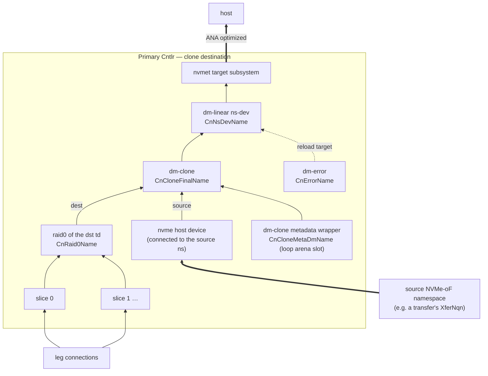
```mermaid
flowchart BT
    subgraph pc["Primary Cntlr — clone destination"]
        SL0["slice 0"]
        SL1["slice 1 …"]
        R["raid0 of the dst td<br/>CnRaid0Name"]
        MLV["dm-clone metadata wrapper<br/>CnCloneMetaDmName (loop arena slot)"]
        SRC["nvme host device<br/>(connected to the source ns)"]
        DC["dm-clone<br/>CnCloneFinalName"]
        NS["dm-linear ns-dev<br/>CnNsDevName"]
        T["nvmet target subsystem"]
        E["dm-error<br/>CnErrorName"]
        SL0 --> R
        SL1 --> R
        R -->|"dest"| DC
        SRC -->|"source"| DC
        MLV --> DC
        DC --> NS
        NS --> T
        E -.->|"reload target"| NS
    end
    XS["source NVMe-oF namespace<br/>(e.g. a transfer's XferNqn)"] ==> SRC
    T ==>|"ANA optimized"| H["host"]
    G["leg connections"] --> SL0
    G --> SL1
```

*Fig. `090Clone` — while a clone targets a td, the `CnNsDevName` of each
namespace backed by that td is reloaded onto the dm-clone; dm-clone pulls
missing regions from the source and hydrates in the background.*

**CreateClone** — Errors: `ALREADY_EXISTS` clone key; `RESOURCE_EXHAUSTED`
at `MaxCloneCntPerSp`; `NOT_FOUND` `dst_td_name`; `FAILED_PRECONDITION` the
destination td already targeted by another clone; `INVALID_ARGUMENT` when
`src_tr_conf` is empty, `src_nqn` is invalid, `src_slice_cnt` is outside
one to `MaxSliceCntPerSp` (unlike `CreateStoragePool`'s own `slice_cnt`, a
`src_slice_cnt` of zero is refused, not defaulted — it describes a source
that already exists), `src_stripe_size` is not a positive multiple of
`MinDmRaid0StripeSize` at most `MaxDmRaid0StripeSize`, `src_block_size` is
not a positive multiple of `MinDmPoolDataBlockSize` at most
`MaxDmPoolDataBlockSize`, or `src_block_size` is not a multiple of
`src_stripe_size` (the source rules of raid0 bitmap math). Defaults:
`dm_clone_conf` per Common validation; `auto_resume` as sent.
Precondition (not verifiable by the control plane, a documented contract,
[D3]): the destination td must be **empty** — freshly created and never
written. Clone crash recovery equates "mapped in the destination thin
pools" with "already copied", which only holds for an initially empty td.
Action: STM: `clone_id` from `next_id`; write the `Clone`, append to
`clone_name_list`, bump `SpRev`. Reply `clone_id`.

On the primary cntlr (`cnagent.md` CN18 is the spec) the clone's build is
the `CreateClone` steps of Transfer + clone = cross-SP live migration: the agent
connects to the source (`src_tr_conf_list` and `src_nqn`, host NQN
`CnHostNqn`, retried until it succeeds), allocates the clone's contiguous
units in the clone-metadata arena of Controller node, common, hole-punches
that range on the loop device and creates the wrapper `CnCloneMetaDmName`
over it ([D14]), builds the dm-clone
`CnCloneFinalName` — metadata that wrapper, destination the destination
td's `CnRaid0Name`, source the connected namespace at `src_ns_idx`, region
size this SP's `block_size`, `hydration_threshold` and
`hydration_batch_size` from `dm_clone_conf` — and then, for each
destination-td namespace that is not effectively suspended, reloads its
`CnNsDevName` onto the dm-clone and moves it to ANA `optimized`;
`auto_resume` is what overrides a stored `suspended` true (`cnagent.md`
CN16). Otherwise the ns-dev stays parked, live, on the td's dm-error and
`inaccessible` (nothing is dm-suspended, so there is no resume step —
Namespace suspend semantics). After a CN reboot the primary rebuilds the
clone by Clone crash recovery before letting any IO through.

Admission: the checks above gate `MaxCloneCntPerSp` only. The binding
ceiling is the primary CN's clone-metadata arena, whose `CnCloneMetaUnit`
units are shared by every clone of every cntlr on that CN — every clone
costs at least two units, large tds at small block sizes far more
(`cnagent.md` CN18 carries the arithmetic). The control plane does not
gate against it: an over-committed clone is created normally and its
`clone_id_to_meta` and `clone_id_to_dm_clone` rows report
`RES_STATUS_ERROR` until arena units free up. Callers must place clones
against the per-CN budget, not against `MaxCloneCntPerSp`.

**DeleteClone** — Errors: `FAILED_PRECONDITION` when `force` is false and
hydration is not complete — checked outside the STM through `GetCntlrInfo`
of the primary (`clone_id_to_dm_clone.details` carries the dm-clone
status); an unreachable agent is `FAILED_PRECONDITION` too. A delete of a
clone whose `deleting` is **already** true returns OK with no writes, no
revision bump and **no agent call**: the check comes first, in phase 1
of this two-phase RPC (`gateway.md` AG4), because after the latch the CN
has torn the stack down, so `GetCntlrInfo` reports no dm-clone and a
hydration check would wedge every repeat delete in `FAILED_PRECONDITION`
for ever (`dnv-worker.md` CLD3). A
stale revision token is still `ABORTED` ahead of it. Action: the deciding
STM writes the latch and nothing beyond it: `Clone.deleting` true,
`suspended` false on every namespace whose `td_id` is the clone's
`dst_td_id` (one `Subsystem` put per subsystem that actually changes, up to
`MaxSsCntPerSp` of them), and one `SpRev` bump. It does **not** delete the
`Clone` key, does not touch a chunk key and does not shrink
`clone_name_list` — the name must survive until the final transaction,
because `model.LoadSp` fetches clones by iterating that list
(`dnv-worker.md` CLD4). Reply `clone_id`.

The namespace resume rides the latch rather than the teardown,
deliberately: it and the fan-out exclusion then arrive in one `SpRev`
bump, hence one syncup, where a resume deferred to the end of the drain
would leave the destination namespace dark for the whole teardown
(`dnv-worker.md` CLD4).

The teardown is the sp worker's clone drain. From the first post-latch
fan-out the clone is absent from every cntlr's `clone_list` and from the
primary's chunk-push plans, which is what makes the primary reload those
namespaces' `CnNsDevName`s back onto the raid0 (all data is local), remove
the dm-clone and then its metadata wrapper `CnCloneMetaDmName` (whose arena
units are free again at the next registry enumeration, [D14]), disconnect
the source and delete the clone's `LocalCloneBmPath` files (Bitmap push
protocol). None of that is a path of its own: the clone is not in the
wanted set, so the sweep of Teardown by sweep removes it
(`dnv-worker.md` CLD5; `cnagent.md` CN18). Meanwhile the worker deletes
the chunk keys `MaxDelBmPerTxn` at a time and then the `Clone` key together
with its `clone_name_list` entry (`dnv-worker.md` CLD8, CLD9). Every clone
transaction fits etcd's default transaction cap, whatever the slice and
chunk ceilings become, so nothing on the clone path needs the raised
`--max-txn-ops` (`dnv-worker.md` CLD11).

Consequences, all of them following from the `Clone` key and its
`clone_name_list` entry surviving until the last transaction: `DeleteClone`
returns while the clone still exists, so an observer polls `GetClone` until
`NOT_FOUND`; a same-name `CreateClone` keeps failing until then —
`ALREADY_EXISTS`, or `RESOURCE_EXHAUSTED` on an SP the surviving entry
holds at `MaxCloneCntPerSp`, that ceiling being the length of
`clone_name_list` and checked ahead of the name, which is also why an
**unrelated** `CreateClone` on a full SP fails for the whole drain; a
second `CreateClone` onto the **same** destination td keeps failing
`FAILED_PRECONDITION` ("already the destination of clone …"), because that
scan walks `clone_name_list`; `DeleteThinDevice` of the destination td,
and a `CreateThinDevice` snapshotting it (Thin devices), keep failing for
the same reason; and `DeleteStoragePool` keeps refusing while any clone
drains — its refusal names the first kind of object the pool still
holds, checking thin devices first, and a draining clone's destination td
cannot be deleted while the clone exists, so the thin-device refusal is
the one a caller meets. A top-down teardown is therefore: delete the
clone, poll `GetClone` until `NOT_FOUND`, then delete the td or the SP.

**GetClone** — STM read.

**UpdateCloneTrConf** — STM: replace `src_tr_conf_list`, bump `SpRev`
(used when the source SP's cntlrs moved); the primary reconnects.

**AppendCloneBitmap** — Errors: `FAILED_PRECONDITION` when the clone's
`deleting` is true (`DeleteClone` is the only RPC allowed to act on a
deleting clone, and a racing append could otherwise write a chunk key
behind the drain — which is also what makes the drain's final emptiness
guard stable, `dnv-worker.md` CLD1); `INVALID_ARGUMENT` empty `bitmap`;
`INVALID_ARGUMENT` a `bitmap` longer than `CloneBmChunkBytes` (stateless,
judged on this request alone); `INVALID_ARGUMENT` `src_slice_idx` at or
above `Clone.src_slice_cnt`; `INVALID_ARGUMENT` `bm_idx` at or above
`MaxCloneBmCnt`; `RESOURCE_EXHAUSTED` when the stored chunk plus the new
page would exceed `CloneBmChunkBytes` — the chunk's ceiling reached by
previous appends, the same shape as `AppendMigrationBitmap`'s `bm_cnt` cap.
Action: STM: append the bytes to the `CloneBitmap` key of
(`src_slice_idx`, `bm_idx`) (created if absent), bump `SpRev`. The `Clone`
record is not rewritten. These are the **source bitmaps**: bit *k* of
source slice `src_slice_idx` covers `src_block_size` bytes of that slice's
local address space; **1 = the source never wrote there, so the region is
skippable**. They are a pure optimization delivered through
`PushCloneBitmap` (Bitmap push protocol) and may be applied at any time,
even after the dm-clone started serving IO (Clone crash recovery);
durability never depends on them.

A slice's bitmap is split into up to `MaxCloneBmCnt` fixed-capacity chunks
of `CloneBmChunkBytes` each: chunk (s, b) holds the bytes of source slice
s's bitmap from offset b·C on, at most C of them, C being
`CloneBmChunkBytes`. Positions across chunks are fixed by `bm_idx` alone —
no chunk's meaning depends on any other chunk's existence or length — so a
caller may append to any (s, b) at any time, in any order, and may leave
chunks unsent entirely; an absent chunk is semantically all-zero
(all-written) and a short chunk's missing tail reads as written, both the
safe direction. **Within** one chunk a page lands at the chunk's current
length, so the pages of one chunk must arrive in slice-bitmap order — the
per-slice append contract scoped down to a chunk, which exists because
callers page the source bitmap through `GetThinDeviceBitmap` and because
etcd values are size-limited. A chunk already pushed and acknowledged may
keep growing ([D8]).

The `Clone` record carries no chunk count: the set of a clone's chunks is
the set of its `CloneBitmap` keys (Key table), which is what the drain and
`PushCloneBitmap` read.

### Transfers

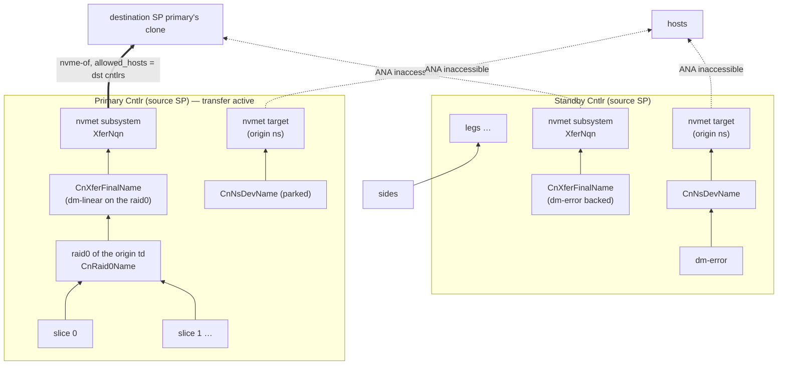
```mermaid
flowchart BT
    subgraph prim["Primary Cntlr (source SP) — transfer active"]
        SL0["slice 0"]
        SL1["slice 1 …"]
        R["raid0 of the origin td<br/>CnRaid0Name"]
        LX["CnXferFinalName<br/>(dm-linear on the raid0)"]
        NX["nvmet subsystem<br/>XferNqn"]
        LP["CnNsDevName (parked)"]
        NP["nvmet target<br/>(origin ns)"]
        SL0 --> R
        SL1 --> R
        R --> LX
        LX --> NX
        LP --> NP
    end
    subgraph stby["Standby Cntlr (source SP)"]
        LEGS["legs …"]
        EX["CnXferFinalName<br/>(dm-error backed)"]
        NXS["nvmet subsystem<br/>XferNqn"]
        ES["dm-error"]
        LS["CnNsDevName"]
        NS2["nvmet target<br/>(origin ns)"]
        EX --> NXS
        ES --> LS
        LS --> NS2
    end
    SIDES["sides"] --> LEGS
    NX ==>|"nvme-of, allowed_hosts = dst cntlrs"| DST["destination SP primary's clone"]
    NXS -.->|"ANA inaccessible"| DST
    NP -.->|"ANA inaccessible"| H["hosts"]
    NS2 -.->|"ANA inaccessible"| H
```

*Fig. `100Transfer` — after `CreateTransfer` with `auto_suspend` true the
origin namespace is parked everywhere; the xfer subsystem is the only live
reader and writer of the bytes, served by the primary.*

**CreateTransfer** — Errors: `ALREADY_EXISTS`; `RESOURCE_EXHAUSTED` at
`MaxXferCntPerSp`; `NOT_FOUND` for an `ori_nqn` or an `ori_ns_idx` the SP
does not hold; `INVALID_ARGUMENT` for the NQN rules of Common validation on
`ori_nqn`, the dnv-namespace one included, and for the host-NQN rules on
`allowed_hosts`, where callers put the destination cntlrs' `CnHostNqn`s.
Action: STM: `xfer_id` from `next_id`, write the `Transfer`, append the
name to `xfer_name_list`, bump `SpRev`; reply `xfer_id`. Every enabled
cntlr creates the xfer stack (`cnagent.md` CN17): the primary builds
`CnXferFinalName`, a dm-linear on the origin td's raid0, and exports it as
subsystem `XferNqn` on the CN's port — nsid `ori_ns_idx`, the origin
namespace's `dev_nguid` and `dev_uuid`, `allowed_hosts` from the record,
verbatim — an empty list admits no host (Primary cntlr, step 6) —, the
cntlid bounds of `Cntlr.cntlid_slot`; the standbys export the same
subsystem backed by a dm-error `CnXferFinalName`, with ANA inaccessible
(fig. `100Transfer`, right half). Iff `auto_suspend`, the primary first
(1) moves the origin namespace to ANA inaccessible on every cntlr and (2)
parks the origin namespace's `CnNsDevName` on its td's dm-error; the
destination clone is then the only reader and writer of the bytes (the
effective suspend of `cnagent.md` CN16; Namespace suspend semantics).

**DeleteTransfer** — `force` false **finalizes** a completed hand-over:
the STM additionally sets `suspended` true on the origin namespace, so the
source stays parked after the xfer object disappears. `force` true
**aborts**: `suspended` is left false, so the next syncup restores normal
service (the ns-dev reloaded onto the raid0, ANA back). Action: STM: remove
the name from `xfer_name_list`, delete the `Transfer`, set `suspended` when
finalizing, bump `SpRev`; the agents drop the xfer subsystem and its dm
devices. Reply `xfer_id`.

**GetTransfer** — one STM read. **UpdateTransferHosts** — STM: replace
`allowed_hosts`, bump `SpRev` (a destination cntlr moved to another CN).

### Migrations

The data-plane procedure and its figure, fig. `080Migration`, are under
Migration.

**CreateMigration** — Errors: `ALREADY_EXISTS` for the migration key;
`NOT_FOUND` when `src_side_id` is in no leg of the SP, spare legs
included; `RESOURCE_EXHAUSTED` at `MaxMigrCntPerSp` or when no DN is a
candidate (Per-operation allocation); `FAILED_PRECONDITION` when the owning leg
already has two sides (a migration is already running on it), or when
`cntlid_slot_list` holds no slot different from the source side's (cntlid
slots: such an SP cannot migrate this leg at all; `gateway.md` D-I).

Action: allocate one DN (Per-operation allocation). The deciding STM drops
a pick when the group, as that STM reads it, occupies a DN the scan's read
of the group did not, and the scan and the STM re-run as a unit from a
fresh read of the group (`gateway.md` GW9): the scan's black list and
tier-1 locations come from that earlier read, so a side hung off the group
since — a migration of its other leg, a spare — could put the pick on its
DN or in its failure domain. In the STM: `migr_id` and `dst_side_id` from
`next_id`; a new `Side` appended to the leg's `side_list`, with a
`cntlid_slot` from `cntlid_slot_list` different from the source side's —
the only slot constraint sides have (cntlid slots) —, `addr_port` and
`nvme_tr_conf` copied from the destination DN, and `provisioned` false
([D15]); a `Migration` written with `migr_id`, `src_side_id`,
`dst_side_id`, the request's `dm_clone_conf` and a zero `bm_cnt`, its name
appended to `migr_name_list`; the destination DN's bookkeeping — the side
in its `side_ptr_list`, the group's `ext_cnt` taken from its
`free_ext_cnt`, its capacity key per Capacity index keys, its `DnRev`
bumped —; a `SpRev` bump. Reply `migr_id`. The destination side therefore
provisions (Side provisioning protocol) before any migration machinery
starts; until the sp worker flips it, `migr_src_conf.dst_provisioned`
false keeps the source side serving untouched (Migration, which carries
the data-plane choreography).

**Admission.** The DN candidate scan covers **extents** only. The
destination DN's [D13] clone-metadata area — `DnCloneMetaSize` bytes of
`DnCloneMetaUnit` units per **DN**, shared by every destination role the
node hosts across every SP — is not part of admission: each migration's
slot costs a fixed base plus one byte per region of the side, rounded up to
whole units, so the area bounds the concurrent destination roles of one
DN, the more tightly the larger the side and the smaller the block size
(`dnagent.md` DN13). A migration the area cannot serve is still created;
each converge of its destination that meets the shortfall reports it on
the `migr_dst_info` rows (`dnagent.md` DN13).
`MaxMigrCntPerSp` bounds none of this.

**FinishMigration** — Errors: `FAILED_PRECONDITION` when `force` is false
and hydration is incomplete, which is checked outside the STM through
`GetSideInfo` of the **destination** side
(`migr_dst_info.dm_clone_info.details`); an agent that does not answer
that call is `FAILED_PRECONDITION` too (`gateway.md` AG3). Action: STM:
remove the **source** `Side` from the leg, the destination side becoming
its only one; the source DN's bookkeeping (pointer out, extents back,
capacity key per Capacity index keys, `DnRev`); delete the `Migration` and
every `MigrBitmap` and remove the name from `migr_name_list`; bump
`SpRev`. The destination agent reloads its per-cntlr dm-linears from the
dm-clone straight onto the side device and drops the dm-clone, the
metadata wrapper and its slot, the nvme host connection and the
migration's `LocalMigrBmPath` files (Bitmap push protocol; `dnagent.md`
DN13); the source DN agent sees the pointer disappear and tears the side
down. Reply `migr_id`.

**CancelMigration** — the mirror rollback: the STM removes the
**destination** `Side`, the `Migration` and its bitmaps, returns the
destination DN's extents, and bumps `SpRev` and the destination's `DnRev`.
The source side returns to normal service on the next `SyncupSide` (ANA
back, the migration export dropped); the destination agent tears its stack
down, the `LocalMigrBmPath` files included.

**GetMigration** — one STM read.

**AppendMigrationBitmap** — Errors: `INVALID_ARGUMENT` empty `bitmap`;
`RESOURCE_EXHAUSTED` when `bm_cnt` is at or above `MaxMigrBmCnt`.
Action: STM: write a `MigrBitmap` at a `bm_idx` equal to `bm_cnt`,
advance `bm_cnt`, bump `SpRev`. The chunks concatenate, in `bm_idx`
order, into one bitmap over the **leg's data region**: bit k covers
`block_size` bytes, and **1 means never written, hence skippable**. Every
append creates a **new** chunk key, so a written chunk is immutable.
Delivery to the destination DN goes through `PushMigrBitmap` (Bitmap push
protocol); the destination agent shifts the bitmap by the leg's
`meta_blocks` (`migr_dst_conf.meta_blocks`: the meta region — md
superblock, bitmap, health block — must always be copied, Group on-leg
layout: meta region, data region, health block) and discards the fully
skippable dm-clone regions (`dnagent.md` DN15).

### Spare legs

**CreateSpareLeg** — Errors: `NOT_FOUND` when `grp_id` is not in the SP;
`INVALID_ARGUMENT` when the group is `RedundNone`; `RESOURCE_EXHAUSTED` at
`MaxSpareLegPerGrp` or when there is no DN (Per-operation allocation);
`FAILED_PRECONDITION` at an `sp_level` at or above `SP_LEVEL_NO_THINPOOL`
("sp level suppresses reactions", as for GrowSlice), and while a spare of
the group still has a side that is not `provisioned`
("spare_unprovisioned"): for as long as that holds, the refusal keeps two
overlapping sp-worker owners from creating two spares for one repair
(`dnv-worker.md` AR2, AR8 step 3). Action: STM: a new `Leg` — a fresh
`leg_id`, `leg_idx` the next unused index in the group, one `Side` written
`provisioned` false ([D15]) — appended to `spare_leg_list`; the DN's
bookkeeping and `DnRev`; a `SpRev` bump. Every cntlr connects to the
spare's side and health-checks it (Primary cntlr, the legs), **but the
spare is not added to the md array**: it is pre-connected standby capacity
only. An unprovisioned spare defers only itself — spares never assemble
("Make sure all groups are available") — and reports
`RES_STATUS_PROVISIONING` until it clears. Reply `leg_id`.

**DeleteSpareLeg** — Errors: `NOT_FOUND` for `grp_id` or `leg_id`;
`FAILED_PRECONDITION` when the spare has two sides: a migration is running
on it (Migrations accepts a spare's side as a migration source), and
releasing both would leave the `Migration` naming sides in no leg, which
neither `FinishMigration` nor `CancelMigration` could then end. Action:
STM: remove the spare from `spare_leg_list`, give the DN its bookkeeping
back, bump `SpRev`. Reply `leg_id`.

**SwitchSpareLeg** — the only way a spare becomes active; users invoke it,
and so does the sp worker's leg repair (Automatic reactions; `dnv-worker.md`
AR8). Errors: `NOT_FOUND` for ids not in the group's lists;
`FAILED_PRECONDITION` when the spare's side is not yet `provisioned`
("spare side is not provisioned": an unzeroed spare must never become an
md member, [D15]), when either leg has two sides (a migration is running on
it and holds the leg until `FinishMigration` or `CancelMigration` ends it,
so a migrating leg is neither promoted nor parked), or at an `sp_level` at
or above `SP_LEVEL_NO_THINPOOL` ("sp level suppresses reactions", as for
GrowSlice). Action: STM swap: `spare_leg_id` moves to `leg_list`, taking
the active role, and `target_leg_id` moves to `spare_leg_list`; bump
`SpRev`. The primary then fails and removes the target if the array still
lists it and adds the promoted spare with failfast, and md rebuilds onto it
— cheaply through the write-intent bitmap when the target was only briefly
absent, but a fresh spare gets a full resync (`cnagent.md` CN12, member
reconciliation). Reply the current active and spare leg ids.

### Bitmap reads

**GetThinDeviceBitmap** — inputs `td_name`, `slice_idx`, `start_block` and
`block_cnt`. The gateway resolves the primary cntlr's CN in an STM, then,
outside it, calls the agent's `GetThinDeviceBm`, which computes from a
dm-thin metadata snapshot of that slice's pool the mapping bitmap of the
td's thin volume in that slice (`cnagent.md` CN25, CN26): bit k, for block
`start_block` plus k of `block_size` bytes, is **1 iff the block is
unmapped, never written**. A zero `block_cnt` reads to the end. Callers
page through it and feed `AppendCloneBitmap` on the destination. A caller
that pages in reads aligned to the source blocks one chunk covers — eight
times `CloneBmChunkBytes`, one bit per block — maps each page to its chunk
statelessly, its `bm_idx` being `start_block` divided by that span, which
is all it takes to satisfy the within-a-chunk append order of Clones
without tracking any cursor.

**GetLegBitmap** — inputs `leg_id`, `start_block` and `block_cnt`. The
same path through the agent's `GetLegBm`: the agent walks the pool
metadata of the owning slice and translates pool-data blocks through the
pool-data linear concat and the group geometry down to this leg's **data
region** (`cnagent.md` CN27), returning bit k as **1 iff no pool block maps
there**. Callers feed `AppendMigrationBitmap`.

**Wire convention.** Every bitmap RPC — `GetThinDeviceBitmap`,
`GetLegBitmap`, `Append*Bitmap`, `Push*Bitmap` — uses **1 = unwritten,
skippable**, while thin-pool metadata natively answers **mapped =
written**; agents and callers invert once at
the boundary (raid0 bitmap math), and the gateway passes the bytes through
verbatim (`gateway.md` GW14). The **bit order** is normative too: bits are
**LSB-first within each byte** — bit i is bit i mod 8 of byte i div 8 —
and the trailing pad bits of the last byte are zero. Chunks are
byte-aligned, so the bit-level concatenation of a migration's chunks is
plain byte concatenation (Bitmap push protocol, raid0 bitmap math).

## Agent services and agent behavior

### Common agent rules

* **Local store.** The agent persists, per synced object, the serialized
  **last accepted request**, at the point the Revision gate below gives,
  as a flat protobuf file: `SyncupDnRequest` at `LocalDnPath`,
  `SyncupSideRequest` at `LocalSidePath`, `SyncupCnRequest` at
  `LocalCnPath`, `SyncupCntlrRequest` at `LocalCntlrPath` — plus one
  file per received bitmap chunk at `LocalMigrBmPath` or
  `LocalCloneBmPath` (Agent local-store paths, Bitmap push protocol).
  Every write goes to a temp file in the same dir, fsync,
  rename, fsync the dir (until then a crash can undo the rename). A write
  that does not succeed can leave its temp file behind, as one whose process
  dies between the write and the rename does (`osclient.md`, ReadFile /
  WriteFile / WriteFileDirect, lists every way). The committed file is the
  only truth: the next start deletes such a file unread (`dnagent.md` SH6),
  since what it held was never committed and the worker sends again whatever
  the committed files lack. The stored request contains the revision, so no
  separate revision record exists. In memory each side's and each cntlr's
  current request is an atomic pointer, so another object's pass reads it
  whole beside the converge that replaces it; a node's request is replaced
  only under the node write lock. On start the agent loads every
  other file of its role's kinds under its prefix, reconciles the system to
  it (full idempotent re-apply; Clone crash recovery for clones), then
  serves — except that it skips, neither loading nor deleting them, the
  files that may belong under a file it cannot load: a file that did not
  load names no object, so it proves no owner gone (`dnagent.md` DN2 and
  `cnagent.md` CN2 say which files that holds back). When an object
  disappears from its parent's pointer list, the agent drops its file or
  files, its chunk files, its in-memory entry and its object lock in that
  same pass, **before** anything of it is removed — save a file a restart
  left unloaded that no memory entry has named since (a file that did not
  load, or one skipped as above): the sweep (Teardown by sweep) removes its
  object's resources by name in that pass, and such a file stays until a
  later restart decodes it and finds the pointer absent (`dnagent.md` SH7).
  The agent keeps no record of the object afterwards because it needs none:
  the sweep finds the object's resources by their names, and a record kept
  until they were gone would be a record of work owed — the very thing that
  lets a failed teardown be forgotten.
* **Revision gate.** A `Syncup*` request with a revision **lower** than
  the stored one is rejected (`AgentReply.code` non-zero, `details`
  explains). Equal revision: re-apply idempotently (workers retry).
  Higher: accept, subject to the conf gate below. When an accepted request
  is persisted is the agent docs' rule — a node's request before its
  converge, a side's or a cntlr's after it (`dnagent.md` SH5, `cnagent.md`
  CN7). `Push*Bitmap` carries no revision and passes no such gate (Bitmap
  push protocol): a chunk is
  position-addressed data under an id that is never reused, it never
  advances the stored revision, and the agent refuses one for an object
  it does not know by name — so a push planned against a report that a
  newer desired state has replaced is either still correct or refused,
  and gating it on a revision would only ever discard work that is about
  to be redone.
* **Conf gate.** Agents resolve no conf defaults of their own (Common
  validation): a geometry an agent invented is one the rest of the
  cluster does not share, and dm, md and the on-disk headers would be
  built against it. A request carrying a value the control plane cannot
  have written — `SyncupDn`'s `extent_size` zero, or a zero among the
  three always present defaultable members of `SyncupCntlr`'s `bdev_conf`
  plus the `bitmap_chunk_block_cnt` that exists only under an md-raid1
  `redund_conf` — is refused with its own `AgentReply.code`
  (`ReplyCodeInvalidConf`, `dnagent.md` SH9) **after** the revision gate
  and **before** the request becomes the desired state, so nothing
  converges, nothing is persisted, and the restart reconcile cannot
  replay it; the reply echoes the revision the agent still holds, so the
  worker sees the request was not accepted. A persisted file carrying such
  a value never becomes live either, and both roles get there the same
  way: the file is **loaded**, never skipped, and refused inside the
  converge, which then converges and sweeps nothing of that DN and its
  sides, or of that cntlr, and leaves the node as it found it — a conf
  fault must not destroy resources (`dnagent.md` DN2 says why skipping
  the file instead would; `cnagent.md` CN8).
* **Full sync.** Every `Syncup*` request carries the complete desired
  state of its object — there is no partial mode.
  `SyncupDn.side_pointer_list` and `SyncupCn.cntlr_pointer_list` are
  authoritative: pointers in the request but not local ⇒ add; local but
  not in the request ⇒ drop the object's state and let the sweep (Teardown
  by sweep) remove its resources by name (ids are never reused, so a
  deleted side or cntlr never comes back). There is no to-be-deleted list:
  a list of removals still owed is memory of a failure, and the agent
  keeps none — what has to go is recomputed from the live node on every
  pass. The embedded object lists inside `SyncupSide` and `SyncupCntlr`
  are authoritative the same way, and what they do not name is swept,
  never diffed against the request applied before it. Bitmap chunks are
  the one thing that never rides in a `Syncup*` request; they travel only
  over the dedicated `Push*Bitmap` RPCs (Bitmap push protocol).
* **RPC shapes.** `Syncup*`, `Push*Bitmap`, `Get*Info`, `GetDnSize` and
  `GetCnSize`, and `GetThinDeviceBm` and `GetLegBm` are unary; the four
  `Check*` RPCs are the only bidirectional streams (Check streams).
  `Syncup*`, `Push*Bitmap`, `Get*Info` and `Check*` replies embed
  `AgentReply` with its `code` and `details` (zero is OK); `Syncup*` and
  `Get*Info` replies also carry the current `*Info` (Live-state reporting),
  and every `Syncup*`, `Get*Info` and `Check*` reply additionally carries
  the revision of the last request the agent accepted for the object
  (`revision`, Live-state reporting) — the exact reply fields are
  listed per RPC under `service DiskNodeAgent` and
  `service ControllerNodeAgent`. `PushMigrBitmapReply` and
  `PushCloneBitmapReply` carry only `AgentReply`; `GetDnSize`, `GetCnSize`,
  `GetThinDeviceBm` and `GetLegBm` return only their payload (`size`,
  `bitmap`) and report failure through the gRPC status. A worker issues the
  `Syncup*` calls for one object sequentially — the next revision only after
  the previous call returned.
* **Error capture.** Shell execution uses the command timeouts (Common
  validation); failures are captured into the affected resource's
  `ResInfo` as `RES_STATUS_ERROR` with the reason in `details` rather than
  crashing the reconcile — the agent always converges as much as it can
  and reports the rest.
* **Bitmap durability.** Received `Push*Bitmap` chunks are persisted per
  chunk under `LocalMigrBmPath` or `LocalCloneBmPath`; the applied sets
  reported through `bm_info.bm_idx_list` and `bm_info_list`'s
  `chunk_id_list` are derived from the files present, so they survive
  agent restarts and the worker does not have to re-push after one — save
  a chunk whose own file, or whose owner's or that owner's parent's, the
  restart could not load: it stays out of the applied set — left on disk
  or deleted — so the worker pushes it again if it still wants it
  (`dnagent.md` DN2, `cnagent.md` CN2). Re-applying a chunk is always
  harmless — re-`blkdiscard`ing an already-hydrated dm-clone region is a
  no-op, which holds only because every dnv dm-clone carries
  `no_discard_passdown` ([D7]; `cnagent.md` CN18). Bitmap push protocol
  and [D7] give the whole protocol.

### `service DiskNodeAgent`

* `GetDnSize` returns the byte size of the `--disk` device's **data area**:
  the raw size minus the fixed `DnDataOffset` prefix of the [D13] format.
  A device at or below `DnDataOffset` is an Internal error. The gateway
  calls it before registration; `dn_id` in the request is for logging
  only (`dnagent.md` DN3).
* `SyncupDn` carries `revision`, `side_pointer_list` and `extent_size` (the
  cluster's `dn_bin_conf.extent_size`, stamped into the disk header at
  format time and immutable from then on, Disk node). It ensures the Disk
  node base state — the [D13] disk format and this agent's own nvmet port
  — and diffs the pointer list per Common agent rules. Reply
  `agent_reply`, `revision`, `dn_info`.
* `SyncupSide` carries one `side_pointer`, `revision`, `side_conf`
  (`ext_cnt`, `cntlid_slot`, `primary_cn_id`, `standby_id_list`,
  `sp_level`, `provisioned`) and — only when this side is a migration
  endpoint — `migr_src_conf` (`migr_id`, `dst_side_id`, `dst_dn_id`,
  `dst_provisioned`: the source role, Migration) and/or `migr_dst_conf`
  (`migr_id`, `src_side_id`, `src_dn_id`, `src_nvme_tr_conf`,
  `block_size`, `meta_blocks`, `dm_clone_conf`, `bm_cnt`: the destination
  role). It is rejected if the pointer is unknown (`SyncupDn` must
  introduce it first). It converges the per-side stack of Disk node: the
  side device of `ext_cnt` extents and its zeroing state (Side
  provisioning protocol), the per-CN dm-error, dm-linear and nvmet
  subsystem, the primary versus standby table targets and ANA states, and
  the migration source and destination roles (Migration). Reply
  `agent_reply`, `revision`, `side_info` (which always reports
  `zeroed_ext_cnt` and `total_ext_cnt`, Side provisioning protocol) and
  `bm_info` (the applied migration-bitmap indexes, Bitmap push protocol).
* `PushMigrBitmap` delivers one `MigrBitmap` chunk (`side_pointer`,
  `migr_id`, `bm_idx`, `bitmap`) to the **destination**-side agent, per
  Bitmap push protocol: persist the chunk at `LocalMigrBmPath`, then
  recompute and `blkdiscard` the fully skippable dm-clone regions
  (Migrations, raid0 bitmap math). Reply `agent_reply` only.
* `GetDnInfo` and `GetSideInfo` return the current `DnInfo` or `SideInfo`
  without changing anything (`agent_reply`, `revision`, the info).
* `CheckDn` and `CheckSide` are the health streams, one per DN or per
  side, with the protocol of Check streams. Request: the ids, `revision`,
  `show_info` and `trace_id` (the sending round's id); reply:
  `agent_reply`, `revision`, `dn_info` or `side_info`.

### `service ControllerNodeAgent`

* `GetCnSize` returns the capacity budget in bytes this CN is willing to
  host, zero meaning "use the default"; typically from local config
  (`cnagent.md` CN3).
* `SyncupCn` carries `revision`, `qos_ratio` and `cntlr_pointer_list`. It
  ensures the base state of Controller node, common — the tmpfs, the
  sparse backing file and the single loop device of the clone-metadata
  arena ([D14]), the loop device re-learned with `losetup --associated`
  and never persisted, and the single nvmet port; it accepts and persists
  `qos_ratio` and programs no limit, QoS enforcement being deferred
  (Controller node, common; `cnagent.md` CN6); and it diffs the pointers.
  Reply `agent_reply`, `revision`, `cn_info`.
* `SyncupCntlr` carries one `cntlr_pointer`, `revision`, `bdev_conf`
  (`dm_pool_conf.low_water_mark_pct` included, Primary cntlr),
  `sp_level`, `cntlr`, `id_to_slice` (keyed by the `slice_id` rendered
  with `IdKeyFmt`), `td_list`, `nqn_to_subsystem`, `clone_list`,
  `xfer_list` and `migr_list`. It converges Primary cntlr or Standby
  cntlr; a primary-to-standby or standby-to-primary flip follows Failover
  exactly, and a clone rebuild follows Clone crash recovery. Reply
  `agent_reply`, `revision`, `cntlr_info` and `bm_info_list` (the applied
  clone-bitmap chunks, one `BitmapInfo` per clone, its applied set carried
  as `chunk_id_list` of `(src_slice_idx, bm_idx)` pairs, Bitmap push
  protocol; `bm_idx_list` is for migrations only).
* `PushCloneBitmap` delivers one `CloneBitmap` chunk (`cntlr_pointer`,
  `clone_id`, `src_slice_idx`, `bm_idx`, `bitmap`) to the **primary**
  cntlr's agent, per Bitmap push protocol: persist the chunk at the
  `LocalCloneBmPath` of its pair, translate through raid0 bitmap math,
  `blkdiscard` the dm-clone. Safe at any time (Clone crash recovery).
  Reply `agent_reply` only.
* `GetCnInfo` and `GetCntlrInfo` return the read-only live state
  (`agent_reply`, `revision`, the info).
* `GetThinDeviceBm` and `GetLegBm` serve the gateway's bitmap reads
  (Bitmap reads) from a dm-thin metadata snapshot, reserved, dumped and
  always released (`cnagent.md` CN25 to CN27): the per-slice td mapping
  bitmap, or the leg-projected pool mapping bitmap. Reply bitmaps use the
  wire convention **1 = unmapped**.
* `CheckCn` and `CheckCntlr` are the health streams, one per CN or per
  cntlr, with the protocol of Check streams. Request: the ids, `revision`,
  `show_info` and `trace_id` (the sending round's id); reply:
  `agent_reply`, `revision`, `cn_info` or `cntlr_info`.

### Side provisioning protocol

dnv is a **multi-tenant** service: one tenant must never be able to read
another tenant's bytes. A discard cannot give that guarantee:
discard-reads-zeros is not a hardware property — the kernel does not
promise that a discarded region reads as zeros, and NVMe read-zeroes after
deallocate is optional. Stale bytes also break correctness where this
design *assumes* zeros: a recycled meta-group extent can hold a previous
SP's valid thin-metadata superblock (a fresh pool would adopt stale
metadata), and a stale md superblock flips "Make sure all groups are
available" into the wrong assembly case with no `--zero-superblock`
escape. Therefore **every side is fully zeroed before its first export**,
tracked per extent on disk, gated by a CP-visible `provisioned` flag
([D15]).

**Key invariant.** *Zeroed is a property of the side's allocation, not of
the disk extent* — extents freed and reallocated to a new side start
all-not-zeroed again, whatever happened to them before. "Logical extent
*i*" is the *i*-th extent in the concatenation of the record's `run_list`,
i.e. the *i*-th `extent_size` bytes of the `DnSideName` device.

**Standing hardware assumption (v1).** DN disks support **fast Write
Zeroes**: a batch of `DnZeroBatchExtCnt` extents at the default
`extent_size` zeroes inside `CmdSoftTimeout` for each of the at most
`DnZeroConcurrency` batches a DN agent runs at once. Zeroing commands run
under the ordinary command timeouts (Common validation); there is no special
zeroing timeout. A slower or busier disk costs kills rather than stopping
zeroing: a batch the timeout kills makes the side's next batch smaller, down
to one extent (`dnagent.md` DN9), so zeroing stalls only where one extent
cannot zero inside `CmdSoftTimeout` at the disk's rate split
`DnZeroConcurrency` ways. Operators must therefore keep `extent_size` within
what the disk's Write Zeroes rate, split `DnZeroConcurrency` ways, zeroes
inside `CmdSoftTimeout`, and a batch whose byte length exceeds that bound
can cost a kill and a retry interval each time a side tries it. Zeroing has
no tuning of its own: tuning describes hardware, so it would be per-node
agent configuration, while `ClusterConf` is write-once and cluster-wide; and
raising the global timeouts stretches every command's bound, not just
zeroing's.

**Protocol (dn agent),** four idempotent steps, restart-safe at every
point:

1. Allocate the extent runs; persist the record with `zeroed_bits` all
   zero.
2. Build `DnSideName` (the multi-target dm-linear over the runs).
3. A **background zeroing goroutine** zeroes the not-yet-zeroed extents in
   batches of at most `DnZeroBatchExtCnt`, in order, **through the
   dm-linear** — the side is contiguous in device offsets there, so one
   `blkdiscard --zeroout` covers a batch regardless of physical
   fragmentation — and after each successful batch persists that batch's
   bits in the volume table. A batch starts at the **lowest
   not-yet-set bit**, never at a count of set bits: the two agree while
   the set bits are a contiguous prefix, and only the first-unset rule
   stays correct when they are not (the per-extent bits are strictly more
   general than a watermark).
4. Per-CN export stacks are converged **only** when the request says
   `provisioned` true **and** all bits are set.

**Converge matrix** (request `side_conf.provisioned` × local state):

| `provisioned` | record | bits | behavior | `side_dev_info` |
|---|---|---|---|---|
| false | absent | — | allocate (bits zero), build the linear, ensure the goroutine | `RES_STATUS_PROVISIONING`, "zeroing 0/n" |
| false | present | partial | ensure the linear and the goroutine | `RES_STATUS_PROVISIONING`, "zeroing k/n" |
| false | present | complete | linear ensured; no goroutine; no exports | `RES_STATUS_OK` (the per-CN stacks report `RES_STATUS_PROVISIONING`) |
| true | present | complete | the full Disk node export converge | normal |
| true | present | partial | **refuse exports**; keep the goroutine (it self-heals) | `RES_STATUS_ERROR`, "not zeroed" |
| true | absent | — | **never allocate**; nothing converged | `RES_STATUS_ERROR`, "record missing" |

The rules embedded there: allocation is permitted **only** at
`provisioned` false. At true, a missing record means the data is gone (a
lost or foreign disk); silently re-allocating would present a zeroed
impostor as the data-bearing leg, so it is a hard resource error that
feeds `err_epoch` and the replacement flows (raid1: the spare switch,
which Automatic reactions performs after `leg_unhealthy`; `RedundNone`:
effectively delete-SP). **The agent always trusts its own bits over the
flag** — the disk is authoritative ([D13]); the etcd flag is a gate, never
evidence. A record whose extent total disagrees with `ext_cnt` is an error
(`dnagent.md` DN9). Rows that refuse the exports report every
above-the-side resource as `RES_STATUS_PROVISIONING` with details "side
provisioning"; `RES_STATUS_ERROR` stays confined to `side_dev_info`.
`SideInfo.zeroed_ext_cnt` and `total_ext_cnt` are filled on every reply
and every Check round; equal counts, with the total above zero, mean
fully zeroed.

**The zeroing goroutine.** It is the dn agent's: single-flight per side,
started by any converge (the startup reconcile included) that finds
zeroing needed, with at most `DnZeroConcurrency` batches running at once
per DN agent, a batch size that follows the soft-timeout kills, failures
reported in `side_dev_info` and retried no sooner than
`DnZeroRetryInterval`, and a teardown, `CancelMigration` or process exit
that cancels it and waits for it before the dm device is removed — so no
orphan `blkdiscard` child ever outlives the agent (`dnagent.md` DN9,
SH27). Zeroing continues at every `sp_level`, `SP_LEVEL_DISABLE` included
(SpLevel): it is bottom-layer provisioning.

**Fail-fast hardware check.** The DN base state checks that the `--disk`
device's Write Zeroes is offloaded: a "write_zeroes_max_bytes" of the
device's sysfs queue reading zero means the kernel would fall back to
writing zero pages at bulk speed and the assumption cannot hold, so the
DN reports `meta_info` as `RES_STATUS_ERROR` "disk lacks Write Zeroes",
which flows into `err_epoch` and the capacity-key removal (Capacity index
keys, dn / cn roles) and takes the unsuitable DN out of allocation. An
absent or unreadable attribute is **not** a verdict (`dnagent.md` DN5).

**Probe.** The read-only probes (`GetSideInfo`, `CheckSide`) never
allocate and never start or stop a goroutine: a missing record reads
`RES_STATUS_MISSING` while the flag is false and `RES_STATUS_ERROR`
"record missing" once it is true; incomplete bits read
`RES_STATUS_PROVISIONING` "zeroing k/n" while the flag is false and
`RES_STATUS_ERROR` "not zeroed" once it is true; a table that does not
match the record's runs reads `RES_STATUS_ERROR` (`dnagent.md` DN18).

### Live-state reporting

`ResInfo` carries `res_name`, `status`, `details` and `epoch`, with
`ResStatus`:

* `RES_STATUS_UNKNOWN` — no answer from the node; set by *workers*, never
  by the agent itself.
* `RES_STATUS_MISSING` — the agent has not created it.
* `RES_STATUS_ERROR` — tried and failed; `details` says why, or carries
  the command output — *needs intervention*.
* `RES_STATUS_OK`.
* `RES_STATUS_PROVISIONING` — deliberately not created, being prepared,
  or kept unprobed behind a side's provisioning gate that closed again
  (`dnagent.md` DN9): **healthy, not ready, no action needed**.
* `RES_STATUS_PENDING` — the primary's prober for the leg, started at the
  leg's build, at a promotion or at an agent restart, has not completed a
  round, or none is registered yet: **no verdict, no action needed**.
  Only the primary's leg report produces it (`cnagent.md` CN11).

`epoch` is the unix seconds of the last status change. The `revision`
returned next to an `*Info` (`Syncup*`, `Check*` and `Get*Info` replies)
is that of the request the agent holds for the object — the last one it
accepted (`dnagent.md` SH8, SH25) — whatever the outcome of its converge.
Map keys in `SideInfo` and `CntlrInfo` are the obvious owner ids —
`cn_id` for a side's per-CN export stack; the td, slice, group, leg,
namespace, subsystem, clone and transfer ids in `CntlrInfo`, with
`td_id_to_thin_info[td].slice_id_to_dm_thin` for the per-td × slice thin
volumes; the sp worker's `created` flip reads exactly these rows (sp
role). dm-clone `details` strings carry the raw `dmsetup status` line, so
hydration progress is visible through `Inspect*`.

`CntlrInfo.leg_id_to_leg` reflects the health check of Group on-leg
layout: meta region, data region, health block. On the primary it is the
block-probe IO: a leg whose probe write or read fails, or stays in flight
past the probe's stall bound, is reported `RES_STATUS_ERROR` with the IO
error in `details`, and a leg reads `RES_STATUS_PENDING` until its
prober's first completed round — the prober registers when the leg's
converge succeeds and starts over at a promotion and at an agent restart.
On a standby it is transport liveness plus the expected ANA state
(`cnagent.md` CN11 says how each probe judges, a leg whose converge fails
before its prober registers included). A leg whose prober has not
completed a round does not read `RES_STATUS_OK` because an OK clears
`Leg.err_epoch` (sp role): every promotion would wipe a dead leg's
`err_epoch`, and an unprobed spare would read ready to the leg repair of
Automatic reactions. `RES_STATUS_PENDING` neither sets nor clears it.

`RES_STATUS_PROVISIONING` **never** sets `err_epoch` (dn / cn roles, sp
role) and never counts as a bad status for the capacity keys (Capacity
index keys): it marks a resource excluded from the *effective* desired
state while a side of its backing chain is still zeroing, or while a
side's own provisioning gate holds it back (Side provisioning protocol,
[D15]). Only the deferred resources carry it — a
serving thin pool keeps reporting `RES_STATUS_OK` with its raw `dmsetup
status` details even while a grow is deferred, so the thin-pool auto-grow
of Automatic reactions keeps parsing them. `SideInfo` additionally
reports `zeroed_ext_cnt` and `total_ext_cnt` on every reply and every
Check round, which the sp worker's flip rule reads (sp role).

### Bitmap push protocol

The skip bitmaps of Clones and Migrations reach the data plane exclusively
through two **unary** RPCs, `PushMigrBitmap` and `PushCloneBitmap` —
never through `Syncup*`. Both follow one protocol; the table maps the
per-RPC roles:

| | `PushMigrBitmap` (`DiskNodeAgent`) | `PushCloneBitmap` (`ControllerNodeAgent`) |
|---|---|---|
| chunk source in etcd | `MigrBitmap` keys, `bm_idx` the append sequence from zero below `bm_cnt` (at most `MaxMigrBmCnt`) | `CloneBitmap` keys, addressed by the pair `(src_slice_idx, bm_idx)`: `src_slice_idx` below `src_slice_cnt`, itself at most `MaxSliceCntPerSp`, and `bm_idx` below `MaxCloneBmCnt` chunks **per slice** |
| chunk meaning | chunks **concatenate in `bm_idx` order** into one bitmap over the leg's data region (Migrations); immutable once written | each chunk is a **self-positioned** slice of source slice `src_slice_idx`'s bitmap: chunk (s, b) holds the bytes of slice s's bitmap from b × C on, for its own length of at most C = `CloneBmChunkBytes` (Clones); `AppendCloneBitmap` may keep growing it within C |
| receiving agent | the DN hosting the migration's **destination** side | the CN hosting the **primary** cntlr (only it runs the dm-clone) |
| request fields | `side_pointer`, `migr_id`, `bm_idx`, `bitmap` (no `revision`: see the worker's step 2) | `cntlr_pointer`, `clone_id`, `src_slice_idx`, `bm_idx`, `bitmap` (likewise) |
| local chunk file | `LocalMigrBmPath` of the cluster, dn, sp, migration and `bm_idx` | `LocalCloneBmPath` of the cluster, cn, sp, clone and the pair |
| applied-set report | `SyncupSideReply.bm_info` (`BitmapInfo.res_id` the `migr_id`, applied set in `bm_idx_list`) | `SyncupCntlrReply.bm_info_list` (one `BitmapInfo` per clone, `res_id` the `clone_id`, applied set in `chunk_id_list` as `(src_slice_idx, bm_idx)` pairs) |
| apply action | shift by the leg's `meta_blocks` (Migrations), then raid0 bitmap math → `blkdiscard` on `DnMigrFinalName` | raid0 bitmap math → `blkdiscard` on `CnCloneFinalName` |

**Why chunked, why ordered.** A whole bitmap might be too large for one etcd
value or one gRPC message (`GetThinDeviceBitmap` and `GetLegBitmap` are
paged for the same reason), so it is split into multiple parts and the key
fixes each part's position so the receiver can place it correctly. For
migration chunks the position is by concatenation: chunk *k*'s first bit
sits at the summed bit length of chunks zero to *k*−1, so chunk *k* is only
interpretable once every lower chunk is present — delivery order matters.
Clone chunks are positioned by `(src_slice_idx, bm_idx)` alone:
`src_slice_idx` picks the source slice and `bm_idx` fixes the chunk's byte
offset within that slice's bitmap at the FIXED quantum C, independently of
any other chunk's existence or length. They are therefore order-independent
among each other, gap-tolerant, and growable in place; skipping the all-zero
chunks of a mostly-written slice is a legitimate optimization, not a
protocol violation. An absent chunk reads as all-zero (= all-written) and a
short chunk's missing tail reads as written — always the safe direction, a
region copied instead of discarded.

C is sized so that a grown chunk value plus the rev-bump put stays inside
etcd's default request-size cap and every `PushCloneBitmap`
message inside gRPC's default message size; `MaxCloneBmCnt` chunks bound
the bitmap of one slice, and `MaxSliceCntPerSp` slices of them bound one
clone's bitmaps, measured against etcd's default storage quota. With the
defaults the bitmaps are far smaller: the chunking exists for the
value-size limits and the paged readers, not because bitmaps are
inherently huge.

**dnv-worker side** (sp role; `dnv-worker.md` BM1 to BM6 carry it out):

1. **Learn what is missing from the syncup replies.** Every `SyncupSide`
   and `SyncupCntlr` reply returns the agent's applied sets: `bm_info` for
   the migration whose destination is that side, carried as
   `bm_idx_list`; one `bm_info_list` entry per clone, carried as
   `chunk_id_list` of `(src_slice_idx, bm_idx)` pairs. The worker diffs
   each set against the chunk keys present in etcd; the chunks in etcd
   but not in the reported set are exactly the missed parts still to
   deliver. For a clone the diff is over PAIRS — the same `bm_idx` on two
   different source slices are two distinct chunks (`dnv-worker.md` BM2).
2. **Push one part per request, with no revision.** Each missed part is
   one `PushMigrBitmapRequest` or `PushCloneBitmapRequest` carrying the
   addressing ids (`side_pointer` and `migr_id`, or `cntlr_pointer` and
   `clone_id`), the chunk address (`bm_idx`, or `src_slice_idx` and
   `bm_idx`) and the raw chunk bytes — and nothing else. A push carries
   **no revision and is gated on none** (Common agent rules): the chunk is
   position-addressed data under an id that is never reused, applying it
   never advances the agent's stored revision, and an agent that does not
   know the object refuses the push by name. A part planned against a
   report that a newer desired state has replaced is therefore either
   still correct or refused, and a revision gate would only ever discard
   work the next round is about to redo.
3. **One in flight per migration or clone.** The worker issues the next
   `Push*Bitmap` call for a migration or clone **only after the reply to
   the previous one has arrived**, and pushes its missed parts in
   ascending `bm_idx` for a migration, ascending lexicographic
   `(src_slice_idx, bm_idx)` for a clone. For migrations that order is
   load-bearing: it guarantees the in-order arrival chunk concatenation
   requires. For clones it is deterministic only — self-positioning makes
   order semantically irrelevant (`dnv-worker.md` BM3).
4. **Independence across objects.** Calls for different migrations or
   clones are independent unary calls and may run concurrently, also
   toward the same agent; only the per-object ordering of step 3 matters.
   (Contrast the `Check*` streams, which are long-lived and one per
   object.)
5. **Targets.** Migration chunks go only to the destination side's DN;
   clone chunks go only to the CN currently hosting the primary cntlr.
   After a failover or a destination change the new node's syncup reply
   simply reports an empty or partial applied set and the worker pushes
   the missing parts there (`dnv-worker.md` BM4).
6. **A failure ends this object's plan and is remembered nowhere.** A
   transport error, a chunk whose value can no longer be read from etcd,
   or a reply with a non-zero `AgentReply.code` (an unknown `migr_id` or
   `clone_id`, because the introducing `SyncupSide` or `SyncupCntlr` has
   not been applied yet; or an address outside the object's geometry) is
   logged — with the agent's `details` when the agent answered at all —
   and stops the remaining parts of that migration or clone, since step 3
   sends the next part only after an OK. Nothing is re-armed and no retry
   is scheduled: the object's next `Syncup*` reply reports its applied set
   again, and whatever is still missing is planned again from that. The
   plans of other migrations and clones are unaffected (step 4;
   `dnv-worker.md` BM6).

**dnv-agent side** (`dnagent.md` DN15 and SH21 to SH23; `cnagent.md`
CN22):

1. **Gate by name.** Reject (non-zero `code`) a `migr_id` or `clone_id`
   the agent does not know yet, and — on the CN, whose chunks are
   addressed by a pair — an address outside the clone's own geometry
   (`src_slice_idx` at or above `src_slice_cnt`, `bm_idx` at or above
   `MaxCloneBmCnt`). There is no revision gate: the request carries no
   revision (Common agent rules), and the ids it names are the whole of
   its addressing.
2. **Persist, then apply.** Write the chunk to its `LocalMigrBmPath` or
   `LocalCloneBmPath` file first (the atomic, durable replace of Common
   agent rules); then recompute the fully skippable dm-clone regions from
   **all** chunks of that migration or clone in the applied set (Common
   agent rules, Bitmap durability: the locally present ones, save those a
   restart left unloaded and no push has rewritten since) — raid0 bitmap
   math, migrations first shifting by the leg's `meta_blocks`
   (Migrations) — and apply them to the migration's or clone's dm-clone by
   `blkdiscard`ing `DnMigrFinalName` or `CnCloneFinalName`. A clone's
   chunks are consumed IN PLACE, with no reassembly buffer: bit *k* of
   source slice *s* is skippable iff the chunk of that slice holding it is
   present, the byte holding it is within the chunk's length, and that bit
   is one — an absent chunk, a short chunk or an out-of-range slice all
   mean "written". If the dm-clone does not currently exist (not built
   yet, or suppressed by `sp_level`), the file still counts as applied —
   the agent re-applies every chunk of the applied set whenever it
   (re)creates the owning dm-clone.
3. **Reply.** The `PushMigrBitmapReply` or `PushCloneBitmapReply` carries
   only `AgentReply`; a code-zero reply is the acknowledgement the worker
   waits for before pushing the next part. A chunk whose persist **failed**
   is acked code zero too — both agents log the error and reply OK: the ack
   only releases the next part, and a chunk that was **not yet applied**
   stays out of the applied set — that set is derived from the files present
   (Common agent rules) — so the object's next `Syncup*` reply reports the
   chunk as missing and the worker re-pushes it. Nothing else schedules that
   re-push, and the failed persist does not schedule the `Syncup*` either:
   **no push outcome does**, the failures of the worker's step 6 included —
   the push path raises no re-sync request of any kind — and the object's
   periodic rounds are `Check*` rounds (Check streams), whose replies carry
   no applied set. So the chunk waits for whatever re-issues the object's
   `Syncup*` anyway — a revision bump, or a `Check*` round the agent answers
   with another revision or with a non-zero code (a rejection, or the
   `ReplyCodeLeftover` of Teardown by sweep) — with no timer and no
   push-side retry of its own; until then its regions are copied instead of
   skipped, which costs only the optional bitmap fast path of Clones and
   Migrations. The one case that does not heal even that way, once the
   `Syncup*` comes, is a failed persist of a *grown* clone chunk ([D8]): the
   pair is already in the applied set with its shorter payload, and the
   code-zero ack also refreshes the worker's per-chunk memo, so the agent
   keeps the shorter version until that chunk grows again — the same
   bounded, correctness-neutral loss [D8] already accepts (migration chunks
   are immutable, so the DN side never hits it).
4. **Restart and rebuild.** On start the agent reloads every chunk file
   under its prefix, save a chunk whose own file, or whose owner's or that
   owner's parent's, it could not load, which follows Common agent rules
   instead, and re-applies the chunks once the owning dm-clone is
   (re)built (agent restart, the clone rebuild of Clone crash recovery,
   an `sp_level` lowering) — re-application is idempotent. Because the
   applied sets in `bm_info` and `bm_info_list` are derived from the files
   on disk, they survive restarts and the worker otherwise never re-pushes
   what the node already holds. The files are deleted together with their
   object, by the same sweep that removes its devices (Teardown by sweep)
   — except a chunk a restart left unloaded and no push has rewritten
   since, which waits for a later restart that decodes it (Common agent
   rules; `dnagent.md` DN2, `cnagent.md` CN2): the local store is swept
   against the STORED REQUEST, so a clone that has left `clone_list`
   (Clones) and a side that is no longer the destination of the migration
   whose chunks it holds (Migrations) lose them in that pass, and a side
   whose pointer leaves the DN's list loses them with the rest of its
   local state. What a standby role or an `sp_level` merely SUPPRESSES
   keeps its chunks applied-by-file — a clone on a standby cntlr, a
   destination role the level has switched off — because sweeping those
   would make the worker re-push every one of them the moment the
   suppression lifted.

**Grown clone chunks ([D8]).** `AppendCloneBitmap` may append more bytes
to a chunk `(src_slice_idx, bm_idx)` that was already pushed and
acknowledged — up to the chunk's `CloneBmChunkBytes` ceiling. The worker
therefore keeps an in-memory memo per `(clone_id, src_slice_idx, bm_idx)`
of the etcd mod revision of the chunk it last pushed, and re-pushes a
chunk whose mod revision advanced past it (`dnv-worker.md` BM5); the agent
overwrites the stored file and re-applies whenever a received payload
differs from it. If the worker changes (crash, shard re-ownership) the
memo is lost, and a chunk that grows afterwards while staying in the
acknowledged set may keep its shorter version at the agent — accepted:
source bitmaps are a pure optimization that never affects correctness
(Clones, Clone crash recovery); the only cost is copying some regions that
could have been skipped. Migration chunks are immutable (every
`AppendMigrationBitmap` creates a new `bm_idx`), so they have no such
caveat.

### Check streams

The four `Check*` RPCs — `CheckDn`, `CheckSide`, `CheckCn` and
`CheckCntlr` — are the only bidirectional streams of the agent services.
They carry no desired state — `Syncup*` does that — and exist so a worker
can watch an object's live state cheaply instead of polling `Get*Info`:

* **One stream per object.** The owning worker keeps one `CheckDn` per
  DN, one `CheckSide` per side, one `CheckCn` per CN and one `CheckCntlr`
  per cntlr open for as long as it owns the object (Membership and shard
  ownership). Rounds are **worker-initiated**: one request per health
  round, exactly one reply per request, never an unsolicited agent
  message. The round interval is the object kind's field of
  `ClusterConf.health_check_conf` (`dn_interval`, `cn_interval`,
  `side_interval`, `cntlr_interval`, in seconds; a request's zero becomes
  `DefaultHealthCheckInterval` at `CreateCluster`, within
  `MinHealthCheckInterval` and `MaxHealthCheckInterval`, Common
  validation — a **stored** zero is invalid and costs the object its
  whole round, not a default).
* **Request:** the object ids (`cluster_id` and `dn_id` or `cn_id`, plus
  `side_pointer` or `cntlr_pointer`), `revision` — the worker's current
  **desired** revision for the object (`dnv-worker.md` RW4; the agents
  ignore this request field, and the mismatch check below is the worker
  comparing the *reply's* revision against desired) —, `show_info`, and
  `trace_id`: the id of the worker round that sent it, under which the
  agent runs the round, because the stream's metadata names only the
  round that opened it (`grpc.md` T3).
* **Reply:** `agent_reply`, `revision` — the revision of the last request
  the agent accepted for the object (Live-state reporting) — and the
  `*Info`:
  * `show_info` true ⇒ the agent always fills the complete current
    `*Info` (Live-state reporting);
  * `show_info` false ⇒ the `*Info` is filled only when something changed
    since the previous reply on this stream — a leg became unhealthy, a
    thin pool crossed its low water mark, a resource changed status at
    all (`RES_STATUS_PROVISIONING` to `RES_STATUS_OK` included), or a
    side's `zeroed_ext_cnt` advanced (the sp worker's flip rule reads
    those counters, sp role, so their progress **is** a change and needs
    no blanket carve-out) — and is left unset otherwise. The first reply
    on a fresh stream always carries the full `*Info`.
* **Revision check, and the re-sync it drives.** The worker re-issues the
  object's `Syncup*` when the reply's `revision` differs from the
  **desired** one — the agent does not hold what the worker believes
  current — **or** when `agent_reply.code` is non-zero at all. A rejection
  (stale revision, unknown object, invalid conf) says the request was
  never applied; `ReplyCodeLeftover` (Teardown by sweep) says it WAS
  applied and the node still holds something unwanted, and re-syncing on
  it is the whole of the sweep's retry machinery — the agent recomputes
  the verdict on every round, so an unclean node is swept again every
  round, with no timer and nothing remembered anywhere (`dnv-worker.md`
  RW4 step 5).
* **Health.** The worker turns a broken stream, a missing reply within the
  round timeout, or `RES_STATUS_ERROR` entries in the `*Info` into the
  `err_epoch` updates of dn / cn roles and sp role (`RES_STATUS_UNKNOWN`
  is what the worker records itself while the stream is dead, Live-state
  reporting). The `Check*` replies are the primary health signal; the
  `Syncup*` replies are the secondary one.

### Teardown by sweep

Creation is driven by the desired state alone; **removal is driven by the
difference between the desired state and the live node**. An agent never
derives what to remove from what it remembers — not from the plan it
applied last time, not from a list of removals it owes, not from a flag
saying that one failed. It enumerates what the node actually holds,
subtracts what the desired state wants, and removes the rest. This is the
contract both roles share; `dnagent.md` DN6 and `cnagent.md` CN21 are the
per-role specifications.

The reason is that a removal derived from "applied plan minus new plan" is
forgotten the instant the new plan is stored, so a removal that failed is
never attempted again — the object stays on the node with nothing left
anywhere that names it. The node cannot forget in that way: while the
device is there, the next enumeration finds it.

* **Actual minus desired, at two scopes.** *Node-level*, in `SyncupDn` and
  `SyncupCn` and at startup, under the node write lock: everything
  belonging to a side or an sp whose pointer has left the parent's list,
  plus the objects no side or sp can be read off at all. *Object-level*,
  inside one side's or cntlr's own converge, under the node read lock plus
  that object's own lock, so the objects of one node converge
  concurrently: that object's resources minus its **wanted set**, which is
  what the build phase would ensure for the stored request with every
  [D15] deferral that merely postpones an object left in the set. A
  provisioning leg's wrapper and a deferred group's array are wanted
  although the build skips them, or the pass that is about to build them
  would sweep them away first. The one deferral that shrinks the set
  instead is the source role of Migration: `dst_provisioned`
  false is *defined* to be equivalent to no `migr_src_conf` at all, so a
  deferred source is neither built nor wanted (`dnagent.md` DN6). The
  node-level pass never touches a side or sp that *is* in the pointer
  list, even when its own file is missing: the pointer arrives before the
  object's `Syncup*` (Common agent rules), and after a lost
  `--local-store` the resources must be re-adopted probe-first by that
  `Syncup*`. On the dn the migration objects of such a side's sp wait too,
  at both scopes: they name the sp and the migration and no side, so while
  any side of their sp that the node may host is known by its pointer
  alone the stored requests cannot show them unwanted — the missing one may
  be the one playing the migration — and neither pass removes or names
  them until every such side has its state; taken sooner, a migration
  source's export would go out from under the destination's dm-clone
  (`dnagent.md` DN6).
* **Attribution is by name, and by what a nameless object is built out
  of.** The role letter and the ids of a dm name say which agent, which
  cluster, which node and which sp a dm device belongs to (dm-device
  kinds, dm device names), and a dnv-format NQN says the same of itself
  (NQNs). The objects
  whose names carry no owner are attributed by their contents instead: an
  md array by the leg wrappers among its members, and only when **every**
  member is one of ours and they all name one sp — an array with any other
  member is not attributable and is never stopped, which is what leaves a
  co-hosted dn agent's udev-assembled array alone; a host-facing
  subsystem, whose NQN is the user's own string, by the sp of any stored
  cntlr that still names it in `nqn_to_subsystem`, and only then by the
  ns-dev its namespaces point at — the request has to be asked first,
  because a subsystem whose last namespace was just deleted has nothing
  left to read an owner off; a side's `SideToCnNqn` export, whose NQN names
  a leg and not a side ([D1]), by the per-cn dm-linear that backs its
  namespace; a clone-source connection by the cntlr that names it as `src_nqn`
  or by the live dm-clone that maps it (`dnagent.md` DN6, `cnagent.md`
  CN21). What cannot be attributed to any of the node's own objects is
  *unowned*. The one unowned kind only the node-level pass removes is a
  host-facing subsystem no request claims and no namespace attributes,
  because only its write lock makes "nobody here wants it" stable. Two are
  removed by both scopes. A clone-source connection is settled from state
  already stable under the node read lock: it is tested against every
  stored cntlr's request — each stored before its converge issues any
  `nvme connect` — and against the live dm-clone tables, and a converge
  that finds a source whose disconnect is still in flight neither adopts
  nor reconnects it until that disconnect has returned (`cnagent.md`
  CN10). One narrow window stays open, between the pass's read of the
  stored requests and its setting the disconnect going: another cntlr's
  converge whose request is stored in that window can adopt the
  still-connected source, which the disconnect then deletes under it
  (`cnagent.md`, Known limits). A `SideToCnNqn` export holding no namespace
  and linked to no port but ours is settled by no lock of this agent's: it
  is tested against the request of every side the agent holds — the
  object-level pass judging only its own leg's — and it exports nothing
  and holds nothing open, but every export passes through that very shape
  while it is being built, the build may be a sibling agent's on the same
  kernel, and no request of this agent's can show that build. So it is
  removed only once its configfs directory is older than
  `DnExportOrphanGrace`, its age being the one evidence that can tell
  (`dnagent.md` DN6). A `cb` clone-metadata wrapper no stored cntlr's
  `clone_list` names is swept by the node-level pass too, across every sp
  at once — but it is not unowned: a `cb` name carries its sp, so a cntlr's
  own pass already removes the ones of its sp that its `clone_list` no
  longer names (`cnagent.md` CN2, CN21).
* **Several agents share one kernel, so "not mine" and "nobody's" are
  different answers.** A lab node runs a dn agent per disk and often a cn
  beside them, and dm, nvmet and the nvme host namespace are all per
  kernel. Where a name identifies its owner (the role letter and node id of
  a dm name; a `MigrSrcNqn` export's dn id; a `SideToCnNqn` connection's cn
  id) that is the whole test. Where it does not, the sweep must be able to
  say **foreign** and stop, because "I cannot attribute it" followed by a
  removal takes a healthy sibling's object. A `SideToCnNqn` export whose
  namespace is backed by another dn's per-cn dm-linear is that agent's and is
  never touched; one with no namespace at all is judged by the nvmet port
  it is linked to, since each agent converges exactly one port id, and one
  linked to no port, or only to ours, falls to the age gate above. A
  `MigrSrcNqn` host connection is judged by its controller's host NQN,
  because the dn id inside a `MigrSrcNqn` is the source dn's and the
  connection could have been opened by any agent on the node (`dnagent.md`
  DN6). A host-facing subsystem whose namespaces are backed by another
  cn's ns-dev is foreign, not unowned — the unowned arm removes
  (`cnagent.md` CN21).
  The reads this costs are per object, so each is reached only after a
  cheap filter has failed to settle it (an sp this node holds a device
  for, a stored request that still names the object): a node running
  dozens of agents must not walk the whole configfs tree once per agent per
  round. The filter cannot settle a sibling's `SideToCnNqn` export of an sp
  both agents hold sides of, so that read is kept to one in-process read of
  the export's one namespace, its namespaces listed only when that one is
  absent (`dnagent.md` DN6).
* **State is dropped at pointer removal; the parent's list is persisted
  first.** An object whose pointer has left the list loses its file, its
  chunk files, its memory entry and its object lock in the same pass,
  before anything of it is removed (Common agent rules) — save a file a
  restart left unloaded that no memory entry has named since, which
  outlives the object's resources until a later restart decodes it
  (`dnagent.md` SH7, DN2; `cnagent.md` CN2). The parent's own request is
  persisted **before** the sweep, not after it: a sweep can block for a
  whole fast-IO-fail window on a dead remote — every leg is connected with
  a fast-IO-fail timeout and a controller-loss timeout that never expires
  (Primary cntlr), which is also the bound that makes a pass safe to run
  at all, since once that timeout has passed after a path loss every IO
  queued at that multipath head fails immediately — and a request
  cancelled in that window
  would skip a save made after the sweep, leaving the next startup to
  rebuild the object from the old list against sides that no longer exist
  (`dnagent.md` SH5, `cnagent.md` CN7). With the new list on disk first, a
  crash mid-sweep is nothing worse than a startup sweep.
* **An enumeration that did not answer licenses no removal.** The rule
  above is about one object; this one is about the listings the whole pass
  is derived from. "Actual minus desired" with an unanswered `dmsetup ls`
  subtracts to *remove nothing*, which looks like the safe direction and
  is not: an empty actual is also the shape of "there is nothing left", so
  every removal gated on ABSENCE rather than on presence fires. The layer
  stop rule never triggers, so lower layers run as though the ones above
  them had succeeded; the live-device half of the evidence that protects a
  shared object (a dm-clone still mapping its source) vanishes node-wide;
  and objects attributed without the dm listing — a host-facing
  subsystem, read from configfs — are removed on a snapshot that proves
  nothing. On the cn each of its three other listings — the sysfs md
  enumeration, the sysfs walk of the nvme host's subsystems and the listing
  of the nvmet configfs tree — empties its own part the same way, the md
  enumeration most sharply: with it unanswered the md layer finds no array
  to stop and reads clean, and the leg layer below it disconnects unwanted
  legs from under a live array. So on the cn, when any of its four listings
  did not answer, the sweep removes nothing from the node and reports what
  it found, and the recorded failure makes the verdict non-OK, which is
  what re-drives it; what a converge whose sweep stopped this way still
  runs — the ANA move to inaccessible, the sweep of the cntlr's local
  state, the trim of the leg health probers, and at `SP_LEVEL_DISABLE`
  the two explicit steps of `cnagent.md` CN19 — and what its build phase
  holds back are `cnagent.md` CN21's. The rule applies per object too: a
  live dm-clone that will not say what it maps makes EVERY clone-source
  connection in use for that pass, because recording a failure is not the
  same as acting on one — nothing downstream reads the failure list before
  removing. The dn applies the pass-wide rule to its `dmsetup ls` alone, a
  known gap: an unanswered nvmet listing or host walk is named in the
  verdict but stops nothing, so the step that removes its exports or the
  one that disconnects its migration-source connections finds nothing to
  remove, and the layers below run on.
* **"Gone" is probe-verified, never inferred from an exit status.** dm
  through `dmsetup info`, nvme host connections through sysfs, md arrays
  through sysfs "array_state", nvmet through configfs — and
  `mdadm --detail` never runs in a sweep, because it loads a superblock
  from the member devices and that read blocks until failfast on a leg
  whose DN side has gone. A command that **did not answer** — killed at
  the soft or hard command timeout (Common validation), never started, ctx
  cancelled — has told the caller nothing at all, and in particular has
  not said the object is absent: the kernel operation may well have
  completed, an ioctl finishing regardless of the signal that killed its
  process. So the exit status never decides. A fresh probe does, and a
  probe that did not answer either reads as *unknown*, which counts as
  still present. For an nvme connection that probe asks for a CONTROLLER,
  not for the subsystem directory: after its last controller is deleted
  the kernel keeps the subsystem's entry under "/sys/class/nvme-subsystem",
  with no controller and no namespace node in it, for as long as
  something holds its multipath head open — a dm table or an md array
  over that head — and drops the entry once the holder lets go. Such an
  entry is no connection, and read as present it would stop the descent
  below the connection's layer over a connection that no longer exists.
  On the DN the consequence
  is sharper than a leak: a side's or a migration's allocation record is
  released only once its device is **verified** gone, because freeing
  extents a live device still maps hands the same blocks to the next side
  (`dnagent.md` DN6). On the CN the `nvme disconnect` itself runs off the
  pass's locks, because a delete whose target vanishes mid-delete waits out
  the kernel's admin timeout (Common validation): all the pass does with a
  connection is probe it, a connection that still has a controller is a
  leftover of the pass that sets its disconnect going, and a later pass's
  probe finds it gone. What the cn keeps meanwhile is only which
  disconnects are still running or waiting to run, so that none is issued
  twice and no converge adopts a connection being deleted — never a list
  of removals owed (`cnagent.md` CN10, CN21).
* **Top-down, and the descent stops at the first layer that left something
  behind.** The layers are the stacks of Disk node and Primary cntlr read
  downwards. Every unwanted object of a layer is attempted, but the layer
  below is skipped when this one left anything: a leg pulled out from
  under a live md array, or a migration source pulled out from under a
  live dm-clone, is destructive, while a pass that simply runs again next
  round costs nothing — by then the failfast window has passed and the
  same order succeeds. The skipped layers' objects are reported as
  leftovers without being touched. On the dn a step ahead of the first
  layer puts every suspended per-cn dm-linear that is about to go, or whose
  export is — as at `SP_LEVEL_NO_SIDE`, which keeps the linear — on its
  dm-error and resumes it, because disabling an nvmet namespace waits for
  every request in flight on it, and one whose IO a suspended device holds
  never completes; a linear that step cannot prove out of suspension stops
  the descent there (`dnagent.md` DN6; the end of a source role resumes its
  linears first, Migration).
* **The verdict is recomputed every time and stored nowhere.** "Something
  is left" is the result of one comparison, never a flag. The read-only
  paths run the same enumeration and the same comparison with nothing
  touched, so every `Check*` round and every `Get*Info` answers a verdict
  as current as the sweep's own while still removing nothing. A leftover
  that has since gone therefore stops being reported by itself, and one
  that is still there keeps being reported without anything having
  remembered it.
* **A leftover travels as `ReplyCodeLeftover`.** It is the one
  per-resource outcome that cannot ride in the `*Info` rows of Live-state
  reporting: those rows are keyed by the ids of *wanted* objects, and a
  leftover is by definition something nothing wants. The code means
  **accepted with residue** — the desired state is stored and every wanted
  object converged — and is not a rejection: the worker reads the reply's
  rows exactly as for code zero and re-issues the object's `Syncup*` every
  round, with no backoff, until the code changes (`dnv-worker.md` RW4,
  RW12). That is the whole of the retry machinery for a leftover — nothing
  on the agent re-drives a sweep because something is left. The agents'
  own background converges do sweep, each as part of a whole converge, but
  only while one is registered or armed for a reason of its own: the cn
  connect retry (`cnagent.md` CN10), and the dn migration connect retry
  and fence timer (`dnagent.md` DN13, DN12). A cn sweep's
  `nvme disconnect` finishes in its own goroutine, off the pass, and the
  next probe finds it gone (`cnagent.md` CN10). The startup case needs no
  recovery step, because the first `Check*` after a restart reports
  whatever the node still holds. `details` names the leftovers, at most
  `maxLeftoverNames` of them, and reports an enumeration that did not
  answer the same way — an answer the agent cannot trust cannot prove the
  node clean. The dn agent reports two more conditions the same way, so
  that the worker re-sends the `Syncup*` whose converge acts on them: a
  disk whose identity it has not confirmed, and a side whose record still
  has extents to zero with no zeroing goroutine running (`dnagent.md` DN6,
  DN16). The cn agent reports two more in its `CheckCn` rounds and
  `GetCnInfo`, both of which a `SyncupCn` would cure: a piece of the base
  state of Controller node, common — the clone-metadata arena's tmpfs,
  file or loop device, or the agent's port or one of its ANA groups — that
  the call's probe read absent, and an ANA group it read in a state other
  than its fixed one while the port's transport attributes match
  (`cnagent.md` CN30). The agent log carries the full list (`log.md`,
  Leftovers), so a lingering leftover is visible every round rather than
  once.

## Workers

The worker contract: how the `dnv-worker` instances share the work, what
each role watches and drives, and the automatic reactions. `dnv-worker.md`
owns the worker and its mechanics.

### Membership and shard ownership

Membership is heartbeat-based and uses no etcd lease ([D17]);
`dnv-worker.md`, The vote worker — `worker/vote.go`, specifies it. Each `dnv-worker` process
mints one random seed per incarnation and, for every role it carries, keeps
the registration of that role and seed (`WorkerReg`, Key table) refreshed
every `DefaultVoteWorkerInterval`, and it scans and watches the registry of
every role it carries (`dnv-worker.md` VW1 to VW3). A registration whose put
has not been observed for the **dead threshold**, twice the vote interval,
is dead and one that is being refreshed is live, judged by the observer's
own monotonic clock since the put it last saw — never by comparing the
stored epoch with local time (VW4). Every observed transition (appear,
disappear, reappear) starts that registration's own grace timer of
`DefaultVoteWorkerGraceTime`, and the change is committed into the
observer's **effective membership**, and shard ownership recomputed, only if
it still holds when the timer fires: a flapping worker never becomes
effective and never blocks others. A worker applies the same rule to its own
registration, so it drives nothing during its first grace window, and every
observer deletes the key of a registration it has committed dead, there
being no lease to expire it (VW5 to VW7).

Per role and shard, each effective member holds a ticket, the sha256 of its
seed, the role and the shard code, and the member with the largest ticket
owns the shard: deterministic on every worker, no coordinator, and a
membership change moves only the shards whose winner changed (VW9). A
worker acts only on the shards it currently owns and starts and stops its
per-shard workers gracefully on every effective change (`dnv-worker.md`
SW1, SW5). It **fences** itself — stops driving everything and rejoins as
a fresh identity — when its own heartbeat cannot reach etcd for the dead
threshold, when its own puts stop being echoed by its watch, or when it
sees its own key deleted by a peer (VW8).

### dn / cn roles

For each owned shard a dn-role worker watches the shard's `DnRev` keys
(`DnRevPrefix`), a cn-role worker its `CnRev` keys (`CnRevPrefix`). On a
put the key yields `cluster_id` and `dn_id` (resp. `cn_id`) and the value
the revision and `addr_port`. The worker reads the node's desired state
with that `addr_port` — the `DnConf` (resp. `CnConf`) keyed by it, plus
the `ClusterConf`, which supplies the `extent_size` of `SyncupDn` from
`dn_bin_conf` and the `qos_ratio` of `SyncupCn`; the sides' details are
pushed by the sp role — and calls `SyncupDn` (resp. `SyncupCn`) at that
same `addr_port` with that revision (`dnv-worker.md` RW13). A put whose
only change is `addr_port` (a moved node, Revision keys and the sync
fan-out) therefore re-syncs the node at its new endpoint without the
worker ever seeing the node disappear. On a delete the worker stops
syncing and health-checking the node and closes its `Check*` stream
(`dnv-worker.md` SW3).

The worker also keeps a `CheckDn` or `CheckCn` stream (Check streams) open
to every owned node, one request per `dn_interval` or `cn_interval` of
`health_check_conf`: a broken stream, a missed reply or a
`RES_STATUS_ERROR` entry sets `DnConf.err_epoch` or `CnConf.err_epoch` to
now, if it is zero, in an STM; recovery clears it; a `revision` mismatch
re-issues `SyncupDn` or `SyncupCn` (`dnv-worker.md` RW4, HL1). The same STM
maintains the node's capacity key (Capacity index keys): unhealthy deletes
it, recovered recreates it. `err_epoch` and capacity changes never bump
revisions. `RES_STATUS_PROVISIONING` is **not** a bad status and never
sets `err_epoch` or removes a capacity key ([D15], Live-state reporting);
a DN whose `meta_info` reports "disk lacks Write Zeroes" (Side
provisioning protocol) is a plain `ERROR` and does lose its capacity key.

### sp role

An sp-role worker watches the `SpRev` keys of each owned shard
(`SpRevPrefix`); the key yields `cluster_id` and `sp_id`, the value the
revision and `sp_name` — the `SpConf` key suffix, so this path needs no
`sp_id_to_name` lookup. On a bump it loads the SP — `SpConf`, cntlrs,
slices, tds, subsystems, clones, transfers, migrations, bitmaps — and
fans out `SyncupSide` to **every side** of the SP and `SyncupCntlr` to
**every cntlr**, with the new revision; each request always carries the
full desired state (Common agent rules). **Sides first**: the cntlrs'
requests — a failover's demotion as much as its promotion (Failover) —
are held until every side the worker drives has reported the new revision
applied (an idle side is not waited for), or for one `cntlr_interval` at
most when a side does not report it; `dnv-worker.md` RW14 says when that
happens and what the hold costs. The order mitigates three races and is no
correctness dependency ([D16]).

Each side's DN and each cntlr's CN are resolved by reading the `DnConf` or
`CnConf` at the record's endpoint — `Side.addr_port`, `Cntlr.addr_port`;
those keys are endpoint-addressed (Key table) — which yields the `dn_id`
and `cn_id` the `Syncup*` requests carry and the `dst_dn_id` of
`migr_src_conf` and the `src_dn_id` of `migr_dst_conf`, cacheable per
round. An endpoint with no `DnConf` or `CnConf` leaves that child idle.
The sp role's revision watch is the `SpRev` keys alone, so no `DnRev` or
`CnRev` event ever reaches it, and it re-resolves idle children on its own
`cntlr_interval` ticker (`dnv-worker.md` RW14); no RPC moves a node's
`addr_port` (Revision keys and the sync fan-out).

Bitmap chunks travel over the dedicated `PushCloneBitmap` and
`PushMigrBitmap` calls instead of the `Syncup*` requests (Bitmap push
protocol): the replies' `bm_info` and `bm_info_list` tell the worker which
chunks each agent already holds — migration indexes in `bm_idx_list`,
clone (src_slice_idx, bm_idx) pairs in `chunk_id_list` — and it pushes the
missing parts, one call in flight per migration or clone, in ascending
`bm_idx`, resp. ascending lexicographic (src_slice_idx, bm_idx), order
(`dnv-worker.md` BM2, BM3).

The `Syncup*` replies and, continuously, the `CheckSide` and `CheckCntlr`
streams the sp role keeps open to every side and cntlr of its SPs (Check
streams; one round per `side_interval` or `cntlr_interval` of
`health_check_conf`) feed health: `err_epoch` is set and cleared on the
`Cntlr`, `Leg` and `Side` records accordingly, in STMs that bump no
revision — in particular a failing health block (Group on-leg layout: meta
region, data region, health block) turns into `Leg.err_epoch`, and into
`Side.err_epoch` when the side path itself is the failing part
(`dnv-worker.md` HL2). `RES_STATUS_PROVISIONING` entries never set
`err_epoch` on any of the three ([D15], Live-state reporting), and a
`RES_STATUS_PENDING` leg row — its prober has not completed a round yet —
neither sets nor clears `Leg.err_epoch` (Live-state reporting).

**Provisioning gate** ([D15], Side provisioning protocol). The sp role
fills `SideConf.provisioned` from the etcd `Side.provisioned`, and
`MigrSrcConf.dst_provisioned` from the migration's **destination** side's
flag. **Flip rule**: on any accepted `SyncupSide` or `CheckSide` reply —
code zero or `ReplyCodeLeftover`, as for the created flip below — where the
synced `provisioned` was false and `zeroed_ext_cnt` equals a non-zero
`total_ext_cnt`, the worker sets `Side.provisioned` true in an STM and
bumps `SpRev` once; several sides of one SP may batch into one STM
(`dnv-worker.md` RW18). The normal watch fan-out then re-syncs the sides,
now exporting, and the cntlrs, now connecting. There are no long gRPC
deadlines and no Check-round exemptions — every RPC stays short.

**Materialization flip.** The sp role already consumes every
`SyncupCntlrReply` and every `CheckCntlrReply` for `err_epoch`
maintenance; the `created` flip is one more consumer of the same replies —
no new RPC, no polling, no timer — and `GetCntlrInfo` replies are not a
source. A reply from **any** cntlr of the SP may complete a td: thin rows
are only ever filled by a cntlr acting as primary, and the ids live in the
shared pool metadata on the DN legs. A reply completes a td when it was
accepted — code zero, or the `ReplyCodeLeftover` of Teardown by sweep,
whose rows are a full probe of the wanted objects and are read exactly as
code zero's — and its thin rows for the td cover exactly the SP's slices,
every row `RES_STATUS_OK` (`dnv-worker.md` RW19). Anything else — no entry
(a standby: `cnagent.md` CN14 builds thin volumes on the primary only), a
partial map, any `MISSING`, `ERROR`, `PROVISIONING` or `UNKNOWN` row — is
"not yet". The reply's `revision` is **not** compared with anything: thin
ids are monotonic facts about the pool metadata, and identity is guarded
in the STM. `show_info` false Check replies suffice, because a Check
stream delivers the `*Info` whenever any resource changed status and
`MISSING` to `OK` is such a change (Check streams). The candidates — the
complete tds the worker's loaded state shows `created` false — go to
`model.FlipCreated`, whose transactions re-read each td, skip one deleted
or re-created under the same name meanwhile or already `created`, set the
rest and bump `SpRev` once each when they wrote; a reply that completes no
candidate causes no etcd traffic, and the candidates of every report
pending at once share the call (`dnv-worker.md` RW19, MD6). The
transactions' reads and writes log as ordinary etcd records, twice for a
retried transaction (`log.md`, etcd).

The bump re-fans the SP, which is how `created` reaches the cn agent
(`cnagent.md` CN14). It cannot loop: the worker reloads the SP on its own
bump, and the re-sync's reply — reporting the same rows `OK` — finds no
candidate. The flip is idempotent and observation-driven, so a worker
restart or a shard-ownership change (Membership and shard ownership) needs
no recovery step: the new owner's first reply on a fresh Check stream
carries the complete `*Info` and flips whatever is complete and still
false. Nothing flips for the thin rows of a cntlr at a pool-suppressing
`sp_level`, of a provisioning-deferred slice, of a standby, or of a td
whose message or create failed.

### Automatic reactions

Two families of automation, both the worker's job (agents only report):
the `EventThreshold` reactions, triggered when a threshold is breached —
except failover, which a `disabled` primary also triggers with no
threshold wait at all (Cntlrs) — and the thin-pool auto-grow driven by
`DmPoolConf.low_water_mark_pct`. A threshold is breached when now minus
`err_epoch` is at least the SP's `event_threshold` field of that kind, a
zero field meaning its default (Common validation; `dnv-worker.md` AR4).
All actions are ordinary STM mutations that bump `SpRev`, so the
data-plane choreography is the same as for the equivalent manual RPC. The
sp role evaluates them once per SP per health round, applies at most one
per pass in the priority failover, auto-grow, cntlr replacement, leg
repair, and suppresses all of them at an `sp_level` at or above
`SP_LEVEL_NO_THINPOOL` and for disabled cntlrs (`dnv-worker.md` AR1 to
AR3). The four reactions are not the whole pass: on every pass over a live
SP, ahead of the conf gates and of that `sp_level` suppression, the worker
first runs one step of the clone drain for each clone latched `deleting`
(Clones; `dnv-worker.md` CLD7, CLD12) — the drains run alongside the
reactions, not instead of them, and are not reactions. A pass over a
`deleting` SP runs none of the reactions either, but not by suppression:
it runs one step of that SP's drain instead, at any `sp_level` (Storage
pools; `dnv-worker.md` SPD6). A disabled cntlr is never a candidate,
replaced or repaired, but a disabled *primary* is itself the failover
trigger (Cntlrs):

* **Failover**, at `primary_unhealthy`: the primary cntlr is unhealthy —
  or the primary is `disabled` (Cntlrs), with no threshold wait — so the
  worker picks the healthy, enabled cntlr with the smallest `cntlr_id` and
  flips the `primary` booleans. This *is* the failover trigger of
  Failover. An unhealthy *settling* primary (one that has not yet reported
  its stack built and clean as primary since it acquired the role,
  Terminology and object model) is held to `cntlr_unhealthy` instead when
  that is the longer, because a promotion that has not completed reads
  unhealthy at its first reports and would otherwise be failed back
  `primary_unhealthy` later, on every pass; the `disabled` trigger is not
  held. Nor is an unhealthy, enabled primary failed over where a failover
  cannot help or is presumed not to: not while its report — a converge's,
  which names the lost id — fails only in the stack of a created td whose
  thin id the pool no longer holds, rows any primary would read alike; and
  not back to the cntlr the last failover the SP's worker applied took the
  role from while it fails, from an error that began less than
  `cntlr_unhealthy` after that failover, only on rows that cntlr failed on
  then (`dnv-worker.md` AR5,
  HL2; a worker restart or shard handoff forgets that failover and can
  cost one more).
* **Cntlr replacement**, at `cntlr_unhealthy`: a cntlr stays unhealthy — a
  non-primary one, or the primary of an SP with no failover candidate (the
  sole-cntlr SP, or every other cntlr unhealthy or disabled; otherwise the
  failover moves the role away first, or holds it where a failover cannot
  help or is presumed not to) — so the worker replaces it: internal
  `DeleteCntlr` (skipping the enabled check) plus internal `CreateCntlr` on
  a fresh CN — never the old cntlr's CN nor one hosting another cntlr of
  the SP, and at tier 1 of Per-operation allocation outside the
  `location`s of the SP's other cntlrs (the old cntlr counts as none of
  them: it is the one leaving) — with the same `cntlid_slot`, primary iff
  the old one was, and then created settling (`dnv-worker.md` AR7, MD6
  `ReplaceCntlr`). Unlike the gateway's two RPCs, the replacement skips a
  missing `CdcEntry` instead of rebuilding it (Cntlrs). A primary is not
  replaced while its report — a converge's — fails only in the stack of a
  created td whose thin id the pool no longer holds, rows a replacement
  would read alike, nor while it is the primary the SP's worker last put
  in by a replacement and fails, from an error that began less than
  `cntlr_unhealthy` after that replacement, only on rows the primary it
  replaced failed on then
  (`dnv-worker.md` AR7; a worker restart or shard handoff forgets that
  replacement and can cost one more).
* **Leg repair**, at `side_unhealthy` and `leg_unhealthy`: one procedure
  with two triggers (`dnv-worker.md` AR8). The worker believes a leg needs
  replacing when either (1) the leg has been unhealthy from the cntlr's
  perspective for `leg_unhealthy` — the primary reports it has no healthy
  path, which may be a CN-to-DN connectivity problem, hence the longer
  wait — or (2) the leg is unhealthy from the cntlr's perspective **and**
  its side has been unhealthy for `side_unhealthy` — the side reports an
  error or the worker cannot talk to the DN, so the DN itself is probably
  dead, hence the shorter wait (Common validation requires `leg_unhealthy`
  above `side_unhealthy`). Repair: if the group already has a **ready**
  spare — one side only (a spare being migrated is never switched in,
  Spare legs), with `Side.provisioned` true, and its leg reported
  `RES_STATUS_OK` by the primary — the worker performs an internal
  `SwitchSpareLeg` (Spare legs: the spare is only now `mdadm --add`-ed and
  rebuilt from the healthy leg); otherwise it creates a spare on a fresh DN
  first — internal `CreateSpareLeg`, its black list the DNs of every leg
  and spare of the group, whose `location`s tier 1 of Per-operation
  allocation excludes as well — and switches on a later pass once it is
  ready. The replaced leg stays parked in `spare_leg_list` for the
  operator; `RedundNone` groups have no spare and are never repaired
  automatically; a leg with two sides (a migration in flight) is left
  alone. There is no migration reaction: every condition that sets
  `Side.err_epoch` also prevents the source DN from serving the migration,
  so it could not succeed as an automatic action; `CreateMigration` is the
  operator's tool for moving data off a degraded but readable DN.
* **Thin-pool auto-grow**, driven by `DmPoolConf.low_water_mark_pct`, which
  is not an `EventThreshold` field. The agent reports every slice pool's
  data and metadata usage — used and total blocks from "dmsetup status",
  carried in the pool's `ResInfo.details` (Live-state reporting) and
  delivered through the `CheckCntlr` stream (Check streams). When a pool's
  **data** usage exceeds `low_water_mark_pct` percent, the worker runs an
  internal `GrowSlice` of the data kind, its `ext_cnt` the slice's first
  data group's — it grows by the original allocation unit; when its
  **metadata** usage exceeds the same percentage, an internal `GrowSlice`
  of the meta kind, ladder-sized (GrowSlice). One grow per pool at a time,
  **per kind**: no second data (resp. metadata) grow starts while the
  previous grow of that kind is not yet visible in the reported usage, and
  a pending data grow does not hold back a metadata grow of the same pool
  (`dnv-worker.md` AR6). A grow whose new group still contains a
  provisioning leg is **deferred on the CN**: the concat and the pool keep
  their old, effective size and keep reporting `OK` at that size with
  their raw "dmsetup status" details, while only the deferred group's own
  rows report `RES_STATUS_PROVISIONING`; the grow completes by itself when
  the leg clears, and the per-kind "one grow per pool at a time" rule is
  unaffected because the serving pool's usage details keep flowing (Side
  provisioning protocol, Live-state reporting, [D15]; `cnagent.md` CN13).
  Auto-grow is **best-effort** — a grow can find no DN candidates, a slice
  whose data list already holds `MaxGrpCntPerSlice` groups takes no more
  (GrowSlice), and nothing reserves space ahead — so a pool's data space
  can run out before a grow lands. The agent writes no feature arguments to
  the thin-pool table (`cnagent.md` CN13), so an exhausted pool behaves as
  dm-thin's default "queue_if_no_space": IO needing a new block queues for
  the kernel's "no_space_timeout" (a dm-thin module parameter) and then
  fails with EIO, while already-provisioned blocks keep serving; operators
  should alert on pool usage well before the pool is full. A
  `low_water_mark_pct` above a hundred percent disables this automation
  (Common validation); operators then grow manually.

The worker never deletes user data on its own; every automatic action
above only re-homes redundancy or roles (`dnv-worker.md` AR9).

## Procedures

### Failover

An SP has several cntlrs; exactly one is primary. A failover switches the
primary from one cntlr (**old_primary**) to another (**new_primary**) and
involves three kinds of participants: the two cntlrs and the **sides**. The
trigger is only ever an etcd change (Automatic reactions, or
`UpdateCntlrEnabled`), delivered by revision-ordered syncups.

**old_primary** — on a `SyncupCntlr` saying it is not primary (a revision
higher than everything it has seen):

1. Move all namespaces from the optimized ANA group to the inaccessible
   one, first, so the host is told to stop using the path before the path
   stops working (`cnagent.md` CN9).
2. Wait until no inflight IO remains on the ns-dev layer.
3. Reload every namespace's `CnNsDevName` dm-linear onto its td's
   `CnErrorName`.
4. Clean up every resource a primary should not have (raid0s, thin
   volumes, pools, pool-meta and pool-data linears, md arrays), leaving the
   standby set of Standby cntlr.

**new_primary** — on a `SyncupCntlr` saying it is primary (the highest
revision):

1. Make sure all groups are available ("Make sure all groups are
   available"). A group whose member is not yet available is retried by
   the agent until it is (`cnagent.md` CN10); the worker is not involved.
   The unordered fan-out of [D16] can land this `SyncupCntlr` before the
   sides' ANA flips have reached the new primary, and nothing re-sends it
   on that account; the sides-first hold (sp role, `dnv-worker.md` RW14)
   makes that rarer, not impossible.
2. Create the pools, thin volumes and raid0 devices (Primary cntlr, steps
   3 to 5).
3. Reload every namespace's `CnNsDevName` from its td's `CnErrorName` onto
   the td's raid0 — or onto the dm-clone, for an in-flight clone, after
   the clone crash recovery if the clone state was lost (Clone crash
   recovery).
4. Move all namespaces from inaccessible to optimized. Step 4 does not
   wait for steps 1 to 3 to succeed: a converge in which a member not yet
   available (step 1) kept the stack from being built moves the namespaces
   to optimized all the same, over the td's `CnErrorName` (the ANA rule of
   `cnagent.md` CN16 reads the plan, not the stack), and host IO on that
   path fails — target-internal (DNR), not a path error — until the
   agent's retry has built the stack (`cnagent.md`, Known limits).

The failover's own transaction marks the new primary settling; until it
has reported its stack built and clean as primary, a failover of it for
being unhealthy waits `cntlr_unhealthy` instead of `primary_unhealthy`
when that is the longer, unless it is disabled (`dnv-worker.md` HL2, AR5).

**sides** — on a `SyncupSide` (the highest revision) showing a changed
primary. One converge pass, with no waits and no suspensions ([D12]) as
far as its reloads succeed (the known limit below):

1. Move the old primary CN's subsystem from optimized to non-optimized.
2. Reload the old primary CN's dm-linear onto its dm-error device.
3. Reload the new primary CN's dm-linear so that it sits on the side
   device.
4. Move the new primary CN's subsystem from non-optimized to optimized.

The agent does all four in a single `SyncupSide` converge. Within that pass
the dm reloads (steps 2 and 3) happen in `ensureCnDm`, before
`ensureCnExports` writes the two "ana_grpid"s (steps 1 and 4). The end
state is the one listed; the difference is only that the old path errors
briefly instead of being demoted first, which the CN's multipath layer
handles as a failed path. Demoting before fencing would be a strict
improvement, which is why the steps are listed in that order.

A reload fails closed (`dnagent.md`, OS wrappers — `dm.go`, `nvmet.go`,
`nvmehost.go`): one whose load fails leaves the device suspended on its old
table, queueing its IO. For step 2 that is a fence failing safe only for
the moment: the old primary's linear serves and writes nothing while
suspended, but a later converge of the side resumes every per-CN linear it
finds suspended, on whatever table is live (`dnagent.md` DN12 rule 2),
which releases the IO the old primary's linear queued onto the side's data
— and leaves that linear live on the side device beside the new primary's
— ahead of any retry of the reload in that converge's build phase
(`dnagent.md` DN10 and `dnagent.md`, Known limits).

**Why unordered fan-out is write-safe ([D16]).** The sp worker pushes the
failover's `SyncupSide` and `SyncupCntlr` calls with no cross-side
ordering, so mid-failover the old primary can still hold a live path to one
leg while the new primary already owns another. Two mechanisms make that
harmless, and both are load-bearing: (a) each side's flip is **atomic
within one DN converge** — the old primary's dm-linear reloads onto
dm-error in the same pass that puts the new primary's onto the side device
— so a single leg never has two writers, short of a reload whose load
fails (the known limit above); and (b) across the legs of a group, **md's
own arbitration** decides: a leg whose superblock still claims a clean full
array cannot be started degraded on its own (case 2 of "Make sure all
groups are available" below, whose assemble without `--run` refuses when
the survivor's Array State does not account for the missing members), and
once both legs are reachable the event counts pick the newer one and resync
overwrites the stale leg. dnv adds no fencing epoch of its own in v1, so
(b) is an explicit dependency on mdadm semantics; the integration suite
must re-cover it whenever the deployed mdadm version changes.

**Host-visible errors when the old primary is alive but CP-unreachable
([D16]).** The common failover — a dead CN — is clean from the host's side
once the new primary's stack is built: its paths drop, IO queues, and the
new primary's optimized flip releases it. A promotion that outruns the
sides' ANA flips (new_primary step 1) can make that flip over dm-error,
and the released IO then fails until the agent's retry builds the stack
(new_primary step 4). An old primary that keeps running while only its
**control-plane** connectivity is lost cannot apply the syncup that demotes
it: its host-facing namespaces stay in the optimized ANA group while the
sides fence its data paths underneath ([D16], whose write-safety the
paragraph above explains). Its md arrays then fail, and the errors nvmet
returns on the still-optimized path are target-internal (DNR), not path
errors — host multipath does **not** retry them on the new primary's path,
so applications can see IO errors until the old primary reconnects to the
CP and applies its demotion, or is stopped. Under the sides-first hold, a
CP-reachable old primary that is still serving goes through the same
state: its demoting `SyncupCntlr` is held until the sides, whose converge
of the failover fences it, have reported that revision applied, so host IO
on its path fails from the fence until it has applied **old_primary** step
1: the hold — about the sides' round trip, and up to one `cntlr_interval`
while a side does not report (`dnv-worker.md` RW14) — then that request's
delivery, its wait for the cntlr's object lock (`cnagent.md` CN1) and its
converge up to step 1. This is accepted for v1 and recorded in [D16].

#### "Make sure all groups are available"

The cases when creating one raid1, every command with the bitmap, failfast
and data-offset options of Primary cntlr step 2:

1. Both legs available:
   1. Neither has an md superblock ⇒ `mdadm --create`, with
      `--assume-clean` only when **neither leg carries an md superblock**,
      which after the zeroing of Side provisioning protocol is exactly the
      freshly provisioned case: a discard does not imply zeros, the
      zeroout does, and the superblock check is the evidence the CN
      actually has ([D15]). The check is that evidence short of one known
      gap: an `mdadm --examine` read that fails after its path's failfast
      expired answers "no superblock", exactly as a fresh leg does
      (`cnagent.md` CN12 and `cnagent.md`, Known limits).
   2. Exactly one has a superblock ⇒ `mdadm --assemble` with that leg,
      then `mdadm --add` the other.
   3. Both have superblocks ⇒ `mdadm --assemble` with both, then read the
      array's members from sysfs (`cnagent.md` CN12), never through
      "mdadm --detail", which opens a member and can block on a dead one
      past the command timeout; if one leg was left out for stale
      metadata, `mdadm --add` it again.
2. One leg available ⇒ `mdadm --assemble` **without** `--run`; mdadm
   decides: success ⇒ the group is available (degraded), failure ⇒ it is
   not.
3. No leg available ⇒ the group is not available.

A group is available in cases 1 and 2-success. **A leg is available** as
`cnagent.md` CN12 defines it. The health block (Group on-leg layout: meta
region, data region, health block) is the ongoing liveness probe on top of
this: an available leg whose probe IO fails is reported unhealthy and
feeds the automatic reactions (Automatic reactions). Spare legs never
participate in assembly (Spare legs).

### Migration

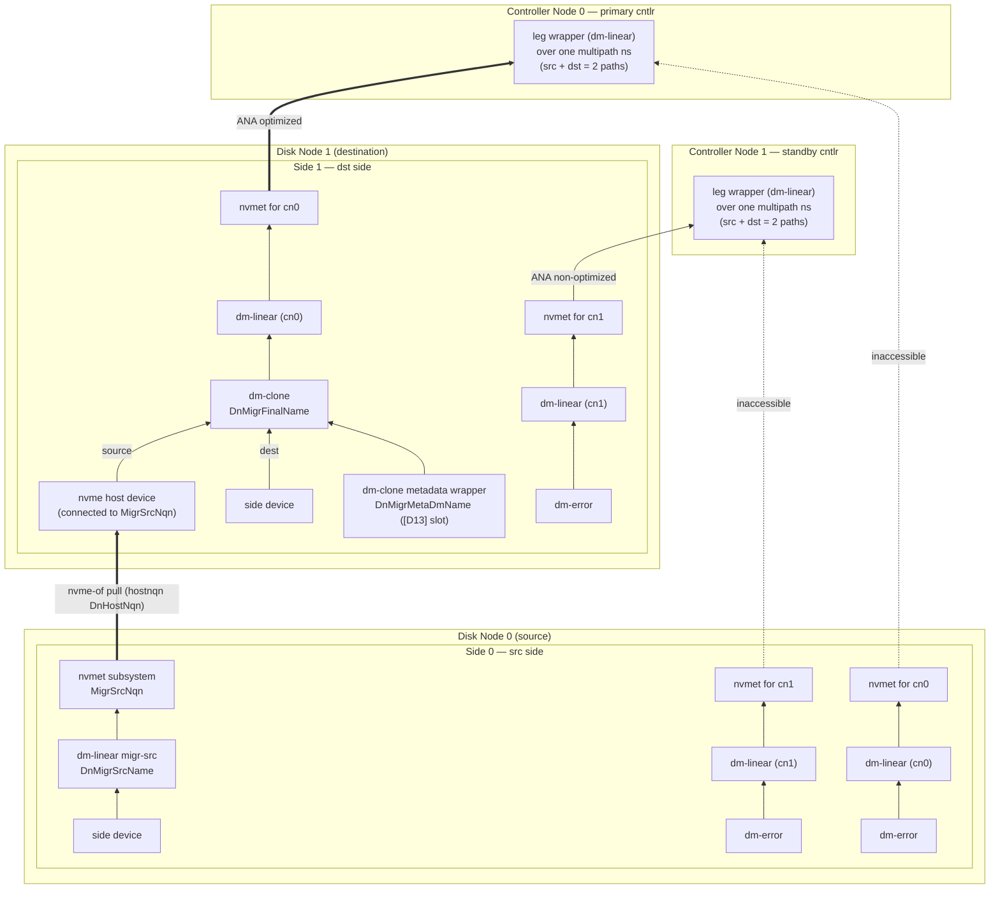
```mermaid
flowchart BT
    subgraph cn0["Controller Node 0 — primary cntlr"]
        W0["leg wrapper (dm-linear)<br/>over one multipath ns<br/>(src + dst = 2 paths)"]
    end
    subgraph cn1["Controller Node 1 — standby cntlr"]
        W1["leg wrapper (dm-linear)<br/>over one multipath ns<br/>(src + dst = 2 paths)"]
    end
    subgraph dn0["Disk Node 0 (source)"]
        subgraph s0["Side 0 — src side"]
            LV0["side device"]
            MS["dm-linear migr-src<br/>DnMigrSrcName"]
            NM["nvmet subsystem<br/>MigrSrcNqn"]
            E00["dm-error"]
            L00["dm-linear (cn0)"]
            N00["nvmet for cn0"]
            E01["dm-error"]
            L01["dm-linear (cn1)"]
            N01["nvmet for cn1"]
            LV0 --> MS
            MS --> NM
            E00 --> L00
            L00 --> N00
            E01 --> L01
            L01 --> N01
        end
    end
    subgraph dn1["Disk Node 1 (destination)"]
        subgraph s1["Side 1 — dst side"]
            ND["nvme host device<br/>(connected to MigrSrcNqn)"]
            MM["dm-clone metadata wrapper<br/>DnMigrMetaDmName ([D13] slot)"]
            DC["dm-clone<br/>DnMigrFinalName"]
            LV1["side device"]
            L10["dm-linear (cn0)"]
            N10["nvmet for cn0"]
            E11["dm-error"]
            L11["dm-linear (cn1)"]
            N11["nvmet for cn1"]
            ND -->|"source"| DC
            LV1 -->|"dest"| DC
            MM --> DC
            DC --> L10
            L10 --> N10
            E11 --> L11
            L11 --> N11
        end
    end
    NM ==>|"nvme-of pull (hostnqn DnHostNqn)"| ND
    N10 ==>|"ANA optimized"| W0
    N11 -->|"ANA non-optimized"| W1
    N00 -.->|"inaccessible"| W0
    N01 -.->|"inaccessible"| W1
```

*Fig. `080Migration` — mid-migration: the leg temporarily owns two sides.
Both export the same `SideToCnNqn`, so each CN sees one multipath namespace
with two paths; ANA moved IO onto the destination path, whose dm-clone
pulls from the source. The leg wrappers are untouched by the switch.*

Starting a migration resembles a failover; the leg temporarily owns two
sides.

**Phase 0 — the destination provisions first.** `CreateMigration` writes
the destination `Side` with `provisioned` false (Migrations), so the
destination DN runs only the Side provisioning protocol: allocate the runs,
build `DnSideName`, zero it batch by batch. No per-CN stacks, no metadata
slot, no `nvme connect`, no dm-clone; what the destination's
`migr_dst_info` rows report meanwhile, and at which levels, is
`dnagent.md` DN13.

For the **src** side, `migr_src_conf.dst_provisioned` false is normative
and means: **behave exactly as if `migr_src_conf` were absent** — keep
serving normally, no fence, no suspension, no migration-source export —
differing only in reporting the would-be `migr_src_info` rows as
`RES_STATUS_PROVISIONING`. Without this gate the source would fence the
primary's path at migration start and the leg would have **no serving path
for the whole zeroing window**.

When the sp worker flips the destination side (sp role), the next fan-out
carries `side_conf.provisioned` true on the destination and
`migr_src_conf.dst_provisioned` true on the source, and both roles run the
sequences below unchanged; the destination's connect retry of step 3
absorbs any cross-side ordering. The cost is added **migration-start
latency** — one whole-side zeroing pass, short under the fast-Write-Zeroes
assumption of Side provisioning protocol, before any data moves.
`CancelMigration` during the zeroing window cancels the zeroing goroutine
and waits for it before the dm devices are removed (Side provisioning
protocol).

**src side** (driven by its `SyncupSide` carrying `migr_src_conf`:
`migr_id`, `dst_side_id`, `dst_dn_id`, `dst_provisioned` true):

1. Move every per-CN subsystem's namespace to inaccessible (all cntlrs).
2. Retire every per-CN dm-linear, in two phases ([D12]):
   a. **Suspend** it where it is, and hold it suspended for at least
      `SuspendSeconds`, the cutover grace window. Its namespace is already
      inaccessible from step 1, so the only IO this absorbs is what the
      old primary still had in flight.
   b. At the end of the window, **reload** it onto its dm-error device.
      Device-mapper releases a suspended device's deferred bios against
      whatever table is live at resume, and the reload installs dm-error
      *before* resuming, so the absorbed IO is failed here rather than
      replayed onto the side's data — which is what would otherwise let
      the source silently diverge from the destination after hydration
      had already copied the region.

   The window is a floor, not a schedule: (b) runs on the first converge at
   or after the deadline, which a timer arranges so that no RPC waits for
   it. It is also a hard bound, as far as the reloads succeed — a device is
   never left suspended beyond it, including across an agent restart that
   finds it suspended, because a suspended dm target queues IO forever and
   wedges any block-device scanner that touches it. `dnagent.md` DN12
   states the rules that keep the bound, and `dnagent.md`, Known limits,
   where it does not hold: after a restart that does not find the linears
   suspended, or that holds no state for the side, their suspension can
   outlast the window, and so can a (b) whose load fails — a reload fails
   closed, which leaves the linear suspended on its pre-fence table,
   queueing its IO, until a later converge's reload of it succeeds or the
   end of the source role resumes it. The floor gives way wherever the
   export above a suspended linear is removed — the side torn down, a CN
   dropped from the side's list, a level with no export layer
   (`SP_LEVEL_NO_SIDE` and above) —
   because disabling an nvmet namespace waits for every request in flight
   on it, and one whose IO a suspended device holds never completes: (b)
   retires the linear first, never a bare resume, which would replay the
   absorbed IO, and such a level ends the window rather than pausing it
   (`dnagent.md` DN6, DN12). Only a request that also ends the source role
   resumes the linears onto their pre-fence tables first, which is that
   role ending's own rule.
3. Build `DnMigrSrcName` (a linear on the side device) and export it
   through `MigrSrcNqn`, its `allowed_hosts` the `DnHostNqn` of the cluster
   and `migr_src_conf.dst_dn_id` alone.

**dst side** (its `SyncupSide` carries `migr_dst_conf`: `migr_id`,
`src_side_id`, `src_dn_id`, `src_nvme_tr_conf`, `block_size`,
`meta_blocks`, `dm_clone_conf`, `bm_cnt`). The steps are logical; the
agent's converge builds bottom-up and reaches the same end state
(`dnagent.md` DN13):

1. Create the per-CN subsystems and namespaces with dm-error backing, all
   inaccessible.
2. Allocate the dm-clone metadata slot in the [D13] clone-metadata area,
   zeroing its head before its record is persisted, and build its wrapper
   dm-linear `DnMigrMetaDmName`.
3. `nvme connect` to the `MigrSrcNqn` of the cluster,
   `migr_dst_conf.src_dn_id`, the sp and the `migr_id` at
   `migr_dst_conf.src_nvme_tr_conf` (hostnqn `DnHostNqn`, the connect
   flags of `dnagent.md` SH20), retrying until success.
4. Create the dm-clone `DnMigrFinalName`: metadata the step-2 wrapper,
   destination the local side device `DnSideName`, source the connected
   nvme device, region size `migr_dst_conf.block_size` (the SP's
   `block_size`), hydration knobs from `migr_dst_conf.dm_clone_conf`.
5. Reload the **primary** CN's dm-linear onto the dm-clone; set that
   subsystem optimized and every other CN's non-optimized. Each CN already
   holds a connection to this side — the same NQN as the source side, so
   it is a second path of the leg's existing multipath namespace (Primary
   cntlr) — and the ANA change alone moves IO from the source path to the
   destination path: no `nvme connect` and no dm reload happens on the CN
   side.

IO then flows host → primary cntlr → destination side, whose dm-clone pulls
missing regions from the source on demand and hydrates in the background.
The dm-clone metadata lives on disk, in the [D13] clone-metadata area, so a
DN reboot resumes hydration where it left off — no special recovery is
needed, unlike clones (Clone crash recovery). The optional bitmap
fast-path: `GetLegBitmap` (paged) → `AppendMigrationBitmap` → the worker's
`PushMigrBitmap` (Bitmap push protocol) → the destination agent persists
each chunk at `LocalMigrBmPath` and `blkdiscard`s never-written regions so
that they are never copied (Migrations, Bitmap reads, raid0 bitmap math).
`FinishMigration` and `CancelMigration` are specified under Migrations.

### Transfer + clone = cross-SP live migration

A clone's source can be *any* NVMe-oF namespace; when the source is a dnv
transfer, the pair performs live migration of a volume between SPs, even
across clusters (figs `090Clone` and `100Transfer`, Clones and Transfers).
Setup for moving a subsystem and namespace from sp1 to sp2:

* sp2 gets an identical subsystem (the same NQN) and namespace (the same
  `ns_idx`, and the same nguid and uuid, passed to `CreateNamespace`,
  Subsystems, namespaces) on a **fresh, empty** thin device [D3], so hosts
  aggregate sp1's and sp2's exports into one multipath device.
* The cntlrs of sp1 and sp2 must use disjoint `cntlid_slot`s: two SPs
  of `MaxCntlrCntPerSp` cntlrs each fill exactly the `CnCntlidSlotCnt`
  slots (cntlid slots). If they do not, rotate a cntlr:
  `UpdateCntlrEnabled` to disabled, `DeleteCntlr`, then `CreateCntlr` with
  a free slot. Likewise the two SPs' cntlrs must not share CNs; rotate the
  same way if they do.
* Ensure `Namespace.suspended` false on sp1 and true on sp2 (create the
  sp2 namespace with `CreateNamespace` and `suspended` true, or
  `UpdateNamespaceSuspended` on an existing one).
* Collect the sp2 cntlrs' CN ids into a `CnHostNqn` list.
* `CreateTransfer` on sp1 (`ori_nqn` and `ori_ns_idx`, `allowed_hosts`
  that list, `auto_suspend` true). The sp1 primary then (1) moves the
  origin namespace to inaccessible, (2) parks its `CnNsDevName`, (3)
  creates `CnXferFinalName` on the raid0, and (4) exports it through
  `XferNqn` per the `Transfer`.
* `CreateClone` on sp2 (`src_tr_conf` the sp1 cntlr endpoints,
  `src_nqn` the transfer's `XferNqn`, `src_ns_idx` the `ori_ns_idx`, the
  source geometry `src_slice_cnt`, `src_stripe_size` and `src_block_size`
  the slice count, raid0 stripe and pool block size of sp1,
  `dst_td_name`, `auto_resume` true). The sp2 primary then (1) connects
  to the targets, (2) allocates arena units and creates the metadata
  wrapper `CnCloneMetaDmName` ([D14]), (3) creates `CnCloneFinalName`, (4)
  reloads the namespace's `CnNsDevName` onto it — the parked ns-dev is
  live and nothing is dm-suspended, so there is no resume step (Namespace
  suspend semantics) — and (5) moves the origin namespace to optimized.
  Hosts flip to sp2 transparently.
* Optional bitmap fast-path: per sp1 slice, `GetThinDeviceBitmap`
  (paged) → `AppendCloneBitmap` with that slice as `src_slice_idx` on sp2
  → the worker's `PushCloneBitmap` (Bitmap push protocol) → the sp2
  primary persists each chunk at `LocalCloneBmPath` and `blkdiscard`s
  (raid0 bitmap math). This is safe while IO runs (Clone crash recovery).
* When hydration completes: `DeleteTransfer` with `force` false on sp1
  (it retires the source: `suspended` true) and `DeleteClone` on sp2
  (`suspended` false, the namespace now backed by the local raid0). To
  abort instead: **first retire the sp2 namespace** with
  `DeleteNamespace` — not merely suspend it, because `DeleteClone`
  unconditionally sets `suspended` false on the destination td's
  namespaces (Clones), which would resume it optimized over the partial
  copy and hand the host a second, divergent path; then `DeleteClone` with
  `force` true on sp2 and `DeleteTransfer` with `force` true on sp1.
  sp1 resumes serving; the sp2 td and its partial bytes remain until
  deleted, and `DeleteClone` only latches (Clones), so deleting that td
  means polling `GetClone` to `NOT_FOUND` first: the destination-td guard
  walks `clone_name_list`, which the drain shrinks in its last transaction
  (`dnv-worker.md` CLD9). **Aborting after the cutover discards every
  write served through sp2**: with `auto_resume` the sp2 namespace
  became the serving path at `CreateClone`, its writes live only on the
  abandoned sp2 td, and sp1 resumes from its retained copy, which
  stopped receiving writes at `CreateTransfer` with `auto_suspend` — so an
  abort is lossless only while nothing has written through sp2.

### raid0 bitmap math

Definitions for one raid0 device: `slice_cnt` underlying devices, a chunk
size of `stripe_size`, and per-underlying-device write bitmaps whose bit
granularity is `block_size`. Constraints, which `CreateClone` validates
(Clones) and which the geometry of every SP created under the geometry
rules of Common validation meets too (Storage pools), so that any such SP
can be a clone source: `slice_cnt` from one to `MaxSliceCntPerSp`;
`stripe_size` a whole multiple of `MinDmRaid0StripeSize`, at most
`MaxDmRaid0StripeSize`; `block_size` a whole multiple of
`MinDmPoolDataBlockSize`, at most `MaxDmPoolDataBlockSize`; and
`block_size` a whole multiple of `stripe_size`. The address mapping of a
logical byte offset *off*:

```
chunk          c = off div stripe_size
slice            = c mod slice_cnt
slice offset     = (c div slice_cnt) × stripe_size + (off mod stripe_size)
```

**Skip-bitmap function.** Given a source geometry A (its `slice_cnt`,
`stripe_size`, `block_size` and per-slice bitmaps, *written = 1*) and a
destination geometry B (the same, with bitmaps *copied = 1*, all zero on a
first run), with the extra constraint that the larger of the two stripe
sizes is a whole multiple of the smaller: the region size is the smaller of
the two stripe sizes — so any region is contiguous inside one chunk on
**both** sides — and the region count is the smaller of the two device
sizes divided by the region size. The output is a bitmap of one bit per
region, where bit *r* is 1 iff region *r* need **not** be copied, iff
not *writtenA(r)* or *copiedB(r)*: *writtenA(r)* ORs and *copiedB(r)* ANDs
the covered source and destination bitmap bits after mapping region *r*'s
byte range through each side's address mapping. Consumers:

* A **userspace copier**, not part of dnvctl — restartable; it
  reads and writes only the two top raid0 devices, in region-size units,
  skipping the 1 bits. B's bitmaps advance by themselves as it writes
  (thin-pool mappings), so a crash simply re-runs the function. It may copy
  some zeroes (over-copy is fine); it must never skip written source data.
* The **agents** applying a source's `CloneBitmap`s and `MigrBitmap`s
  (Bitmap push protocol): the same math with no B term (dm-clone tracks its
  own hydration), the region size being the dm-clone region — the
  destination `block_size`, which may exceed A's stripe size; a region then
  spans several source slices and *writtenA* simply ORs across all of them.
  They `blkdiscard` region *r* iff not *writtenA(r)*. For a migration they
  first shift by the leg's `meta_blocks` (Migrations). The agent carries
  this out as `dnagent.md` SH22 and `cnagent.md` CN22 say.
* Clone **crash recovery** (Clone crash recovery): the B side only — it
  `blkdiscard`s region *r* iff *copiedB(r)*.

**Wire and local conventions.** Every bitmap of the `Gateway` service and of
etcd — `GetThinDeviceBitmap`, `GetLegBitmap`, `AppendCloneBitmap`,
`AppendMigrationBitmap`, the stored `CloneBitmap` and `MigrBitmap` — is
**1 = unwritten, skippable**; thin-pool metadata and the formulas above
use **written or copied = 1**. A bitmap is inverted exactly once, at the
boundary. Bit addressing is **LSB-first within each byte** in **both**
conventions — bit *i* is bit *i* mod 8 of byte *i* div 8 — and the trailing
pad bits of the last byte are zero (Bitmap reads). Only the **meaning** of a
set bit is inverted at the boundary, never the bit order.

### Clone crash recovery

Clone progress durability does **not** rely on the source bitmaps in etcd;
it relies on the **destination thin-pool bitmaps**. The destination td
starts empty ([D3]) and dm-clone hydrates in regions of one `block_size`,
so after any crash "block mapped in a destination thin pool" is "block
already copied". The volatile clone metadata — arena units under the
wrapper `CnCloneMetaDmName` on the CN's tmpfs and loop device (Controller
node, common) — is therefore rebuildable. Whenever the primary (re)builds a
clone whose dm-clone metadata is missing or unusable — a CN reboot, a
failover to a cntlr that never ran it, a tmpfs loss, or a metadata-wrapper
probe mismatch (a wrong length, or a table backed by a stale loop path
after a tmpfs remount, [D14]) — **or** whose dm-clone device is absent,
whether or not its metadata wrapper survived (a pass that created the
wrapper and then failed to create the dm-clone leaves a freshly
hole-punched slot that dm-clone would format empty, with nothing hydrated,
so a surviving, still-matching wrapper is no reason to skip the rebuild;
`cnagent.md` CN18 step 4), it must:

1. Park the dm-linear `CnNsDevName` of every namespace backed by the td on
   the td's dm-error (or make sure none is created yet), and remove the
   stale dm-clone.
2. Create the dm-clone with **hydration disabled** over a freshly
   allocated, freshly hole-punched metadata wrapper ([D14]) — a wrapper that
   still matches is kept as it is, because re-punching a live slot would
   wipe a valid dm-clone superblock.
3. Read the **destination bitmaps**: the mapping bitmap of the destination
   td from every thin pool of the SP (per slice, *mapped = 1 = copied*).
4. `blkdiscard` every dm-clone region whose bits are 1 in the destination
   bitmaps (raid0 bitmap math, the B side only), marking those regions
   "already hydrated".
5. Enable background hydration, then re-converge those `CnNsDevName`s onto
   whatever CN16 now wants for the td (`cnagent.md` CN18 fixes that order):
   the dm-clone when the namespace serves — an `auto_resume` clone, or one
   an operator has resumed — and the td's dm-error while it is still
   effectively suspended (`cnagent.md` CN16 rule 1). Nothing is resumed:
   step 1 parked them live (Namespace suspend semantics).

An existing dm-clone whose hydration is still disabled is an unfinished
recovery — only step 5 enables hydration — and the next (re)build that can
read the dm-clone's status runs this list again from step 1; re-applying
the destination bitmaps is idempotent (`cnagent.md` CN18 step 4 says what
leaves such a dm-clone behind). Until then no ns-dev is put on it: the
agent puts a td's ns-devs on its dm-clone only while the dm-clone's status
shows hydration enabled, and parks them on the td's dm-error while it shows
hydration disabled (`cnagent.md` CN16 rule 5).

The destination bitmaps must be fully applied **before** the dm-clone
handles any IO — otherwise a read of an already-copied, and possibly
since-rewritten, region would be fetched from the source again, returning
stale data over the newer local bytes. The **source** bitmaps (Clones)
carry no such hazard — they only mark regions the source never wrote — so
they may keep arriving through `PushCloneBitmap` after IO has started; any
source chunks already persisted at `LocalCloneBmPath` are simply re-applied
by the agent once the dm-clone is rebuilt (Bitmap push protocol), with no
worker involvement.

### Namespace suspend semantics

`suspended` true makes the namespace **effectively suspended** on every
cntlr. The stored flag is one of two sources — the other is an
`auto_suspend` transfer naming the namespace — and an `auto_resume` clone on
its td overrides both (`cnagent.md` CN16 is the rule). An effectively
suspended namespace's `CnNsDevName` is kept **parked** — live, its table a
dm-linear over the td's dm-error — with the namespace in the
inaccessible ANA group; a namespace that is not effectively suspended gets
the normal behavior of Primary cntlr and Standby cntlr. Users set the flag
(`CreateNamespace`'s `suspended`, `UpdateNamespaceSuspended`), and so do
the transfer and clone finalizations (Transfers, Clones). Nothing is
dm-suspended, short of a park whose load fails and leaves the ns-dev
suspended on its old table (`cnagent.md` CN16): hosts queue against the ANA
state, which nvmet enforces at the target, and a local opener of a parked
ns-dev gets EIO rather than blocking ([D12]).

*Parked*, of an ns-dev, is this device state and nothing else. It is
unrelated to a **parked spare leg** (Automatic reactions), which is an etcd
record state — a replaced leg retained in `spare_leg_list` for the
operator — with no dm meaning.

### SpLevel

Levels gate agent behavior top-down for disaster recovery: each step
removes one more fragile layer until `SP_LEVEL_DISABLE` leaves only the
bottom storage layer — on a DN, each side's data device `DnSideName` and
its [D13] extent record. Side zeroing (Side provisioning protocol) is part
of that bottom layer and keeps running at `SP_LEVEL_DISABLE`. Agents treat
the level as part of the desired state (it rides in every `SyncupSide` and
`SyncupCntlr`): raising it tears layers down, lowering it rebuilds them.
`UpdateStoragePoolLevel` sets it (Storage pools); `dnagent.md` DN11 and
`cnagent.md` CN19 give each role's behavior per level.

`SP_LEVEL_READONLY` means exactly one thing: **every user-facing namespace
of Subsystems, namespaces — the ones backed by `CnNsDevName` — serves reads
and fails writes with an IO error.** Nothing else. It is enforced **on the
CN only**, by reloading each such namespace's `CnNsDevName` onto a dm-flakey
"error_writes" table over its normal backing (`FlakeyErrorWritesTable`);
never by a block-device read-only flag, and never on the DN ([D11]). An
effectively suspended namespace is exempt at every level: it is parked on
the td's dm-error and inaccessible (Namespace suspend semantics), so it
serves no reads to keep and no writes to fail — the CN16 parked rule is
evaluated above the dm-flakey one. Two kernel facts rule out a bdev flag at
any layer: nvmet opens a namespace's backing device for both read and write
("BLK_OPEN_READ | BLK_OPEN_WRITE"), so the top device of an export can
never be read-only; and a read-only flag **below** the top does not stop
writes that device-mapper remaps onto it, since "bio_check_ro()" runs at
top-level bio submission only. The DN, moreover, cannot fail writes at all
— md superblock and bitmap writes, resync, failover assembly and the
health-block writes of Group on-leg layout: meta region, data region,
health block must keep flowing at these levels — so the DN's behavior below
`SP_LEVEL_NO_MIGRATION` is identical to `SP_LEVEL_READWRITE`. Clone and
migration hydration is likewise **not** paused: hydration is infrastructure
IO, not user IO. The accepted gap: a CN that has not yet converged to the
new revision keeps serving writes until it syncs — there is no DN-side
enforcement point that could close it.

### cntlid slots

NVMe multipath requires distinct CNTLIDs among the controllers a host
aggregates. dnv partitions the cntlid space through each nvmet subsystem's
"attr_cntlid_min" and "attr_cntlid_max" into slots, the same partition on
CNs and DNs: `CnCntlidSlotCnt` slots from `CnCntlidSlotBase` in steps of
`CnCntlidSlotStep`, with their DN twins `DnCntlidSlotCnt`,
`DnCntlidSlotBase` and `DnCntlidSlotStep`. Slot *s* starts at the base plus
*s* steps and ends one CNTLID below the next slot's start; nvmet's range
includes both ends, so a slot holds exactly one step of CNTLIDs and no two
slots share one. All slots come from `SpConf.cntlid_slot_list`. Rules:

* Every **cntlr** of an SP uses a slot distinct from every other cntlr of
  the same SP (host-facing multipath aggregates them).
* A **side** uses one slot for all its per-CN exports. Sides of
  **different legs** may share slots freely — their subsystem NQNs differ,
  so no CN-side aggregation occurs. The sides of **one** leg are aggregated
  by the CN (they share an NQN; see NQNs), so while a leg is being migrated the
  source side and the destination side must use different slots —
  otherwise the two controllers the CN merges could pick the same CNTLID
  and the kernel would refuse the second path.
* Two SPs joined by transfer and clone must use disjoint slot sets across
  their cntlrs (Transfer + clone = cross-SP live migration) — their
  host-facing subsystems share NQNs.

An agent can find a subsystem it wants already live under another slot's
range, built by the cntlr that a rotation replaced on the same CN (Transfer
+ clone = cross-SP live migration) or by another side of the same leg on
the same kernel (Disk node); it converges that subsystem under its own
cntlr's or side's slot. nvmet refuses an "attr_cntlid_min" above the
current "attr_cntlid_max" and an "attr_cntlid_max" below the current
"attr_cntlid_min", so no single write order converges every move: the
agent writes "attr_cntlid_max" first when the live one reads below the new
"attr_cntlid_min", and "attr_cntlid_min" first otherwise
(`EnsureSubsystem`).

## dnv-cdc

`dnv-cdc` serves the NVMe-oF Central Discovery Controller, the well-known
discovery subsystem `NvmeDiscoveryNqn`, to hosts over NVMe/TCP. `cdc.md`
owns it: the discovery service model (DS1 to DS11), the etcd watcher (WV1
to WV6) and the NVMe/TCP discovery service (NP1 to NP14). An instance
serves the ranges it is configured with — a range is the shard codes that
share one first hex digit — by watching the whole {p} cdc prefix and
filtering on the {shard_code} field of each key (DS2, WV2). For each
`CdcEntry` it owns — the gateway creates and deletes one with each
host-facing subsystem and rewrites its hosts, and the gateway and the
worker rewrite its transports as cntlrs change (`cdc.md`, Scope and
placement) — it advertises one discovery log record per element of
`nvme_tr_conf_list` (DS3) to exactly the hosts the entry's
`allowed_hosts` names, to no host while that list is empty (DS4); and it
sends a discovery-log-change AEN to exactly the hosts whose rendered,
filtered log changes (DS6), the generation counter being kept per instance
and host while that host holds a live connection (DS7). Hosts running
nvme-stas then connect and disconnect automatically, which is what makes
`DeleteSubsystem`, `CreateCntlr` and `UpdateCntlrEnabled` transparent to
hosts.

Redundancy is twins: two or more instances of one range on different
control-plane servers, with every cdc endpoint configured on every host.
Nothing fails a range over, so complementary ranges would leave a dead
instance's shards with no discovery log and no AENs, and a coverage gap is
an operations error no instance can detect (DS2). An instance answers no
host until its first scan of etcd has landed, and from then on keeps
serving its last known state through etcd outages (`cdc.md` CM4, DS10).

## Components: invocation reference

Each binary is a thin `main` over its library package (`layout.md`,
`cmd/` wiring) and binds flags, an optional config file and the
environment through viper, so every daemon flag is also a config key and
an environment variable. The flags, their defaults and the environment
prefixes are the code's and each binary's `--help`'s; the component
documents state the ones their rules depend on. The three control-plane
processes run co-located on any number of control-plane servers (fig.
`070Cluster`).

* `dnv-gateway` (`gateway.md`) — the stateless server of the `Gateway`
  gRPC service: it listens for users and CLIs, reads and writes etcd, and
  dials the agents only for the calls System overview lists.
* `dnv-worker` (`dnv-worker.md`) — the vote, shard and revision workers of
  the roles it runs, any subset of `dn`, `cn` and `sp` (`dnv-worker.md`
  CM1): it reads and writes etcd and dials the agents.
* `dnv-agent dn` and `dnv-agent cn` (`dnagent.md`, `cnagent.md`) — one
  cobra root command with exactly those two subcommands (`dnagent.md` CM1);
  the dn agent runs on every DN and the cn agent on every CN. An agent
  serves its gRPC service to the workers and the gateway, converges one
  nvmet port on the node's kernel from its transport configuration — which
  is mirrored into `DnConf` or `CnConf` when the node is created, so that a
  CN dials a DN's sides and a host a CN's namespaces there — and keeps its
  local store (Agent local-store paths). It never talks to etcd. The dn
  agent also takes the raw disk it formats ([D13]); the cn agent takes the
  capacity budget `GetCnSize` replies, the per-node input of the CN extent
  count (Size → extents; `cnagent.md`, `cmd/dnv-agent cn`). A node may run
  a dn agent and a cn agent side by side: the pair co-owns one nvmet port
  at the default port id, with identical transport values, and both use the
  default local-store prefix, since the two roles' store kinds are disjoint
  (Disk node; Controller node, common; `dnagent.md` CM2). Several agents on
  one kernel need more than distinct port ids (`dnagent.md` CM2), and two
  cn agents on one kernel are never safe (Controller node, common).
* `dnv-cdc` (`cdc.md`) — the discovery controller (dnv-cdc): it reads etcd
  and listens for hosts on its NVMe/TCP endpoint; one instance per
  control-plane server, twins of a range on different servers, and every
  endpoint listed on every host.
* `dnvctl` (`dnvctl.md`) — the operator CLI: one command per
  `service Gateway` RPC, sent to one gateway (`dnvctl.md` CT1).

**etcd.** etcd holds all desired state. Every etcd node serving dnv must
run with its `--max-txn-ops` at `EtcdMaxTxnOps` or higher. It is a server
flag, so it belongs in the etcd deployment beside the endpoints: dnv cannot
set it from the client side. `gateway.md`, Additions to
`common/constants.go`, says which transaction sizes the number —
`CreateStoragePool` at its widest shape, bounded by ceiling constants alone
— and which other bounded transactions need it.

**md assembly.** Only the agent assembles dnv arrays, so every node that
runs a dnv agent masks udev's incremental assembly of them — a DN too, the
superblocks of a CN's legs landing on its storage through the side export: a
udev rule ordered before the stock "64-md-raid-assembly.rules" imports the
md environment itself — the array name does not exist before the stock rule
runs its own import, so a bare name match in an earlier rule never fires —
and sets "SYSTEMD_READY" to zero for a device whose array name carries the
fixed dnv prefix of `CnMdArrayName` (md names), in the bare form and in the
"homehost:name" form; the cn agent creates its arrays with `--homehost any`,
which keeps the stored name bare. The mask works because the stock rule
skips a device whose "SYSTEMD_READY" is zero, which the deployed mdadm's
rules must do. On dedicated CN hosts two blunter means need no name
matching: an mdadm.conf "AUTO -all", under which only arrays with explicit
ARRAY lines, such as the OS array, assemble, or shadowing the stock rule
entirely.

## Recorded design decisions

Each decision states the rule it shapes and its reason; the rest of this
document and the component documents cite it by its id.

* **[D1] Leg identity and the leg wrapper.** A side subsystem's NQN names
  the *leg*, not the side, and omits the `dn_id` (NQNs), so both sides of a
  migrating leg export the same NQN with the same namespace identity (Disk
  node) from two different DNs. Kernel nvme multipath therefore merges
  them: the CN holds **one** namespace device per leg with one path per
  side, and a migration is an ANA flip between paths — md never sees a
  device change, and the switch costs no reconnect and no dm reload. The
  cost is the rule that the two sides of a migrating leg must use disjoint
  cntlid slots (cntlid slots). A cn-local dm-linear, the leg wrapper, still
  wraps that namespace device, for two reasons: md and the group devices
  consume a dnv-named member that a sweep can attribute (dm device names,
  Teardown by sweep) rather than a kernel node, whose name carries no owner
  and whose device number can change across reconnects; and its table is
  sized from the desired state, never from probing the device. It is not
  the mechanism that survives a side swap, and it stays agent-internal (dm
  device names).
* **[D2] Subsystem identity.** A subsystem's serial is its `ss_id` rendered
  with `IdKeyFmt`, and its model is the one fixed dnv model string
  (`subsystemModel`) — both stable across cntlrs, so hosts see one device.
* **[D3] Empty destination td.** Clone correctness (the precondition of
  Clones) and crash recovery (Clone crash recovery) both assume the
  destination td was never written before the clone; "mapped ⇒ copied"
  holds only then. The control plane cannot verify it cheaply; it is a
  documented contract, satisfied trivially by creating the td right before
  `CreateClone`.
* **[D4] Three fixed ANA groups per port.** Every agent's single port
  carries exactly three ANA groups, created at port setup with fixed ids
  and states that are never rewritten afterwards: `AnaGrpIdOptimized`
  (optimized; nvmet's always-present default group),
  `AnaGrpIdNonOptimized` (non-optimized) and `AnaGrpIdInaccessible`
  (inaccessible), constants of `common/constants.go`. Every ANA transition
  moves the namespace by rewriting its "ana_grpid" — safe on a live
  namespace precisely because the target group always exists (a
  nonexistent group id blackholes IO). The fixed set stays far below the
  kernel's per-port cap on ANA groups regardless of namespace count, and
  leaves nothing to allocate, persist (in etcd or locally) or recover after
  an agent restart. A group is nested under its port
  ("ports/{id}/ana_groups/{grp}"), so the ids mean nothing across ports —
  two agents sharing a kernel under distinct `--nvmet-port-id`s get three
  groups each — and nothing across nodes.
* **[D5] Location copy in capacity values.** `DnConf.location` and
  `CnConf.location` are authoritative; the capacity key's value carries a
  copy so that allocator scans stay read-only range scans. The STM that
  changes `location`-relevant state rewrites both.
* **[D6] Health-block payload.** The leg health probe (Group on-leg layout:
  meta region, data region, health block) writes the magic, the writer id
  and a unix timestamp and reads the block back with O_DIRECT; success
  within the nvme and command timeouts means healthy. Several cntlrs
  probing the same block concurrently is harmless: the content is never
  interpreted beyond "IO completed".
* **[D7] Push-bitmap durability.** Every received `PushMigrBitmap` and
  `PushCloneBitmap` chunk is persisted as its own file under
  `LocalMigrBmPath` or `LocalCloneBmPath`, and the applied sets reported in
  `bm_info` and `bm_info_list` are derived from the files, so an agent
  restart never forces a re-push — save for a chunk whose own file, or
  whose owner's or that owner's parent's, the restart could not load
  (Common agent rules) — and a rebuilt dm-clone can re-apply source bitmaps
  locally (Bitmap push protocol, Clone crash recovery). Both dm-clone
  features — `no_hydration` **and** `no_discard_passdown` — are mandatory
  on **every** dnv dm-clone, cn clone and dn migration alike
  (`agent/dm.go` builds the table), because `blkdiscard` must stay
  metadata-only: with passdown enabled dm-clone also remaps the discard to
  the destination device, and passdown is on by default whenever the
  destination's discard granularity is at most one region — which both a
  raid0 over thin volumes (cn) and a dm-linear over a raw disk (dn)
  satisfy. Without it the idempotent re-apply this decision assumes, and
  the Common agent rules' "re-`blkdiscard`ing an already-hydrated region is
  a no-op", would destroy acknowledged writes: a chunk read from the CN
  thin metadata *before* a host write hydrated region *r* can arrive
  *after* it, and the resulting discard would reach the destination. The
  accepted gap: a clone chunk grown by `AppendCloneBitmap` after its last
  push is re-delivered only while the pushing worker keeps its in-memory
  revision memo (`dnv-worker.md` BM5) — source bitmaps never affect
  correctness, so a missed tail only costs some avoidable copying.
* **[D8] Grown clone chunks.** `AppendCloneBitmap` may grow an
  already-acknowledged chunk `(src_slice_idx, bm_idx)` up to its
  `CloneBmChunkBytes` ceiling; the worker re-pushes when it observes growth
  (`dnv-worker.md` BM5), and a worker change can leave the shorter version
  at the agent — accepted, because source bitmaps only ever cost extra
  copying, never correctness (Bitmap push protocol, Clone crash recovery).
* **[D9] `creation_epoch` in `cluster_id`.** Hashing only the name would
  make `cluster_id` a pure function of a user-chosen string: a cluster
  deleted and recreated under the same name would reuse the whole key space
  and every derived node-local name (`getShortId`, dm names, NQNs), so any
  leftover etcd key or leftover device of the old incarnation would be
  silently adopted by the new one. Mixing in a gateway-stamped
  `creation_epoch` (unix nanoseconds) makes each incarnation a distinct id,
  at the cost of one `ClusterConf` read before any other key can be
  formatted (cluster_id derivation, STM discipline). The epoch lives in
  `ClusterConf` rather than in the key so that `cluster_name` stays the
  user-facing handle and `ListClusters` keeps working off a plain name
  prefix.
* **[D11] Read-only is a CN-only mechanism, never a bdev flag.**
  `SP_LEVEL_READONLY` means "every user-facing namespace serves reads and
  fails writes", and is implemented by reloading each `CnNsDevName` onto a
  dm-flakey `error_writes` table (SpLevel; `cnagent.md` CN16). A
  block-device read-only flag cannot work anywhere in the stack: nvmet
  opens a namespace's backing device for reading and writing, so an
  export's top device fails "echo 1 > namespaces/1/enable" with EACCES when
  it is read-only; and a read-only flag below the top is bypassed entirely
  by device-mapper remapping. Nor can the DN fail writes as a substitute:
  md superblock and bitmap writes, resync, failover assembly and the health
  probe of Group on-leg layout: meta region, data region, health block must
  keep flowing at every read-only level. Consequently the DN has **no**
  read-only behavior at all — every level below `SP_LEVEL_NO_MIGRATION`
  behaves there like `SP_LEVEL_READWRITE` — and hydration is never paused.
* **[D12] Fencing ends in a table reload onto an error target, and any
  suspension before it is bounded.** A path being decommissioned is taken
  out of service by reloading it onto its dm-error: dm-error's map
  function returns "DM_MAPIO_KILL", so the bio completes immediately with
  "BLK_STS_IOERR", which is the correct outcome for a path that is going
  away.

  The migration cutover (Migration) precedes that reload with a **bounded**
  suspension of `SuspendSeconds`, so that IO the old primary still had in
  flight is absorbed rather than instantly failed. This is safe only
  because of the ordering: device-mapper releases a suspended device's
  deferred bios against whatever table is live at resume, and the reload
  installs dm-error *before* resuming, so the absorbed IO is **errored at
  the end of the window, never replayed** onto the side's data. Replaying
  it is the outcome that matters — on a migration source it could land
  after hydration had already copied that region, silently diverging
  source and destination.

  Everything else about a suspension stays hostile, which is why the bound
  is load-bearing rather than advisory. A suspended dm target queues bios
  forever with no timeout and no error path, so (a) any block-device
  scanner that touches it blocks in uninterruptible D state — "exit_aio"
  then makes that task unkillable and the node needs a reboot — and (b)
  `dmsetup remove` on it does not succeed. The **dn** agent therefore
  (`dnagent.md` DN6, DN12): never suspends anywhere except this one window;
  never lets a device outlive it short of a `dmsetup` command that fails,
  including across an agent restart that finds it suspended (a linear found
  suspended with no recorded start is put on its dm-error at once rather
  than starting a second window; a restart whose probes of a side's
  linears all go unanswered finds none so, and one left holding no state
  for the side — a lost `--local-store`, a side or DN file missing or
  unreadable — keeps nothing of what it found: `dnagent.md`, Known
  limits); and, before any teardown step runs over a fenced linear — the
  removal of its export included, all that `SP_LEVEL_NO_SIDE` takes — puts
  it on its dm-error, DN12's phase 2 brought forward, rather than resuming it
  onto the table it was suspended with and replaying what the window
  absorbed; only a request that also ends the source role resumes it onto
  its pre-fence table first, which is that role ending's own rule. A
  reload fails closed (`dnagent.md`, OS wrappers — `dm.go`, `nvmet.go`,
  `nvmehost.go`; `cnagent.md` CN16): one whose load fails leaves the device
  suspended on its old table, queueing its IO until a later reload or
  resume of it succeeds, so the bound holds only as far as the reloads
  succeed. The side failover (Failover) has no window at all: it reloads
  onto dm-error directly, and a reload of it whose load fails is a known
  limit of Failover. The residual exposure is external tooling — udev,
  blkid, an operator's lsblk — reading a source's linears during the
  window, or longer under that `dnagent.md` known limit or after a reload
  whose load failed; no dnv agent scans block devices, neither running an
  LVM command ([D13], [D14]).

  An effectively suspended namespace (Namespace suspend semantics) — a
  stored-suspended one, or the origin an `auto_suspend` transfer names
  (Transfers; Transfer + clone = cross-SP live migration) — is not held
  dm-suspended for the life of the suspension, which would be unbounded,
  with no `SuspendSeconds` floor or ceiling, and the one place a
  block-device walker on a CN could wedge in D state. It is **parked**
  instead: its ns-dev reloaded onto the td's dm-error and resumed, the
  namespace inaccessible — with **no cutover window**, because the
  namespace is moved to inaccessible before its own ns-dev is touched
  (`cnagent.md` CN9's
  pre-step 1 does the ANA move, on every converge; the park comes second,
  from pre-step 2 or, when an unanswered listing stopped the sweep, from
  the build phase) and nvmet refuses IO to an inaccessible namespace at the
  target, so a window would absorb nothing but a local scanner's bios; the
  reload's own flushing suspend is what keeps in-flight IO from being
  replayed. Two bounds on that argument are stated rather than hidden: the
  ANA write is best-effort (a failed "ana_grpid" write is logged and the
  pass continues), so a host racing that failure takes IO errors rather
  than queueing in a suspended device — fail-fast rather than an
  unkillable wedge, and the next converge rewrites the group; and the clone
  rebuild (Clone crash recovery) parks a *serving* namespace's ns-dev from
  the build phase with no ANA move at all, which is that recovery's own
  documented window and not this one. With the park, the CN holds no
  suspension **across** a converge pass at all, short of a `dmsetup`
  command that fails (a park whose load fails leaves its ns-dev suspended
  on its old table: `cnagent.md` CN16 and its known limit "A park whose
  load fails can wedge the cntlr"). What is left there is CN14's snapshot
  quiesce, a `dmsetup suspend` bracketed around one per-slice `create_snap`
  sequence and resumed before the pass returns unless that resume fails
  (`cnagent.md` CN14, CN16) — otherwise bounded by construction.
* **[D13] The DN carries a self-describing dnv disk format; the dn agent
  uses no LVM.** Three reasons keep LVM out. (a) Its label scan reads every
  block device on the node, so any dnv device in a bad state takes the
  whole node's LVM down with it — the suspended-device wedge of [D12] is
  one instance of that class, and [D12] removes only that instance. (b) A
  layout that puts a volume group on a logical volume needs
  "devices/scan_lvs = 1" in the host's "/etc/lvm/lvm.conf"; depending on
  host LVM configuration for correctness is a deployment hazard. (c) LVM
  brings global locks, per-command process spawns and version-to-version
  behavior differences into a converge path that must stay bounded by the
  command timeouts (Common validation). The DN carries instead the format
  of Disk node — a CRC-protected header block, two alternating
  CRC-protected volume-table slots (so a torn write can only damage the
  older copy), a fixed clone-metadata slot area and an extent area at
  `DnDataOffset` — all read and written natively in Go through the
  `OsClient`'s `ReadBlock` and `WriteBlock`. A side is one aggregate
  dm-linear `DnSideName` concatenating the side's extent runs, and a
  migration's dm-clone metadata is a slot plus a wrapper dm-linear
  `DnMigrMetaDmName`. **The on-disk volume table, not the agent's local
  store, is authoritative for extent placement**: converge is
  lookup-or-allocate, so a node that loses `--local-store` but keeps its
  disk recovers exactly the layout it had — which is also why the agent's
  orphan sweep is driven by the DN's authoritative `side_pointer_list` and
  never by "this side has no local state" (`dnagent.md` DN6). A disk
  already formatted for a different cluster, dn or `extent_size` is
  refused, never overwritten (as pvcreate refuses a foreign physical
  volume), and that refusal is enforced at the metadata layer: an
  unconfirmed disk rejects every mutation, because a failed `SyncupDn`
  does not stop the `SyncupSide` calls that follow it (Common agent rules;
  `dnagent.md` DN5). Changing any layout constant is a header-version bump,
  not a tweak.
* **[D14] The CN uses no LVM either; the clone-metadata arena is a slot
  allocator.** A clone volume group would bring onto the CN exactly the
  failure class [D13](a) keeps off the DN: a bare vgs or lvs label scan
  reads every block device on the node, and a CN holds error targets, md
  members and pathless multipath legs, and can hold suspended devices,
  which wedge an LVM scan in unkillable D state ("exit_aio";
  "ignore_suspended_devices" and "global_filter" do not help) — while the
  cn agent would run those scans on every converge and every Check round.
  The arena instead (Controller node, common; tmpfs / file names): one
  tmpfs-backed sparse file (`CnTmpFilePath`, `CnCloneMetaAreaSize` bytes)
  on **one** loop device — re-learned every converge with
  `losetup --associated`, never persisted, because loop names are
  unpredictable and a per-clone loop sprawl is unwanted — carved into
  `CnCloneMetaUnit` units and handed out first-fit in **contiguous** runs to
  wrapper dm-linears `CnCloneMetaDmName` (cn dm kind `cb`, `cnagent.md`,
  Additions to `common`; the wrapper exists because dm-clone reads its
  superblock from sector zero and takes no offset, the same reason
  `DnMigrMetaDmName` does). **The kernel's dm tables are the allocation
  registry** — each wrapper's linear table, its length over the loop
  device at its offset, records its own allocation, and the arena is
  volatile *together with* the dm state (a reboot clears both, an agent
  restart preserves both) — so there is no on-file allocation table and
  none of [D13]'s header, CRC and A/B machinery is needed. Every allocation
  hole-punches its range with plain `blkdiscard` first, because a freed
  unit still holds the previous clone's valid dm-clone superblock and
  hole-punch gives guaranteed zeros by *file* semantics (no device DLFEAT
  involved) while releasing the tmpfs pages; `--zeroout` is **forbidden**
  there because it would materialize up to the whole arena in RAM
  (`cnagent.md` CN5, CN18). The reasons: the [D13](a) label-scan class is
  eliminated rather than mitigated, lvm2 is one dependency fewer, and CN
  naming is as deterministic as everything else. Arena exhaustion reports
  `RES_STATUS_ERROR` on the clone's resources; orphaned kind-`cb` wrappers
  are removed by the sweep (Teardown by sweep), which frees their units; a
  wrapper whose length or backing loop path does not match the currently
  probed loop device is `RES_STATUS_ERROR` and is repaired by the clone
  rebuild (Clone crash recovery).
* **[D15] Whole-side zeroing behind a `provisioned` gate;
  `RES_STATUS_PROVISIONING`.** dnv is multi-tenant, so a new side must
  never expose a previous tenant's bytes. A trim cannot deliver that:
  `blkdiscard` does not imply zeros (the kernel does not promise that a
  discarded region reads as zeros, and NVMe's read-zeroes after deallocate
  is optional). Nor is a trim enough for correctness: a recycled
  meta-group extent can carry a valid thin-pool metadata superblock a fresh
  pool would adopt, and a stale md superblock puts "Make sure all groups
  are available" in the wrong assembly case with no `--zero-superblock`
  escape. Every side is therefore fully zeroed with `blkdiscard --zeroout`
  before its first export, with per-extent progress in `zeroed_bits` on the
  authoritative volume table ([D13]), gated by the control-plane-visible
  `Side.provisioned` flag that the sp worker flips once the agent reports
  the side fully zeroed (Side provisioning protocol; the flip rule of sp
  role). Resources deferred while a side underneath them
  zeroes report `RES_STATUS_PROVISIONING` — *healthy, not ready, no action
  needed* — which **never** sets `err_epoch`; `ERROR` means *needs
  intervention*, which is why a missing record at `provisioned` true (data
  loss on a lost or foreign disk) stays `ERROR` and feeds Automatic
  reactions rather than looking transitional. The zeroing runs as a
  background, lock-free, batched goroutine under the ordinary command
  timeouts (Common validation), on the standing assumption that DN disks
  have fast Write Zeroes, checked fail-fast against the disk's
  "write_zeroes_max_bytes" (`dnagent.md` DN5, DN9); a synchronous
  whole-side zeroing inside one `SyncupSide` is not an option, because a
  node-read holder plus one queued `SyncupDn` writer would freeze the whole
  DN agent. The zeroing is also what funds the `--assume-clean` of "Make
  sure all groups are available" and the fresh-thin-pool metadata
  assumption.
* **[D16] Failover fencing has no epoch; safety = per-side atomic flip + md
  arbitration.** A failover's only cross-node coordination is the revisioned
  fan-out of sp role, unordered among the sides. Its sides-first order — the
  cntlrs' requests held until every side the worker drives has reported the
  revision applied, for one `cntlr_interval` at most (`dnv-worker.md` RW14)
  — mitigates three races: a promotion outrunning the sides' ANA flips, a
  cntlr's connect outrunning a new side's export, and a leg removal's
  disconnect on a CN overlapping the disk node's unlink of that side's
  export. It is no correctness dependency: at the bound the cntlrs go
  whether every side has reported or not, and nothing below relies on it.
  Correctness rests on two things (Failover, "Make sure all groups are
  available"): each DN converges its side's old-primary-to-dm-error and
  new-primary-to-side-device reloads in one pass, so one leg never has two
  writers — short of a reload of the old primary's linear whose load fails,
  which a later converge of the side resumes on the side device before it
  retries the reload (Failover; `dnagent.md` DN10 and Known limits); and
  mdadm's assembly rules arbitrate across legs — a stale leg whose
  superblock claims a clean full array will not start degraded alone, and
  event counts plus resync direction repair divergence once both legs
  return. md behavior is therefore a load-bearing dependency, pinned by the
  integration suite. The accepted cost is an old primary that is alive but
  not yet demoted: fenced at the DNs but still advertising optimized, it
  returns DNR internal errors that host multipath does not fail over from,
  so applications can see EIO — at a failover of a primary still serving,
  until it applies its demotion, which waits in the sides-first hold with
  the other cntlrs' requests (the hold lasts about the sides' round trip, up
  to one `cntlr_interval` while a side does not report, and the demotion's
  delivery and its converge up to the ANA move come on top), and, for the
  control-plane-partitioned old primary of Failover, until it re-syncs or is
  stopped. Closing both edges takes a fencing epoch checked on the data path
  (NVMe reservations, or a per-revision gate at the side exports) — not more
  ordering in the worker, which cannot reach a partitioned node anyway.
* **[D10] Id-keyed revision keys.** `DnRev`, `CnRev` and `SpRev` are keyed
  by `dn_id`, `cn_id` and `sp_id`, not by the `addr_port` or `sp_name`
  that keys the matching `DnConf`, `CnConf` or `SpConf`; the mutable handle
  lives in the value. The key is then immutable for the object's whole
  life, so relocating a node or renaming an SP — however that is driven —
  stays a single put on the rev key rather than a delete and a put, which a
  watching worker would otherwise have to interpret as one object leaving
  and another arriving, with a revision starting over and a spurious
  teardown in between. It also makes a watch event self-contained: the
  worker learns where to dial (`addr_port`) or which `SpConf` to read
  (`sp_name`) straight from the value it just received (Revision keys and
  the sync fan-out, dn / cn roles, sp role). `SpName` (`sp_id_to_name`)
  stays needed because reaching `SpRev` from an `sp_id` alone would require
  knowing the SP's `shard_code`, which only `SpConf` — reached by name —
  carries.
* **[D17] Worker membership by heartbeat, grace windows and sha256 tickets;
  no lease.** A worker refreshes its registration key (`WorkerReg`, Key
  table) every vote interval (`DefaultVoteWorkerInterval`); observers judge
  liveness by their own monotonic clock since the last put they saw, a
  registration not refreshed for the dead threshold (Membership and shard
  ownership) being dead; every observed transition must hold for the grace
  time (`DefaultVoteWorkerGraceTime`) before it changes the observer's
  effective membership; ownership is the largest sha256 ticket of seed, role
  and shard among effective members (`dnv-worker.md` VW2 to VW9). Why not a
  lease: a lease expiry is a single server-side event with no notion of
  "stable" — a worker flapping at the keep-alive boundary reshuffles
  ownership on every flap, and a newly started worker takes its shards
  instantly while the old owners still hold them. The explicit scheme makes
  appear, disappear and reappear first-class, testable transitions with one
  damping rule, keeps a dead worker's last heartbeat visible to operators,
  and depends on no lease keep-alive semantics. Why observer-local time
  rather than the stored epoch: comparing a writer's wall clock with a
  reader's makes correctness depend on NTP — a clock running ahead would let
  one worker claim every shard while the others keep theirs, undetected; the
  epoch in the value is therefore informational. The costs, all accepted: a
  key a scan finds untracked — every key of the first scan after a start or
  a fence — needs a whole dead threshold before it can be declared dead (a
  rescan keeps the running deadline of every key whose `mod_revision` the
  observer has already seen, `dnv-worker.md` VW3); a fresh worker drives
  nothing for its first grace window; ownership changes overlap or gap by a
  few seconds across workers, safe for the reasons and within the bounds of
  `dnv-worker.md` VW7 (idempotent syncups under the agents' revision gate,
  STM-guarded reactions save one unrequested spare, a stale `err_epoch`
  corrected by the owner's next verdict); and dead keys are
  garbage-collected by their observers instead of expiring — which is also
  what lets a worker detect that the fleet has given up on it (it sees its
  own key deleted) and rejoin as a fresh identity.

## v1 assumptions and known limits

These are the boundaries v1 accepts, stated so that scale, recovery and
security expectations are explicit rather than discovered. None of them is
a defect in the mechanisms above.

* **One primary per SP is the volume throughput ceiling.** Every td of an
  SP is served by its single primary cntlr; slices shard *within* that CN,
  never across CNs. The aggregate bandwidth of one volume is one CN's.
  Scale-out is by storage pool: spread SPs, and so their primaries, across
  CNs.
* **Revision granularity is the SP.** Any `SpRev` bump re-fans the complete
  desired state to every side and every cntlr of the SP (Common agent rules,
  full sync; sp role). During initial provisioning each side's `provisioned`
  flip is itself a bump, so a large SP's bring-up costs
  O(sides × (sides + cntlrs)) syncups; the sp role's allowance to batch
  several flips into one STM (`dnv-worker.md` RW18) is the mitigation.
  Steady state is one fan-out per transaction that changes the SP's
  desired state — a user mutation, or a worker transaction such as the
  created flip (next bullet) — and none for health bookkeeping (Revision
  keys and the sync fan-out).
* **One more fan-out per td creation.** Every created flip bumps `SpRev`
  (sp role, `dnv-worker.md` RW19), so creating a td costs two full fan-outs
  of the SP instead of one; batching the flip keeps bulk creation at one
  extra fan-out per reply, or per `MaxFlipCreatedPerTxn` tds for a reply
  that completes more.
* **The agent node lock has head-of-line blocking.** A pending node write
  (`SyncupDn`/`SyncupCn`) blocks every new node-read acquisition behind the
  slowest in-flight object converge. Converges are bounded per command
  (Common validation) wherever the command's child can be killed; one
  blocked in an uninterruptible kernel wait is not (Common validation), nor
  is an in-process sysfs, configfs or device access once its syscall has
  started (`dnagent.md` SH15). The cn sweep's `nvme disconnect`, whose
  delete can wait out the kernel's admin timeout, runs off the locks for
  that reason (`cnagent.md` CN10 and CN21). Two other disconnects run under
  their locks — the cn build's of a migration's departed side and the dn
  sweep's of a migration destination's source connection — and the second
  can cost a `SyncupSide` its worker deadline (`cnagent.md`, Known limits;
  `dnagent.md`, Known limits). On a node where many commands run to their
  timeouts, one sick object can delay every other object's converge and
  Check round by up to a whole converge pass. Accepted: object locks keep
  steady-state concurrency, and the zeroing loop's try-acquire rule
  (`dnagent.md` DN9) keeps the one long-running background writer out of
  that queue.
* **No thin-metadata repair path is specified.** Pool metadata is redundant
  at the block layer (meta groups can be `RedundMdRaid1`), but there is no
  "thin_check"-on-activate or "thin_repair" flow for a pool whose dm-thin
  metadata is corrupt. A pool-metadata `RES_STATUS_ERROR` is therefore an
  operator-intervention event (activate read-only, "thin_repair" onto fresh
  space by hand).
* **The fabric is trusted.** gRPC is plaintext (`grpc.md`, Wiring), etcd
  access is whatever the deployment configures, and data-plane access
  control is host-NQN allow-lists — a spoofable identifier. NVMe in-band
  authentication and TLS are out of scope for v1. The [D15] multi-tenant
  guarantee is about *stored bytes* (no tenant ever reads another's stale
  blocks); it does not defend against an attacker on the storage network.
  Deploy on an isolated, trusted fabric.
* **QoS is deferred** (Controller node, common): agents accept and persist
  `qos_ratio` and enforce nothing (`cnagent.md` CN6).
* **Snapshot creation is not atomic across a primary crash.** With the
  origin quiesce of Thin devices a snapshot is point-in-time against live
  IO, but a crash between two slices' `create_snap` messages still leaves a
  torn snapshot; delete and re-create it. `ThinDevice.created` certifies
  materialization, not point-in-time consistency: a torn snapshot still
  flips to `created` once every slice's volume exists.
* **A snapshot accepted before a clone targets its origin can hold part of
  the copy.** `CreateThinDevice` refuses a snapshot of a clone's destination
  while the `Clone` key exists (Thin devices), but `CreateClone` does not
  look for an uncreated snapshot of its destination: finding one means
  walking every td of the SP, the walk `DeleteThinDevice` keeps out of its
  transaction. The primary's pre-pass sends every ready slice's snapshot
  message before the same pass builds the dm-clone (`cnagent.md` CN14,
  CN18); only a slice it skips — its pool not ready, or its thin device
  unreadable — or whose message fails is retried on a later converge, which
  can come after hydration has begun. That slice of the snapshot then holds
  whatever the copy has written into the destination by then, while the
  slices messaged in time hold the empty td, and the snapshot still flips to
  `created`. [D3]'s destination is empty, so the exposure is a snapshot of
  an empty td, and only a snapshot not yet created by the time a clone into
  that td is created.
* **A created td is never re-created by message.** A td the sp worker has
  flipped to `created` is attached with a bare `dmsetup create`; if a pool
  has lost its id the row reads `RES_STATUS_ERROR` on every converge
  and no message ever re-creates it (`cnagent.md` CN14). It belongs next to
  the missing thin-metadata repair path above: pool-metadata loss is an
  operator-intervention event, and no failover or replacement brings the td
  back. Nor does the primary role move back and forth over it. Every cntlr
  that takes the role reads the same rows; a converge's report failing only
  in the td's stack triggers neither a failover nor a replacement, a Check
  round's — which reads the volume `MISSING` and names no id — does, and the
  worker then neither hands the role back nor replaces the replacement while
  the new primary fails, from an error set within `cntlr_unhealthy` of that
  failover or replacement, only on rows its predecessor failed on. So a lost id
  costs one failover, or in an SP with no failover candidate one
  replacement, per coordinator that drives the SP, with the exceptions
  `dnv-worker.md`, Known limits, counts (HL2, AR5, AR7).
* **Worker membership tolerates, but does not repair, a partitioned
  observer.** A worker whose registry watch drops a peer's events while its
  own heartbeats still succeed sees that peer go stale and, after the grace
  window, claims its shards; correct peers see nothing wrong. The double
  driving is bounded — the victim sees its key deleted, fences and rejoins
  as a fresh identity, and every agent-side effect is idempotent — but not
  prevented ([D17]). It can leave a group a spare no failure asked for (the
  spare-zeroing limit below). A health epoch one driver leaves stale is
  corrected by the owner's first verdict after it next loads the record:
  within a pass and a round for a side, a leg or a cntlr — though at the
  default thresholds a pass can fail a healthy primary over on it first —
  and within a `nodeRecordMaxAge` and a round for a DN or a CN, which is out
  of allocation meanwhile if the stale epoch marks it unhealthy
  (`dnv-worker.md` HL3 and Known limits).
* **Undriven windows are part of the membership design.** A fresh worker
  drives nothing for its first grace window (`DefaultVoteWorkerGraceTime`);
  a crashed worker's shards are undriven for twice the vote interval
  (`DefaultVoteWorkerInterval`) plus the grace window; a fenced worker's
  shards until the peers commit it dead. Revision keys are durable, so
  nothing is lost: convergence is delayed, not skipped (`dnv-worker.md`,
  Known limits).
* **A group's spare list can fill with parked legs.** Every leg repair parks
  the replaced leg in `spare_leg_list`, which holds at most
  `MaxSpareLegPerGrp` legs, so once the repairs of one group have parked
  that many the worker can only log `reaction skipped` until an operator
  runs `DeleteSpareLeg` (`dnv-worker.md` AR8).
* **A spare whose DN fails while it zeroes blocks its group's next spare.**
  `CreateSpareLeg` refuses while any spare of the group has a side that is
  not `provisioned` (Spare legs), so the worker's leg repair cannot create a
  spare for that group: it leaves a failed leg in place — unless another
  spare of the group is or becomes ready to switch in — until that DN comes
  back and finishes zeroing the spare or an operator runs `DeleteSpareLeg`
  (`dnv-worker.md` AR8 step 3). Because nothing records which repair a spare
  was made for, an ownership overlap can also leave a group a spare no
  failure asked for (`dnv-worker.md` AR2 and Known limits).
* **A slice's data space is capped when its SP is created.** Every data
  grow — the worker's or a user's — appends a group of the slice's first
  data group's size, which is `init_ext_cnt` extents (Per-operation
  allocation, GrowSlice), and a slice's data list holds at most
  `MaxGrpCntPerSlice` groups (md names), so a slice's data space tops out at
  `MaxGrpCntPerSlice` groups of `init_ext_cnt` extents. At that cap
  `GrowSlice` answers `FAILED_PRECONDITION` and the worker's auto-grow logs
  `reaction skipped` (`grp_list_full`) instead of growing (`dnv-worker.md`
  AR6 and Known limits), so the pool can run out of space as Automatic
  reactions describes.
  Nothing frees the ceiling of a live slice, because groups leave a slice
  only by the drain of a deleting SP (`dnv-worker.md` SPD10): an SP
  expected to grow large wants a larger `init_ext_cnt` or more slices.
* **A reload fails closed.** A dm reload whose load fails leaves its device
  suspended on its old table, queueing its IO with no timeout until a later
  reload or resume of it succeeds (`dnagent.md`, OS wrappers — `dm.go`,
  `nvmet.go`, `nvmehost.go`; `cnagent.md` CN16), so [D12]'s bound on a
  suspension holds only as far as the reloads succeed. On a fencing reload
  that keeps the data safe at the cost of liveness — a CN park whose load
  fails can wedge the cntlr (`cnagent.md`, Known limits) — with one
  exception: a side flip whose reload of the old primary's linear fails its
  load leaves that linear suspended over the side device only until the
  side's next converge resumes it there, releasing the IO it queued onto
  the side's data before the reload is retried (Failover, `dnagent.md`
  DN10).
